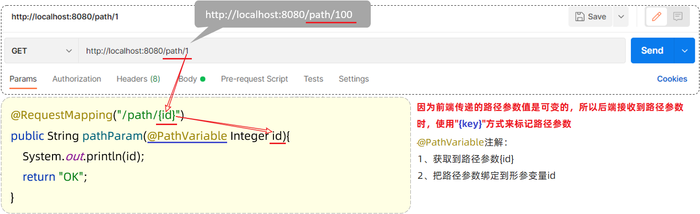
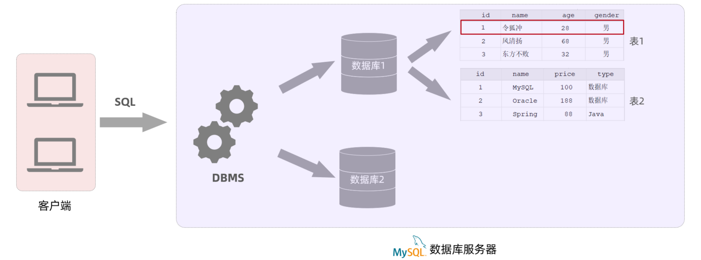
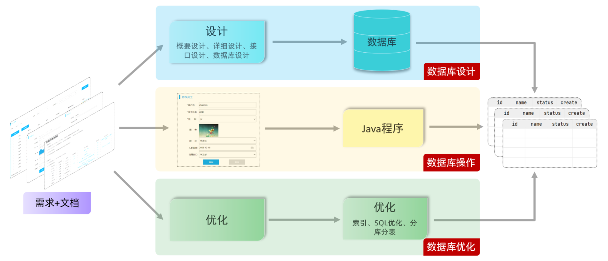

# JavaWeb

-------

# Web前端


### HTML:负责网页的结构(页面元素和内容)。

### CSS:负责网页的表现(页面元素的外观、位置等页面样式，如:颜色、大小等)

### JavaScript:负责网页的行为(交互效果)。

DOM是文档对象模型（Document Object Model）的缩写。它是一种用于表示和操作网页内容的标准编程接口。在Web开发中，网页被表示为一个文档树，由各种元素（如标签、文本、属性等）组成，DOM提供了一种规范的方式来访问和操作这个文档树。

**DOM基本元素**

DOM的基本元素是节点（Node），节点可以分为不同的类型，包括以下几种常见的节点类型：

1. 元素节点（Element Node）：表示HTML或XML文档中的标签元素，如`<div>`、`<p>`、`<a>`等。
2. 文本节点（Text Node）：表示文档中的纯文本内容，如段落中的文字、标签之间的空格等。
3. 属性节点（Attribute Node）：表示元素节点的属性，如`id`、`class`、`href`等。
4. 注释节点（Comment Node）：表示文档中的注释内容，以`<!--`开头，以`-->`结尾。
5. 文档节点（Document Node）：表示整个文档，是DOM树的根节点。

**DOM的基本属性**

1. `nodeName`：返回节点的名称。对于元素节点，返回标签名；对于文本节点，返回"#text"；对于注释节点，返回"#comment"等。
2. `nodeValue`：返回或设置节点的值。对于文本节点，返回文本内容；对于元素节点和注释节点，返回null。
3. `nodeType`：返回节点的类型。元素节点的值是1，文本节点的值是3，属性节点的值是2，注释节点的值是8，文档节点的值是9。
4. `parentNode`：返回节点的父节点。
5. `childNodes`：返回节点的子节点列表。
6. `firstChild`：返回节点的第一个子节点。
7. `lastChild`：返回节点的最后一个子节点。
8. `previousSibling`：返回节点的前一个兄弟节点。
9. `nextSibling`：返回节点的后一个兄弟节点。

这些是DOM的基本元素和属性，通过这些元素和属性，可以对文档进行遍历、访问和修改。

**DOM的常用操作方法**

DOM提供了一系列常用的操作方法，可以通过这些方法来访问、创建、修改和删除文档中的节点。以下是一些常见的DOM操作方法：

1. 查询元素节点：
2. `getElementById(id)`：根据元素的id属性获取元素节点。
3. `getElementsByTagName(tagName)`：根据标签名获取元素节点列表。
4. `getElementsByClassName(className)`：根据类名获取元素节点列表。
5. `querySelector(selector)`：根据选择器获取符合条件的第一个元素节点。
6. `querySelectorAll(selector)`：根据选择器获取所有符合条件的元素节点列表。
7. 创建节点：
8. `createElement(tagName)`：创建一个新的元素节点。
9. `createTextNode(text)`：创建一个包含指定文本内容的文本节点。
10. `createComment(text)`：创建一个注释节点。
11. 修改节点：
12. `appendChild(node)`：将指定节点作为最后一个子节点添加到目标节点。
13. `insertBefore(newNode, referenceNode)`：将新节点插入到参考节点之前。
14. `replaceChild(newNode, oldNode)`：用新节点替换旧节点。
15. `removeChild(node)`：从父节点中移除指定节点。
16. `setAttribute(name, value)`：设置元素节点的属性。
17. `removeAttribute(name)`：移除元素节点的属性。
18. 节点遍历：
19. `parentNode`：获取父节点。
20. `childNodes`：获取子节点列表。
21. `firstChild`：获取第一个子节点。
22. `lastChild`：获取最后一个子节点。
23. `previousSibling`：获取前一个兄弟节点。
24. `nextSibling`：获取后一个兄弟节点。
25. 修改样式：
26. `classList`：获取或修改元素节点的类名。
27. `style.property`：设置元素节点的样式属性，如`element.style.color = "red"`。
28. 事件处理：
29. `addEventListener(event, callback)`：为元素节点添加事件监听器。
30. `removeEventListener(event, callback)`：移除元素节点的事件监听器。

### Vue ：

是一套前端框架，免除原生JavaScript中的DOM操作，简化书写
基于MVVM(Model-View-ViewModel)思想，实现数据的双向绑定，将编程的关注点放在数据上
官网:https://v2.cn.vuejs.org/


### XML

XML 指可扩展标记语言（e**X**tensible **M**arkup **L**anguage）。

XML 被设计用来传输和存储数据，不用于表现和展示数据，HTML 则用来表现数据。

```xml
<?xml version="1.0" encoding="UTF-8"?>
<site>
  <name>RUNOOB</name>
  <url>https://www.runoob.com</url>
  <logo>runoob-logo.png</logo>
  <desc>编程学习网站</desc>
</site>
```

**XML 和 HTML 之间的差异**

XML 不是 HTML 的替代。

XML 和 HTML 为不同的目的而设计：

- XML 被设计用来传输和存储数据，其焦点是数据的内容。
- HTML 被设计用来显示数据，其焦点是数据的外观。

HTML 旨在显示信息，而 XML 旨在传输信息。

### Json

一种轻量级的数据交换格式，具有良好的可读和便于快速编写的特性。业内主流技术为其提供了完整的解决方案（有点类似于正则表达式 ，获得了当今大部分语言的支持），从而可以在不同平台间进行数据交换。JSON采用兼容性很高的文本格式，同时也具备类似于C语言体系的行为。

**JSON 和 XML 的区别**
json和xml都是在远程调用或者和某公司合作时的数据交换格式。

1、相同点

json与xml是一种远程数据传输交换格式。

json是轻量级的，xml标记电子文件具有结构性的语言。

2、不同点

xml缺点：xml是远程数据传输，交换格式数据庞大,比较占宽带，解析异常复杂，不易于维护，同时在不同服务器中的解析格式不同，造成大量数据重复。

json优点：因为文件格式压缩，格式简单，占宽带小，易于维护。

### Ajax

- 概念:Asynchronous JavaScript And XML,异步的JavaScript和XML

- 作用:

  - 数据交换:通过Ajax可以给服务器发送请求，并获取服务器响应的数据。

  - 异步交互:可以在不重新加载整个页面的情况下，与服务器交换数据并更新部分网页的技术，如:搜索联想、用户名是否可用的校验等等。


### Axios

Axios是对原生的AJAX进行封装，简化书写。

- Axios发送请求的方式

  ```javascript
  发送 get 请求
  axios({
      method:"get",
      url:"http://localhost:8080/ajax-demo1/aJAXDemo1?username=zhangsan"
  }).then(function (resp){
      alert(resp.data);
  })
  发送 post 请求
  axios({
      method:"post",
      url:"http://localhost:8080/ajax-demo1/aJAXDemo1",
      data:"username=zhangsan"
  }).then(function (resp){
      alert(resp.data);
  });`axios()是用来发送异步请求的，小括号中使用 js的JSON对象传递请求相关的参数：
  ```

  > method属性：用来设置请求方式的。取值为 get 或者 post。
  >
  > url属性：用来书写请求的资源路径。如果是 get 请求，需要将请求参数拼接到路径的后面，格式为： url?参数名=参数值&参数名2=参数值2。如果是post请求的方式，因为请求参数不能再，卸载路径的后面，需要单独设置一个属性。
  >
  > data属性：作为请求体被发送的数据。也就是说如果是 post 请求的话，数据需要作为 data 属性的值。
  >
  > then() 需要传递一个匿名函数。我们将 then()中传递的匿名函数称为 回调函数，意思是该匿名函数在发送请求时不会被调用，而是在成功响应后调用的函数。而该回调函数中的 resp 参数是对响应的数据进行封装的对象，通过 resp.data 可以获取到响应的数据。

**请求方法别名**

为了方便起见，已经为所有支持的请求方法提供了别名。

- axios.request（config）
- axios.get（url [，config]）
- axios.delete（url [，config]）
- axios.head（url [，config]）
- axios.post（url [，data [，config]]）
- axios.put（url [，data [，config]]）

注意：当使用别名方法时，不需要在config中指定url，method和data属性。

```js
上面的请求方式可以简化成这样

get请求

axios.get("http://yapi.smart-xwork.cn/mock/169327/emp/list").then(result => {
    console.log(result.data);
})
post请求

axios.post("http://yapi.smart-xwork.cn/mock/169327/emp/deleteById","id=1").then(result => {
    console.log(result.data);
})
```

### 前后端分离开发

页面原型与需求文档 --> API接口文档

### YAPI

接口文档管理平台

**项目管理**

**接口管理**

**Mock服务**

在软件开发中，Mock 指创建一个对象来模拟真实对象。为什么不用真实对象，需要模拟呢？因为有些真实对象是不容易构造或获取的。比如：

1. 真实 API 仍在开发中，但前端开发依赖该 API。这时，我们可以使用 Mock 来模拟 API 的返回结果。
2. 在开发环境，无法访问依赖的第三方服务。这时，我们可以使用 Mock 来模拟第三方服务的返回结果。

### 前端工程化


**vue路由**


### 打包部署(nginx)

**使用场景:**

我们常使用前后端分离项目时,会需要将前端vue打包然后部署。

#### 一.打包

vue项目可以直接通过一下语句进行打包：

```coffeescript
npm run build
```

默认打包后放在dist文件下

#### 二.部署(nginx)

直接在nginx.conf中进行配置即可:

> **nginx**
>
> HTTP和反向代理web服务器

部署：将打包好的 dist 目录下的文件，复制到nginx安装目录的html目录下

启动:双击 nginx.exe 文件即可，Nginx服务器默认占用80端口号（常被windows系统占用，在nginx.conf中修改端口号。(netstat-ano findStr 80)）

访问:http://localhost:90

# Web后端

## Maven

#### Maven介绍

Maven是Apache旗下的一个开源项目，是一款用于管理和构建java项目的工具。

官网：https://maven.apache.org/

作用：

- 依赖管理

  - 方便快捷的管理项目依赖的资源(jar包)，避免版本冲突问题

  - 在maven项目的pom.xml文件中，添加一段配置即可实现。


- 统一项目结构


- 项目构建

maven提供了标准的、跨平台(Linux、Windows、MacOS) 的自动化项目构建方式

#### Maven概述

##### Maven模型

* 项目对象模型 (Project Object Model)
* 依赖管理模型(Dependency)
* 构建生命周期/阶段(Build lifecycle & phases)

##### Maven仓库 

仓库：用于存储资源，管理各种jar包

> 仓库的本质就是一个目录(文件夹)，这个目录被用来存储开发中所有依赖(就是jar包)和插件

Maven仓库分为：

- 本地仓库：自己计算机上的一个目录(用来存储jar包)
- 中央仓库：由Maven团队维护的全球唯一的。仓库地址：https://repo1.maven.org/maven2/
- 远程仓库(私服)：一般由公司团队搭建的私有仓库

##### POM配置详解

POM (Project Object Model) ：指的是项目对象模型，用来描述当前的maven项目。

- 使用pom.xml文件来实现

pom.xml文件：

~~~xml
<?xml version="1.0" encoding="UTF-8"?>
<project xmlns="http://maven.apache.org/POM/4.0.0"
         xmlns:xsi="http://www.w3.org/2001/XMLSchema-instance"
         xsi:schemaLocation="http://maven.apache.org/POM/4.0.0 http://maven.apache.org/xsd/maven-4.0.0.xsd">
    <!-- POM模型版本 -->
    <modelVersion>4.0.0</modelVersion>

    <!-- 当前项目坐标 -->
    <groupId>com.itheima</groupId>
    <artifactId>maven_project1</artifactId>
    <version>1.0-SNAPSHOT</version>
    
    <!-- 打包方式 -->
    <packaging>jar</packaging>
 
</project>
~~~

pom文件详解：

- <project> ：pom文件的根标签，表示当前maven项目
- <modelVersion> ：声明项目描述遵循哪一个POM模型版本
  - 虽然模型本身的版本很少改变，但它仍然是必不可少的。目前POM模型版本是4.0.0
- 坐标 ：<groupId>、<artifactId>、<version>
  - 定位项目在本地仓库中的位置，由以上三个标签组成一个坐标
- <packaging> ：maven项目的打包方式，通常设置为jar或war（默认值：jar）

##### Maven坐标详解

什么是坐标？

* Maven中的坐标是==资源的唯一标识== , 通过该坐标可以唯一定位资源位置
* 使用坐标来定义项目或引入项目中需要的依赖

Maven坐标主要组成

* groupId：定义当前Maven项目隶属组织名称（通常是域名反写，例如：com.itheima）
* artifactId：定义当前Maven项目名称（通常是模块名称，例如 order-service、goods-service）
* version：定义当前项目版本号

#### 依赖管理

##### 1 依赖配置

依赖：指当前项目运行所需要的jar包。一个项目中可以引入多个依赖：

例如：在当前工程中，我们需要用到logback来记录日志，此时就可以在maven工程的pom.xml文件中，引入logback的依赖。具体步骤如下：

1. 在pom.xml中编写<dependencies>标签

2. 在<dependencies>标签中使用<dependency>引入坐标

3. 定义坐标的 groupId、artifactId、version

```xml
<dependencies>
    <!-- 第1个依赖 : logback -->
    <dependency>
        <groupId>ch.qos.logback</groupId>
        <artifactId>logback-classic</artifactId>
        <version>1.2.11</version>
    </dependency>
    <!-- 第2个依赖 : junit -->
    <dependency>
        <groupId>junit</groupId>
        <artifactId>junit</artifactId>
        <version>4.12</version>
    </dependency>
</dependencies>
```

4. 点击刷新按钮，引入最新加入的坐标
   - 刷新依赖：保证每一次引入新的依赖，或者修改现有的依赖配置，都可以加入最新的坐标

> 注意事项：
>
> 1. 如果引入的依赖，在本地仓库中不存在，将会连接远程仓库 / 中央仓库，然后下载依赖（这个过程会比较耗时，耐心等待）
> 2. 如果不知道依赖的坐标信息，可以到mvn的中央仓库（https://mvnrepository.com/）中搜索


##### 2 依赖传递


早期我们没有使用maven时，向项目中添加依赖的jar包，需要把所有的jar包都复制到项目工程下。如下图所示，需要logback-classic时，由于logback-classic又依赖了logback-core和slf4j，所以必须把这3个jar包全部复制到项目工程下

我们现在使用了maven，当项目中需要使用logback-classic时，只需要在pom.xml配置文件中，添加logback-classic的依赖坐标即可。

在pom.xml文件中只添加了logback-classic依赖，但由于**maven的依赖具有传递性，所以会自动把所依赖的其他jar包也一起导入。**

依赖传递可以分为：

1. 直接依赖：在当前项目中通过依赖配置建立的依赖关系

2. 间接依赖：被依赖的资源如果依赖其他资源，当前项目间接依赖其他资源


比如以上图中：

- projectA依赖了projectB。对于projectA 来说，projectB 就是直接依赖。
- 而projectB依赖了projectC及其他jar包。 那么此时，在projectA中也会将projectC的依赖传递下来。对于projectA 来说，projectC就是间接依赖。

**排除依赖**

- 排除依赖：指主动断开依赖的资源。（被排除的资源无需指定版本）

```xml
<dependency>
    <groupId>com.itheima</groupId>
    <artifactId>maven-projectB</artifactId>
    <version>1.0-SNAPSHOT</version>
   
    <!--排除依赖, 主动断开依赖的资源-->
    <exclusions>
    	<exclusion>
            <groupId>junit</groupId>
            <artifactId>junit</artifactId>
        </exclusion>
    </exclusions>
</dependency>
```

##### 3 依赖范围

在项目中导入依赖的jar包后，默认情况下，可以在任何地方使用。

如果希望限制依赖的使用范围，可以通过<scope>标签设置其作用范围。

作用范围：

1. 主程序范围有效（main文件夹范围内）

2. 测试程序范围有效（test文件夹范围内）

3. 是否参与打包运行（package指令范围内）

如上图所示，给junit依赖通过scope标签指定依赖的作用范围。 那么这个依赖就只能作用在测试环境，其他环境下不能使用。

scope标签的取值范围：

| **scope**值     | **主程序** | **测试程序** | **打包（运行）** | **范例**    |
| --------------- | ---------- | ------------ | ---------------- | ----------- |
| compile（默认） | Y          | Y            | Y                | log4j       |
| test            | -          | Y            | -                | junit       |
| provided        | Y          | Y            | -                | servlet-api |
| runtime         | -          | Y            | Y                | jdbc驱动    |


##### 4 生命周期

Maven的生命周期就是为了对所有的构建过程进行抽象和统一。 描述了一次项目构建，经历哪些阶段。

Maven对项目构建的生命周期划分为3套（相互独立）：

- clean：清理工作。

- default：核心工作。如：编译、测试、打包、安装、部署等。

- site：生成报告、发布站点等。


我们看到这三套生命周期，里面有很多很多的阶段，这么多生命周期阶段，其实我们常用的并不多，主要关注以下几个：

> • clean：移除上一次构建生成的文件
>
> • compile：编译项目源代码
>
> • test：使用合适的单元测试框架运行测试(junit)
>
> • package：将编译后的文件打包，如：jar、war等
>
> • install：安装项目到本地仓库

生命周期的顺序是：clean --> validate --> compile --> test --> package --> verify --> install --> site --> deploy 

我们需要关注的就是：clean -->  compile --> test --> package  --> install 

> 说明：在同一套生命周期中，我们在执行后面的生命周期时，前面的生命周期都会执行。

**执行**

在日常开发中，当我们要执行指定的生命周期时，有两种执行方式：

1. 在idea工具右侧的maven工具栏中，选择对应的生命周期，双击执行，可通过闪电标志跳过某一环节


2. 在DOS命令行中，通过maven命令执行


#### 附录

##### 更新依赖索引

有时候给idea配置完maven仓库信息后，在idea中依然搜索不到仓库中的jar包。这是因为仓库中的jar包索引尚未更新到idea中。这个时候我们就需要更新idea中maven的索引了，具体做法如下：

 打开设置----搜索maven----Repositories----选中本地仓库-----点击Update


##### 清理maven仓库

初始情况下，我们的本地仓库是没有任何jar包的，此时会从私服去下载（如果没有配置，就直接从中央仓库去下载），可能由于网络的原因，jar包下载不完全，这些不完整的jar包都是以lastUpdated结尾。此时，maven不会再重新帮你下载，需要你删除这些以lastUpdated结尾的文件，然后maven才会再次自动下载这些jar包。


如果本地仓库中有很多这样的以lastUpadted结尾的文件，可以定义一个批处理文件，在其中编写如下脚本来删除： 

~~~
set REPOSITORY_PATH=E:\develop\apache-maven-3.6.1\mvn_repo
rem 正在搜索...

del /s /q %REPOSITORY_PATH%\*.lastUpdated

rem 搜索完毕
pause
~~~


操作步骤如下：

1). 定义批处理文件del_lastUpdated.bat  (直接创建一个文本文件，命名为del_lastUpdated，后缀名直接改为bat即可 )


2). 在上面的bat文件上**右键---》编辑** 。修改文件：

修改完毕后，双击运行即可删除maven仓库中的残留文件。

## SpringBoot基础 


如果我们在项目中，直接基于SpringFramework进行开发，存在两个问题：配置繁琐、入门难度大。 

所以基于此呢，spring官方推荐我们从另外一个项目开始学习，那就是目前最火爆的SpringBoot。 

通过springboot就可以快速的帮我们构建应用程序，所以springboot呢，最大的特点有两个 ：

- 简化配置
- 快速开发

**Spring Boot 可以帮助我们非常快速的构建应用程序、简化开发、提高效率 。**

### 1. SpringBootWeb快速入门

#### 1.1 需求

需求：基于SpringBoot的方式开发一个web应用，浏览器发起请求/hello后，给浏览器返回字符串 “Hello World ~”。

#### 1.2 开发步骤

第1步：创建SpringBoot工程项目

第2步：定义HelloController类，添加方法hello，并添加注解

第3步：测试运行

**1.2.1 创建SpringBoot工程（需要联网）**

基于Spring官方骨架，创建SpringBoot工程。


基本信息描述完毕之后，勾选web开发相关依赖。


**1.2.2 定义请求处理类**


**1.2.3 运行测试**

运行SpringBoot自动生成的引导类

打开浏览器，输入 `http://localhost:8080/hello`

#### 1.3 Web分析


浏览器：

- 输入网址：`http://192.168.100.11:8080/hello`

  - 通过IP地址192.168.100.11定位到网络上的一台计算机

    > 我们之前在浏览器中输入的localhost，就是127.0.0.1（本机）

  - 通过端口号8080找到计算机上运行的程序

    > `localhost:8080`  , 意思是在本地计算机中找到正在运行的8080端口的程序

  - /hello是请求资源位置

    - 资源：对计算机而言资源就是数据
      - web资源：通过网络可以访问到的资源（通常是指存放在服务器上的数据）

    > `localhost:8080/hello` ，意思是向本地计算机中的8080端口程序，获取资源位置是/hello的数据
    >
    > - 8080端口程序，在服务器找/hello位置的资源数据，发给浏览器

服务器：（可以理解为ServerSocket）

- 接收到浏览器发送的信息（如：/hello）
- 在服务器上找到/hello的资源
- 把资源发送给浏览器

> 我们在JavaSE阶段学习网络编程时，有讲过网络三要素：
>
> - IP  ：网络中计算机的唯一标识
> - 端口 ：计算机中运行程序的唯一标识
> - 协议 ：网络中计算机之间交互的规则

### 2. HTTP协议

#### 2.1 HTTP-概述

##### 2.1.1 介绍

HTTP：Hyper Text Transfer Protocol(超文本传输协议)，规定了浏览器与服务器之间数据传输的规则。

- http是互联网上应用最为广泛的一种网络协议 
- http协议要求：浏览器在向服务器发送请求数据时，或是服务器在向浏览器发送响应数据时，都必须按照固定的格式进行数据传输

##### 2.2.2 特点

我们刚才初步认识了HTTP协议，那么我们在看看HTTP协议有哪些特点：

* **基于TCP协议: **   面向连接，安全

  > TCP是一种面向连接的(建立连接之前是需要经过三次握手)、可靠的、基于字节流的传输层通信协议，在数据传输方面更安全

* **基于请求-响应模型:**   一次请求对应一次响应（先请求后响应）

  > 请求和响应是一一对应关系，没有请求，就没有响应

* **HTTP协议是无状态协议:**  对于数据没有记忆能力。每次请求-响应都是独立的

  > 无状态指的是客户端发送HTTP请求给服务端之后，服务端根据请求响应数据，响应完后，不会记录任何信息。
  >
  > - 缺点:  多次请求间不能共享数据
  > - 优点:  速度快
  >
  > 请求之间无法共享数据会引发的问题：
  >
  > - 如：京东购物。加入购物车和去购物车结算是两次请求
  > - 由于HTTP协议的无状态特性，加入购物车请求响应结束后，并未记录加入购物车是何商品
  > - 发起去购物车结算的请求后，因为无法获取哪些商品加入了购物车，会导致此次请求无法正确展示数据
  >
  > 具体使用的时候，我们发现京东是可以正常展示数据的，原因是Java早已考虑到这个问题，并提出了使用会话技术(Cookie、Session)来解决这个问题。具体如何来做，我们后面课程中会讲到。

  刚才提到HTTP协议是规定了请求和响应数据的格式，那具体的格式是什么呢?

#### 2.2 HTTP-请求协议

浏览器和服务器是按照HTTP协议进行数据通信的。

HTTP协议又分为：请求协议和响应协议

- 请求协议：浏览器将数据以请求格式发送到服务器
  - 包括：**请求行**、**请求头** 、**请求体** 
- 响应协议：服务器将数据以响应格式返回给浏览器
  - 包括：**响应行** 、**响应头** 、**响应体** 


**请求行** ：HTTP请求中的第一行数据。由：`请求方式`、`资源路径`、`协议/版本`组成（之间使用空格分隔）

**请求头** ：第二行开始，上图黄色部分内容就是请求头。格式为key: value形式 常用请求头含义：


~~~
Host: 表示请求的主机名

User-Agent: 浏览器版本。 例如：Chrome浏览器的标识类似Mozilla/5.0 ...Chrome/79 ，IE浏览器的标识类似Mozilla/5.0 (Windows NT ...)like Gecko

Accept：表示浏览器能接收的资源类型，如text/*，image/*或者*/*表示所有；

Accept-Language：表示浏览器偏好的语言，服务器可以据此返回不同语言的网页；

Accept-Encoding：表示浏览器可以支持的压缩类型，例如gzip, deflate等。

Content-Type：请求主体的数据类型

Content-Length：数据主体的大小（单位：字节）
~~~

在HTTP1.1版本中，浏览器访问服务器的几种方式： 

在我们实际应用中常用的也就是 ：**GET、POST**

**GET方式的请求协议：**


**POST方式的请求协议：**


GET请求和POST请求的区别：

| 区别方式     | GET请求                                                      | POST请求             |
| ------------ | ------------------------------------------------------------ | -------------------- |
| 请求参数     | 请求参数在请求行中，没有请求体。<br/>例：/brand/findAll?name=OPPO&status=1 | 请求参数在请求体中   |
| 请求参数长度 | 请求参数长度有限制(浏览器不同限制也不同)                     | 请求参数长度没有限制 |
| 安全性       | 安全性低。原因：请求参数暴露在浏览器地址栏中。               | 安全性相对高         |


#### 2.3 HTTP-响应协议

**2.3.1 格式介绍**

与HTTP的请求一样，HTTP响应的数据也分为3部分：**响应行**、**响应头** 、**响应体** 


* 响应行(以上图中红色部分)：响应数据的第一行。响应行由`协议及版本`、`响应状态码`、`状态码描述`组成

  * 协议/版本：HTTP/1.1
  * 响应状态码：200
  * 状态码描述：OK

* 响应头(以上图中黄色部分)：响应数据的第二行开始。格式为key：value形式

  * http是个无状态的协议，所以可以在请求头和响应头中设置一些信息和想要执行的动作，这样，对方在收到信息后，就可以知道你是谁，你想干什么

  常见的HTTP响应头有:

  ~~~
  Content-Type：表示该响应内容的类型，例如text/html，image/jpeg ；
  
  Content-Length：表示该响应内容的长度（字节数）；
  
  Content-Encoding：表示该响应压缩算法，例如gzip ；
  
  Cache-Control：指示客户端应如何缓存，例如max-age=300表示可以最多缓存300秒 ;
  
  Set-Cookie: 告诉浏览器为当前页面所在的域设置cookie ;
  ~~~

- 响应体(以上图中绿色部分)： 响应数据的最后一部分。存储响应的数据
  - 响应体和响应头之间有一个空行隔开（作用：用于标记响应头结束）

**2.3.2 响应状态码分类**

| 状态码分类 | 说明                                                         |
| ---------- | ------------------------------------------------------------ |
| 1xx        | **响应中** --- 临时状态码。表示请求已经接受，告诉客户端应该继续请求或者如果已经完成则忽略 |
| 2xx        | **成功** --- 表示请求已经被成功接收，处理已完成              |
| 3xx        | **重定向** --- 重定向到其它地方，让客户端再发起一个请求以完成整个处理 |
| 4xx        | **客户端错误** --- 处理发生错误，责任在客户端，如：客户端的请求一个不存在的资源，客户端未被授权，禁止访问等 |
| 5xx        | **服务器端错误** --- 处理发生错误，责任在服务端，如：服务端抛出异常，路由出错，HTTP版本不支持等 |

参考: 资料/SpringbootWeb/响应状态码.md

关于响应状态码，我们先主要认识三个状态码，其余的等后期用到了再去掌握：

* 200    ok   客户端请求成功
* 404  Not Found  请求资源不存在
* 500  Internal Server Error  服务端发生不可预期的错误


**常见的响应状态码**

| 状态码  | 英文描述                               | 解释                                                         |
| ------- | -------------------------------------- | ------------------------------------------------------------ |
| ==200== | **`OK`**                               | 客户端请求成功，即**处理成功**，这是我们最想看到的状态码     |
| 302     | **`Found`**                            | 指示所请求的资源已移动到由`Location`响应头给定的 URL，浏览器会自动重新访问到这个页面 |
| 304     | **`Not Modified`**                     | 告诉客户端，你请求的资源至上次取得后，服务端并未更改，你直接用你本地缓存吧。隐式重定向 |
| 400     | **`Bad Request`**                      | 客户端请求有**语法错误**，不能被服务器所理解                 |
| 403     | **`Forbidden`**                        | 服务器收到请求，但是**拒绝提供服务**，比如：没有权限访问相关资源 |
| ==404== | **`Not Found`**                        | **请求资源不存在**，一般是URL输入有误，或者网站资源被删除了  |
| 405     | **`Method Not Allowed`**               | 请求方式有误，比如应该用GET请求方式的资源，用了POST          |
| 428     | **`Precondition Required`**            | **服务器要求有条件的请求**，告诉客户端要想访问该资源，必须携带特定的请求头 |
| 429     | **`Too Many Requests`**                | 指示用户在给定时间内发送了**太多请求**（“限速”），配合 Retry-After(多长时间后可以请求)响应头一起使用 |
| 431     | **` Request Header Fields Too Large`** | **请求头太大**，服务器不愿意处理请求，因为它的头部字段太大。请求可以在减少请求头域的大小后重新提交。 |
| ==500== | **`Internal Server Error`**            | **服务器发生不可预期的错误**。服务器出异常了，赶紧看日志去吧 |
| 503     | **`Service Unavailable`**              | **服务器尚未准备好处理请求**，服务器刚刚启动，还未初始化好   |

状态码大全：https://cloud.tencent.com/developer/chapter/13553 

#### 2.4 HTTP-协议解析

浏览器输入：`http://localhost:8080`  就会访问到ServerSocket程序 

- ServerSocket程序，会读取服务器上`html/a.html`文件，并把文件数据发送给浏览器
- 浏览器接收到a.html文件中的数据后进行解析，显示内容

服务器是可以使用java完成编写，是可以接受页面发送的请求和响应数据给前端浏览器的，而在开发中真正用到的Web服务器，我们不会自己写的，都是使用目前比较流行的web服务器。如：**Tomcat**

### 3. WEB服务器-Tomcat

#### 3.1 简介

##### 3.1.1 服务器概述

**服务器硬件**

- 指的也是计算机，只不过服务器要比我们日常使用的计算机大很多。

服务器，也称伺服器。是提供计算服务的设备。由于服务器需要响应服务请求，并进行处理，因此一般来说服务器应具备承担服务并且保障服务的能力。

服务器的构成包括处理器、硬盘、内存、系统总线等，和通用的计算机架构类似，但是由于需要提供高可靠的服务，因此在处理能力、稳定性、可靠性、安全性、可扩展性、可管理性等方面要求较高。

在网络环境下，根据服务器提供的服务类型不同，可分为：文件服务器，数据库服务器，应用程序服务器，WEB服务器等。

服务器只是一台设备，必须安装服务器软件才能提供相应的服务。

**服务器软件**

服务器软件：基于ServerSocket编写的程序

- 服务器软件本质是一个运行在服务器设备上的应用程序
- 能够接收客户端请求，并根据请求给客户端响应数据


##### 3.1.2 Web服务器

Web服务器是一个应用程序(软件)，对HTTP协议的操作进行封装，使得程序员不必直接对协议进行操作(不用程序员自己写代码去解析http协议规则)，让Web开发更加便捷。主要功能是"提供网上信息浏览服务"。

**Web服务器软件使用步骤**

* 准备静态资源
* 下载安装Web服务器软件
* 将静态资源部署到Web服务器上
* 启动Web服务器使用浏览器访问对应的资源

对于Web服务器来说，实现的方案有很多，Tomcat只是其中的一种，而除了Tomcat以外，还有很多优秀的Web服务器，比如:


##### 3.1.3 Tomcat

Tomcat服务器软件是一个免费的开源的web应用服务器。是Apache软件基金会的一个核心项目。由Apache，Sun和其他一些公司及个人共同开发而成。

由于Tomcat只支持Servlet/JSP少量JavaEE规范，所以是一个开源免费的轻量级Web服务器。

> JavaEE规范：   JavaEE => Java Enterprise Edition(Java企业版)
>
> avaEE规范就是指Java企业级开发的技术规范总和。包含13项技术规范：JDBC、JNDI、EJB、RMI、JSP、Servlet、XML、JMS、Java IDL、JTS、JTA、JavaMail、JAF

因为Tomcat支持Servlet/JSP规范，所以Tomcat也被称为Web容器、Servlet容器。JavaWeb程序需要依赖Tomcat才能运行。

Tomcat的官网: https://tomcat.apache.org/ 


#### 3.2 基本使用

**下载**

直接从官方网站下载：https://tomcat.apache.org/download-90.cgi

Tomcat软件类型说明：

- tar.gz文件，是linux和mac操作系统下的压缩版本
- zip文件，是window操作系统下压缩版本（我们选择zip文件）


**安装**

打开`apache-tomcat-9.0.27`目录就能看到如下目录结构，每个目录中包含的内容需要认识下


bin：目录下有两类文件，一种是以`.bat`结尾的，是Windows系统的可执行文件，一种是以`.sh`结尾的，是Linux系统的可执行文件。

webapps：就是以后项目部署的目录


**卸载：**卸载比较简单，可以直接删除目录即可


**启动Tomcat**

- 双击tomcat解压目录/bin/**startup.bat**文件即可启动tomcat

==注意: tomcat服务器启动后,黑窗口不会关闭,只要黑窗口不关闭,就证明tomcat服务器正在运行==

Tomcat的默认端口为8080，所以在浏览器的地址栏输入：`http://127.0.0.1:8080` 即可访问tomcat服务器

> 127.0.0.1 也可以使用localhost代替。如：`http://localhost:8080`

==注意事项== ：Tomcat启动的过程中，遇到控制台有中文乱码时，可以通常修改conf/logging.prooperties文件解决


**关闭:**  关闭有三种方式 

1、强制关闭：直接x掉Tomcat窗口（不建议）

2、正常关闭：bin\shutdown.bat

3、正常关闭：在Tomcat启动窗口中按下 Ctrl+C


**常见问题**

**问题1：Tomcat启动时，窗口一闪而过**

- 检查JAVA_HOME环境变量是否正确配置

**问题2：端口号冲突**


- 发生问题的原因：Tomcat使用的端口被占用了。

- 解决方案：换Tomcat端口号
  - 要想修改Tomcat启动的端口号，需要修改 conf/server.xml文件


> 注: HTTP协议默认端口号为80，如果将Tomcat端口号改为80，则将来访问Tomcat时，将不用输入端口号。


#### 3.3 入门程序解析

不论使用IDEA创建SpringBoot项目，还是直接在官方网站利用骨架生成SpringBoot项目，项目的结构和pom.xml文件中内容是相似的。

**起步依赖**

spring-boot-starter-web和spring-boot-starter-test，在SpringBoot中又称为：起步依赖

而在SpringBoot的项目中，有很多的起步依赖，他们有一个共同的特征：就是以`spring-boot-starter-`作为开头。在以后大家遇到spring-boot-starter-xxx这类的依赖，都为起步依赖。

起步依赖有什么特殊之处呢，这里我们以入门案例中引入的起步依赖做为讲解：

- spring-boot-starter-web：包含了web应用开发所需要的常见依赖
- spring-boot-starter-test：包含了单元测试所需要的常见依赖

> **spring-boot-starter-web**内部把关于Web开发所有的依赖都已经导入并且指定了版本，只需引入 `spring-boot-starter-web` 依赖就可以实现Web开发的需要的功能

Spring的官方提供了很多现成的starter(起步依赖)，每一个起步依赖，都用于开发一个特定的功能。我们在开发相关应用时，只需要引入对应的starter即可。

官方地址：https://docs.spring.io/spring-boot/docs/2.7.2/reference/htmlsingle/#using.build-systems.starters


**SpringBoot父工程**

因为每一个SpringBoot工程，都有一个父工程。依赖的版本号，在父工程中统一管理。


**内嵌Tomcat**

在我们的SpringBoot中，引入了web运行环境(也就是引入spring-boot-starter-web起步依赖)，其内部已经集成了内置的Tomcat服务器。当我们运行SpringBoot的引导类时(运行main方法)，就会看到命令行输出的日志，其中占用8080端口的就是Tomcat。

## SpringBootWeb请求响应

在SpringBoot进行web程序开发时，它内置了一个核心的Servlet程序 DispatcherServlet，称之为 核心控制器。 DispatcherServlet 负责接收页面发送的请求，然后根据执行的规则，将请求再转发给后面的请求处理器Controller，请求处理器处理完请求之后，最终再由DispatcherServlet给浏览器响应数据。

将来浏览器发送请求，会携带请求数据，包括：请求行、请求头；请求到达tomcat之后，tomcat会负责解析这些请求数据，然后呢将解析后的请求数据会传递给Servlet程序的HttpServletRequest对象，那也就意味着 HttpServletRequest 对象就可以获取到请求数据。 而Tomcat，还给Servlet程序传递了一个参数 HttpServletResponse，通过这个对象，我们就可以给浏览器设置响应数据 。

上述所描述的这种浏览器/服务器的架构模式呢，我们称之为：BS架构。


### 1. 请求

#### 1.1 Postman

前后端分离开发模式下，后端人员需要使用专业的接口测试工具测试自己所开发的程序。如postman、apipost、apifox

- Postman是一款功能强大的网页调试与发送网页HTTP请求的Chrome插件。

  > Postman原是Chrome浏览器的插件，可以模拟浏览器向后端服务器发起任何形式(如:get、post)的HTTP请求
  >
  > 使用Postman还可以在发起请求时，携带一些请求参数、请求头等信息

- 作用：常用于进行接口测试

- 用postman模拟浏览器发送各种请求，后端程序进行相应，响应结果展示在postman中


#### 1.2 简单参数

简单参数：在向服务器发起请求时，向服务器传递的是一些普通的请求数据。

我们在这里讲解两种方式：

1. **原始方式**   

在原始的Web程序当中，需要通过Servlet中提供的API：HttpServletRequest（请求对象），获取请求的相关信息。比如获取请求参数：

> Tomcat接收到http请求时：把请求的相关信息封装到HttpServletRequest对象中

在Controller中，我们要想获取Request对象，可以直接在方法的形参中声明 HttpServletRequest 对象。然后就可以通过该对象来获取请求信息：

```json
//根据指定的参数名获取请求参数的数据值
String  request.getParameter("参数名")
```

```java
@RestController // Spring Framework 中用于定义控制器的注解
public class RequestController {
    //原始方式
    @RequestMapping("/simpleParam") //用于将任意HTTP 请求映射到控制器方法上
    public String simpleParam(HttpServletRequest request){
        // http://localhost:8080/simpleParam?name=Tom&age=10
        // 请求参数： name=Tom&age=10   （有2个请求参数）
        // 第1个请求参数： name=Tom   参数名:name，参数值:Tom
        // 第2个请求参数： age=10     参数名:age , 参数值:10

        String name = request.getParameter("name");//name就是请求参数名
        String ageStr = request.getParameter("age");//age就是请求参数名

        int age = Integer.parseInt(ageStr);//需要手动进行类型转换
        System.out.println(name+"  :  "+age);
        return "OK";
    }
}
```


2. **SpringBoot方式**

在Springboot的环境中，对原始的API进行了封装，接收参数的形式更加简单。 如果是简单参数，参数名与形参变量名相同，定义同名的形参即可接收参数。

~~~java
@RestController
public class RequestController {
    //springboot方式
    @RequestMapping("/simpleParam")
    public String simpleParam(String name , Integer age ){//形参名和请求参数名保持一致
        System.out.println(name+"  :  "+age);
        return "OK";
    }
}
~~~

> **结论：不论是GET请求还是POST请求，对于简单参数来讲，只要保证==请求参数名和Controller方法中的形参名保持一致==，就可以获取到请求参数中的数据值。**

如果方法形参名称与请求参数名称不一致，可以使用Spring提供的@RequestParam注解完成映射。在方法形参前面加上@RequestParam 然后通过value属性执行请求参数名，从而完成映射。

```java
public String simpleParam(@RequestParam("name", required = false) String username , Integer age )
```

**注意事项：**

@RequestParam中的required属性默认为true（默认值也是true），代表该请求参数必须传递，如果不传递将报错

如果该参数是可选的，可以将required属性设置为false

#### 1.3 实体参数

请求参数比较多，将请求参数封装到一个实体类对象中。 要想完成数据封装，需要遵守如下规则：**请求参数名与实体类的属性名相同**

复杂实体对象的封装，需要遵守如下规则：

- **请求参数名与形参对象属性名相同，按照对象层次结构关系即可接收嵌套实体类属性参数。**

定义POJO实体类：

- Address实体类

```java
public class Address {
    private String province;
    private String city;

    public String getProvince() {
        return province;
    }

    public void setProvince(String province) {
        this.province = province;
    }

    public String getCity() {
        return city;
    }

    public void setCity(String city) {
        this.city = city;
    }

    @Override
    public String toString() {
        return "Address{" +
                "province='" + province + '\'' +
                ", city='" + city + '\'' +
                '}';
    }
}
```

- User实体类

```java
public class User {
    private String name;
    private Integer age;
    private Address address; //地址对象

    public String getName() {
        return name;
    }

    public void setName(String name) {
        this.name = name;
    }

    public Integer getAge() {
        return age;
    }

    public void setAge(Integer age) {
        this.age = age;
    }

    public Address getAddress() {
        return address;
    }

    public void setAddress(Address address) {
        this.address = address;
    }

    @Override
    public String toString() {
        return "User{" +
                "name='" + name + '\'' +
                ", age=" + age +
                ", address=" + address +
                '}';
    }
}
```

Controller方法：

```java
@RestController
public class RequestController {
    //实体参数：复杂实体对象
    @RequestMapping("/complexPojo")
    public String complexPojo(User user){
        System.out.println(user);
        return "OK";
    }
}
```

#### 1.4 数组集合参数

数组集合参数的使用场景：在HTML的表单中，有一个表单项是支持多选的(复选框)，可以提交选择的多个值。

后端程序接收上述多个值的方式有两种：

1. 数组
2. 集合

**1.4.1 数组**

数组参数：**请求参数名与形参数组名称相同且请求参数为多个，定义数组类型形参即可接收参数**

Controller方法：

```java
@RestController
public class RequestController {
    //数组集合参数
    @RequestMapping("/arrayParam")
    public String arrayParam(String[] hobby){
        System.out.println(Arrays.toString(hobby));
        return "OK";
    }
}
```

Postman测试：

在前端请求时，有两种传递形式：

方式一： xxxxxxxxxx?hobby=game&hobby=java

方式二：xxxxxxxxxxxxx?hobby=game,java

**1.4.2 集合**

集合参数：**请求参数名与形参集合对象名相同且请求参数为多个，@RequestParam 绑定参数关系**

Controller方法：

```java
@RestController
public class RequestController {
    //数组集合参数
    @RequestMapping("/listParam")
    public String listParam(@RequestParam List<String> hobby){
        System.out.println(hobby);
        return "OK";
    }
}
```

#### 1.5 日期参数

因为日期的格式多种多样（如：2022-12-12 10:05:45 、2022/12/12 10:05:45），那么对于日期类型的参数在进行封装的时候，需要通过@DateTimeFormat注解，以及其pattern属性来设置日期的格式。

- @DateTimeFormat注解的pattern属性中指定了哪种日期格式，前端的日期参数就必须按照指定的格式传递。
- 后端controller方法中，需要使用Date类型或LocalDateTime类型，来封装传递的参数。

Controller方法：

```java
@RestController
public class RequestController {
    //日期时间参数
   @RequestMapping("/dateParam")
    public String dateParam(@DateTimeFormat(pattern = "yyyy-MM-dd HH:mm:ss") LocalDateTime updateTime){
        System.out.println(updateTime);
        return "OK";
    }
}
```

#### 1.6 JSON参数

在前后端进行交互时，如果是比较复杂的参数，前后端通过会使用JSON格式的数据进行传输。 （JSON是开发中最常用的前后端数据交互方式）

- Postman发送JSON格式数据：


- 服务端Controller方法接收JSON格式数据：

  - 传递json格式的参数，在Controller中会使用实体类进行封装。 

  - 封装规则：**JSON数据键名与形参对象属性名相同，定义POJO类型形参即可接收参数。需要使用 @RequestBody标识。**
  - @RequestBody注解：将JSON数据映射到形参的实体类对象中（JSON中的key和实体类中的属性名保持一致）


#### 1.7 路径参数

传统的开发中请求参数是放在请求体(POST请求)传递或跟在URL后面通过?key=value的形式传递(GET请求)。

在现在的开发中，经常还会直接在请求的URL中传递参数。例如：

~~~
http://localhost:8080/user/1		
http://localhost:880/user/1/0
~~~

上述的这种传递请求参数的形式呢，我们称之为：路径参数。

路径参数：

- 前端：通过请求URL直接传递参数
- 后端：使用{…}来标识该路径参数，需要使用@PathVariable获取路径参数



Controller方法：

```java
@RestController
public class RequestController {
    //路径参数
    @RequestMapping("/path/{id}")
    public String pathParam(@PathVariable Integer id){
        System.out.println(id);
        return "OK";
    }
}
```


**传递多个路径参数：**


### 2. 响应

#### 2.1 @ResponseBody

在我们前面所编写的controller方法中，都已经设置了响应数据。

controller方法中的return的结果使用@ResponseBody注解响应给浏览器

> **@ResponseBody注解：**
>
> - 类型：方法注解、类注解
> - 位置：书写在Controller方法上或类上
> - 作用：将方法返回值直接响应给浏览器
>   - 如果返回值类型是实体对象/集合，将会转换为JSON格式后在响应给浏览器

之前所书写的Controller中，只在类上添加了@RestController注解、方法添加了@RequestMapping注解，并没有使用@ResponseBody注解，怎么给浏览器响应呢？

~~~java
@RestController
public class HelloController {
    @RequestMapping("/hello")
    public String hello(){
        System.out.println("Hello World ~");
        return "Hello World ~";
    }
}
~~~

原因：在类上添加的**@RestController注解，是一个组合注解**。

- @RestController = @Controller + @ResponseBody 

#### 2.2 统一响应结果

如果我们开发一个大型项目，项目中controller方法将成千上万，使用上述方式将造成整个项目难以维护。那在真实的项目开发中是什么样子的呢？

在真实的项目开发中，无论是哪种方法，我们都会定义一个统一的返回结果。方案如下：


> 前端：只需要按照统一格式的返回结果进行解析(仅一种解析方案)，就可以拿到数据。

统一的返回结果使用类来描述，在这个结果中包含：

- 响应状态码：当前请求是成功，还是失败

- 状态码信息：给页面的提示信息

- 返回的数据：给前端响应的数据（字符串、对象、集合）

定义在一个实体类Result来包含以上信息。代码如下：


```java
public class Result {
    private Integer code;//响应码，1 代表成功; 0 代表失败
    private String msg;  //响应码 描述字符串
    private Object data; //返回的数据

    public Result() { }
    public Result(Integer code, String msg, Object data) {
        this.code = code;
        this.msg = msg;
        this.data = data;
    }

    public Integer getCode() {
        return code;
    }

    public void setCode(Integer code) {
        this.code = code;
    }

    public String getMsg() {
        return msg;
    }

    public void setMsg(String msg) {
        this.msg = msg;
    }

    public Object getData() {
        return data;
    }

    public void setData(Object data) {
        this.data = data;
    }

    //增删改 成功响应(不需要给前端返回数据)
    public static Result success(){
        return new Result(1,"success",null);
    }
    //查询 成功响应(把查询结果做为返回数据响应给前端)
    public static Result success(Object data){
        return new Result(1,"success",data);
    }
    //失败响应
    public static Result error(String msg){
        return new Result(0,msg,null);
    }
}
```

改造Controller：


~~~java
@RestController
public class ResponseController { 
    //响应统一格式的结果
    @RequestMapping("/hello")
    public Result hello(){
        System.out.println("Hello World ~");
        //return new Result(1,"success","Hello World ~");
        return Result.success("Hello World ~");
    }

    //响应统一格式的结果
    @RequestMapping("/getAddr")
    public Result getAddr(){
        Address addr = new Address();
        addr.setProvince("广东");
        addr.setCity("深圳");
        return Result.success(addr);
    }

    //响应统一格式的结果
    @RequestMapping("/listAddr")
    public Result listAddr(){
        List<Address> list = new ArrayList<>();

        Address addr = new Address();
        addr.setProvince("广东");
        addr.setCity("深圳");

        Address addr2 = new Address();
        addr2.setProvince("陕西");
        addr2.setCity("西安");

        list.add(addr);
        list.add(addr2);
        return Result.success(list);
    }
}
~~~

#### 2.3 案例

需求：加载并解析xml文件中的数据，完成数据处理，并在页面展示

案例准备：

1. XML文件
   - 已经准备好(emp.xml)，直接导入进来，放在 src/main/resources目录下
2. 工具类
   - 已经准备好解析XML文件的工具类，无需自己实现
   - 直接在创建一个包 com.itheima.utils ，然后将工具类拷贝进来
3. 前端页面资源
   - 已经准备好，直接拷贝进来，放在src/main/resources下的static目录下

Springboot项目的静态资源(html，css，js等前端资源)默认存放目录为：classpath:/static 、 classpath:/public、 classpath:/resources

> 在SpringBoot项目中，静态资源默认可以存放的目录：
>
> - classpath:/static/
> - classpath:/public/
> - classpath:/resources/
> - classpath:/META-INF/resources/
>
> classpath：
>
> - 代表的是类路径，在maven的项目中，其实指的就是 src/main/resources 或者 src/main/java，但是java目录是存放java代码的，所以相关的配置文件及静态资源文档，就放在 src/main/resources下。

### 3. 分层解耦

#### 3.1 三层架构

##### 3.1.1 介绍

在我们进行程序设计以及程序开发时，尽可能让每一个接口、类、方法的职责更单一些（单一职责原则）。

> 单一职责原则：一个类或一个方法，就只做一件事情，只管一块功能。
>
> 这样就可以让类、接口、方法的复杂度更低，可读性更强，扩展性更好，也更利用后期的维护。

我们之前开发的程序呢，并不满足单一职责原则。下面我们来分析下之前的程序：


按照上述的三个组成部分，在我们项目开发中呢，可以将代码分为三层：


- Controller：控制层。接收前端发送的请求，对请求进行处理，并响应数据。
- Service：业务逻辑层。处理具体的业务逻辑。
- Dao：数据访问层(Data Access Object)，也称为持久层。负责数据访问操作，包括数据的增、删、改、查。


三层架构的好处：

1. 复用性强
2. 便于维护
3. 利于扩展


#### 3.2 分层解耦

首先需要了解软件开发涉及到的两个概念：内聚和耦合。

- 内聚：软件中各个功能模块内部的功能联系。

- 耦合：衡量软件中各个层/模块之间的依赖、关联的程度。

**软件设计原则：高内聚低耦合。**

> 高内聚指的是：一个模块中各个元素之间的联系的紧密程度，如果各个元素(语句、程序段)之间的联系程度越高，则内聚性越高，即 "高内聚"。
>
> 低耦合指的是：软件中各个层、模块之间的依赖关联程序越低越好。

**解耦思路**

之前我们在编写代码时，需要什么对象，就直接new一个就可以了。 这种做法呢，层与层之间代码就耦合了，当service层的实现变了之后， 我们还需要修改controller层的代码。

此时，就存在另一个问题了，不能new，就意味着没有业务层对象（程序运行就报错），怎么办呢？

- 我们的解决思路是：
  - 提供一个容器，容器中存储一些对象(例：EmpService对象)
  - controller程序从容器中获取EmpService类型的对象


我们想要实现上述解耦操作，就涉及到Spring中的两个核心概念：

- **控制反转：** Inversion Of Control，简称IOC。对象的创建控制权由程序自身转移到外部（容器），这种思想称为控制反转。

  > 对象的创建权由程序员主动创建转移到容器(由容器创建、管理对象)。这个容器称为：IOC容器或Spring容器

- **依赖注入：** Dependency Injection，简称DI。容器为应用程序提供运行时，所依赖的资源，称之为依赖注入。

  > 程序运行时需要某个资源，此时容器就为其提供这个资源。
  >
  > 例：EmpController程序运行时需要EmpService对象，Spring容器就为其提供并注入EmpService对象

IOC容器中创建、管理的对象，称之为：bean对象

#### 3.3 IOC&DI

使用Spring提供的注解：@Component ，就可以实现类交给IOC容器管理

使用Spring提供的注解：@Autowired ，就可以实现程序运行时IOC容器自动注入需要的依赖对象

完整的三层代码：

- **Controller层：**

~~~java
@RestController
public class EmpController {

    @Autowired //运行时,从IOC容器中获取该类型对象,赋值给该变量
    private EmpService empService ;

    @RequestMapping("/listEmp")
    public Result list(){
        //1. 调用service, 获取数据
        List<Emp> empList = empService.listEmp();

        //3. 响应数据
        return Result.success(empList);
    }
}
~~~

- **Service层：**

~~~java
@Component //将当前对象交给IOC容器管理,成为IOC容器的bean
public class EmpServiceA implements EmpService {

    @Autowired //运行时,从IOC容器中获取该类型对象,赋值给该变量
    private EmpDao empDao ;

    @Override
    public List<Emp> listEmp() {
        //1. 调用dao, 获取数据
        List<Emp> empList = empDao.listEmp();

        //2. 对数据进行转换处理 - gender, job
        empList.stream().forEach(emp -> {
            //处理 gender 1: 男, 2: 女
            String gender = emp.getGender();
            if("1".equals(gender)){
                emp.setGender("男");
            }else if("2".equals(gender)){
                emp.setGender("女");
            }

            //处理job - 1: 讲师, 2: 班主任 , 3: 就业指导
            String job = emp.getJob();
            if("1".equals(job)){
                emp.setJob("讲师");
            }else if("2".equals(job)){
                emp.setJob("班主任");
            }else if("3".equals(job)){
                emp.setJob("就业指导");
            }
        });
        return empList;
    }
}
~~~

**Dao层：**

~~~java
@Component //将当前对象交给IOC容器管理,成为IOC容器的bean
public class EmpDaoA implements EmpDao {
    @Override
    public List<Emp> listEmp() {
        //1. 加载并解析emp.xml
        String file = this.getClass().getClassLoader().getResource("emp.xml").getFile();
        System.out.println(file);
        List<Emp> empList = XmlParserUtils.parse(file, Emp.class);
        return empList;
    }
}
~~~


##### IOC详解

##### bean的声明

前面我们提到IOC控制反转，就是将对象的控制权交给Spring的IOC容器，由IOC容器创建及管理对象。IOC容器创建的对象称为bean对象。

在之前的入门案例中，要把某个对象交给IOC容器管理，需要在类上添加一个注解：@Component 

而Spring框架为了更好的标识web应用程序开发当中，bean对象到底归属于哪一层，又提供了@Component的衍生注解：

要把某个对象交给IOC容器管理，需要在对应的类上加上如下注解之一：

| 注解        | 说明                 | 位置                                            |
| :---------- | -------------------- | ----------------------------------------------- |
| @Controller | @Component的衍生注解 | 标注在控制器类上                                |
| @Service    | @Component的衍生注解 | 标注在业务类上                                  |
| @Repository | @Component的衍生注解 | 标注在数据访问类上（由于与mybatis整合，用的少） |
| @Component  | 声明bean的基础注解   | 不属于以上三类时，用此注解                      |

> 注意事项: 
>
> - 在IOC容器中，每一个Bean都有一个属于自己的名字, 声明bean的时候，可以通过value属性指定bean的名字，如果没有指定，默认为类名首字母小写。
> - 使用以上四个注解都可以声明bean，但是在springboot集成web开发中，声明控制器bean只能用@Controller。

**组件扫描**

使用四大注解声明的bean，要想生效，还需要被组件扫描注解@ComponentScan扫描

> @ComponentScan注解虽然没有显式配置，但是实际上已经包含在了引导类声明注解 @SpringBootApplication 中，==**默认扫描的范围是SpringBoot启动类所在包及其子包**==。

推荐做法（如下图）：

- 将我们定义的controller，service，dao这些包呢，都放在引导类所在包com.itheima的子包下，这样我们定义的bean就会被自动的扫描到

##### DI详解

? 面向注解编程

@Autowired注解，默认是按照**类型**进行自动装配的（去IOC容器中找某个类型的对象，然后完成注入操作）

那如果在IOC容器中，存在多个相同类型的bean对象，程序运行会报错

如何解决上述问题呢？Spring提供了以下几种解决方案：

- @Primary
- @Qualifier
- @Resource


1. 使用@Primary注解：当存在多个相同类型的Bean注入时，加上@Primary注解，来确定默认的实现。


2. 使用@Qualifier注解：指定当前要注入的bean对象。 在@Qualifier的value属性中，指定注入的bean的名称。

- @Qualifier注解不能单独使用，必须配合@Autowired使用


3. 使用@Resource注解：是按照bean的名称进行注入。通过name属性指定要注入的bean的名称。


> 面试题 ： @Autowird 与 @Resource的区别
>
> - @Autowired 是spring框架提供的注解，而@Resource是JDK提供的注解
> - @Autowired 默认是按照类型注入，而@Resource是按照名称注入


## MySQL

### 1.概述

数据库管理系统（**D**ata**B**ase **M**anagement **S**ystem，简称DBMS）

- DBMS是操作和管理数据库的大型软件。将来我们只需要操作这个软件，就可以通过这个软件来操纵和管理数据库了。

SQL（**S**tructured **Q**uery **L**anguage，简称SQL）：结构化查询语言，它是操作**关系型数据库**的编程语言，定义了一套操作关系型数据库的统一标准。我们学习数据库开发，最为重要的就是学习SQL语句 。

#### **MySQL连接**

MySQL服务器启动完毕后，然后再使用如下指令，来连接MySQL服务器：

```
mysql -u用户名 -p密码 [-h数据库服务器的IP地址 -P端口号]
```

#### 数据模型

**关系型数据库（RDBMS）**

概念：建立在关系模型基础上，由多张相互连接的**二维表**组成的数据库。

我们之前提到的MySQL、Oracle、DB2、SQLServer这些都是属于关系型数据库。不是基于二维表存储数据的数据库，就是非关系型数据库（Redis就属于非关系型数据库）。

**数据模型**



- 通过MySQL客户端连接数据库管理系统DBMS，然后通过DBMS操作数据库

> 在Mysql数据库服务器当中存储数据，你需要：
>
> 1. 先去创建数据库（可以创建多个数据库，之间是相互独立的）
> 2. 在数据库下再去创建数据表（一个数据库下可以创建多张表）
> 3. 再将数据存放在数据表中（一张表可以存储多行数据）

#### SQL语言

**SQL通用语法**

1、SQL语句可以单行或多行书写，以分号结尾。

2、SQL语句可以使用空格/缩进来增强语句的可读性。

3、MySQL数据库的SQL语句不区分大小写。

4、注释：

- 单行注释：-- 注释内容   或   # 注释内容(MySQL特有)
- 多行注释： /* 注释内容 */

**分类**

SQL语句根据其功能被分为四大类：DDL、DML、DQL、DCL 

| **分类** | **全称**                    | **说明**                                               |
| -------- | --------------------------- | ------------------------------------------------------ |
| DDL      | Data Definition  Language   | 数据定义语言，用来定义数据库对象(数据库，表，字段)     |
| DML      | Data Manipulation  Language | 数据操作语言，用来对数据库表中的数据进行增删改         |
| DQL      | Data Query Language         | 数据查询语言，用来查询数据库中表的记录                 |
| DCL      | Data Control  Language      | 数据控制语言，用来创建数据库用户、控制数据库的访问权限 |

### 2. 数据库设计-DDL

#### 2.1 项目开发流程



#### 2.2 数据库操作

DDL英文全称是Data Definition Language(数据定义语言)，用来定义数据库对象(数据库、表)。

DDL中数据库的常见操作：查询、创建、使用、删除。


**1. 查询所有数据库：**

```mysql
show databases;
```

**查询当前数据库：**

```mysql
select database();
```

**2. 创建数据库**

```mysql
create database [ if not exists ] 数据库名;
```

==注意：在同一个数据库服务器中，不能创建两个名称相同的数据库，否则将会报错。可以使用if not exists来避免这个问题==

 **3. 使用数据库**

```mysql
use 数据库名 ;
```

**4. 删除数据库**

```mysql
drop database [ if exists ] 数据库名 ;
```

==如果删除一个不存在的数据库，将会报错。可以加上参数 if exists ，如果数据库存在，再执行删除，否则不执行删除。==

> 说明：上述语法中的database，也可以替换成 schema

#### 2.3 图形化工具


DataGrip这款工具可以不用安装，因为Jetbrains公司已经将DataGrip这款工具的功能已经集成到了 IDEA当中

#### 2.4 表操作

关于表结构的操作也是包含四个部分：创建表、查询表、修改表、删除表。

##### 1. **创建**

```mysql
create table  表名(
	字段1  字段1类型 [约束]  [comment  字段1注释 ],
	字段2  字段2类型 [约束]  [comment  字段2注释 ],
	......
	字段n  字段n类型 [约束]  [comment  字段n注释 ] 
) [ comment  表注释 ] ;
```

注意： [ ] 中的内容为可选参数； 最后一个字段后面没有逗号

==**约束**==

在MySQL数据库当中，提供了以下5种约束：

| **约束** | **描述**                                                   | **关键字**  |
| -------- | ---------------------------------------------------------- | ----------- |
| 非空约束 | 限制该字段值不能为null                                     | not null    |
| 唯一约束 | 保证字段的所有数据都是唯一、不重复的                       | unique      |
| 主键约束 | 主键是一行数据的唯一标识，要求非空且唯一（auto_increment） | primary key |
| 默认约束 | 保存数据时，如果未指定该字段值，则采用默认值               | default     |
| 外键约束 | 让两张表的数据建立连接，保证数据的一致性和完整性           | foreign key |

> 主键自增：auto_increment
>
> - 每次插入新的行记录时，数据库自动生成id字段(主键)下的值
> - 具有auto_increment的数据列是一个正数序列开始增长(从1开始自增)

##### 2. MySQL数据类型

MySQL中的数据类型有很多，主要分为三类：数值类型、字符串类型、日期时间类型。


**数值类型**

| 类型        | 大小   | 有符号(SIGNED)范围                                    | 无符号(UNSIGNED)范围                                       | 描述               |
| ----------- | ------ | ----------------------------------------------------- | ---------------------------------------------------------- | ------------------ |
| TINYINT     | 1byte  | (-128，127)                                           | (0，255)                                                   | 小整数值           |
| SMALLINT    | 2bytes | (-32768，32767)                                       | (0，65535)                                                 | 大整数值           |
| MEDIUMINT   | 3bytes | (-8388608，8388607)                                   | (0，16777215)                                              | 大整数值           |
| INT/INTEGER | 4bytes | (-2147483648，2147483647)                             | (0，4294967295)                                            | 大整数值           |
| BIGINT      | 8bytes | (-2^63，2^63-1)                                       | (0，2^64-1)                                                | 极大整数值         |
| FLOAT       | 4bytes | (-3.402823466 E+38，3.402823466351 E+38)              | 0 和 (1.175494351  E-38，3.402823466 E+38)                 | 单精度浮点数值     |
| DOUBLE      | 8bytes | (-1.7976931348623157 E+308，1.7976931348623157 E+308) | 0 和  (2.2250738585072014 E-308，1.7976931348623157 E+308) | 双精度浮点数值     |
| DECIMAL     |        | 依赖于M(精度)和D(标度)的值                            | 依赖于M(精度)和D(标度)的值                                 | 小数值(精确定点数) |

```sql
示例: 
    年龄字段 ---不会出现负数, 而且人的年龄不会太大
	age tinyint unsigned
	
	分数 ---总分100分, 最多出现一位小数
	score double(4,1) //4表示整个数字长度，1表示小数位个数
```

**字符串类型**

| 类型       | 大小                  | 描述                         |
| ---------- | --------------------- | ---------------------------- |
| CHAR       | 0-255 bytes           | 定长字符串(需要指定长度)     |
| VARCHAR    | 0-65535 bytes         | 变长字符串(需要指定长度)     |
| TINYBLOB   | 0-255 bytes           | 不超过255个字符的二进制数据  |
| TINYTEXT   | 0-255 bytes           | 短文本字符串                 |
| BLOB       | 0-65 535 bytes        | 二进制形式的长文本数据       |
| TEXT       | 0-65 535 bytes        | 长文本数据                   |
| MEDIUMBLOB | 0-16 777 215 bytes    | 二进制形式的中等长度文本数据 |
| MEDIUMTEXT | 0-16 777 215 bytes    | 中等长度文本数据             |
| LONGBLOB   | 0-4 294 967 295 bytes | 二进制形式的极大文本数据     |
| LONGTEXT   | 0-4 294 967 295 bytes | 极大文本数据                 |

char 与 varchar 都可以描述字符串，char是定长字符串，指定长度多长，就占用多少个字符，和字段值的长度无关 。而varchar是变长字符串，指定的长度为最大占用长度 。相对来说，char的性能会更高些。

```sql
示例： 
    用户名 username ---长度不定, 最长不会超过50
	username varchar(50)
	
	手机号 phone ---固定长度为11
	phone char(11)
```

**日期时间类型**

| 类型      | 大小 | 范围                                       | 格式                | 描述                     |
| --------- | ---- | ------------------------------------------ | ------------------- | ------------------------ |
| DATE      | 3    | 1000-01-01 至  9999-12-31                  | YYYY-MM-DD          | 日期值                   |
| TIME      | 3    | -838:59:59 至  838:59:59                   | HH:MM:SS            | 时间值或持续时间         |
| YEAR      | 1    | 1901 至 2155                               | YYYY                | 年份值                   |
| DATETIME  | 8    | 1000-01-01 00:00:00 至 9999-12-31 23:59:59 | YYYY-MM-DD HH:MM:SS | 混合日期和时间值         |
| TIMESTAMP | 4    | 1970-01-01 00:00:01 至 2038-01-19 03:14:07 | YYYY-MM-DD HH:MM:SS | 混合日期和时间值，时间戳 |

```sql
示例: 
	生日字段  birthday ---生日只需要年月日  
	birthday date
	
	创建时间 createtime --- 需要精确到时分秒
	createtime  datetime
```

##### 3. 查询

> 关于表结构的查询操作，工作中一般都是直接基于**图形化界面操作**。 

查询当前数据库所有表

```mysql
show tables;
```

查看指定表结构

```mysql
desc 表名 ;#可以查看指定表的字段、字段的类型、是否可以为NULL、是否存在默认值等信息
```

查询指定表的建表语句

```mysql
show create table 表名 ;
```

4. **修改**

   一般基于**图形化界面操作**。 


5. **删除**

删除表语法：

```sql
drop  table [ if exists ]  表名;
```

在删除表时，表中的全部数据也会被删除。

### 3. 数据库操作-DML

DML英文全称是Data Manipulation Language(数据操作语言)，用来对数据库中表的数据记录进行增、删、改操作。

- 添加数据（INSERT）
- 修改数据（UPDATE）
- 删除数据（DELETE） 


#### 3.1 增加(insert)

insert语法：

- 1. 向指定字段添加数据

  ~~~mysql
  insert into 表名 (字段名1, 字段名2) values (值1, 值2);
  ~~~

- 2. 全部字段添加数据

  ~~~mysql
  insert into 表名 values (值1, 值2, ...);
  ~~~

- 3. 批量添加数据（指定字段）

  ~~~mysql
  insert into 表名 (字段名1, 字段名2) values (值1, 值2), (值1, 值2);
  ~~~

  批量添加数据（全部字段）

  ~~~mysql
  insert into 表名 values (值1, 值2, ...), (值1, 值2, ...);
  ~~~

案例1：向tb_emp表的username、name、gender字段插入数据

~~~mysql
-- 因为设计表时create_time, update_time两个字段不能为NULL，所以也做为要插入的字段
insert into tb_emp(username, name, gender, create_time, update_time)
values ('wuji', '张无忌', 1, now(), now());
~~~

create_time, update_time可以利用now()函数来获得；

#### 3.2 修改(update)

update语法：

```sql
update 表名 set 字段名1 = 值1 , 字段名2 = 值2 , .... [where 条件] ;
```

> 注意事项:
>
> 1. 修改语句的条件可以有，也可以没有，如果没有条件，则会修改整张表的所有数据。
>
> 2. 在修改数据时，一般需要同时修改公共字段update_time，将其修改为当前操作时间。

#### 3.3 删除(delete)

delete语法：

```SQL
delete from 表名  [where  条件] ;
```

> 注意事项:
>
> • DELETE 语句的条件可以有，也可以没有，如果没有条件，则会删除整张表的所有数据。
>
> • DELETE 语句不能删除某一个字段的值(可以使用UPDATE，将该字段值置为NULL即可)。
>
> • 当进行删除全部数据操作时，会提示询问是否确认删除所有数据，直接点击Execute即可。 

### 4. 数据库操作-DQL

DQL英文全称是Data Query Language(数据查询语言)，用来查询数据库表中的记录。

查询关键字：SELECT

##### 4.1 语法

DQL查询语句，语法结构如下：

快捷键CTRL + alt + L 整理格式

```mysql
SELECT
	字段列表
FROM
	表名列表
WHERE
	条件列表
GROUP  BY
	分组字段列表
HAVING
	分组后条件列表
ORDER BY
	排序字段列表
LIMIT
	分页参数
```

可分为5个部分：

- 基本查询（不带任何条件）
- 条件查询（where）
- 分组查询（group by）
- 排序查询（order by）
- 分页查询（limit）

##### 4.2 基本查询

在基本查询的DQL语句中，不带任何的查询条件，语法如下：

- 查询多个字段

  ~~~mysql
  select 字段1, 字段2, 字段3 from  表名;
  ~~~

- 查询所有字段（通配符），实际开发中尽量少用

  ~~~mysql
  select *  from  表名;
  ~~~

- 设置别名

  ~~~mysql
  select 字段1 [ as 别名1 ] , 字段2 [ as 别名2 ]  from  表名;
  ~~~

- 去除重复记录

  ~~~mysql
  select distinct 字段列表 from  表名;
  ~~~

##### 4.3 条件查询

```sql
select  字段列表  from   表名   where   条件列表 ; -- 条件列表：意味着可以有多个条件
```

学习条件查询就是学习条件的构建方式，而在SQL语句当中构造条件的运算符分为两类：

- 比较运算符
- 逻辑运算符

常用的比较运算符如下: 

| **比较运算符**       | **功能**                                 |
| -------------------- | ---------------------------------------- |
| >                    | 大于                                     |
| >=                   | 大于等于                                 |
| <                    | 小于                                     |
| <=                   | 小于等于                                 |
| =                    | 等于                                     |
| <> 或 !=             | 不等于                                   |
| between ...  and ... | 在某个范围之内(含最小、最大值)           |
| in(...)              | 在in之后的列表中的值，多选一             |
| like 占位符          | 模糊匹配(_匹配单个字符, %匹配任意个字符) |
| is null              | 是null                                   |

常用的逻辑运算符如下:

| **逻辑运算符** | **功能**                    |
| -------------- | --------------------------- |
| and 或 &&      | 并且 (多个条件同时成立)     |
| or 或 \|\|     | 或者 (多个条件任意一个成立) |
| not 或 !       | 非 , 不是                   |

##### 聚合函数

之前我们做的查询都是横向查询，就是根据条件一行一行的进行判断，而使用聚合函数查询就是纵向查询，它是对一列的值进行计算，然后返回一个结果值。（将一列数据作为一个整体，进行纵向计算）

语法：

~~~mysql
select  聚合函数(字段列表)  from  表名 ;
~~~

> 注意 : 聚合函数会忽略空值，对NULL值不作为统计。

常用聚合函数：

| **函数** | **功能** |
| -------- | -------- |
| count    | 统计数量 |
| max      | 最大值   |
| min      | 最小值   |
| avg      | 平均值   |
| sum      | 求和     |

> count ：按照列去统计有多少行数据。
>
> - 在根据指定的列统计的时候，如果这一列中有null的行，该行不会被统计在其中。
> -  count(字段)、count(常量)、count(*)（推荐此写法）
>
> sum ：计算指定列的数值和，如果不是数值类型，那么计算结果为0
>
> max ：计算指定列的最大值
>
> min ：计算指定列的最小值
>
> avg ：计算指定列的平均值

##### 4.4 分组查询

分组： 按照某一列或者某几列，把相同的数据进行合并输出。

分组查询通常会使用聚合函数进行计算。

语法：

~~~mysql
select  字段列表  from  表名  [where 条件]  group by 分组字段名  [having 分组后过滤条件];
~~~

> 注意事项:
>
> • 分组之后，查询的字段一般为聚合函数和分组字段，查询其他字段无任何意义
>
> • 执行顺序：where > 聚合函数 > having 

**where与having区别（面试题）**

- 执行时机不同：where是分组之前进行过滤，不满足where条件，不参与分组；而having是分组之后对结果进行过滤。
- 判断条件不同：where不能对聚合函数进行判断，而having可以。

##### 4.5 排序查询

语法：

```mysql
select  字段列表  
from   表名   
[where  条件列表] 
[group by  分组字段 ] 
order  by  字段1  排序方式1 , 字段2  排序方式2 … ;
```

- 排序方式：

  - ASC ：升序（默认值）

  - DESC：降序

> 注意事项：如果是多字段排序，当第一个字段值相同时，才会根据第二个字段进行排序 

##### 4.6 分页查询

分页查询语法：

```sql
select  字段列表  from   表名  limit  起始索引, 查询记录数 ;
```

> 注意事项:
>
> 1. 起始索引从0开始。计算公式 ：起始索引 = （查询页码 - 1）* 每页显示记录数
>
> 2. 分页查询是数据库的方言，不同的数据库有不同的实现，MySQL中是LIMIT
>
> 3. 如果查询的是第一页数据，起始索引可以省略，直接简写为 limit  条数

### 5. 多表设计

项目开发中，在进行数据库表结构设计时，会根据业务需求及业务模块之间的关系，分析并设计表结构，由于业务之间相互关联，所以各个表结构之间也存在着各种联系，基本上分为三种：

- 一对多(多对一)

- 多对多

- 一对一


#### 5.1 一对多


> **一对多关系实现：在数据库表中多的一方，添加字段，来关联属于一这方的主键。**

#####  **外键约束**

> 外键约束：让两张表的数据建立连接，保证数据的一致性和完整性。  
>
> 对应的关键字：foreign key

外键约束的语法：

```mysql
-- 创建表时指定
create table 表名(
	字段名    数据类型,
	...
	[constraint]   [外键名称]  foreign  key (外键字段名)   references   主表 (主表列名)	
);


-- 建完表后，添加外键
alter table  表名  add constraint  外键名称  foreign key(外键字段名) references 主表(主表列名);
```

图形化界面操作


##### **物理外键和逻辑外键**

- 物理外键
  - 概念：使用foreign key定义外键关联另外一张表。
  - 缺点：
    - 影响增、删、改的效率（需要检查外键关系）。
    - 仅用于单节点数据库，不适用与分布式、集群场景。
    - 容易引发数据库的死锁问题，消耗性能。

- 逻辑外键
  - 概念：在业务层逻辑中，解决外键关联。
  - 通过逻辑外键，就可以很方便的解决上述问题。

> **在现在的企业开发中，很少会使用物理外键，都是使用逻辑外键。 甚至在一些数据库开发规范中，会明确指出禁止使用物理外键 foreign key **

 

#### 5.2 一对一

一对一关系表在实际开发中应用起来比较简单，通常是用来做单表的拆分，也就是将一张大表拆分成两张小表，将大表中的一些基础字段放在一张表当中，将其他的字段放在另外一张表当中，以此来提高数据的操作效率。

> 一对一 ：在任意一方加入外键，关联另外一方的主键，并且设置外键为唯一的(UNIQUE)

#### 5.3 多对多

案例：学生与课程的关系

- 关系：一个学生可以选修多门课程，一门课程也可以供多个学生选择

- 实现关系：**建立第三张中间表，中间表至少包含两个外键，分别关联两方主键**

### 6. 多表查询

#### 6.1 概述

笛卡尔积：笛卡尔乘积是指在数学中，两个集合(A集合和B集合)的所有组合情况。

> 在多表查询时，需要消除无效的笛卡尔积，只保留表关联部分的数据

在SQL语句中，如何去除无效的笛卡尔积呢？只需要给多表查询加上连接查询的条件即可。

~~~mysql
select * from tb_emp , tb_dept where tb_emp.dept_id = tb_dept.id ;
~~~

**分类**

多表查询可以分为：

1. 连接查询

   - 内连接：相当于查询A、B交集部分数据


2. 外连接

- 左外连接：查询左表所有数据(包括两张表交集部分数据)

- 右外连接：查询右表所有数据(包括两张表交集部分数据)

3. 子查询

#### 6.2 内连接

内连接查询：查询两表或多表中交集部分数据。

内连接从语法上可以分为：

- 隐式内连接

- 显式内连接

隐式内连接语法：

``` mysql
select  字段列表   from   表1 , 表2   where  条件 ... ;
```

显式内连接语法：

``` mysql
select  字段列表   from   表1  [ inner ]  join 表2  on  连接条件 ... ;
```

> 表名字过长，多表查询时给表起别名：
>
> - tableA  as  别名1  ,  tableB  as  别名2 ;
>
> - tableA  别名1  ,  tableB  别名2 ;
>
> 注意事项:
>
> 一旦为表起了别名，就不能再使用表名来指定对应的字段了，此时只能够使用别名来指定字段。

#### 6.3 外连接

外连接分为两种：左外连接 和 右外连接。

左外连接语法结构：

```mysql
select  字段列表   from   表1  left  [ outer ]  join 表2  on  连接条件 ... ;
```

> 左外连接相当于查询表1(左表)的所有数据，当然也包含表1和表2交集部分的数据。

右外连接语法结构：

```mysql
select  字段列表   from   表1  right  [ outer ]  join 表2  on  连接条件 ... ;
```

> 右外连接相当于查询表2(右表)的所有数据，当然也包含表1和表2交集部分的数据。

> 注意事项：
>
> 左外连接和右外连接是可以相互替换的，只需要调整连接查询时SQL语句中表的先后顺序就可以了。而我们在日常开发使用时，更偏向于左外连接。

#### 6.4 子查询

SQL语句中嵌套select语句，称为嵌套查询，又称子查询。

```sql
SELECT  *  FROM   t1   WHERE  column1 =  ( SELECT  column1  FROM  t2 ... );
```

> 子查询外部的语句可以是insert / update / delete / select 的任何一个，最常见的是 select。

根据子查询结果的不同分为：

1. 标量子查询（子查询结果为单个值[一行一列]）

2. 列子查询（子查询结果为一列，但可以是多行）

3. 行子查询（子查询结果为一行，但可以是多列）

4. 表子查询（子查询结果为多行多列[相当于子查询结果是一张表]）

子查询可以书写的位置：

1. where之后
2. from之后
3. select之后


##### 标量子查询

子查询返回的结果是单个值(数字、字符串、日期等)，最简单的形式，这种子查询称为标量子查询。

常用的操作符： =   <>   >    >=    <   <=   

案例2：查询在 "方东白" 入职之后的员工信息

> 可以将需求分解为两步：
>
> 1. 查询 方东白 的入职日期
> 2. 查询 指定入职日期之后入职的员工信息

```mysql
-- 1.查询"方东白"的入职日期
select entrydate from tb_emp where name = '方东白';     #查询结果：2012-11-01
-- 2.查询指定入职日期之后入职的员工信息
select * from tb_emp where entrydate > '2012-11-01';

-- 合并以上两条SQL语句
select * from tb_emp where entrydate > (select entrydate from tb_emp where name = '方东白');
```


##### 列子查询

子查询返回的结果是一列(可以是多行)，这种子查询称为列子查询。

常用的操作符：

| **操作符** | **描述**                     |
| ---------- | ---------------------------- |
| IN         | 在指定的集合范围之内，多选一 |
| NOT IN     | 不在指定的集合范围之内       |


##### 行子查询

子查询返回的结果是一行(可以是多列)，这种子查询称为行子查询。

常用的操作符：= 、<> 、IN 、NOT IN


##### 表子查询

子查询返回的结果是多行多列，常作为临时表，这种子查询称为表子查询。

案例：查询入职日期是 "2006-01-01" 之后的员工信息 , 及其部门信息

> 分解为两步执行：
>
> 1. 查询入职日期是 "2006-01-01" 之后的员工信息
> 2. 基于查询到的员工信息，在查询对应的部门信息

~~~mysql
select * from emp where entrydate > '2006-01-01';

select e.*, d.* from (select * from emp where entrydate > '2006-01-01') e left join dept d on e.dept_id = d.id ;
~~~

### 7. 事务

事务是一组操作的集合，它是一个不可分割的工作单位。事务会把所有的操作作为一个整体一起向系统提交或撤销操作请求，即这些操作要么同时成功，要么同时失败。

事务作用：保证在一个事务中多次操作数据库表中数据时，要么全都成功,要么全都失败。

MYSQL中有两种方式进行事务的操作：

1. 自动提交事务：即执行一条sql语句提交一次事务。（默认MySQL的事务是自动提交）
2. 手动提交事务：先开启，再提交 

事务操作有关的SQL语句：

| SQL语句                        | 描述             |
| ------------------------------ | ---------------- |
| start transaction;  /  begin ; | 开启手动控制事务 |
| commit;                        | 提交事务         |
| rollback;                      | 回滚事务         |

> 手动提交事务使用步骤：
>
> - 第1种情况：开启事务  =>  执行SQL语句   =>  成功  =>  提交事务
> - 第2种情况：开启事务  =>  执行SQL语句   =>  失败  =>  回滚事务

案例：使用事务控制删除部门和删除该部门下的员工的操作：

```sql
-- 开启事务
start transaction ;

-- 删除学工部
delete from tb_dept where id = 1;

-- 删除学工部的员工
delete from tb_emp where dept_id = 1;
```

- 上述的这组SQL语句，如果如果执行成功，则提交事务

```sql
-- 提交事务 (成功时执行)
commit ;
```

- 上述的这组SQL语句，如果如果执行失败，则回滚事务

```sql
-- 回滚事务 (出错时执行)
rollback ;
```


**四大特性**

面试题：事务有哪些特性？

- 原子性（Atomicity）：事务是不可分割的最小单元，要么全部成功，要么全部失败。
- 一致性（Consistency）：事务完成时，必须使所有的数据都保持一致状态。
- 隔离性（Isolation）：数据库系统提供的隔离机制，保证事务在不受外部并发操作影响的独立环境下运行。
- 持久性（Durability）：事务一旦提交或回滚，它对数据库中的数据的改变就是永久的。

> 事务的四大特性简称为：ACID


### 8.数据库优化——索引

索引(index)：是帮助数据库高效获取数据的数据结构 。


优点：

1. 提高数据查询的效率，降低数据库的IO成本。
2. 通过索引列对数据进行排序，降低数据排序的成本，降低CPU消耗。

缺点：

1. 索引会占用存储空间。
2. 索引大大提高了查询效率，同时却也降低了insert、update、delete的效率。


#### **结构**

MySQL数据库支持的索引结构有很多，如：Hash索引、B+Tree索引、Full-Text索引等。

我们平常所说的索引，如果没有特别指明，都是指默认的 B+Tree 结构组织的索引。


#### **树结构回顾**

二叉搜索树、二叉平衡树、红黑树


B+Tree(多路平衡搜索树)

- 增加树的宽度，降低深度。


- 每一个节点，可以存储多个key（有n个key，就有n个指针）
- 节点分为：叶子节点、非叶子节点
  - 叶子节点，就是最后一层子节点，所有的数据都存储在叶子节点上
  - 非叶子节点，不是树结构最下面的节点，用于索引数据，存储的的是：key+指针
- 为了提高范围查询效率，叶子节点形成了一个双向链表，便于数据的排序及区间范围查询


#### **语法**

**创建索引**

~~~mysql
create  [ unique ]  index 索引名 on  表名 (字段名,... ) ;
~~~

案例：为tb_emp表的name字段建立一个索引

~~~mysql
create index idx_emp_name on tb_emp(name);
~~~


**查看索引**

~~~mysql
show  index  from  表名;
~~~

案例：查询 tb_emp 表的索引信息

~~~mysql
show  index  from  tb_emp;
~~~


**删除索引**

~~~mysql
drop  index  索引名  on  表名;
~~~

案例：删除 tb_emp 表中name字段的索引

~~~mysql
drop index idx_emp_name on tb_emp;
~~~


> 注意事项：
>
> - 主键字段，在建表时，会自动创建主键索引
>
> - 添加唯一约束时，数据库实际上会添加唯一索引


## Mybatis

做为后端程序开发人员，通常会**使用Java程序来完成对数据库的操作**。Java程序操作数据库，现在主流的方式是：Mybatis。

MyBatis是一款优秀的 **持久层** **框架**，用于简化JDBC的开发。


### 1. 入门程序

Mybatis操作数据库的步骤：

1. 准备工作(创建springboot工程、数据库表user、实体类User)

2. 引入Mybatis的相关依赖，配置Mybatis(数据库连接信息)

3. 编写SQL语句(注解/XML)


#### 创建springboot工程


#### 配置Mybatis

连接数据库的四大参数：

- MySQL驱动类 
- 登录名
- 密码
- 数据库连接字符串

在springboot项目中，可以编写application.properties文件，配置数据库连接信息。

application.properties:

```properties
#驱动类名称
spring.datasource.driver-class-name=com.mysql.cj.jdbc.Driver
#数据库连接的url
spring.datasource.url=jdbc:mysql://localhost:3306/mybatis
#连接数据库的用户名
spring.datasource.username=root
#连接数据库的密码
spring.datasource.password=1234
```


#### 解决SQL警告与提示

默认我们在UserMapper接口上的@Select注解中编写SQL语句是没有提示的。如果想让idea给出提示，可以做如下配置：


SQL语句中的关键字有提示了，但还存在不识别表名(列名)的情况：

> 产生原因：Idea和数据库没有建立连接，不识别表信息
>
> 解决方案：在Idea中配置MySQL数据库连接


### 2. JDBC了解

JDBC： ( Java DataBase Connectivity )，就是使用Java语言操作关系型数据库的一套API。

我们可以使用这套接口(JDBC)编程，真正执行的代码是驱动jar包中的实现类。

原始的JDBC程序是如何操作数据库的。操作步骤如下：

1. 注册驱动
2. 获取连接对象
3. 执行SQL语句，返回执行结果
4. 处理执行结果
5. 释放资源


> 使用SpringBoot+Mybatis的方式操作数据库，能够提升开发效率、降低资源浪费

在mybatis中，是如何解决这些问题的：

1. 数据库连接四要素(驱动、链接、用户名、密码)，都配置在springboot默认的配置文件 application.properties中

2. 查询结果的解析及封装，由mybatis自动完成映射封装，我们无需关注

3. 在mybatis中使用了数据库连接池技术，从而避免了频繁的创建连接、销毁连接而带来的资源浪费。

对于Mybatis来说，我们在开发持久层程序操作数据库时，需要重点关注以下两个方面：

1. application.properties

   ~~~properties
   #驱动类名称
   spring.datasource.driver-class-name=com.mysql.cj.jdbc.Driver
   #数据库连接的url
   spring.datasource.url=jdbc:mysql://localhost:3306/mybatis
   #连接数据库的用户名
   spring.datasource.username=root
   #连接数据库的密码
   spring.datasource.password=1234
   ~~~

2. Mapper接口（编写SQL语句）

   ~~~java
   @Mapper
   public interface UserMapper {
       @Select("select id, name, age, gender, phone from user")
       public List<User> list();
   }
   ~~~


### 3. 数据库连接池

在前面我们所讲解的mybatis中，使用了数据库连接池技术，避免频繁的创建连接、销毁连接而带来的资源浪费。

> 没有使用数据库连接池：
>
> - 客户端执行SQL语句：要先创建一个新的连接对象，然后执行SQL语句，SQL语句执行后又需要关闭连接对象从而释放资源，每次执行SQL时都需要创建连接、销毁链接，这种频繁的重复创建销毁的过程是比较耗费计算机的性能。

- 数据库连接池是个容器，负责分配、管理数据库连接(Connection)；
- 允许应用程序重复使用一个现有的数据库连接，而不是再重新建立一个；
- 释放空闲时间超过最大空闲时间的连接，来避免因为没有释放连接而引起的数据库连接遗漏；


数据库连接池的好处：

1. 资源重用
2. 提升系统响应速度
3. 避免数据库连接遗漏


**产品**

常见的数据库连接池：

* C3P0
* DBCP
* Druid
* Hikari (springboot默认)

现在使用更多的是：Hikari、Druid  （性能更优越）

把默认的数据库连接池切换为Druid数据库连接池，只需要完成以下两步操作即可：

1. 在pom.xml文件中引入依赖

```xml
<dependency>
    <!-- Druid连接池依赖 -->
    <groupId>com.alibaba</groupId>
    <artifactId>druid-spring-boot-starter</artifactId>
    <version>1.2.8</version>
</dependency>
```

2. 在application.properties中引入数据库连接配置

~~~properties
spring.datasource.druid.driver-class-name=com.mysql.cj.jdbc.Driver
spring.datasource.druid.url=jdbc:mysql://localhost:3306/mybatis
spring.datasource.druid.username=root
spring.datasource.druid.password=1234
~~~


### 4. lombok

Lombok是一个实用的Java类库，可以通过简单的注解来简化和消除一些必须有但显得很臃肿的Java代码。

| **注解**            | **作用**                                                     |
| ------------------- | ------------------------------------------------------------ |
| @Getter/@Setter     | 为所有的属性提供get/set方法                                  |
| @ToString           | 会给类自动生成易阅读的  toString 方法                        |
| @EqualsAndHashCode  | 根据类所拥有的非静态字段自动重写 equals 方法和  hashCode 方法 |
| @Data               | 提供了更综合的生成代码功能（@Getter  + @Setter + @ToString + @EqualsAndHashCode） |
| @NoArgsConstructor  | 为实体类生成无参的构造器方法                                 |
| @AllArgsConstructor | 为实体类生成除了static修饰的字段之外带有各参数的构造器方法。 |

**使用**

第1步：在pom.xml文件中引入依赖

```xml
<!-- 在springboot的父工程中，已经集成了lombok并指定了版本号，故当前引入依赖时不需要指定version -->
<dependency>
    <groupId>org.projectlombok</groupId>
    <artifactId>lombok</artifactId>
</dependency>
```

第2步：在实体类上添加注解

```java
import lombok.Data;

@Data
public class User {
    private Integer id;
    private String name;
    private Short age;
    private Short gender;
    private String phone;
}
```

> 在实体类上添加了@Data注解，那么这个类在编译时期，就会生成getter/setter、equals、hashcode、toString等方法。
>
> 但是@Data注解中不包含全参构造方法，通常在实体类上，还会添加上：全参构造、无参构造
>
> ```Java
> @Data //getter方法、setter方法、toString方法、hashCode方法、equals方法
> @NoArgsConstructor //无参构造
> @AllArgsConstructor//全参构造
> 
> 
> ```
>
> 

### 5. Mybatis基础操作

#### 5.1 删除

**功能：根据主键删除数据**

- SQL语句

~~~mysql
-- 删除id=17的数据
delete from emp where id = 17;
~~~

> Mybatis框架让程序员更关注于SQL语句

- 接口方法

~~~java
@Mapper
public interface EmpMapper {
    
    //@Delete("delete from emp where id = 17")
    //public void delete();
    //以上delete操作的SQL语句中的id值写成固定的17，就表示只能删除id=17的用户数据
    //SQL语句中的id值不能写成固定数值，需要变为动态的数值
    //解决方案：在delete方法中添加一个参数(用户id)，将方法中的参数，传给SQL语句
    
    /**
     * 根据id删除数据
     * @param id    用户id
     */
    @Delete("delete from emp where id = #{id}")//使用#{key}方式获取方法中的参数值
    public void delete(Integer id);
    
}
~~~

> @Delete注解：用于编写delete操作的SQL语句

> 如果mapper接口方法形参只有一个普通类型的参数，#{…} 里面的属性名可以随便写，如：#{id}、#{value}。但是建议保持名字一致。


**日志输入**

在Mybatis当中我们可以借助日志，查看到sql语句的执行、执行传递的参数以及执行结果。具体操作如下：

1. 打开application.properties文件

2. 开启mybatis的日志，并指定输出到控制台

```properties
#指定mybatis输出日志的位置, 输出控制台
mybatis.configuration.log-impl=org.apache.ibatis.logging.stdout.StdOutImpl
```


#### **预编译SQL**

> 性能更高：预编译SQL，编译一次之后会将编译后的SQL语句缓存起来，后面再次执行这条语句时，不会再次编译。（只是输入的参数不同）
>
> 更安全(防止SQL注入)：将敏感字进行转义，保障SQL的安全性。

**SQL注入**：是通过操作输入的数据来修改事先定义好的SQL语句，以达到执行代码对服务器进行攻击的方法。

> 预编译时，把整个`' or '1'='1`作为一个完整的参数，赋值给第2个问号（`' or '1'='1`进行了转义，只当做字符串使用）

**参数占位符**

在Mybatis中提供的参数占位符有两种：${...} 、**#{...}**


注意事项：在项目开发中，建议使用#{...}，生成预编译SQL，防止SQL注入安全。


#### 5.2  新增

SQL语句：

```sql
insert into emp(username, name, gender, image, job, entrydate, dept_id, create_time, update_time) values ('songyuanqiao','宋远桥',1,'1.jpg',2,'2012-10-09',2,'2022-10-01 10:00:00','2022-10-01 10:00:00');
```

接口方法：

```java
@Mapper
public interface EmpMapper {

    @Insert("insert into emp(username, name, gender, image, job, entrydate, dept_id, create_time, update_time) values (#{username}, #{name}, #{gender}, #{image}, #{job}, #{entrydate}, #{deptId}, #{createTime}, #{updateTime})")
    public void insert(Emp emp);

}
```

> 说明：#{...} 里面写的名称是对象的属性名，采用驼峰命名


**主键返回**

概念：在数据添加成功后，需要获取插入数据库数据的主键

默认情况下，执行插入操作时，是不会主键值返回的。如果我们想要拿到主键值，需要在Mapper接口中的方法上添加一个Options注解，并在注解中指定属性useGeneratedKeys=true和keyProperty="实体类属性名"

主键返回代码实现：

~~~java
@Mapper
public interface EmpMapper {
    
    //会自动将生成的主键值，赋值给emp对象的id属性
    @Options(useGeneratedKeys = true,keyProperty = "id")
    @Insert("insert into emp(username, name, gender, image, job, entrydate, dept_id, create_time, update_time) values (#{username}, #{name}, #{gender}, #{image}, #{job}, #{entrydate}, #{deptId}, #{createTime}, #{updateTime})")
    public void insert(Emp emp);

}
~~~

#### 5.3 更新

SQL语句：

```sql
update emp set username = 'linghushaoxia', name = '令狐少侠', gender = 1 , image = '1.jpg' , job = 2, entrydate = '2012-01-01', dept_id = 2, update_time = '2022-10-01 12:12:12' where id = 18;
```

接口方法：

```java
@Mapper
public interface EmpMapper {
    /**
     * 根据id修改员工信息
     * @param emp
     */
    @Update("update emp set username=#{username}, name=#{name}, gender=#{gender}, image=#{image}, job=#{job}, entrydate=#{entrydate}, dept_id=#{deptId}, update_time=#{updateTime} where id=#{id}")
    public void update(Emp emp);
    
}
```

#### 5.4 查询

##### 根据ID查询

SQL语句：

~~~mysql
select id, username, password, name, gender, image, job, entrydate, dept_id, create_time, update_time from emp;
~~~

接口方法：

~~~java
@Mapper
public interface EmpMapper {
    @Select("select id, username, password, name, gender, image, job, entrydate, dept_id, create_time, update_time from emp where id=#{id}")
    public Emp getById(Integer id);
}
~~~


##### 数据封装

如果实体类属性名和数据库表查询返回的字段名不一致，mybatis不能自动封装。

 解决方案：

1. 起别名：在SQL语句中，对不一样的列名起别名，别名和实体类属性名一样
2. 结果映射：通过 @Results及@Result 进行手动结果映射
3. **开启驼峰命名**(推荐)：如果字段名与属性名符合驼峰命名规则，mybatis会自动通过驼峰命名规则映射

> 驼峰命名规则：   abc_xyz    =>   abcXyz
>
> - 表中字段名：abc_xyz
> - 类中属性名：abcXyz

```properties
# 在application.properties中添加：
mybatis.configuration.map-underscore-to-camel-case=true
```


##### 条件查询

SQL语句：

```sql
select id, username, password, name, gender, image, job, entrydate, dept_id, create_time, update_time 
from emp 
where name like '%张%' 
      and gender = 1 
      and entrydate between '2010-01-01' and '2020-01-01 ' 
order by update_time desc;
```

${...}进行字符串拼接，存在sql注入风险。#{...}不能出现在引号内。

使用MySQL提供的字符串拼接函数：concat('%' , '关键字' , '%')

~~~java
@Mapper
public interface EmpMapper {

    @Select("select * from emp " +
            "where name like concat('%',#{name},'%') " +
            "and gender = #{gender} " +
            "and entrydate between #{begin} and #{end} " +
            "order by update_time desc")
    public List<Emp> list(String name, Short gender, LocalDate begin, LocalDate end);

}

~~~

> 在上面我们所编写的条件查询功能中，我们需要保证接口中方法的形参名和SQL语句中的参数占位符名相同。
>
> 在springBoot早期的1.x版本/单独使用mybatis（使用@Param注解来指定SQL语句中的参数名）


### 6. Mybatis的XML配置文件

Mybatis的开发有两种方式：

1. 注解
2. XML

使用Mybatis的注解方式，主要是来完成一些简单的增删改查功能。如果需要实现复杂的SQL功能，建议使用XML来配置映射语句，也就是将SQL语句写在XML配置文件中。

在Mybatis中使用XML映射文件方式开发，需要符合一定的规范：

1. XML映射文件的名称与Mapper接口名称一致，并且将XML映射文件和Mapper接口放置在相同包下（同包同名）

2. XML映射文件的namespace属性为Mapper接口全限定名一致

3. XML映射文件中sql语句的id与Mapper接口中的方法名一致，并保持返回类型一致。


> \<select>标签：就是用于编写select查询语句的。
>
> - resultType属性，指的是查询返回的单条记录所封装的类型。

MybatisX是一款基于IDEA的快速开发Mybatis的插件，为效率而生。


### 7. Mybatis动态SQL

SQL语句会随着用户的输入或外部条件的变化而变化，我们称为：**动态SQL**。

#### 动态SQL-if

`<if>`：用于判断条件是否成立。使用test属性进行条件判断，如果条件为true，则拼接SQL。

~~~xml
<if test="条件表达式">
   要拼接的sql语句
</if>
~~~

使用`<where>`标签代替SQL语句中的where关键字

`<where>`：只会在子元素有内容的情况下才插入where子句，而且会自动去除子句的开头的AND或OR

~~~xml
<select id="list" resultType="com.itheima.pojo.Emp">
        select * from emp
        <where>
             <!-- if做为where标签的子元素 -->
             <if test="name != null">
                 and name like concat('%',#{name},'%')
             </if>
             <if test="gender != null">
                 and gender = #{gender}
             </if>
             <if test="begin != null and end != null">
                 and entrydate between #{begin} and #{end}
             </if>
        </where>
        order by update_time desc
</select>
~~~

动态更新员工信息，如果更新时传递有值，则更新；如果更新时没有传递值，则不更新

`<set>`：动态的在SQL语句中插入set关键字，并会删掉额外的逗号。（用于update语句中）

修改Mapper接口：

~~~java
@Mapper
public interface EmpMapper {
    //删除@Update注解编写的SQL语句
    //update操作的SQL语句编写在Mapper映射文件中
    public void update(Emp emp);
}
~~~

修改Mapper映射文件：

~~~xml
<?xml version="1.0" encoding="UTF-8" ?>
<!DOCTYPE mapper
        PUBLIC "-//mybatis.org//DTD Mapper 3.0//EN"
        "https://mybatis.org/dtd/mybatis-3-mapper.dtd">
<mapper namespace="com.itheima.mapper.EmpMapper">

    <!--更新操作-->
    <update id="update">
        update emp
        set
            <if test="username != null">
                username=#{username},
            </if>
            <if test="name != null">
                name=#{name},
            </if>
            <if test="gender != null">
                gender=#{gender},
            </if>
            <if test="image != null">
                image=#{image},
            </if>
            <if test="job != null">
                job=#{job},
            </if>
            <if test="entrydate != null">
                entrydate=#{entrydate},
            </if>
            <if test="deptId != null">
                dept_id=#{deptId},
            </if>
            <if test="updateTime != null">
                update_time=#{updateTime}
            </if>
        where id=#{id}
    </update>

</mapper>
~~~

总结：

> - `<if>`
>
>   - 用于判断条件是否成立，如果条件为true，则拼接SQL
>
>   - 形式：
>
>     ~~~xml
>     <if test="name != null"> … </if>
>     ~~~
>
> - `<where>`
>
>   - where元素只会在子元素有内容的情况下才插入where子句，而且会自动去除子句的开头的AND或OR
>
> - `<set>`
>
>   - 动态地在行首插入 SET 关键字，并会删掉额外的逗号。（用在update语句中）
>


#### 动态SQL-foreach

SQL语句：

~~~mysql
delete from emp where id in (1,2,3);
~~~

Mapper接口：

~~~java
@Mapper
public interface EmpMapper {
    //批量删除
    public void deleteByIds(List<Integer> ids);
}
~~~

XML映射文件：

- 使用`<foreach>`遍历deleteByIds方法中传递的参数ids集合

~~~xml
<foreach collection="集合名称" item="集合遍历出来的元素/项" separator="每一次遍历使用的分隔符" 
         open="遍历开始前拼接的片段" close="遍历结束后拼接的片段">
</foreach>
~~~


#### 动态SQL-sql&include

在xml映射文件中配置的SQL，有时可能会存在很多重复的片段，此时就会存在很多冗余的代码。

我们可以对重复的代码片段进行抽取，将其通过`<sql>`标签封装到一个SQL片段，然后再通过`<include>`标签进行引用。

- `<sql>`：定义可重用的SQL片段

- `<include>`：通过属性refid，指定包含的SQL片段

SQL片段： 抽取重复的代码

```xml
<sql id="commonSelect">
 	select id, username, password, name, gender, image, job, entrydate, dept_id, create_time, update_time from emp
</sql>
```

然后通过`<include>` 标签在原来抽取的地方进行引用。操作如下：

```xml
<select id="list" resultType="com.itheima.pojo.Emp">
    <include refid="commonSelect"/>
    <where>
        <if test="name != null">
            name like concat('%',#{name},'%')
        </if>
        <if test="gender != null">
            and gender = #{gender}
        </if>
        <if test="begin != null and end != null">
            and entrydate between #{begin} and #{end}
        </if>
    </where>
    order by update_time desc
</select>
```

