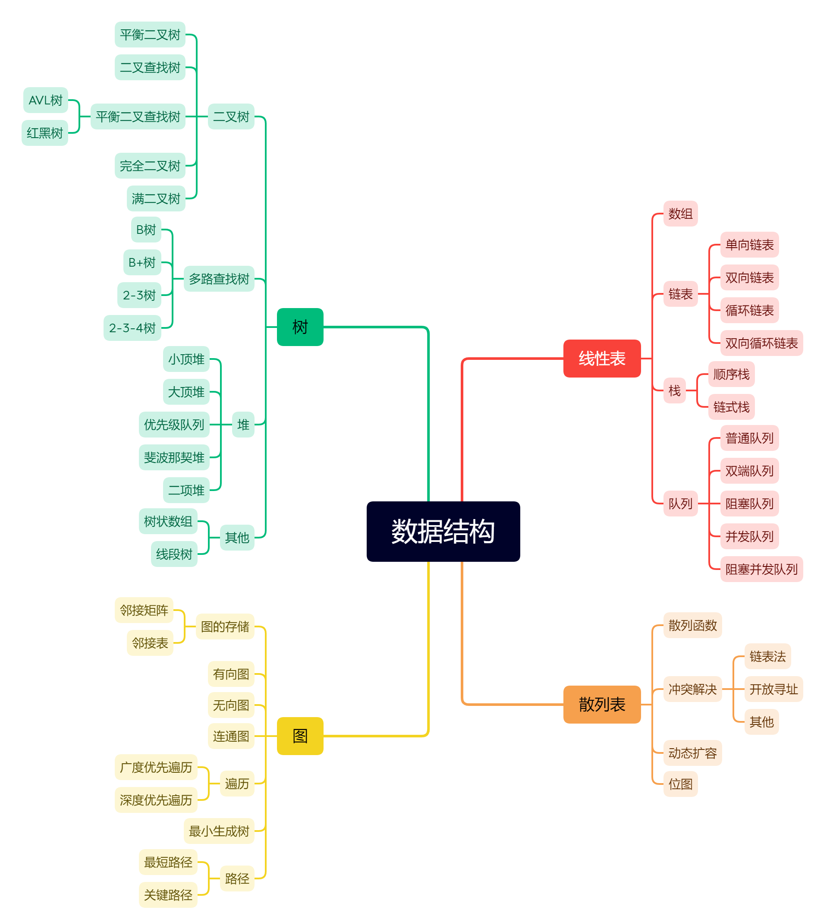
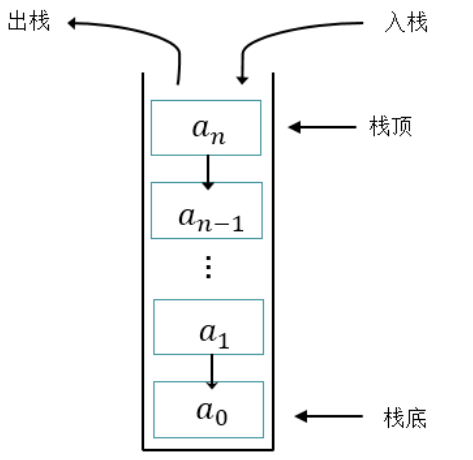
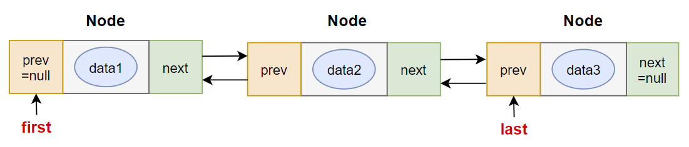
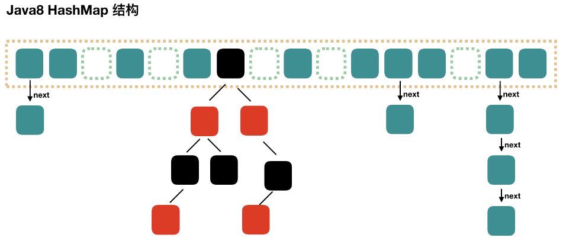

# Java基础

##  学习概括

#### 第1阶段：Java基本语法

01~20：第01章_Java语言概述
21~40：第02章_变量与运算符
41~58：第03章_流程控制语句
59~61：第04章_IDEA的安装与使用
62~72：第05章_数组

#### 第2阶段：Java面向对象编程

73~89：第06章_面向对象编程（基础）
90~104：第07章_面向对象编程（进阶）
105~123：第08章_面向对象编程（高级）

#### 第3阶段：Java高级应用

124~131：第09章_异常处理
132~141：第10章_多线程
142~152：第11章_常用类和基础API
153~163：第12章_集合框架
164~167：第13章_泛型
168~174：第14章_数据结构与集合源码
175~182：第15章_File类与IO流
183~186：第16章_网络编程
187~193：第17章_反射机制
194~200：第18章_JDK8-17新特性


## Java语言概述

### 常用的dos命令

| 操作          | 说明                 |
| ------------- | -------------------- |
| d:            | 切换盘               |
| cd 目录       | 进入当前目录或文件夹 |
| cd ..         | 回到上一级目录       |
| md 文件名     | 创建文件目录         |
| rd 文件目录名 | 删除指定目录         |
| cls           | 清屏                 |
| exit          | 退出窗口             |

### 开发步骤


### Hello World

``` 
class HelloChina{
	public static void main(String[] args){
		System.out.println("hello")
		System.out.print("\n") //换行符
		System.out.print("\t") //制表符
}
}
```

1、main()方法固定，public static void main(String[] args)
2、程序严格区分大小写
3、每一行执行语句以;结束
4、控制台输出数据操作System.out.println(),换行
						System.out.print()

5、编译不通过，考虑文件名、文件路径、代码语法问题
6、运行不通过，查看解释运行的类名、字节码文件路径是否书写错误；
7、一个源文件中可以声明多个类，只能有一个使用public声明，且要求类名与源文件名相同。

------

### 注释

1. 单行注释

```
//这是一行注释
```

2. 多行注释

``` 
/*
	多行注释
*/
```

多行注释不能嵌套使用

3. 文档注释

```
/**
	文档注释
*/
```

文档注释可以被Javadoc解释，生成一个网页形式的说明文档

### Java api文档

放在d盘 [BaiduNetdiskDownload](D:\BaiduNetdiskDownload) 中

_______


# IntelliJ IDEA 常用快捷键一览表

author：尚硅谷-宋红康

***

## 1-IDEA的日常快捷键

## 掌握

**1、public [static](https://so.csdn.net/so/search?q=static&spm=1001.2101.3001.7020) void main(String[] args)**

输入psvm按tab键

**2、 System.out.println()**

| 生成控制台的相关快捷键 | 描述                                                         |
| ---------------------- | ------------------------------------------------------------ |
| sout + Tab键           | 生成System.out.println();，输出到控制台语句并换行。          |
| souf + Tab键           | 生成System.out.printf("");,输出一个格式化字符串到控制台。    |
| soutm + Tab键          | 生成System.out.println("类名.方法名");，输出当前 类和方法名 到控制台。 |
| soutp + Tab键          | 生成System.out.println(所有方法参数名+值);，输出当前 方法的参数名和值 到控制台。 |

可以先输入要输出的东西，再输入sout

**3.注释**

CTRL + /

**4.set / get 方法**

| Alt + Insert | 代码自动生成，如生成对象的 set / get 方法，构造函数，toString() 等 |
| ------------ | ------------------------------------------------------------ |

**5.方法参数提示**

| Ctrl + P | 方法参数提示显示 |
| -------- | ---------------- |

**6.使用块环绕**

| ctrl+alt+t | 使用xx块环绕-surround with ... |
| ---------- | ------------------------------ |

**7.提示**

| alt + enter | 智能提示-edit |
| ----------- | ------------- |

## 全集

### 第1组：通用型

| 说明            | 快捷键           |
| --------------- | ---------------- |
| 复制代码-copy   | ctrl + c         |
| 粘贴-paste      | ctrl + v         |
| 剪切-cut        | ctrl + x         |
| 撤销-undo       | ctrl + z         |
| 反撤销-redo     | ctrl + shift + z |
| 保存-save all   | ctrl + s         |
| 全选-select all | ctrl + a         |

### 第2组：提高编写速度（上）

| 说明                                               | 快捷键           |
| -------------------------------------------------- | ---------------- |
| 智能提示-edit                                      | alt + enter      |
| 提示代码模板-insert live template                  | ctrl+j           |
| 使用xx块环绕-surround with ...                     | ctrl+alt+t       |
| 调出生成getter/setter/构造器等结构-generate ...    | alt+insert       |
| 自动生成返回值变量-introduce variable ...          | ctrl+alt+v       |
| 复制指定行的代码-duplicate line or selection       | ctrl+d           |
| 删除指定行的代码-delete line                       | ctrl+y           |
| 切换到下一行代码空位-start new line                | shift + enter    |
| 切换到上一行代码空位-start new line before current | ctrl +alt+ enter |
| 向上移动代码-move statement up                     | ctrl+shift+↑     |
| 向下移动代码-move statement down                   | ctrl+shift+↓     |
| 向上移动一行-move line up                          | alt+shift+↑      |
| 向下移动一行-move line down                        | alt+shift+↓      |
| 方法的形参列表提醒-parameter info                  | ctrl+p           |

### 第3组：提高编写速度（下）

| 说明                                        | 快捷键       |
| ------------------------------------------- | ------------ |
| 批量修改指定的变量名、方法名、类名等-rename | shift+f6     |
| 抽取代码重构方法-extract method ...         | ctrl+alt+m   |
| 重写父类的方法-override methods ...         | ctrl+o       |
| 实现接口的方法-implements methods ...       | ctrl+i       |
| 选中的结构的大小写的切换-toggle case        | ctrl+shift+u |
| 批量导包-optimize imports                   | ctrl+alt+o   |

### 第4组：类结构、查找和查看源码

| 说明                                                      | 快捷键                          |
| --------------------------------------------------------- | ------------------------------- |
| 如何查看源码-go to class...                               | ctrl + 选中指定的结构 或 ctrl+n |
| 显示当前类结构，支持搜索指定的方法、属性等-file structure | ctrl+f12                        |
| 退回到前一个编辑的页面-back                               | ctrl+alt+←                      |
| 进入到下一个编辑的页面-forward                            | ctrl+alt+→                      |
| 打开的类文件之间切换-select previous/next tab             | alt+←/→                         |
| 光标选中指定的类，查看继承树结构-Type Hierarchy           | ctrl+h                          |
| 查看方法文档-quick documentation                          | ctrl+q                          |
| 类的UML关系图-show uml popup                              | ctrl+alt+u                      |
| 定位某行-go to line/column                                | ctrl+g                          |
| 回溯变量或方法的来源-go to implementation(s)              | ctrl+alt+b                      |
| 折叠方法实现-collapse all                                 | ctrl+shift+ -                   |
| 展开方法实现-expand all                                   | ctrl+shift+ +                   |

### 第5组：查找、替换与关闭

| 说明                                               | 快捷键       |
| -------------------------------------------------- | ------------ |
| 查找指定的结构                                     | ctlr+f       |
| 快速查找：选中的Word快速定位到下一个-find next     | ctrl+l       |
| 查找与替换-replace                                 | ctrl+r       |
| 直接定位到当前行的首位-move caret to line start    | home         |
| 直接定位到当前行的末位 -move caret to line end     | end          |
| 查询当前元素在当前文件中的引用，然后按 F3 可以选择 | ctrl+f7      |
| 全项目搜索文本-find in path ...                    | ctrl+shift+f |
| 关闭当前窗口-close                                 | ctrl+f4      |

### 第6组：调整格式

| 说明                                         | 快捷键           |
| -------------------------------------------- | ---------------- |
| 格式化代码-reformat code                     | ctrl+alt+l       |
| 使用单行注释-comment with line comment       | ctrl + /         |
| 使用/取消多行注释-comment with block comment | ctrl + shift + / |
| 选中数行，整体往后移动-tab                   | tab              |
| 选中数行，整体往前移动-prev tab              | shift + tab      |

## 2-Debug快捷键

| 说明                                                  | 快捷键        |
| ----------------------------------------------------- | ------------- |
| 单步调试（不进入函数内部）- step over                 | F8            |
| 单步调试（进入函数内部）- step into                   | F7            |
| 强制单步调试（进入函数内部） - force step into        | alt+shift+f7  |
| 选择要进入的函数 - smart step into                    | shift + F7    |
| 跳出函数 - step out                                   | shift + F8    |
| 运行到断点 - run to cursor                            | alt + F9      |
| 继续执行，进入下一个断点或执行完程序 - resume program | F9            |
| 停止 - stop                                           | Ctrl+F2       |
| 查看断点 - view breakpoints                           | Ctrl+Shift+F8 |
| 关闭 - close                                          | Ctrl+F4       |

# IDEA断点调试(Debug)

### 为什么需要Debug

编好的程序在执行过程中如果出现错误，该如何查找或定位错误呢？简单的代码直接就可以看出来，但如果代码比较复杂，就需要借助程序调试工具（Debug）来查找错误了。

```
运行编写好的程序时，可能出现的几种情况：
> 情况1：没有任何bug,程序执行正确！

====================如果出现如下的三种情况，都又必要使用debug=============================
> 情况2：运行以后，出现了错误或异常信息。但是通过日志文件或控制台，显示了异常信息的位置。
> 情况3：运行以后，得到了结果，但是结果不是我们想要的。
> 情况4：运行以后，得到了结果，结果大概率是我们想要的。但是多次运行的话，可能会出现不是我们想要的情况。
        比如：多线程情况下，处理线程安全问题。
        
```

### Debug的步骤

Debug(调试)程序步骤如下：

1、添加断点

2、启动调试

3、单步执行

4、观察变量和执行流程，找到并解决问题

### 单步调试工具介绍

：Step Over（F8）：进入下一步，如果当前行断点是调用一个方法，则不进入当前方法体内

：Step Into（F7）：进入下一步，如果当前行断点是调用一个自定义方法，则进入该方法体内

：Force Step Into（Alt +Shift  + F7）：进入下一步，如果当前行断点是调用一个核心类库方法，则进入该方法体内

：Step Out（Shift  + F8）：跳出当前方法体

：Run to Cursor（Alt + F9）：直接跳到光标处继续调试

：Resume Program（F9）：恢复程序运行，但如果该断点下面代码还有断点则停在下一个断点上

：Stop（Ctrl + F2）：结束调试

：View Breakpoints（Ctrl + Shift  + F8）：查看所有断点

：Mute Breakpoints：使得当前代码后面所有的断点失效， 一下执行到底 


## 变量与运算符

### 关键字


## 快捷键

**1、public [static](https://so.csdn.net/so/search?q=static&spm=1001.2101.3001.7020) void main(String[] args)**

输入psvm按tab键

**2、 System.out.println()**

| 生成控制台的相关快捷键 | 描述                                                         |
| ---------------------- | ------------------------------------------------------------ |
| sout + Tab键           | 生成System.out.println();，输出到控制台语句并换行。          |
| souf + Tab键           | 生成System.out.printf("");,输出一个格式化字符串到控制台。    |
| soutm + Tab键          | 生成System.out.println("类名.方法名");，输出当前 类和方法名 到控制台。 |
| soutp + Tab键          | 生成System.out.println(所有方法参数名+值);，输出当前 方法的参数名和值 到控制台。 |

可以先输入要输出的东西，再输入sout

**3.注释**

CTRL + /

**4.set / get 方法**

| Alt + Insert | 代码自动生成，如生成对象的 set / get 方法，构造函数，toString() 等 |
| ------------ | ------------------------------------------------------------ |

**5.方法参数提示**

| Ctrl + P | 方法参数提示显示 |
| -------- | ---------------- |


### 标识符


> 规则
>
> 26个英文字母大小写，0-9，_，$
>
> 不用数字开头
>
> /*
>
> int 123L = 12；
>
> long 16 = 123L;
>
> */
>
> 不用关键字和保留字
>
> 不包含空格

 

> 规范
>
> 包名：所有字母小写
>
> 类名、接口名：所有单词的首字母大写，大驼峰
>
> 变量名、方法名：第一个单词首字母小写，第二个单词开始大写，，小驼峰
>
> 常量名：所有字母大写，单词间使用下划线连接


### 变量

#### 变量的声明格式：

> 数据类型 变量名 = 变量值

#### 数据类型


> 整型
>
> byte的存储范围-128--127；
>
> 整型通常用int就可以，默认int；
>
> 定义long型变量，后缀.l,.L


> 浮点型
>
> float：单精度，7位有效数字，后缀要加.f或.F
>
> 默认double型，
>
> 高精度计算用BigDecimal类


> 字符型
>
> 1.用一对单引号''来表示，内部只能有一个字符
>
> 2.用Unicode值来表示字符型常量
>
> 3.用转义字符'\n','\t'
>
> 4.用具体字符对应的数值（ASCII码）


> 布尔类型：boolean
>
> 只有两个取值true、false


#### 变量间运算规则

1. 自动类型提升
2. 强制类型转换

> 可以自动转换为容量大的数据类型
>
>  byte、short、char -->int -->long -->float -->double
>
> - 特殊：byte与short、char之间做运算，结果为int类型

> 强转符：一个括号（）
>
> ```
> double d2 = 12.9;
> int i4 = (int)d2;
> ```

#### String类的使用

- String类，引用数据类型，字符串

- 用双引号赋值""
- 内部可以包含多个字符串
- 只能与基本数据类型间做连接运算“+”，区分连接运算与加法运算

```
String str1 = "";
String str2 = str1 + boolean2 + num3;
```

- 将String类型的变量转换为基本数据类型，使用Integer类

```
int num3 = Integer.parseInt(str9);
```

### 计算机底层

二进制（0B、0b开头）、八进制（0开头）、十六进制（0X、0x开头）

以补码方式存储数据

### 运算符


#### 算数运算符

> 除法：/
>
> 取余：%  结果正负号与被取余的数相同
>
> （前）++：先自增，再运算
>
> （后）++：先运算，再自增

#### 赋值运算符

> 支持连续赋值 a = b =1
>
> 不会改变操作本身的数据类型

#### 比较运算符

> 运算结果为boolean
>
> istanceof 多态

#### 逻辑运算符

> 且  & 、&&（短路、后面部分可能不执行）（开发中推荐）
>
> 或  |、||（短路）
>
> 非   ！
>
> 异或   ^

#### 位运算符

> 针对数值类型运算
>
> <<    左移，左移一位，原数*2，正负都适用
>
> ```
> >>   右移，右移一位，原数据/2
> >>>  无符号右移，右移后，左边空出来的补0
> ```

交换两个变量的值：声明一个临时变量

#### 条件运算符

三元运算符

（条件表达式）？表达式1：表达式2

```
double result = (2>1)? 1:2.0;
```

> 输出boolean类型
>
> 结果是true,执行表达式1，否则执行2
>
> 1和2表达式类型应相同

条件运算符效率比逻辑语句稍高

## 流程控制

### 顺序


### 分支

#### if-else

> if(....){......;
>
> }
>
> elseif(...){.....;
>
> }
>
> elseif(){;}
>
> else{........;
>
> }

嵌套

#### switch-case

```
switch(表达式){
    case 常量值1:
        语句块1;
        //break;
    case 常量值2:
        语句块2;
        //break; 
    // ...
   [default:
        语句块n+1;
        break;
   ]
}
```

- case子句中的值必须是常量，不能是变量名或不确定的表达式值或范围；

- switch(表达式)中表达式的值必须是下述几种类型之一：byte，short，char，int，枚举 (jdk 5.0)，String (jdk 7.0)；

- 没有break，程序会顺序执行到switch结尾；

- 凡是使用switch-case的结构都可以转换为if-else结构。反之，不成立

  

#### Scanner获取数据

```
导包：import java.util.Scanner;
创建实例：Scanner scan = new Scanner(System.in);//System.in默认代表键盘输入
获取指定类型变量：String name = scanner.next();
				int age = scanner.nextInt();//
释放资源：scan.close();				
```


### 循环

#### for循环

```
for (①初始化部分; ②循环条件部分; ④迭代部分)｛
         	③循环体部分;
｝
```

####  while循环

```java
①初始化部分
while(②循环条件部分)｛
    ③循环体部分;
    ④迭代部分;
}
```

#### do-while循环

```
①初始化部分;
do{
	③循环体部分
	④迭代部分
}while(②循环条件部分); 
```

> - 结尾while(循环条件)中循环条件必须是boolean类型
>
> - 一定会执行一次循环体
> - 开发中使用少

#### 无限循环

- 最简单"无限"循环格式：`while(true)` , `for(;;)` 
- 控制循环的结束（使用break）

#### 嵌套循环

```
for(初始化语句①; 循环条件语句②; 迭代语句⑦) {
    for(初始化语句③; 循环条件语句④; 迭代语句⑥) {
      	循环体语句⑤;
    }
}
```

### break与continue关键字

			适用范围			在循环结构中使用的作用						相同点

break	      switch-case
			循环结构			一旦执行，就跳出当前循环结构		    此关键字的后面，不能声明语句

continue	循环结构			一旦执行，就跳出当次循环结构		    此关键字的后面，不能声明语句

---------


### 工程与模块管理

**层级关系：**

```
project(工程) - module(模块) - package(包) - class(类)
```

项目结构基本都是多Module的结构，这类项目一般是`按功能划分`的

在一个module下，可以声明多个包（package），一般命名规范如下：

```
1.不要有中文
2.不要以数字开头
3.给包取名时一般都是公司域名倒着写,而且都是小写
  比如：尚硅谷网址是www.atguigu.com
  那么我们的package包名应该写成：com.atguigu.子名字。
```

## 数组

理解：容器，多个数据的组合

> 数组中元素有序排列

### 数组的使用

 #### 数组的声明

```
数据类型[] 数组名;
数组名 = new 数据类型[]{元素1,元素2,元素3,...};

静态初始化：数组变量的初始化和数组元素的赋值操作同时进行

double[] prices;
prices = new double[]{20.32,43.21,43.22};
```


```
动态初始化：数组变量的初始化和数组元素的赋值操作分开进行
动态初始化中，只确定了元素的个数（即数组的长度）

数组存储的元素的数据类型[] 数组名字 = new 数组存储的元素的数据类型[长度];
int[] arr = new int[5];
或

数组存储的数据类型[] 数组名字;
数组名字 = new 数组存储的数据类型[长度];
int[] arr;
arr = new int[5];

```


#### 数组的调用

> 通过角标的方式，获取数组元素
>
> foods[0] = xxxx; 给元素进行赋值


#### 数组的长度

> .length


#### 数组的遍历

```
for(int i=0; i<arr.length; i++){
            System.out.println(arr[i]);
```

#### 数组元素的默认值


  ### 数组内存划分

#### Java内存划分


| 区域名称   | 作用                                                         |
| ---------- | ------------------------------------------------------------ |
| 虚拟机栈   | 用于存储正在执行的每个Java方法的局部变量表等。局部变量表存放了编译期可知长度<br/>的各种基本数据类型、对象引用，方法执行完，自动释放。 |
| 堆内存     | 存储对象（包括数组对象），new来创建的，都存储在堆内存。      |
| 方法区     | 存储已被虚拟机加载的类信息、常量、（静态变量）、即时编译器编译后的代码等数据。 |
| 本地方法栈 | 当程序中调用了native的本地方法时，本地方法执行期间的内存区域 |
| 程序计数器 | 程序计数器是CPU中的寄存器，它包含每一个线程下一条要执行的指令的地址 |

#### 数组用到栈和堆

数组名放在栈里面，数组元素放在堆里面


### 二维数组

理解：可以看成是一维数组array1又作为另一个一维数组array2的元素而存在。

#### 数组的初始化

```
静态初始化
int[][] arr = new int[][]{{3,8,2},{2,7},{9,0,1,6}};
```


```
动态初始化
int[][] arr = new int[3][2];
```


#### 数组的遍历

```
for(int i=0; i<arr.length; i++){
            for(int j=0; j<arr[i].length; j++){
                System.out.print(arr[i][j] + " ");
            }
```

#### 数组元素默认值

**动态初始化的两种方式**

格式1：规则二维表：每一行的列数是相同的

```
int[][] arr = new int[3][2];
```

1）外层元素，默认存储地址值

2）内层元素，与一维相同

格式2：不规则：每一行的列数不一样

```
int[][] arr = new int[3][];
```

1）外层元素，默认存储null

2）内层元素，不存在，调用会报错

### 二维数组的内存解析


### 数组的常见算法

#### 数值型数组特征值统计

特征值涉及到：平均值、最大值、最小值、总和等

```
//求总和、均值
        int sum = 0;//因为0加上任何数都不影响结果
        for(int i=0; i<arr.length; i++){
            sum += arr[i];
        }
        double avg = (double)sum/arr.length;
//找最大值
        int max = arr[0];
        for(int i=1; i<arr.length; i++){//此处i从1开始，是max不需要与arr[0]再比较一次了
            if(arr[i] > max){
                max = arr[i];
```

#### 数组元素的赋值与数组复制

例：杨辉三角

- 赋值

array1 = array2，两个变量同时指向了一个地址，改一个都改

- 复制

两个数组指向两个地址，通过动态操作让他们的值相同

####  数组的反转

```
 //反转方式一
        思路：首尾对应位置的元素交换
        （1）确定交换几次
           次数 = 数组.length / 2
        （2）谁和谁交换
        for(int i=0; i<次数; i++){
             int temp = arr[i];
             arr[i] = arr[arr.length-1-i];
             arr[arr.length-1-i] = temp;
        }
//反转方式二
		新建一个数组，遍历重新写入
```

#### 数组的扩容与缩容

```
数组扩容
int[] newArr = new int[arr.length << 1];
int[] newArr = new int[arr.length * 2];

数组的缩容
1、不新建数组，用后一个覆盖前一个
  for (int i = delIndex; i < arr.length - 1; i++) {
            arr[i] = arr[i + 1];
        }
        arr[arr.length - 1] = 0;
        
2、新建一个数组，长度比原来少一

```

#### 数组元素查找

- 线性查找

顺序查找,遍历挨个查看

要求：对数组元素的顺序没要求

复杂度O(N)

- 二分法查找

和中间元素比大小

要求数组必须是有序的

复杂度O(logN)


#### 数组元素排序

##### 衡量排序算法优劣

- 时间复杂度（看阶数）：Ο(1)＜Ο(log2n)＜Ο(n)＜Ο(nlog2n)＜Ο(n<sup>2</sup>)＜Ο(n<sup>3</sup>)＜…＜Ο(2<sup>n</sup>)＜Ο(n!)<O(n<sup>n</sup>)

- 空间复杂度：分析排序算法中需要多少辅助内存，多用空间换时间
- 稳定性：

##### 排序算法分类：

内部排序，外部排序


##### 冒泡排序

```
冒泡排序
思想：每一次比较“相邻（位置相邻）”元素，如果它们不符合目标顺序（例如：从小到大），
     就交换它们，经过多轮比较，最终实现排序。
public class Test19BubbleSort{
    public static void main(String[] args){
        int[] arr = {6,9,2,9,1};
        for(int i=1; i<arr.length; i++){
         for(int j=0; j<arr.length-i; j++){
                //希望的是arr[j] < arr[j+1]
                if(arr[j] > arr[j+1]){
                    //交换arr[j]与arr[j+1]
                    int temp = arr[j];
                    arr[j] = arr[j+1];
                    arr[j+1] = temp;
                }
            }
        }

        //完成排序，遍历结果
        for(int i=0; i<arr.length; i++){
            System.out.print(arr[i]+"  ");
        }
    }
}
```

##### 快速排序

开发中使用较多

1. 从数列中挑出一个元素，称为"基准"（pivot），

2. 重新排序数列，所有元素比基准值小的摆放在基准前面，所有元素比基准值大的摆在基准的后面（相同的数可以到任一边）。在这个分区结束之后，该基准就处于数列的中间位置。这个称为分区（partition）操作。

   

# 面向对象基础

## 类(Class) 和 对象(Object) 

**类：**

具有相同特征的事物的抽象描述，是抽象的 、概念上的定义。

**对象：**

实际存在的该类事物的 每个个体 ，是具体的 ，因而也称为 实例(instance) 。

## 面向对象三步骤

- 步骤1：类的定义

```
[修饰符] class 类名{
	属性声明;
	方法声明;
}


public class Dog{
//声明属性
	String type; //种类
	String nickName; //昵称
	String hostName; //主人名称
//声明方法
	public void eat(){ //吃东西
		System.out.println("狗狗进食");
	}
}

```

- 步骤2：对象的创建

```
类名 对象名 = new 类名();

class PersonTest{
	public static void main(String[] args){
        //创建Person类的对象
        Person per = new Person();
        //创建Dog类的对象
        Dog dog = new Dog();
	}
}
```

类的实例化<=>创建类的对象<=>创建类的实例

> 格式：类类型 对象名 = 通过new创建的对象实体
>
> Person per = new Person();

- 步骤3：对象调用属性或方法

```
使用" 对象名.属性 " 或 " 对象名.方法 "的方式访问对象成员（包括属性和方法）
```

## 对象的内存解析


栈（Stack） ：方法内定义的变量，储存在栈中。

堆（Heap） ：new 出来的结构（包括数组实体、对象实体），包括对象中的属性。 

方法区（Method Area） ：用于存储已被虚拟机加载的类信息、常量、静态变量、即时编译器编译后的代码等数据。

## 类的成员之一：成员变量(field)

```
[修饰符1] class 类名{
	[修饰符2] 数据类型 成员变量名 [= 初始化值];
}
```

#### 成员变量 vs 局部变量

- 成员变量：在方法体外，类体内声明的变量。

- 局部变量：在方法体内部等位置声明的变量。

1、声明位置和方式 

（1）实例变量：在类中方法外 （2）局部变量：在方法体{}中或方法的形参列表、代码块中 

2、在内存中存储的位置不同 

（1）实例变量：堆 （2）局部变量：栈 

3、生命周期

 （1）实例变量：和对象的生命周期一样，随着对象的创建而存在，随着对象被GC回收而消 亡， 而且每一个对象的实例变量是独立的。       （2）局部变量：和方法调用的生命周期一样，每一次方法 被调用而在存在，随着方法执行的结束而消亡， 而且每一次方法调用都是独立。 

4、作用域 

（1）实例变量：通过对象就可以使用，本类中直接调用，其他类中“对象.实例变量” （2）局 部变量：出了作用域就不能使用 

5、修饰符（后面来讲） 

（1）实例变量：public,protected,private,final,volatile,transient等 （2）局部变 量：final 

6、默认值 

（1）实例变量：有默认值 （2）局部变量：没有，必须手动初始化。其中的形参比较特殊， 靠实参给它初始化。

#### 对象属性的默认初始化赋值


## 类的成员之二：方法

方法：类或对象行为特征的抽象，用来完成某个功能操作。在某些语言中也称为 函数 或 过程

#### 方法声明的格式

```
权限修饰符 返回值类型 方法名（形参列表）[throws 异常类型]{
	方法体的功能代码
}

public class Person{
	private int age;
	
	public int getAge() { //声明方法getAge()
		return age;
	}
	
	public void setAge(int i) { //声明方法setAge
	age = i; //将参数i的值赋给类的成员变量age
	}
}

1.权限修饰符
	有private、缺省、protected、public
2.返回值类型
	无返回值，则声明：void
	有返回值，则声明出返回值类型（可以是任意类型）。与方法体中“ return 返回值 ”搭配使用
	[经验]
3.方法名
	规范标识符
4.形参列表
	表示完成方法体功能时需要外部提供的数据列表。可以包含零个，一个或多个参数。
	无论是否有参数，()不能省略....Math.random()
    如果有参数，每一个参数都要指定数据类型和参数名，多个参数之间使用逗号分隔，例如：
    一个参数： (数据类型 参数名)
    二个参数： (数据类型1 参数1, 数据类型2 参数2)
5.方法体
	方法必须定义在类里
	方法不调用不执行，调用一次执行一次
	方法中可以调用另一个方法
	方法内不能定义方法
6.return
	
```

#### 方法调用内存解析

- 形参：方法声明时，（）内声明的形式参数

- 实参：方法被调用时，实际传递给形参的常量或变量


## 对象数组

数组的元素可以是基本数据类型，也可以是引用数据类型。当元素是引用类型中的类时，我们称为对象数组。

#### 对象数组内存解析


#### 对象数组创建

- 首先要创建数组对象本身，即确定数组的长度，
- 然后再创建每一个元素对象
- 如果不创建， 数组的元素的默认值就是 null ，所以很容易出现 空指针异常NullPointerException 。

```
		// 数组的创建
        Student[] students = new Student[20];
        // 通过循环结构给数组的属性赋值
        for (int i = 0; i < students.length; i++) {
        // 数组元素的赋值
            students[i] = new Student();
```

## 方法

#### 方法的重载（overload）

**定义：**

在同一个类中，允许存在一个以上的同名方法，只要它们的参数列表不同即可。

调用时先看方法名，再看参数列表

判断是不是同一个方法，方法名和参数列表都要比较。

**重载方法调用**：JVM通过方法的参数列表，调用匹配的方法。

​	先找个数、类型最匹配的 

​	再找个数和类型可以兼容的，如果同时多个方法可以兼容将会报错

#### 可变形参个数的方法

当定义一个方法时，形参的类型可以确定，但是形参的个数不确定，那么可以考虑使用可变个数的形参。

```
方法名(参数的类型名 ...参数名)

public int sum(int... nums)
public static void test(int a ,String...books)

```

#### 方法的值传递机制

- 基本数据类型：传递的是数据值

- 引用数据类型：传递的是地址值

> 形参（formal parameter）：在定义方法时，方法名后面括号()中声明的变量称为形式参数，简称形参。

> 实参（actual parameter）：在调用方法时，方法名后面括号()中的使用的值/变量/表达式称为实际参数，简称实参。

- 形参是**基本数据类型**：将实参基本数据类型变量的“数据值”传递给形参 

- 形参是**引用数据类型**：将实参引用数据类型变量的“地址值”传递给形参


**举例一：**

交换不成功，输出的是main方法中的，swap方法会先出栈


**举例二：**


#### 递归方法

**概念**：方法自己调用自己的现象

**分类**：直接递归、间接递归

```
直接递归
public void methodA(){
	methodA();
}
```

```
间接递归
public static void A(){
	B();
}
public static void B(){
	C();
}
public static void C(){
	A();
}
```

```
//使用递归的写法写斐波那契数列

int f(int n) {//计算斐波那契数列第n个值是多少
	if (n < 1) {//负数是返回特殊值1，表示不计算负数情况
		return 1;
	}
	if (n == 1 || n == 2) {
		return 1;
	}
	return f(n - 2) + f(n - 1);
}

```


> 递归时向已知方向递归，否则循环无法结束
>
> 追求高性能时避免用递归，花时间且耗内存，考虑用循环。


## package关键字

包，用于指明该文件中定义的类、接口等结构所在的包。

```
package 顶层包名.子包名 ;
```

> 规范
>
> **包名**：所有字母小写
>
> 类名、接口名：所有单词的首字母大写，大驼峰
>
> 变量名、方法名：第一个单词首字母小写，第二个单词开始大写，，小驼峰
>
> 常量名：所有字母大写，单词间使用下划线连接

作为第一条语句出现，包通常使用所在公司域名的倒置：com.atguigu.xxx。

#### JDK中主要的包

- java.lang ----包含一些Java语言的核心类，如String、Math、Integer、 System和Thread，提供常用功能 
- java.net ----包含执行与网络相关的操作的类和接口。
-  java.io ----包含能提供多种输入/输出功能的 类。 
- java.util ----包含一些实用工具类，如定义系统特性、接口的集合框架类、使用与日期日历相关 的函数。
-  java.text ----包含了一些java格式化相关的类 
- java.sql ----包含了java进行JDBC数据库编程 的相关类/接口
-  java.awt ----包含了构成抽象窗口工具集（abstract window toolkits）的多个类，这些类 被用来构建和管理应用程序的图形用户界面(GUI)。

### import关键字

用import语句来显式引入指定包下所需要的类

```
import 包名.类名;
```

- 如果使用 **a.* 导入**结构，表示可以导入a包下的所有的结构。举例：可以使用java.util.*的方式，一 次性导入util包下所有的类或接口。
-  如果导入的类或接口是java.lang包下的，或者是当前包下的，则可以省略此import语句。
-  如果已经导入java.a包下的类，那么如果需要使用a包的子包下的类的话，仍然需要导入。 
- 如果在代码中使用不同包下的同名的类，那么就需要使用类的**全类名**的方式指明调用的是哪个类。

## 面向对象特征之一：封装

#### 原则

**高内聚** ：类的内部数据操作细节自己完成，不允许外部干涉； 

**低耦合** ：仅暴露少量的方法给外部使用，尽量方便外部调用。

#### 权限修饰符

private、缺省、 protected、public


#### 权限的具体使用

**外部类**：只能用public、缺省修饰 

**成员变量、成员方法、构造器、成员、内部类**：public、protected、缺省、private

#### 封装性的体现

**场景一**：私有化类的属性，提供公共的get和set方法，对此属性进行获取或修改。

**场景二**：将类中不需要对外暴露的方法，设置为private。

**场景三**：单例模式中构造器private的了，避免在类的外部创建实例。


## 类的成员之三：构造器

#### 结构

constructor

```
[修饰符] class 类名{
	[修饰符] 构造器名(){
	// 实例初始化代码
	}
	
	[修饰符] 构造器名(参数列表){
	// 实例初始化代码
	}
}

Person p = new Person(“Peter”,15) ;
```


#### 构造器作用

**关键作用：*****在new对象时，直接为当前对象的某个或所有成员变量直接赋值****

作用一：搭配new关键字，创建类的对象

作用二：创建对象的同时，给对象的相关属性赋值


> 当我们没有显式的声明类中的构造器时，系统会默认提供一个无参的构造器并且该构造器的修饰 符默认与类的修饰符相同.当我们显式的定义类的构造器以后，系统就不再提供默认的无参的构造器了。

```
// 无参构造
public Student() {}
// 有参构造
public Student(String n,int a) {
	name = n;
	age = a;
}

//调用无参构造创建学生对象
Student s1 = new Student();
//调用有参构造创建学生对象
Student s2 = new Student("张三",23);
```

## 补充知识

### 属性赋值过程

#### 属性赋值方法

1. 默认赋值

2. 显式赋值

3. 构造器中赋值

4. 通过"对象.属性"或"对象.方法"的方式，给属性赋值

#### 赋值先后顺序

① - ② - ③ - ④

执行次数;

> ①、②、③在对象创建过程中，只执行一次。 ④ 是在对象创建后执行的，可以根据需求多次执行。


### JavaBean

所谓JavaBean，是指符合如下标准的Java类： 

- 类是公共的 

- 有一个无参的公共的构造器 

- 有属性，且有对应的get、set方法


### UML类图

- +表示 public 类型， - 表示 private 类型，#表示protected类型

- 方法的写法: 方法的类型(+、-) 方法名(参数名： 参数类型)：返回值类型 

- 斜体表示抽象方法或类。


# 面向对象进阶

## this关键字

- 解决的问题：当形参名与属性名同名，在方法内区分两个变量

- 理解：当前对象

- this可以调用的结构：成员变量、方法和构造器

#### this调用构造器

> 格式：”this(形参列表)“

在类的构造器中，调用当前类中指定的其他构造器

> 最多声明一个，放在首行

## 面向对象特征之二：继承

减少代码冗余，提高代码复用性，利于功能扩展

### 继承的格式：

通过 `extends` 关键字，可以声明一个类B继承另外一个类A

```
[修饰符] class 类A {
	...
}

[修饰符] class 类B extends 类A {
	...
}
```

### 继承中的概念;

父类、超类、基类(base class)、SuperClass

子类、派生类(derived class)、SubClass

> - 继承后子类获得父类的属性和方法，
>
> - 但由于封装性影响，可能不能直接调用父类中声明的属性或方法
>
> - 继承父类后，可以扩展特有的功能
>
> - 没有显式声明父类，默认继承Java.kang.object

>  支持多层继承，一父多子，一子仅一父


## 方法的重写

在程序执行中，子类的方法将覆盖父类的方法。

方法声明格式：权限修饰符 返回值类型 方法名（形参列表）{方法体}

**重写规则：**

- 方法名相同

- 权限修饰符不小于父类

- private不能重写

- 返回值类型

  - 父类返回值void,子类重写返回值void
  - 父类是基本数据类型，重写返回值类型也相同

  - 父类是引用数据类型，子类重写返回值类型与之相同或是子类

## super关键字

子类继承重写父类后，对父类中被重写的方法进行调用

子类继承后和父类中有同名属性，是否可以在子类中区分

#### super调用属性、方法

```
//调用父类属性和方法
super.方法
super。属性
```

#### super调用构造器

- 子类继承父类时，不会继承构造器，需用super
- 在构造器的首行，"this(形参列表)" 和 "super(形参列表)"只能二选一。
- 构造器的首行两个都没调用，子类默认调用"super()"，即调用
- 父类中空参的构造器。

```

super(形参列表);

super(name,age);
```

> 开发中常见错误：
>
> 如果子类构造器中既未显式调用父类或本类的构造器，且父类中又没有空参的构造器，则`编译出错`。

#### 子类对象实例化过程


在创建子类对象的过程中，一定会调用父类中的构造器，直到调用Object类中的构造器为止。

## 面向对象特征之三：多态

一个事物的多种形态

编译看左边，运行看右边

### 多态性

开发中，有时我们在设计一个数组、或一个成员变量、或一个方法的形参、返回值类型时，无法确定它具体的类型，只能确定它是某个系列的类型。

**多态存在的三个必要条件**

- 继承
- 重写
- 父类引用指向子类对象：**Parent p = new Child();**

多态性在Java中的体现：

**对象的多态性：父类的引用指向子类的对象**

```
父类类型 变量名 = 子类对象；
Person p = new Student();
```

### 多态的应用

**虚拟方法调用**

在多态的场景下，调用方法时，编译时方法是左边声明的父类的方法，执行时执行的是子类重写父类的方法。

>  **编译看左边，应用看右边。**

**多态的使用要求**

继承关系，方法重写

### 多态的优缺点

好处：变量引用的子类对象不同，执行的方法就不同，实现动态绑定。

弊端：一个引用类型变量如果声明为父类的类型，但实际引用的是子类对象，那么该变量就不能再访问子类中添加的属性和方法。

### 向下转型

```
Person p1 = new Man();
//使用强转符改变类型
Man m1 = (Man)p1;

```

向下转型，可能会出现类型转换异常（ClassCastException）

#### 关键字instanceof

```
//检验对象a是否是数据类型A的对象，返回值为boolean型

对象a instanceof 数据类型A

```

只要用instanceof判断返回true的，那么强转为该类型就一定是安全的，不会报ClassCastException异常。

```
 //先判断，再强转
 if(pets[i] instanceof Dog){
                Dog dog = (Dog) pets[i];
                dog.watchHouse();
```

### Object类

Java类的根父类

#### clone（了解）

Animal a2 = (Animal) a1.clone();

可用于创建对象

#### finalize（了解）

- 对象被回收：当某个对象没有任何引用时，JVM就认为这个对象是垃圾对象，就会在之后不确定的时间使用垃圾回收机制来销毁该对象，在销毁该对象前，会先调用 finalize()方法。 

- 在JDK 9中此方法已经被`标记为过时`的。

### equals

>  任何引用数据类型都可以用

自定义类没重写方法，比较两个对象的引用地址值是否相同。

对类File、String、Date及包装类（Wrapper Class）来说，重写了Object类的equals()方法，比较两个对象的实体内容是否相等。

**equals重写**

实际开发中，常判断两个对象的属性值是否相同，需要重写 

idea自动实现

**面试题：**==和equals的区别

- == 

  - 基本数据类型、引用数据类型。

  - 基本类型就是比较值，对于引用类型就是比较内存地址

- equals

  - java.lang.Object类里面的方法，如果该方法没有被重写过默认也是==;

  - 我们可以看到String等类的equals方法是被重写过的

  - 重写equals方法，会比较类中的相应属性是否都相等。

### tostring

使用场景：平时在调用System.out.println()打印对象引用变量时，调用了对象的tostring

- 自定义的类，没重写时，默认**返回当前对象的地址值**

- 对类File、String、Date及包装类（Wrapper Class）来说，重写了，调用时**返回实体内容**

开发中，一般重写

# 面向对象高级

## 关键字static

静态的

### 应用场景

无论是否产生了对象或无论产生了多少对象的情况下，`某些特定的数据在内存空间里只有一份`

static用来修饰的结构:属性、方法;代码块、内部类;


> ### 复习: 变量的分类
>
> 方式1:
>
> 1. **按照数据类型**:
>
>    基本数据类型、引用数据类型
>
> 方式2:
>
> 2. **按照类中声明的位置**:
>    **成员变量:**按照是否使用static修饰进行分类
>
> - 使用static修饰的成员变量:**静态变量、类变量**
>
> - 不使用static修饰的成员变量:**非静态变量、实例变量**
>
>   **局部变量**:方法内、方法形参、构造器内、构造器形参、代码块内等。

### 静态变量（类变量）与实例变量（非静态变量）对比

**静态变量：**

在内存空间中只有一份， 被类的多个对象共享；

存放在堆空间；

随着类的加载而加载，只会加载一次；

可以被类直接调用，也可以使用对象调用；

随着类卸载而消亡；

**实例变量：**

类的每一个实例都保存着一份实例变量；

存放在堆空间的对象实体中；

随着对象创建而加载；

只能使用对象进行调用；

### static修饰方法

- 随着类的加载而加载

- 可以通过“类.静态方法”的方式，直接调用静态方法

- 静态方法内可以调用静态的属性或静态的方法，不可以调用非静态的结构。
- static修饰的方法中，不能使用this和super

### 将属性声明为静态?

当前类的多个实例能共享此成员变量

### 将方法声明为静态?

方法内操作的变量都是静态变量

常将工具类中的方法声明为静态方法，arrays、math

## 单例（Sigleleton）设计模式

软件系统中，对某个类只能存在一个实例对象，该类只提供一个取得其对象实例的方法

### 实现

#### 饿汉式

```
class Singleton {
    // 1.私有化构造器
    private Singleton() {
    }

    // 2.内部提供一个当前类的实例
    // 4.此实例也必须静态化
    private static Singleton single = new Singleton();

    // 3.提供公共的静态的方法，返回当前类的对象
    public static Singleton getInstance() {
        return single;
    }
}
```

#### 懒汉式

```
class Singleton {
    // 1.私有化构造器
    private Singleton() {
    }
    // 2.内部提供一个当前类的实例
    // 4.此实例也必须静态化
    private static Singleton single;
    // 3.提供公共的静态的方法，返回当前类的对象
    public static Singleton getInstance() {
        if(single == null) {
            single = new Singleton();
        }
        return single;
    }
}

```

#### 饿汉式 vs 懒汉式

**饿汉式：**（建议）

- 特点：`立即加载`，即在使用类的时候已经将对象创建完毕。
- 优点：实现起来`简单`；没有多线程安全问题。
- 缺点：当类被加载的时候，会初始化static的实例，静态变量被创建并分配内存空间，从这以后，这个static的实例便一直占着这块内存，直到类被卸载时，静态变量被摧毁，并释放所占有的内存。因此在某些特定条件下会`耗费内存`。

#### 懒汉式：

- 特点：`延迟加载`，即在调用静态方法时实例才被创建。
- 优点：实现起来比较简单；当类被加载的时候，static的实例未被创建并分配内存空间，当静态方法第一次被调用时，初始化实例变量，并分配内存，因此在某些特定条件下会`节约内存`。
- 缺点：在多线程环境中，这种实现方法是完全错误的，`线程不安全`，根本不能保证单例的唯一性。
  - 说明：在多线程章节，会将懒汉式改造成线程安全的模式。

##   类的成员之四：代码块                          

初始化类和对象的信息

复习：类中可以声明的结构：属性、方法、构造器；代码块、内部类

**静态代码块：**

随着类的加载而执行；只会执行一次；

用来初始化类的信息；

内部可以声明变量、调用属性或方法、编写输出语句；

内部只能调用静态结构；

**非静态代码块:**

随着对象的创建而实行

## 类中属性赋值过程

1.可以给类的非静态的属性(即实例变量)赋值的位置有

- 默认初始化
- 显式初始化 或 代码块始化
- 构造器中初始化
- 有了对象以后，通过"对象.属性"或"对象.方法"的方法进行赋值


2.执行的先后顺序
默认初始化 - - 显式初始化 或 代码块始化 - -  构造器中初始化 - -  对象.方法

###  <init>说明

在字节码文件中可以看到，每个<init>对应一个类的构造器

编写的代码中的构造器在编写后以<init>方法呈现

<init>方法用来初始化当前创建的对象的信息

### 实例变量赋值选择

显示赋值：每个对象属性相同

构造器赋值：每个对象属性不同

## 关键字final

最终的

可以用来修饰的结构：类、方法、变量

- final修饰类

类不能被继承

- final修饰方法

方法不能被重写

- final修饰变量

  变量变为常量

  既可以修饰成员变量，也可以修饰局部变量。

  - final修饰成员变量: 有哪些位置可以给成员变量赋值?

  ​	显式赋值
  ​	代码块中赋值
  ​	构造器中赋值

  - final修饰局部变量:一旦赋值就不能修改

    > 方法内声明的局部变量:
    >
    > 在调用局部变量前，一定需要赋值。而且一旦赋值，就不可更改

    > 方法的形参
    >
    > 在调用此方法时，给形参进行赋值。而且一旦赋值，就不可更改

## 关键字abstract（抽象类与抽象方法）

可以修饰：类、方法

抽象类的语法格式

```java
[权限修饰符] abstract class 类名{
    
}
[权限修饰符] abstract class 类名 extends 父类{
    
}
```

>  抽象类不能实例化


抽象方法的语法格式

```java
[其他修饰符] abstract 返回值类型 方法名([形参列表]);
```

> 注意：抽象方法没有方法体

>  抽象方法所在的类一定是抽象类


**总结：父类不能实例化，父类中可以有一些抽象方法。全交给子类进行实例化，子类必须重写父类所有的抽象方法，否则报错或子类声明为抽象类再交给自己的子类重写**

## 关键字interface（接口）

一种规范

例如是否能够连接使用某种·数据库产品，要看能否实现JDBC规范

**接口内部结构说明**

可以声明：	

​	属性：必须用 public static final 修饰

​	方法：JDK8之前：声明抽象方法 public abstract

​	     JDK8：声明静态方法、默认方法

不可以声明：

​	构造器、代码块

**接口的成员说明**

**在JDK8.0 之前**，接口中只允许出现：

（1）公共的静态的常量：其中`public static final`可以省略

（2）公共的抽象的方法：其中`public abstract`可以省略

> 理解：接口是从多个相似类中抽象出来的规范，不需要提供具体实现

**在JDK8.0 时**，接口中允许声明`默认方法`和`静态方法`：

（3）公共的默认的方法：其中public 可以省略，建议保留，但是default不能省略

（4）公共的静态的方法：其中public 可以省略，建议保留，但是static不能省略

**在JDK9.0 时**，接口又增加了：

（5）私有方法

除此之外，接口中没有构造器，没有初始化块，因为接口中没有成员变量需要动态初始化。

**接口的声明格式**

```
[修饰符] interface 接口名{
    //接口的成员列表：
    // 公共的静态常量
    // 公共的抽象方法
    
    // 公共的默认方法（JDK1.8以上）
    // 公共的静态方法（JDK1.8以上）
    // 私有方法（JDK1.9以上）
}

public interface USB3{
    //静态常量
    long MAX_SPEED = 500*1024*1024;//500MB/s

    //抽象方法
    void in();
    void out();

    //默认方法
    default void start(){
        System.out.println("开始");
    }
    default void stop(){
        System.out.println("结束");
    }

    //静态方法
    static void show(){
        System.out.println("USB 3.0可以同步全速地进行读写操作");
    }
}
```

**类与接口关系**：实现关系

```
class A extends SuperA implents B,C{}
```

A为SuperA子类

A为B，C实现类

> 类可以实现多个接口
>
> 类必须将接口中所有抽象方法都重写

**接口与接口关系：**

> 继承，可以多继承

**抽象类与接口关系：**


> **总结：**
>
> - 接口本身不能创建对象，只能创建接口的实现类对象，接口类型的变量可以与实现类对象构成多态引用。
> - 声明接口用interface，接口的成员声明有限制：
>   - （1）公共的静态常量
>   - （2）公共的抽象方法
>   - （3）公共的默认方法（JDK8.0 及以上）
>   - （4）公共的静态方法（JDK8.0 及以上）
>   - （5）私有方法（JDK9.0 及以上）
> - 类可以实现接口，关键字是implements，而且支持多实现。如果实现类不是抽象类，就必须实现接口中所有的抽象方法。如果实现类既要继承父类又要实现父接口，那么继承（extends）在前，实现（implements）在后。
> - 接口可以继承接口，关键字是extends，而且支持多继承。
> - 接口的默认方法可以选择重写或不重写。如果有冲突问题，另行处理。子类重写父接口的默认方法，要去掉default，子接口重写父接口的默认方法，不要去掉default。
> - 接口的静态方法不能被继承，也不能被重写。接口的静态方法只能通过“接口名.静态方法名”进行调用。

## 类的成员之五：内部类

将一个类A定义在另一个类B里面，里面的那个类A就称为`内部类（InnerClass）`，类B则称为`外部类（OuterClass）`。


### 成员内部类

 **语法格式：**

```java
[修饰符] class 外部类{
    [其他修饰符] [static] class 内部类{
    }
}
```

**举例：**

- 实例化静态内部类

```
外部类名.静态内部类名 变量 = 外部类名.静态内部类名();
变量.非静态方法();
```

- 实例化非静态内部类

```
外部类名 变量1 = new 外部类();
外部类名.非静态内部类名 变量2 = 变量1.new 非静态内部类名();
变量2.非静态方法();
```

#### 

```java
public class TestMemberInnerClass {
    public static void main(String[] args) {
        //创建静态内部类实例，并调用方法
        Outer.StaticInner inner = new Outer.StaticInner();
        inner.inFun();
        //调用静态内部类静态方法
        Outer.StaticInner.inMethod();    				       System.out.println("*****************************");
    
    //创建非静态内部类实例（方式1），并调用方法
    Outer outer = new Outer();
    Outer.NoStaticInner inner1 = outer.new NoStaticInner();
    inner1.inFun();

    //创建非静态内部类实例（方式2）
    Outer.NoStaticInner inner2 = outer.getNoStaticInner();
    inner1.inFun();
 }
}
```
### 匿名内部类

因为考虑到这个子类或实现类是一次性的，那么我们“费尽心机”的给它取名字，就显得多余。那么我们完全可以使用匿名内部类的方式来实现，避免给类命名的问题。

```java
new 父类([实参列表]){
    重写方法...
}
```

```java
new 父接口(){
    重写方法...
}
```

举例1：使用匿名内部类的对象直接调用方法：

```java
interface A{
	void a();
}
public class Test{
    public static void main(String[] args){
    	new A(){
			@Override
			public void a() {
				System.out.println("aaaa");
			}
    	}.a();
    }
}
```

举例2：通过父类或父接口的变量多态引用匿名内部类的对象

```java
interface A{
	void a();
}
public class Test{
    public static void main(String[] args){
    	A obj = new A(){
			@Override
			public void a() {
				System.out.println("aaaa");
			}
    	};
    	obj.a();
    }
}
```

举例3：匿名内部类的对象作为实参

```java
interface A{
	void method();
}
public class Test{
    public static void test(A a){
    	a.method();
    }
    
    public static void main(String[] args){
    	test(new A(){

			@Override
			public void method() {
				System.out.println("aaaa");
			}
    	});
    }   
}
```

**练习：**

编写一个**匿名**内部类，它继承Object，并在匿名内部类中，声明一个方法public void test()打印尚硅谷。

请编写代码调用这个方法。

```java
package com.atguigu.test01;

public class Test01 {
	public static void main(String[] args) {
		new Object(){
			public void test(){
				System.out.println("尚硅谷");
			}
		}.test();
	}
}

```

## 枚举类

枚举类型本质上也是一种类，只不过是这个类的对象是有限的、固定的几个，不能让用户随意创建。

> 开发中，如果针对某个类其实例个数确定，推荐将此类声明枚举类。
>
> 若枚举只有一个对象, 则可以作为一种单例模式的实现方式。

在JDK5.0 之后，Java支持`enum`关键字来快速定义枚举类型。

### 定义枚举类（JDK5.0 之后）

#### enum关键字声明枚举

```java
【修饰符】 enum 枚举类名{
    常量对象列表
}

【修饰符】 enum 枚举类名{
    常量对象列表;
    
    对象的实例变量列表;
}
```

举例1：

```java
package com.atguigu.enumeration;

public enum Week {
    MONDAY,TUESDAY,WEDNESDAY,THURSDAY,FRIDAY,SATURDAY,SUNDAY;
}
```

```java
public class TestEnum {
	public static void main(String[] args) {
		Season sprin g = Season.SPRING;
		System.out.println(spring);
	}
}
```

### enum中常用方法

```
String toString(): 默认返回的是常量名（对象名），可以继续手动重写该方法！
    
static 枚举类型[] values():返回枚举类型的对象数组。该方法可以很方便地遍历所有的枚举值，是一个静态方法
    
static 枚举类型 valueOf(String name)：可以把一个字符串转为对应的枚举类对象。要求字符串必须是枚举类对象的“名字”。如不是，会有运行时异常：IllegalArgumentException。
    
String name():得到当前枚举常量的名称。建议优先使用toString()。
    
int ordinal():返回当前枚举常量的次序号，默认从0开始

```

### 实现接口的枚举类

- 和普通 Java 类一样，枚举类可以实现一个或多个接口
- 若每个枚举值在调用实现的接口方法呈现相同的行为方式，则只要统一实现该方法即可。
- 若需要每个枚举值在调用实现的接口方法呈现出不同的行为方式，则可以让每个枚举值分别来实现该方法

语法：

```java
//1、枚举类可以像普通的类一样，实现接口，并且可以多个，但要求必须实现里面所有的抽象方法！
enum A implements 接口1，接口2{
	//抽象方法的实现
}

//2、如果枚举类的常量可以继续重写抽象方法!
enum A implements 接口1，接口2{
    常量名1(参数){
        //抽象方法的 实现或重写
    },
    常量名2(参数){
        //抽象方法的实现或重写
    },
    //...
}
```

## 注解(Annotation)

注解（Annotation）是从`JDK5.0`开始引入，以“`@注解名`”在代码中存在。例如：

```java
@Override
```

```java
@Deprecated
```

```java
@SuppressWarnings(value=”unchecked”)
```

Annotation 可以像修饰符一样被使用，可用于修饰包、类、构造器、方法、成员变量、参数、局部变量的声明。还可以添加一些参数值，这些信息被保存在 Annotation 的 “name=value” 对中。

注解可以在类编译、运行时进行加载，体现不同的功能。

> 注解是可以被编译器或其他程序读取的。程序还可以根据注解的不同，做出相应的处理。
>

### 常见的Annotation作用

**示例1：生成文档相关的注解**

```java
@author 标明开发该类模块的作者，多个作者之间使用,分割
@version 标明该类模块的版本
@see 参考转向，也就是相关主题
@since 从哪个版本开始增加的
@param 对方法中某参数的说明，如果没有参数就不能写
@return 对方法返回值的说明，如果方法的返回值类型是void就不能写
@exception 对方法可能抛出的异常进行说明 ，如果方法没有用throws显式抛出的异常就不能写
```

**示例2：在编译时进行格式检查(JDK内置的三个基本注解)**

`@Override`: 限定重写父类方法，该注解只能用于方法

`@Deprecated`: 用于表示所修饰的元素(类，方法等)已过时。通常是因为所修饰的结构危险或存在更好的选择

`@SuppressWarnings`: 抑制编译器警告

```java
package com.annotation.javadoc;
 
public class AnnotationTest{
 
	public static void main(String[] args) {
		@SuppressWarnings("unused")
		int a = 10;
	}
	@Deprecated
	public void print(){
		System.out.println("过时的方法");
	}
 
	@Override
	public String toString() {
		return "重写的toString方法()";
	}
}

```

**示例3：跟踪代码依赖性，实现替代配置文件功能**

- Servlet3.0提供了注解(annotation)，使得不再需要在web.xml文件中进行Servlet的部署。

```java
@WebServlet("/login")
public class LoginServlet extends HttpServlet {
    private static final long serialVersionUID = 1L;
	protected void doGet(HttpServletRequest request, HttpServletResponse response) { }

	protected void doPost(HttpServletRequest request, HttpServletResponse response) {
    doGet(request, response);
}  
}
```
### 元注解

JDK1.5在java.lang.annotation包定义了4个标准的meta-annotation类型，它们被用来**提供对其它 annotation类型作说明。**

（1）**@Target：**用于描述注解的使用范围

* 可以通过枚举类型ElementType的10个常量对象来指定
* TYPE，METHOD，CONSTRUCTOR，PACKAGE.....

（2）**@Retention：**用于描述注解的生命周期

* 可以通过枚举类型RetentionPolicy的3个常量对象来指定
* SOURCE（源代码）、CLASS（字节码）、RUNTIME（运行时）
* `唯有RUNTIME阶段才能被反射读取到`。

（3）**@Documented**：表明这个注解应该被 javadoc工具记录。

（4）**@Inherited：**允许子类继承父类中的注解


## JUnit单元测试

#### 测试分类

**黑盒测试：**不需要写代码，给输入值，看程序是否能够输出期望的值。 

**白盒测试：**需要写代码的。关注程序具体的执行流程。

#### JUnit单元测试介绍

JUnit 是由 Erich Gamma 和 Kent Beck 编写的一个测试框架（regression testing framework），供Java开发人员编写单元测试之用。

**JUnit测试是程序员测试，即所谓白盒测试，因为程序员知道被测试的软件如何（How）完成功能和完成什么样（What）的功能。**

要使用JUnit，必须在项目的编译路径中`引入JUnit的库`，即相关的.class文件组成的jar包。jar就是一个压缩包，压缩包都是开发好的第三方（Oracle公司第一方，我们自己第二方，其他都是第三方）工具类，都是以class文件形式存在的。

#### 编写和运行@Test单元测试方法

JUnit4版本，要求@Test标记的方法必须满足如下要求：

> - 所在的类必须是public的，非抽象的，包含唯一的无参构造器。
> - @Test标记的方法本身必须是public，非抽象的，非静态的，void无返回值，()无参数的。
>

```java
package com.atguigu.junit;

import org.junit.Test;

public class TestJUnit {
    @Test
    public void test01(){
        System.out.println("TestJUnit.test01");
    }

    @Test
    public void test02(){
        System.out.println("TestJUnit.test02");
    }

    @Test
    public void test03(){
        System.out.println("TestJUnit.test03");
    }
}
```

## 包装类

**对基本数据类型进行包装，使基本数据类型的变量具备引用数据类型的相关特征**

Java针对八种基本数据类型定义了相应的引用类型：包装类（封装类）。有了类的特点，就可以调用类中的方法，Java才是真正的面向对象。


### 包装类与基本数据类型间的转换

#### 装箱

 **装箱：把基本数据类型转为包装类对象**

> 转为包装类的对象，是为了使用专门为对象设计的API和特性

基本数值---->包装对象

```java
Integer obj1 = new Integer(4);//1、使用构造函数函数
Float f = new Float(“4.56”);
Long l = new Long(“asdf”);  //NumberFormatException

Integer obj2 = Integer.valueOf(4);//2、使用包装类中的valueOf方法（建议）
```

#### 拆箱

**拆箱：把包装类对象拆为基本数据类型**

> 转为基本数据类型，一般是因为需要运算，Java中的大多数运算符是为基本数据类型设计的。比较、算术等

包装对象---->基本数值

```java
Integer obj = new Integer(4);
int num1 = obj.intValue();
```

#### **自动装箱与拆箱：**

由于我们经常要做基本类型与包装类之间的转换，从`JDK5.0 `开始，基本类型与包装类的装箱、拆箱动作可以自动完成。例如：

```java
Integer i = 4;//自动装箱。相当于Integer i = Integer.valueOf(4);
i = i + 5;//等号右边：将i对象转成基本数值(自动拆箱) i.intValue() + 5;
//加法运算完成后，再次装箱，把基本数值转成对象。
```

> 注意：只能与自己对应的类型之间才能实现自动装箱与拆箱。

```java
Integer i = 1;
Double d = 1;//错误的，1是int类型
```

### 基本数据类型、包装类与字符串间的转换

**（1）基本数据类型转为字符串**

**方式1：**调用字符串重载的valueOf()方法

```java
int a = 10;
//String str = a;//错误的

String str = String.valueOf(a);
```

**方式2：**更直接的方式：使用连接

```java
int a = 10;

String str = a + "";
```

**（2）字符串转为基本数据类型**

**方式1：**除了Character类之外，其他所有包装类都具有parseXxx静态方法可以将字符串参数转换为对应的基本类型，例如：

* `public static int parseInt(String s)`：将字符串参数转换为对应的int基本类型。
* `public static long parseLong(String s)`：将字符串参数转换为对应的long基本类型。
* `public static double parseDouble(String s)`：将字符串参数转换为对应的double基本类型。

**方式2：**字符串转为包装类，然后可以自动拆箱为基本数据类型

* ```public static Integer valueOf(String s)```：将字符串参数转换为对应的Integer包装类，然后可以自动拆箱为int基本类型
* ```public static Long valueOf(String s)```：将字符串参数转换为对应的Long包装类，然后可以自动拆箱为long基本类型
* ```public static Double valueOf(String s)```：将字符串参数转换为对应的Double包装类，然后可以自动拆箱为double基本类型

注意:如果字符串参数的内容无法正确转换为对应的基本类型，则会抛出`java.lang.NumberFormatException`异常。

**方式3：**通过包装类的构造器实现

```java
int a = Integer.parseInt("整数的字符串");
double d = Double.parseDouble("小数的字符串");
boolean b = Boolean.parseBoolean("true或false");

int a = Integer.valueOf("整数的字符串");
double d = Double.valueOf("小数的字符串");
boolean b = Boolean.valueOf("true或false");

int i = new Integer(“12”);

```

其他方式小结：


# 异常处理


**异常** ：指的是程序在执行过程中，出现的非正常情况，如果不处理最终会导致JVM的非正常停止。

异常指的并不是语法错误和逻辑错误。

## 2. Java异常体系

### 2.1 Throwable

`java.lang.Throwable` 类是Java程序执行过程中发生的异常事件对应的类的根父类。

**Throwable中的常用方法：**

* `public void printStackTrace()`：打印异常的详细信息。

  包含了异常的类型、异常的原因、异常出现的位置、在开发和调试阶段都得使用printStackTrace。

* `public String getMessage()`：获取发生异常的原因。

### 2.2 Error 和 Exception

Throwable可分为两类：Error和Exception。分别对应着`java.lang.Error`与`java.lang.Exception`两个类。

**Error：**Java虚拟机无法解决的严重问题。如：JVM系统内部错误、资源耗尽等严重情况。一般不编写针对性的代码进行处理。

- 例如：StackOverflowError（栈内存溢出）和OutOfMemoryError（堆内存溢出，简称OOM）。

**Exception:** 其它因编程错误或偶然的外在因素导致的一般性问题，需要使用针对性的代码进行处理，使程序继续运行。否则一旦发生异常，程序也会挂掉。例如：

- 空指针访问
- 试图读取不存在的文件
- 网络连接中断
- 数组角标越界

> 包括：**编译时异常、运行时异常**

Error：StackOverflowError、OutOfMemoryError

编译时异常：InterruptedException、ClassNotFoundException、IOException、FileNotFoundException

运行时异常:NullPointerException、ClassCastException、ArrayIndexOutOfBoundsException、InputMismatchException、ArithmeticException

## 3. 常见的错误和异常

### 3.1 Error

最常见的就是VirtualMachineError，它有两个经典的子类：StackOverflowError、OutOfMemoryError。

```java
package com.atguigu.exception;

import org.junit.Test;

public class TestStackOverflowError {
    @Test
    public void test01(){
        //StackOverflowError
        recursion();
    }

    public void recursion(){ //递归方法
        recursion(); 
    }
}

```

```java
package com.atguigu.exception;

import org.junit.Test;

public class TestOutOfMemoryError {
    @Test
    public void test02(){
        //OutOfMemoryError
        //方式一：
        int[] arr = new int[Integer.MAX_VALUE];
    }
    @Test
    public void test03(){
        //OutOfMemoryError
        //方式二：
        StringBuilder s = new StringBuilder();
        while(true){
            s.append("atguigu");
        }
    }
}

```

### 3.2 运行时异常

```java
package com.atguigu.exception;

import org.junit.Test;

import java.util.Scanner;

public class TestRuntimeException {
    @Test
    public void test01(){
        //NullPointerException
        int[][] arr = new int[3][];
        System.out.println(arr[0].length);
    }

    @Test
    public void test02(){
        //ClassCastException
        Object obj = 15;
        String str = (String) obj;
    }

    @Test
    public void test03(){
        //ArrayIndexOutOfBoundsException
        int[] arr = new int[5];
        for (int i = 1; i <= 5; i++) {
            System.out.println(arr[i]);
        }
    }

    @Test
    public void test04(){
        //InputMismatchException
        Scanner input = new Scanner(System.in);
        System.out.print("请输入一个整数：");//输入非整数
        int num = input.nextInt();
        input.close();
    }

    @Test
    public void test05(){
        int a = 1;
        int b = 0;
        //ArithmeticException
        System.out.println(a/b);
    }
}

```

### 3.3 编译时异常

```java
package com.atguigu.exception;

import org.junit.Test;

import java.io.FileInputStream;
import java.io.FileNotFoundException;
import java.sql.Connection;
import java.sql.DriverManager;
import java.sql.SQLException;

public class TestCheckedException {
    @Test
    public void test06() {
        Thread.sleep(1000);//休眠1秒  InterruptedException
    }

    @Test
    public void test07(){
        Class c = Class.forName("java.lang.String");//ClassNotFoundException
    }

    @Test
    public void test08() {
        Connection conn = DriverManager.getConnection("....");  //SQLException
    }
    @Test
    public void test09()  {
        FileInputStream fis = new FileInputStream("尚硅谷Java秘籍.txt"); //FileNotFoundException
    }
    @Test
    public void test10() {
        File file = new File("尚硅谷Java秘籍.txt");
		FileInputStream fis = new FileInputStream(file);//FileNotFoundException
		int b = fis.read();//IOException
		while(b != -1){
			System.out.print((char)b);
			b = fis.read();//IOException
		}
		
		fis.close();//IOException
    }
}
```

## 4. 异常的处理

### 4.1 异常处理概述

**Java异常处理**

Java采用的异常处理机制，是`将异常处理的程序代码集中在一起`，与正常的程序代码分开，使得程序简洁、优雅，并易于维护。

**Java异常处理的方式：**

方式一：try-catch-finally（抓抛模型）

方式二：throws + 异常类型

### 4.2 方式1：捕获异常（try-catch-finally）

#### 4.2.1 try-catch-finally基本格式

捕获异常语法如下：

~~~java
try{
	......	//可能产生异常的代码
}
catch( 异常类型1 e ){
	......	//当产生异常类型1型异常时的处置措施
}
catch( 异常类型2 e ){
	...... 	//当产生异常类型2型异常时的处置措施
}  
finally{
	...... //无论是否发生异常，都无条件执行的语句
} 

~~~

- 如果有多个catch分支，并且多个异常类型有父子类关系，必须保证小的子异常类型在上，大的父异常类型在下。否则，报错。
- try-catch可以嵌套使用
- catch中常用异常处理的方式

  - `public String getMessage()`：获取异常的描述信息，返回字符串

  - `public void printStackTrace()`：打印异常的跟踪栈信息并输出到控制台。包含了异常的类型、异常的原因、还包括异常出现的位置，在开发和调试阶段，都得使用printStackTrace()。

#### 4.2.3 finally使用及举例

通常将一定要被执行的代码声明在finally中。

finally语句和catch语句是可选的，但finally不能单独使用。

开发中有一些资源，比如（输入流、输出流、数据库连接、Socket连接等资源），需要及时进行显示的关闭操作，否则会导致内存的泄露，将这些操作声明在finally中。

### 4.3 方式2：声明抛出异常类型（throws）

如果在编写方法体的代码时，某句代码可能发生某个`编译时异常`，不处理编译不通过，但是在当前方法体中可能`不适合处理`或`无法给出合理的处理方式`，则此方法应`显示地`声明抛出异常，表明该方法将不对这些异常进行处理，而由该方法的调用者负责处理。

#### 4.3.1 throws基本格式

**声明异常格式：**

~~~
修饰符 返回值类型 方法名(参数) throws 异常类名1,异常类名2…{   }	
~~~

在throws后面可以写多个异常类型，用逗号隔开。

举例：

```java
public void readFile(String file)  throws FileNotFoundException,IOException {
	...
	// 读文件的操作可能产生FileNotFoundException或IOException类型的异常
	FileInputStream fis = new FileInputStream(file);
    //...
}

```

#### 4.3.3 方法重写中throws的要求

方法重写时，对于方法签名是有严格要求的。复习：

```
（1）方法名必须相同
（2）形参列表必须相同
（3）返回值类型
	- 基本数据类型和void：必须相同
	- 引用数据类型：<=
（4）权限修饰符：>=，而且要求父类被重写方法在子类中是可见的
（5）不能是static，final修饰的方法
```

此外，对于throws异常列表要求：

- 如果父类被重写方法的方法签名后面没有 “throws  编译时异常类型”，那么重写方法时，方法签名后面也不能出现“throws  编译时异常类型”。
- 如果父类被重写方法的方法签名后面有 “`throws  编译时异常类型`”，那么重写方法时，throws的编译时异常类型必须 <= 被重写方法throws的编译时异常类型，或者不throws编译时异常。
- 方法重写，对于“`throws 运行时异常类型`”没有要求。

### 4.4 两种异常处理方式的选择

前提：对于异常，使用相应的处理方式。此时的异常，主要指的是编译时异常。

- 如果程序代码中，涉及到资源的调用（流、数据库连接、网络连接等），则必须考虑使用try-catch-finally来处理，保证不出现内存泄漏。
- 如果父类被重写的方法没有throws异常类型，则子类重写的方法中如果出现异常，只能考虑使用try-catch-finally进行处理，不能throws。
- 开发中，方法a中依次调用了方法b,c,d等方法，方法b,c,d之间是递进关系。此时，如果方法b,c,d中有异常，我们通常选择使用throws，而方法a中通常选择使用try-catch-finally。

## 5. 手动抛出异常对象：throw

Java 中异常对象的生成有两种方式：

- 由虚拟机**自动生成**：程序运行过程中，虚拟机检测到程序发生了问题，那么针对当前代码，就会在后台自动创建一个对应异常类的实例对象并抛出。

- 由开发人员**手动创建**：`new 异常类型([实参列表]);`，如果创建好的异常对象不抛出对程序没有任何影响，和创建一个普通对象一样，但是一旦throw抛出，就会对程序运行产生影响了。

### 5.1 使用格式

~~~java
throw new 异常类名(参数);
~~~

### 5.2 使用注意点：

无论是编译时异常类型的对象，还是运行时异常类型的对象，如果没有被try..catch合理的处理，都会导致程序崩溃。

throw语句会导致程序执行流程被改变，throw语句是明确抛出一个异常对象，因此它`下面的代码将不会执行`。

如果当前方法没有try...catch处理这个异常对象，throw语句就会`代替return语句`提前终止当前方法的执行，并返回一个异常对象给调用者。

> throws和throw的区别？
>
> throw在抛，手动
>
> throws在抓，自动

## 6. 自定义异常

### 6.1 为什么需要自定义异常类

Java中不同的异常类，分别表示着某一种具体的异常情况。那么在开发中总是有些异常情况是核心类库中没有定义好的，此时我们需要根据自己业务的异常情况来定义异常类。例如年龄负数问题，考试成绩负数问题，某员工已在团队中等。

### 6.2 如何自定义异常类

（1）要继承一个异常类型

​	自定义一个编译时异常类型：自定义类继承`java.lang.Exception`。

​	自定义一个运行时异常类型：自定义类继承`java.lang.RuntimeException`。

（2）建议大家提供至少两个构造器，一个是无参构造，一个是(String message)构造器。

（3）自定义异常需要提供`serialVersionUID`

### 6.3 注意点

1. 自定义的异常只能通过throw抛出。
2. 自定义异常最重要的是异常类的名字和message属性。当异常出现时，可以根据名字判断异常类型。比如：`TeamException("成员已满，无法添加"); `、 `TeamException("该员工已是某团队成员");`

3. 自定义异常对象只能手动抛出。抛出后由try..catch处理，也可以甩锅throws给调用者处理。

### 6.4 举例

举例1：

```java
class MyException extends Exception {
    static final long serialVersionUID = 23423423435L;
    private int idnumber;

    public MyException(String message, int id) {
        super(message);
        this.idnumber = id;
    }

    public int getId() {
        return idnumber;
    }
}

```

```java
public class MyExpTest {
    public void regist(int num) throws MyException {
        if (num < 0)
            throw new MyException("人数为负值，不合理", 3);
        else
            System.out.println("登记人数" + num);
    }
    public void manager() {
        try {
            regist(100);
        } catch (MyException e) {
            System.out.print("登记失败，出错种类" + e.getId());
        }
        System.out.print("本次登记操作结束");
    }
    public static void main(String args[]) {
        MyExpTest t = new MyExpTest();
        t.manager();
    }
}

```

#  多线程


## 1. 相关概念

### 1.1 程序、进程与线程

* **程序（program）**：为完成特定任务，用某种语言编写的`一组指令的集合`。即指`一段静态的代码`，静态对象。

* **进程（process）**：程序的一次执行过程，或是正在内存中运行的应用程序。
  * 每个进程都有一个独立的内存空间，系统运行一个程序即是一个进程从创建、运行到消亡的过程。（生命周期）
  * 程序是静态的，进程是动态的
  * 进程作为`操作系统调度和分配资源的最小单位`（亦是系统运行程序的基本单位），系统在运行时会为每个进程分配不同的内存区域。
  * 现代的操作系统，大都是支持多进程的，支持同时运行多个程序。比如：现在我们上课一边使用编辑器，一边使用录屏软件，同时还开着画图板，dos窗口等软件。
* **线程（thread）**：进程可进一步细化为线程，是程序内部的`一条执行路径`。一个进程中至少有一个线程。
  - 一个进程同一时间若`并行`执行多个线程，就是支持多线程的。
  - 线程作为`CPU调度和执行的最小单位`。

> 注意：
>
> 不同的进程之间是不共享内存的。
>
> 进程之间的数据交换和通信的成本很高。

## 1.2 多线程程序的优点

**多线程程序的优点：**

1. 提高应用程序的响应。对图形化界面更有意义，可增强用户体验。

2. 提高计算机系统CPU的利用率

3. 改善程序结构。将既长又复杂的进程分为多个线程，独立运行，利于理解和修改

## 1.3 并行与并发

* **并行（parallel）**：指两个或多个事件在`同一时刻`发生（同时发生）。指在同一时刻，有`多条指令`在`多个CPU`上`同时`执行。比如：多个人同时做不同的事。
* **并发（concurrency）**：指两个或多个事件在`同一个时间段内`发生。即在一段时间内，有`多条指令`在`单个CPU`上`快速轮换、交替`执行，使得在宏观上具有多个进程同时执行的效果。

## 2.创建和启动线程

### 2.1 概述

- Java语言的JVM允许程序运行多个线程，使用`java.lang.Thread`类代表**线程**，所有的线程对象都必须是Thread类或其子类的实例。

- Thread类的特性
  - 每个线程都是通过某个特定Thread对象的run()方法来完成操作的，因此把run()方法体称为`线程执行体`。
  - 通过该Thread对象的start()方法来启动这个线程，而非直接调用run()
  - 要想实现多线程，必须在主线程中创建新的线程对象。

### 2.2 方式1：继承Thread类

Java通过继承Thread类来**创建**并**启动多线程**的步骤如下：

1. 定义Thread类的子类，并重写该类的run()方法，该run()方法的方法体就代表了线程需要完成的任务
2. 创建Thread子类的实例，即创建了线程对象
3. 调用线程对象的start()方法来启动该线程

代码如下：

~~~java
package com.atguigu.thread;
//自定义线程类
public class MyThread extends Thread {
    //定义指定线程名称的构造方法
    public MyThread(String name) {
        //调用父类的String参数的构造方法，指定线程的名称
        super(name);
    }
    /**
     * 重写run方法，完成该线程执行的逻辑
     */
    @Override
    public void run() {
        for (int i = 0; i < 10; i++) {
            System.out.println(getName()+"：正在执行！"+i);
        }
    }
}
~~~

测试类：

~~~java
package com.atguigu.thread;

public class TestMyThread {
    public static void main(String[] args) {
        //创建自定义线程对象1
        MyThread mt1 = new MyThread("子线程1");
        //开启子线程1
        mt1.start();
        
        //创建自定义线程对象2
        MyThread mt2 = new MyThread("子线程2");
        //开启子线程2
        mt2.start();
        
        //在主方法中执行for循环
        for (int i = 0; i < 10; i++) {
            System.out.println("main线程！"+i);
        }
    }
}

~~~


> 注意：
>
> 1. 如果自己手动调用run()方法，那么就只是普通方法，没有启动多线程模式。
>
> 2. run()方法由JVM调用，什么时候调用，执行的过程控制都有操作系统的CPU调度决定。
>
> 3. 想要启动多线程，必须调用start方法。
>
> 4. 一个线程对象只能调用一次start()方法启动，如果重复调用了，则将抛出以上的异常“`IllegalThreadStateException`”。

### 2.3 方式2：实现Runnable接口

Java有单继承的限制，当我们无法继承Thread类时，那么该如何做呢？在核心类库中提供了Runnable接口，我们可以实现Runnable接口，重写run()方法，然后再通过Thread类的对象代理启动和执行我们的线程体run()方法

步骤如下：

1. 定义Runnable接口的实现类，并重写该接口的run()方法，该run()方法的方法体同样是该线程的线程执行体。
2. 创建Runnable实现类的实例，并以此实例作为Thread的target参数来创建Thread对象，该Thread对象才是真正
   的线程对象。

3. 调用线程对象的start()方法，启动线程。调用Runnable接口实现类的run方法。

代码如下：

```java
package com.atguigu.thread;

public class MyRunnable implements Runnable {
    @Override
    public void run() {
        for (int i = 0; i < 20; i++) {
            System.out.println(Thread.currentThread().getName() + " " + i);
        }
    }
}
```

测试类：

```java
package com.atguigu.thread;

public class TestMyRunnable {
    public static void main(String[] args) {
        //创建自定义类对象  线程任务对象
        MyRunnable mr = new MyRunnable();
        //创建线程对象
        Thread t = new Thread(mr, "长江");
        t.start();
        for (int i = 0; i < 20; i++) {
            System.out.println("黄河 " + i);
        }
    }
}
```

### 2.4 变形写法

**使用匿名内部类对象来实现线程的创建和启动**

```java
new Thread("新的线程！"){
	@Override
	public void run() {
		for (int i = 0; i < 10; i++) {
			System.out.println(getName()+"：正在执行！"+i);
		}
	}
}.start();
```

```java
new Thread(new Runnable(){
	@Override
	public void run() {
		for (int i = 0; i < 10; i++) {
			System.out.println(Thread.currentThread().getName()+"：" + i);
		}
	}
}).start();
```

### 2.5 对比两种方式

**联系**

Thread类实际上也是实现了Runnable接口的类。即：

```java
public class Thread extends Object implements Runnable
```

**区别**

- 继承Thread：线程代码存放Thread子类run方法中。

- 实现Runnable：线程代码存在接口的子类的run方法。

**实现Runnable接口比继承Thread类所具有的优势**

- 避免了单继承的局限性
- 多个线程可以共享同一个接口实现类的对象，非常适合多个相同线程来处理同一份资源。
- 增加程序的健壮性，实现解耦操作，代码可以被多个线程共享，代码和线程独立。

## 3. Thread类的常用结构

### 3.1 构造器

- public Thread() :分配一个新的线程对象。
- public Thread(String name) :分配一个指定名字的新的线程对象。
- public Thread(Runnable target) :指定创建线程的目标对象，它实现了Runnable接口中的run方法
- public Thread(Runnable target,String name) :分配一个带有指定目标新的线程对象并指定名字。

### 3.2 常用方法系列1

* public void run() :此线程要执行的任务在此处定义代码。
* public void start() :导致此线程开始执行; Java虚拟机调用此线程的run方法。
* public String getName() :获取当前线程名称。
* public void setName(String name)：设置该线程名称。
* public static Thread currentThread() :返回对当前正在执行的线程对象的引用。在Thread子类中就是this，通常用于主线程和Runnable实现类
* public static void sleep(long millis) :使当前正在执行的线程以指定的毫秒数暂停（暂时停止执行）。
* public static void yield()：yield只是让当前线程暂停一下，让系统的线程调度器重新调度一次，希望优先级与当前线程相同或更高的其他线程能够获得执行机会，但是这个不能保证，完全有可能的情况是，当某个线程调用了yield方法暂停之后，线程调度器又将其调度出来重新执行。 

### 3.3 常用方法系列2

* public final boolean isAlive()：测试线程是否处于活动状态。如果线程已经启动且尚未终止，则为活动状态。 

* void join() ：等待该线程终止。 

  void join(long millis) ：等待该线程终止的时间最长为 millis 毫秒。如果millis时间到，将不再等待。 

  void join(long millis, int nanos) ：等待该线程终止的时间最长为 millis 毫秒 + nanos 纳秒。 

  

* public final void stop()：`已过时`，不建议使用。强行结束一个线程的执行，直接进入死亡状态。run()即刻停止，可能会导致一些清理性的工作得不到完成，如文件，数据库等的关闭。同时，会立即释放该线程所持有的所有的锁，导致数据得不到同步的处理，出现数据不一致的问题。

* void suspend() / void resume() : 这两个操作就好比播放器的暂停和恢复。二者必须成对出现，否则非常容易发生死锁。suspend()调用会导致线程暂停，但不会释放任何锁资源，导致其它线程都无法访问被它占用的锁，直到调用resume()。`已过时`，不建议使用。

### 3.4 常用方法系列3

每个线程都有一定的优先级，同优先级线程组成先进先出队列（先到先服务），使用分时调度策略。优先级高的线程采用抢占式策略，获得较多的执行机会。每个线程默认的优先级都与创建它的父线程具有相同的优先级。

- Thread类的三个优先级常量：
  - MAX_PRIORITY（10）：最高优先级 
  - MIN _PRIORITY （1）：最低优先级
  - NORM_PRIORITY （5）：普通优先级，默认情况下main线程具有普通优先级。

* public final int getPriority() ：返回线程优先级 
* public final void setPriority(int newPriority) ：改变线程的优先级，范围在[1,10]之间。

## 4. 多线程的生命周期

Java语言使用Thread类及其子类的对象来表示线程，在它的一个完整的生命周期中通常要经历如下一些状态：

### 4.1 JDK1.5之前：5种状态

线程的生命周期有五种状态：新建（New）、就绪（Runnable）、运行（Running）、阻塞（Blocked）、死亡（Dead）。CPU需要在多条线程之间切换，于是线程状态会多次在运行、阻塞、就绪之间切换。


### 4.2 JDK1.5及之后：6种状态


在java.lang.Thread.State的枚举类中这样定义：

```java
public enum State {
	NEW,
	RUNNABLE,
	BLOCKED,
	WAITING,
	TIMED_WAITING,
	TERMINATED;
}
```

- `NEW（新建）`：线程刚被创建，但是并未启动。还没调用start方法。

- `RUNNABLE（可运行）`：这里没有区分就绪和运行状态。因为对于Java对象来说，只能标记为可运行，至于什么时候运行，不是JVM来控制的了，是OS来进行调度的，而且时间非常短暂，因此对于Java对象的状态来说，无法区分。

- `Teminated（被终止）`：表明此线程已经结束生命周期，终止运行。

- 重点说明，根据Thread.State的定义，**阻塞状态分为三种**：`BLOCKED`、`WAITING`、`TIMED_WAITING`。
  - `BLOCKED（锁阻塞）`：在API中的介绍为：一个正在阻塞、等待一个监视器锁（锁对象）的线程处于这一状态。只有获得锁对象的线程才能有执行机会。
    - 比如，线程A与线程B代码中使用同一锁，如果线程A获取到锁，线程A进入到Runnable状态，那么线程B就进入到Blocked锁阻塞状态。
  - `TIMED_WAITING（计时等待）`：在API中的介绍为：一个正在限时等待另一个线程执行一个（唤醒）动作的线程处于这一状态。
    - 当前线程执行过程中遇到Thread类的`sleep`或`join`，Object类的`wait`，LockSupport类的`park`方法，并且在调用这些方法时，`设置了时间`，那么当前线程会进入TIMED_WAITING，直到时间到，或被中断。
  - `WAITING（无限等待）`：在API中介绍为：一个正在无限期等待另一个线程执行一个特别的（唤醒）动作的线程处于这一状态。
    - 当前线程执行过程中遇到遇到Object类的`wait`，Thread类的`join`，LockSupport类的`park`方法，并且在调用这些方法时，`没有指定时间`，那么当前线程会进入WAITING状态，直到被唤醒。
      - 通过Object类的wait进入WAITING状态的要有Object的notify/notifyAll唤醒；
      - 通过Condition的await进入WAITING状态的要有Condition的signal方法唤醒；
      - 通过LockSupport类的park方法进入WAITING状态的要有LockSupport类的unpark方法唤醒
      - 通过Thread类的join进入WAITING状态，只有调用join方法的线程对象结束才能让当前线程恢复；

说明：当从WAITING或TIMED_WAITING恢复到Runnable状态时，如果发现当前线程没有得到监视器锁，那么会立刻转入BLOCKED状态。


## 5. 线程安全问题及解决

当我们使用多个线程访问**同一资源**（可以是同一个变量、同一个文件、同一条记录等）的时候，若多个线程`只有读操作`，那么不会发生线程安全问题。但是如果多个线程中对资源有`读和写`的操作，就容易出现线程安全问题。

### 5.2 同步机制解决线程安全问题

要解决上述多线程并发访问一个资源的安全性问题:也就是解决重复票与不存在票问题，Java中提供了同步机制(synchronized)来解决

为了保证每个线程都能正常执行原子操作，Java引入了线程同步机制。注意:在任何时候,最多允许一个线程拥有同步锁，谁拿到锁就进入代码块，其他的线程只能在外等着(BLOCKED)。

#### 5.2.1 同步机制解决线程安全问题的原理

同步机制的原理，其实就相当于给某段代码加“锁”，任何线程想要执行这段代码，都要先获得“锁”，我们称它为同步锁。因为Java对象在堆中的数据分为分为对象头、实例变量、空白的填充。而对象头中包含：

- Mark Word：记录了和当前对象有关的GC、锁标记等信息。
- 指向类的指针：每一个对象需要记录它是由哪个类创建出来的。
- 数组长度（只有数组对象才有）

哪个线程获得了“同步锁”对象之后，”同步锁“对象就会记录这个线程的ID，这样其他线程就只能等待了，除非这个线程”释放“了锁对象，其他线程才能重新获得/占用”同步锁“对象。

#### 5.2.2 同步代码块和同步方法

**同步代码块**：synchronized 关键字可以用于某个区块前面，表示只对这个区块的资源实行互斥访问。
格式:

```java
synchronized(同步锁){
     需要同步操作的代码
}
```


**同步方法：**synchronized 关键字直接修饰方法，表示同一时刻只有一个线程能进入这个方法，其他线程在外面等着。

```java
public synchronized void method(){
    可能会产生线程安全问题的代码
}
```


#### 5.2.3 同步锁机制

在《Thinking in Java》中，是这么说的：对于并发工作，你需要某种方式来防止两个任务访问相同的资源（其实就是共享资源竞争）。 防止这种冲突的方法就是当资源被一个任务使用时，在其上加锁。第一个访问某项资源的任务必须锁定这项资源，使其他任务在其被解锁之前，就无法访问它了，而在其被解锁之时，另一个任务就可以锁定并使用它了。

#### 5.2.4 synchronized的锁是什么

**同步锁对象可以是任意类型，但是必须保证竞争“同一个共享资源”的多个线程必须使用同一个“同步锁对象”。**

对于同步代码块来说，同步锁对象是由程序员手动指定的（很多时候也是指定为this或类名.class），但是对于同步方法来说，同步锁对象只能是默认的：

- 静态方法：当前类的Class对象（类名.class）

- 非静态方法：this

#### 5.2.5 同步操作的思考顺序

1、如何找问题，即代码是否存在线程安全？（非常重要）
（1）明确哪些代码是多线程运行的代码
（2）明确多个线程是否有共享数据
（3）明确多线程运行代码中是否有多条语句操作共享数据

2、如何解决呢？（非常重要）
对多条操作共享数据的语句，只能让一个线程都执行完，在执行过程中，其他线程不可以参与执行。
即所有操作共享数据的这些语句都要放在同步范围中

3、切记：

范围太小：不能解决安全问题

范围太大：因为一旦某个线程抢到锁，其他线程就只能等待，所以范围太大，效率会降低，不能合理利用CPU资源。

#### 5.2.6 代码演示

##### 示例一：静态方法加锁

```java
package com.atguigu.safe;

class TicketSaleThread extends Thread{
    private static int ticket = 100;
    public void run(){//直接锁这里，肯定不行，会导致，只有一个窗口卖票
        while (ticket > 0) {
            saleOneTicket();
        }
    }

    public synchronized static void saleOneTicket(){//锁对象是TicketSaleThread类的Class对象，而一个类的Class对象在内存中肯定只有一个
        if(ticket > 0) {//不加条件，相当于条件判断没有进入锁管控，线程安全问题就没有解决
            System.out.println(Thread.currentThread().getName() + "卖出一张票，票号:" + ticket);
            ticket--;
        }
    }
}
public class SaleTicketDemo3 {
    public static void main(String[] args) {
        TicketSaleThread t1 = new TicketSaleThread();
        TicketSaleThread t2 = new TicketSaleThread();
        TicketSaleThread t3 = new TicketSaleThread();

        t1.setName("窗口1");
        t2.setName("窗口2");
        t3.setName("窗口3");

        t1.start();
        t2.start();
        t3.start();
    }
}

```

##### 示例二：非静态方法加锁

```java
package com.atguigu.safe;


public class SaleTicketDemo4 {
    public static void main(String[] args) {
        TicketSaleRunnable tr = new TicketSaleRunnable();
        Thread t1 = new Thread(tr, "窗口一");
        Thread t2 = new Thread(tr, "窗口二");
        Thread t3 = new Thread(tr, "窗口三");

        t1.start();
        t2.start();
        t3.start();
    }
}

class TicketSaleRunnable implements Runnable {
    private int ticket = 100;

    public void run() {//直接锁这里，肯定不行，会导致，只有一个窗口卖票
        while (ticket > 0) {
            saleOneTicket();
        }
    }

    public synchronized void saleOneTicket() {//锁对象是this，这里就是TicketSaleRunnable对象，因为上面3个线程使用同一个TicketSaleRunnable对象，所以可以
        if (ticket > 0) {//不加条件，相当于条件判断没有进入锁管控，线程安全问题就没有解决
            System.out.println(Thread.currentThread().getName() + "卖出一张票，票号:" + ticket);
            ticket--;
        }
    }
}
```

##### **示例三：同步代码块**

```java
package com.atguigu.safe;


public class SaleTicketDemo5 {
    public static void main(String[] args) {
        //2、创建资源对象
        Ticket ticket = new Ticket();

        //3、启动多个线程操作资源类的对象
        Thread t1 = new Thread("窗口一") {
            public void run() {//不能给run()直接加锁，因为t1,t2,t3的三个run方法分别属于三个Thread类对象，
                // run方法是非静态方法，那么锁对象默认选this，那么锁对象根本不是同一个
                while (true) {
                    synchronized (ticket) {
                        ticket.sale();
                    }
                }
            }
        };
        Thread t2 = new Thread("窗口二") {
            public void run() {
                while (true) {
                    synchronized (ticket) {
                        ticket.sale();
                    }
                }
            }
        };
        Thread t3 = new Thread(new Runnable() {
            public void run() {
                while (true) {
                    synchronized (ticket) {
                        ticket.sale();
                    }
                }
            }
        }, "窗口三");


        t1.start();
        t2.start();
        t3.start();
    }
}

//1、编写资源类
class Ticket {
    private int ticket = 1000;

    public void sale() {//也可以直接给这个方法加锁，锁对象是this，这里就是Ticket对象
        if (ticket > 0) {
            System.out.println(Thread.currentThread().getName() + "卖出一张票，票号:" + ticket);
            ticket--;
        } else {
            throw new RuntimeException("没有票了");
        }
    }

    public int getTicket() {
        return ticket;
    }
}

```

## 6. 再谈同步

### 6.1 单例设计模式的线程安全问题

#### 6.1.1 饿汉式没有线程安全问题

饿汉式：在类初始化时就直接创建单例对象，而类初始化过程是没有线程安全问题的

#### 6.1.2 懒汉式线程安全问题

懒汉式：延迟创建对象，第一次调用getInstance方法再创建对象

形式一：

```java
package com.atguigu.single.lazy;

public class LazyOne {
    private static LazyOne instance;

    private LazyOne(){}

    //方式1：
    public static synchronized LazyOne getInstance1(){
        if(instance == null){
            instance = new LazyOne();
        }
        return instance;
    }
    //方式2：
    public static LazyOne getInstance2(){
        synchronized(LazyOne.class) {
            if (instance == null) {
                instance = new LazyOne();
            }
            return instance;
        }
    }
    //方式3：
    public static LazyOne getInstance3(){
        if(instance == null){
            synchronized (LazyOne.class) {
                try {
                    Thread.sleep(10);//加这个代码，暴露问题
                } catch (InterruptedException e) {
                    e.printStackTrace();
                }
                if(instance == null){
                    instance = new LazyOne();
                }
            }
        }

        return instance;
    }
    /*
    注意：上述方式3中，有指令重排问题
    mem = allocate(); 为单例对象分配内存空间
    instance = mem;   instance引用现在非空，但还未初始化
    ctorSingleton(instance); 为单例对象通过instance调用构造器
    从JDK2开始，分配空间、初始化、调用构造器会在线程的工作存储区一次性完成，然后复制到主存储区。但是需要   
    volatile关键字，避免指令重排。
    */
    
}

```

形式二：使用内部类

```java
package com.atguigu.single.lazy;

public class LazySingle {
    private LazySingle(){}
    
    public static LazySingle getInstance(){
        return Inner.INSTANCE;
    }
    
    private static class Inner{
        static final LazySingle INSTANCE = new LazySingle();
    }
    
}
```

### 6.2 死锁

不同的线程分别占用对方需要的同步资源不放弃，都在等待对方放弃自己需要的同步资源，就形成了线程的死锁。

**诱发死锁的原因：**

- 互斥条件
- 占用且等待
- 不可抢夺（或不可抢占）
- 循环等待

以上4个条件，同时出现就会触发死锁。

**解决死锁：**

死锁一旦出现，基本很难人为干预，只能尽量规避。可以考虑打破上面的诱发条件。

针对条件1：互斥条件基本上无法被破坏。因为线程需要通过互斥解决安全问题。

针对条件2：可以考虑一次性申请所有所需的资源，这样就不存在等待的问题。

针对条件3：占用部分资源的线程在进一步申请其他资源时，如果申请不到，就主动释放掉已经占用的资源。

针对条件4：可以将资源改为线性顺序。申请资源时，先申请序号较小的，这样避免循环等待问题。

### 6.3 JDK5.0新特性：Lock(锁)

- JDK5.0的新增功能，保证线程的安全。与采用synchronized相比，Lock可提供多种锁方案，更灵活、更强大。Lock通过显式定义同步锁对象来实现同步。同步锁使用Lock对象充当。
- java.util.concurrent.locks.Lock接口是控制多个线程对共享资源进行访问的工具。锁提供了对共享资源的独占访问，每次只能有一个线程对Lock对象加锁，线程开始访问共享资源之前应先获得Lock对象。
- 在实现线程安全的控制中，比较常用的是`ReentrantLock`，可以显式加锁、释放锁。
  - ReentrantLock类实现了 Lock 接口，它拥有与 synchronized 相同的并发性和内存语义，但是添加了类似锁投票、定时锁等候和可中断锁等候的一些特性。此外，它还提供了在激烈争用情况下更佳的性能。
- Lock锁也称同步锁，加锁与释放锁方法，如下：

  * public void lock() :加同步锁。
  * public void unlock() :释放同步锁。
- 代码结构

```java
class A{
    //1. 创建Lock的实例，必须确保多个线程共享同一个Lock实例
	private final ReentrantLock lock = new ReenTrantLock();
	public void m(){
        //2. 调动lock()，实现需共享的代码的锁定
		lock.lock();
		try{
			//保证线程安全的代码;
		}
		finally{
            //3. 调用unlock()，释放共享代码的锁定
			lock.unlock();  
		}
	}
}

```

> 注意：如果同步代码有异常，要将unlock()写入finally语句块。

举例：

```java
import java.util.concurrent.locks.ReentrantLock;

class Window implements Runnable{
	int ticket = 100;
    //1. 创建Lock的实例，必须确保多个线程共享同一个Lock实例
	private final ReentrantLock lock = new ReentrantLock();
	public void run(){
		
		while(true){
			try{
                //2. 调动lock()，实现需共享的代码的锁定
				lock.lock();
				if(ticket > 0){
					try {
						Thread.sleep(10);
					} catch (InterruptedException e) {
						e.printStackTrace();
					}
					System.out.println(ticket--);
				}else{
					break;
				}
			}finally{
                //3. 调用unlock()，释放共享代码的锁定
				lock.unlock();
			}
		}
	}
}

public class ThreadLock {
	public static void main(String[] args) {
		Window t = new Window();
		Thread t1 = new Thread(t);
		Thread t2 = new Thread(t);
		
		t1.start();
		t2.start();
	}
}
```

**synchronized与Lock的对比**

1. Lock是显式锁（手动开启和关闭锁，别忘记关闭锁），synchronized是隐式锁，出了作用域、遇到异常等自动解锁
2. Lock只有代码块锁，synchronized有代码块锁和方法锁
3. 使用Lock锁，JVM将花费较少的时间来调度线程，性能更好。并且具有更好的扩展性（提供更多的子类），更体现面向对象。
4. （了解）Lock锁可以对读不加锁，对写加锁，synchronized不可以
5. （了解）Lock锁可以有多种获取锁的方式，可以从sleep的线程中抢到锁，synchronized不可以

> 说明：开发建议中处理线程安全问题优先使用顺序为：
>
> •    Lock ----> 同步代码块 ----> 同步方法

## 7. 线程的通信

### 7.1 线程间通信

**为什么要处理线程间通信：**

当我们`需要多个线程`来共同完成一件任务，并且我们希望他们`有规律的执行`，那么多线程之间需要一些通信机制，可以协调它们的工作，以此实现多线程共同操作一份数据。

### 7.2 等待唤醒机制

这是多个线程间的一种`协作机制`。谈到线程我们经常想到的是线程间的`竞争（race）`，比如去争夺锁，但这并不是故事的全部，线程间也会有协作机制。

在一个线程满足某个条件时，就进入等待状态（`wait() / wait(time)`）， 等待其他线程执行完他们的指定代码过后再将其唤醒（`notify()`）;或可以指定wait的时间，等时间到了自动唤醒；在有多个线程进行等待时，如果需要，可以使用 `notifyAll()`来唤醒所有的等待线程。wait/notify 就是线程间的一种协作机制。

1. wait：线程不再活动，不再参与调度，进入 `wait set` 中，因此不会浪费 CPU 资源，也不会去竞争锁了，这时的线程状态是 WAITING 或 TIMED_WAITING。它还要等着别的线程执行一个`特别的动作`，也即“`通知（notify）`”或者等待时间到，在这个对象上等待的线程从wait set 中释放出来，重新进入到调度队列（`ready queue`）中
2. notify：则选取所通知对象的 wait set 中的一个线程释放；
3. notifyAll：则释放所通知对象的 wait set 上的全部线程。

> 注意：
>
> 被通知的线程被唤醒后也不一定能立即恢复执行，因为它当初中断的地方是在同步块内，而此刻它已经不持有锁，所以它需要再次尝试去获取锁（很可能面临其它线程的竞争），成功后才能在当初调用 wait 方法之后的地方恢复执行。
>
> 总结如下：
>
> - 如果能获取锁，线程就从 WAITING 状态变成 RUNNABLE（可运行） 状态；
> - 否则，线程就从 WAITING 状态又变成 BLOCKED（等待锁） 状态

### 7.3 举例

例题：使用两个线程打印 1-100。线程1, 线程2 交替打印

```java
class Communication implements Runnable {
    int i = 1;
    public void run() {
        while (true) {
            synchronized (this) {
                notify();
                if (i <= 100) {
                    System.out.println(Thread.currentThread().getName() + ":" + i++);
                } else
                    break;
                try {
                    wait();
                } catch (InterruptedException e) {
                    e.printStackTrace();
                }
            }
        }
    }
}
```

### 7.4 调用wait和notify需注意的细节

1. wait方法与notify方法必须要由`同一个锁对象调用`。因为：对应的锁对象可以通过notify唤醒使用同一个锁对象调用的wait方法后的线程。
2. wait方法与notify方法是属于Object类的方法的。因为：锁对象可以是任意对象，而任意对象的所属类都是继承了Object类的。
3. wait方法与notify方法必须要在`同步代码块`或者是`同步函数`中使用。因为：必须要`通过锁对象`调用这2个方法。否则会报java.lang.IllegalMonitorStateException异常。

### 7.5 生产者与消费者问题

等待唤醒机制可以解决经典的“生产者与消费者”的问题。生产者与消费者问题（英语：Producer-consumer problem），也称有限缓冲问题（英语：Bounded-buffer problem），是一个多线程同步问题的经典案例。该问题描述了两个（多个）`共享固定大小缓冲区的线程`——即所谓的“生产者”和“消费者”——在实际运行时会发生的问题。

生产者的主要作用是生成一定量的数据放到缓冲区中，然后重复此过程。与此同时，消费者也在缓冲区消耗这些数据。**该问题的关键就是要保证生产者不会在缓冲区满时加入数据，消费者也不会在缓冲区中空时消耗数据。**

### 7.6 面试题：区分sleep()和wait()

相同点：一旦执行，都会使得当前线程结束执行状态，进入阻塞状态。

不同点：

 ① 定义方法所属的类：sleep():Thread中定义。  wait():Object中定义

② 使用范围的不同：sleep()可以在任何需要使用的位置被调用； wait():必须使用在同步代码块或同步方法中

③ 都在同步结构中使用的时候，是否释放同步监视器的操作不同：sleep():不会释放同步监视器 ;wait():会释放同步监视器

④ 结束等待的方式不同：sleep()：指定时间一到就结束阻塞。 wait():可以指定时间也可以无限等待直到notify或notifyAll。

### 7.7 是否释放锁的操作

任何线程进入同步代码块、同步方法之前，必须先获得对同步监视器的锁定，那么何时会释放对同步监视器的锁定呢？

#### 7.7.1 释放锁的操作

当前线程的同步方法、同步代码块执行结束。

当前线程在同步代码块、同步方法中遇到break、return终止了该代码块、该方法的继续执行。

当前线程在同步代码块、同步方法中出现了未处理的Error或Exception，导致当前线程异常结束。

当前线程在同步代码块、同步方法中执行了锁对象的wait()方法，当前线程被挂起，并释放锁。

#### 7.7.2 不会释放锁的操作

线程执行同步代码块或同步方法时，程序调用Thread.sleep()、Thread.yield()方法暂停当前线程的执行。

线程执行同步代码块时，其他线程调用了该线程的suspend()方法将该该线程挂起，该线程不会释放锁（同步监视器）。

- 应尽量避免使用suspend()和resume()这样的过时来控制线程。

## 8. JDK5.0新增线程创建方式

### 8.1 新增方式一：实现Callable接口

- 与使用Runnable相比， Callable功能更强大些
  - 相比run()方法，可以有返回值
  - 方法可以抛出异常
  - 支持泛型的返回值（需要借助FutureTask类，获取返回结果）
- Future接口（了解）
  - 可以对具体Runnable、Callable任务的执行结果进行取消、查询是否完成、获取结果等。
  - FutureTask是Futrue接口的唯一的实现类
  - FutureTask 同时实现了Runnable, Future接口。它既可以作为Runnable被线程执行，又可以作为Future得到Callable的返回值
- 缺点：在获取分线程执行结果的时候，当前线程（或是主线程）受阻塞，效率较低。
- 代码举例

```java
/*
 * 创建多线程的方式三：实现Callable （jdk5.0新增的）
 */
//1.创建一个实现Callable的实现类
class NumThread implements Callable {
    //2.实现call方法，将此线程需要执行的操作声明在call()中
    @Override
    public Object call() throws Exception {
        int sum = 0;
        for (int i = 1; i <= 100; i++) {
            if (i % 2 == 0) {
                System.out.println(i);
                sum += i;
            }
        }
        return sum;
    }
}


public class CallableTest {
    public static void main(String[] args) {
        //3.创建Callable接口实现类的对象
        NumThread numThread = new NumThread();

        //4.将此Callable接口实现类的对象作为传递到FutureTask构造器中，创建FutureTask的对象
        FutureTask futureTask = new FutureTask(numThread);
        //5.将FutureTask的对象作为参数传递到Thread类的构造器中，创建Thread对象，并调用start()
        new Thread(futureTask).start();


//      接收返回值
        try {
            //6.获取Callable中call方法的返回值
            //get()返回值即为FutureTask构造器参数Callable实现类重写的call()的返回值。
            Object sum = futureTask.get();
            System.out.println("总和为：" + sum);
        } catch (InterruptedException e) {
            e.printStackTrace();
        } catch (ExecutionException e) {
            e.printStackTrace();
        }
    }

}
```

### 8.2 新增方式二：使用线程池

**现有问题：**

如果并发的线程数量很多，并且每个线程都是执行一个时间很短的任务就结束了，这样频繁创建线程就会大大降低系统的效率，因为频繁创建线程和销毁线程需要时间。

那么有没有一种办法使得线程可以复用，即执行完一个任务，并不被销毁，而是可以继续执行其他的任务？

**思路：**提前创建好多个线程，放入线程池中，使用时直接获取，使用完放回池中。可以避免频繁创建销毁、实现重复利用。类似生活中的公共交通工具。

**好处：**

- 提高响应速度（减少了创建新线程的时间）

- 降低资源消耗（重复利用线程池中线程，不需要每次都创建）

- 便于线程管理
  - corePoolSize：核心池的大小
  - maximumPoolSize：最大线程数
  - keepAliveTime：线程没有任务时最多保持多长时间后会终止
  - …

**线程池相关API**

- JDK5.0之前，我们必须手动自定义线程池。从JDK5.0开始，Java内置线程池相关的API。在java.util.concurrent包下提供了线程池相关API：`ExecutorService` 和 `Executors`。
- `ExecutorService`：真正的线程池接口。常见子类ThreadPoolExecutor
  - `void execute(Runnable command)` ：执行任务/命令，没有返回值，一般用来执行Runnable
  - `<T> Future<T> submit(Callable<T> task)`：执行任务，有返回值，一般又来执行Callable
  - `void shutdown()` ：关闭连接池
- `Executors`：一个线程池的工厂类，通过此类的静态工厂方法可以创建多种类型的线程池对象。
  - `Executors.newCachedThreadPool()`：创建一个可根据需要创建新线程的线程池
  - `Executors.newFixedThreadPool(int nThreads)`; 创建一个可重用固定线程数的线程池
  - `Executors.newSingleThreadExecutor()` ：创建一个只有一个线程的线程池
  - `Executors.newScheduledThreadPool(int corePoolSize)`：创建一个线程池，它可安排在给定延迟后运行命令或者定期地执行。

```java
public class ThreadPoolTest {

    public static void main(String[] args) {
        //1. 提供指定线程数量的线程池
        ExecutorService service = Executors.newFixedThreadPool(10);
        ThreadPoolExecutor service1 = (ThreadPoolExecutor) service;

//        //设置线程池的属性
//        System.out.println(service.getClass());//ThreadPoolExecutor
        service1.setMaximumPoolSize(50); //设置线程池中线程数的上限

        //2.执行指定的线程的操作。需要提供实现Runnable接口或Callable接口实现类的对象
        service.execute(new NumberThread());//适合适用于Runnable
        service.execute(new NumberThread1());//适合适用于Runnable
    
        try {
            Future future = service.submit(new NumberThread2());//适合使用于Callable
            System.out.println("总和为：" + future.get());
        } catch (Exception e) {
            e.printStackTrace();
        }
        //3.关闭连接池
        service.shutdown();
    }

}
```

# 第11章_常用类和基础API

## 1. 字符串相关类之不可变字符序列：String

### 1.1 String的特性

- `java.lang.String` 类代表字符串。Java程序中所有的字符串文字（例如`"hello"` ）都可以看作是实现此类的实例。

- 字符串是常量，用双引号引起来表示。它们的值在创建之后不能更改。

- 字符串String类型本身是final声明的，意味着我们不能继承String。

- String对象的字符内容是存储在一个字符数组value[]中的。`"abc"` 等效于 `char[] data={'h','e','l','l','o'}`。


- private意味着外面无法直接获取字符数组，而且String没有提供value的get和set方法。

- final意味着字符数组的引用不可改变，而且String也没有提供方法来修改value数组某个元素值

- 因此字符串的字符数组内容也不可变的，即String代表着不可变的字符序列。即，一旦对字符串进行修改，就会产生新对象。

- JDK9只有，底层使用byte[]数组。

- Java 语言提供对字符串串联符号（"+"）以及将其他对象转换为字符串的特殊支持（toString()方法）。

### 1.2 String的内存结构

#### 1.2.1 概述

因为字符串对象设计为不可变，那么所以字符串有常量池来保存很多常量对象。

JDK6中，字符串常量池在方法区。JDK7开始，就移到堆空间，直到目前JDK17版本。

> **string的不可变性**
>
> 对字符串变量重新赋值时，需要重新指定一个字符串常量的位置进行赋值，不能在原有的位置进行修改
>
> 对现有的字符串进行拼接操作时，需要重新开辟空间保存拼接后的字符串，不能在原有的位置修改
>
> 当调用字符串的replace（）替换某个现有的字符时，需要重新开辟空间保存拼接后的字符串

#### 1.2.2 string实例化的两种方式

String str1 = “abc”; 与 String str2 = new String(“abc”);的区别？


str2 首先指向堆中的一个字符串对象，然后堆中字符串的value数组指向常量池中常量对象的value数组。

> - 字符串常量存储在字符串常量池，目的是共享。
>
> - 字符串非常量对象存储在堆中。

练习：String str2 = new String("hello"); 在内存中创建了几个对象？

```
两个，一个是堆空间中new的对象，一个是字符串常量池中生成的字面量
```

#### 1.2.3 string的连接操作

> **结论：**
>
> （1）常量+常量：结果是常量池。且常量池中不会存在相同内容的常量。（常量可能是自变量，也可能是final修饰的常量）
>
> （2）常量与变量 或 变量与变量：结果在堆中
>
> （3）拼接后调用intern方法：返回值在常量池中
>
> （4）concat方法拼接，哪怕是两个常量对象拼接，结果也是在堆，调用后返回一个new对象。

### 1.3 String的常用API-1

#### 1.3.1 构造器

* `public String() ` ：初始化新创建的 String对象，以使其表示空字符序列。
* ` String(String original)`： 初始化一个新创建的 `String` 对象，使其表示一个与参数相同的字符序列；换句话说，新创建的字符串是该参数字符串的副本。
* `public String(char[] value) ` ：通过当前参数中的字符数组来构造新的String。
* `public String(char[] value,int offset, int count) ` ：通过字符数组的一部分来构造新的String。
* `public String(byte[] bytes) ` ：通过使用平台的**默认字符集**解码当前参数中的字节数组来构造新的String。
* `public String(byte[] bytes,String charsetName) ` ：通过使用指定的字符集解码当前参数中的字节数组来构造新的String。

#### 1.3.2 String与其他结构间的转换

**字符串 --> 基本数据类型、包装类：**

- Integer包装类的public static int parseInt(String s)：可以将由“数字”字符组成的字符串转换为整型。
- 类似地，使用java.lang包中的Byte、Short、Long、Float、Double类调相应的类方法可以将由“数字”字符组成的字符串，转化为相应的基本数据类型。

**基本数据类型、包装类 --> 字符串：**

- 调用String类的public String valueOf(int n)可将int型转换为字符串
- 相应的valueOf(byte b)、valueOf(long l)、valueOf(float f)、valueOf(double d)、valueOf(boolean b)可由参数的相应类型到字符串的转换。

 **字符数组 -->  字符串：**

- String 类的构造器：String(char[]) 和 String(char[]，int offset，int length) 分别用字符数组中的全部字符和部分字符创建字符串对象。 

 **字符串 -->  字符数组：**

- public char[] toCharArray()：将字符串中的全部字符存放在一个字符数组中的方法。

- public void getChars(int srcBegin, int srcEnd, char[] dst, int dstBegin)：提供了将指定索引范围内的字符串存放到数组中的方法。

**字符串 --> 字节数组：（编码）**

- public byte[] getBytes() ：使用平台的默认字符集将此 String 编码为 byte 序列，并将结果存储到一个新的 byte 数组中。
- public byte[] getBytes(String charsetName) ：使用指定的字符集将此 String 编码到 byte 序列，并将结果存储到新的 byte 数组。

 **字节数组 --> 字符串：（解码）**

- String(byte[])：通过使用平台的默认字符集解码指定的 byte 数组，构造一个新的 String。

- String(byte[]，int offset，int length) ：用指定的字节数组的一部分，即从数组起始位置offset开始取length个字节构造一个字符串对象。

- String(byte[], String charsetName ) 或 new String(byte[], int, int,String charsetName )：解码，按照指定的编码方式进行解码。

- > utf-8字符集中，一个汉字占3个字节，一个字母占用1个字节
  >
  > Gbk字符集中，一个汉字占用2个字节，一个字母占用1个字节
  >
  > 

### 1.4 String的常用API-2

`String` 类包括的方法可用于检查序列的单个字符、比较字符串、搜索字符串、提取子字符串、创建字符串副本并将所有字符全部转换为大写或小写。 

#### 1.4.1 系列1：常用方法

（1）boolean isEmpty()：字符串是否为空
（2）int length()：返回字符串的长度
（3）String concat(xx)：拼接
（4）boolean equals(Object obj)：比较字符串是否相等，区分大小写
（5）boolean equalsIgnoreCase(Object obj)：比较字符串是否相等，不区分大小写
（6）int compareTo(String other)：比较字符串大小，区分大小写，按照Unicode编码值比较大小
（7）int compareToIgnoreCase(String other)：比较字符串大小，不区分大小写
（8）String toLowerCase()：将字符串中大写字母转为小写
（9）String toUpperCase()：将字符串中小写字母转为大写
（10）String trim()：去掉字符串前后空白符
（11）public String intern()：结果在常量池中共享

#### 1.4.2 系列2：查找

（11）boolean contains(xx)：是否包含xx
（12）int indexOf(xx)：从前往后找当前字符串中xx，即如果有返回第一次出现的下标，要是没有返回-1
（13）int indexOf(String str, int fromIndex)：返回指定子字符串在此字符串中第一次出现处的索引，从指定的索引开始
（14）int lastIndexOf(xx)：从后往前找当前字符串中xx，即如果有返回最后一次出现的下标，要是没有返回-1
（15）int lastIndexOf(String str, int fromIndex)：返回指定子字符串在此字符串中最后一次出现处的索引，从指定的索引开始反向搜索。

#### 1.4.3 系列3：字符串截取

（16）String substring(int beginIndex) ：返回一个新的字符串，它是此字符串的从beginIndex开始截取到最后的一个子字符串。 
（17）String substring(int beginIndex, int endIndex) ：返回一个新字符串，它是此字符串从beginIndex开始截取到endIndex(不包含)的一个子字符串。 

#### 1.4.4 系列4：和字符/字符数组相关

（18）char charAt(index)：返回[index]位置的字符
（19）char[] toCharArray()： 将此字符串转换为一个新的字符数组返回
（20）static String valueOf(char[] data)  ：返回指定数组中表示该字符序列的 String
（21）static String valueOf(char[] data, int offset, int count) ： 返回指定数组中表示该字符序列的 String
（22）static String copyValueOf(char[] data)： 返回指定数组中表示该字符序列的 String
（23）static String copyValueOf(char[] data, int offset, int count)：返回指定数组中表示该字符序列的 String

#### 1.4.5 系列5：开头与结尾

（24）boolean startsWith(xx)：测试此字符串是否以指定的前缀开始 
（25）boolean startsWith(String prefix, int toffset)：测试此字符串从指定索引开始的子字符串是否以指定前缀开始
（26）boolean endsWith(xx)：测试此字符串是否以指定的后缀结束 

#### 1.4.6 系列6：替换

（27）String replace(char oldChar, char newChar)：返回一个新的字符串，它是通过用 newChar 替换此字符串中出现的所有 oldChar 得到的。 不支持正则。
（28）String replace(CharSequence target, CharSequence replacement)：使用指定的字面值替换序列替换此字符串所有匹配字面值目标序列的子字符串。 
（29）String replaceAll(String regex, String replacement)：使用给定的 replacement 替换此字符串所有匹配给定的正则表达式的子字符串。 
（30）String replaceFirst(String regex, String replacement)：使用给定的 replacement 替换此字符串匹配给定的正则表达式的第一个子字符串。 

## 2.字符串相关类之可变字符序列：StringBuffer、StringBuilder

因为String对象是不可变对象，虽然可以共享常量对象，但是对于频繁字符串的修改和拼接操作，效率极低，空间消耗也比较高。因此，JDK又在java.lang包提供了可变字符序列StringBuffer和StringBuilder类型。

 区分String、StringBuffer、StringBuilder

- String:不可变的字符序列； 底层使用char[]数组存储(JDK8.0中)
- StringBuffer:可变的字符序列；**线程安全（方法有synchronized修饰），效率低；**底层使用char[]数组存储 (JDK8.0中)
- StringBuilder:可变的字符序列； jdk1.5引入，**线程不安全的，效率高；**底层使用char[]数组存储(JDK8.0中)

### 2.2 StringBuilder、StringBuffer的API

StringBuilder、StringBuffer的API是完全一致的，并且很多方法与String相同。

**1、常用API**

（1）StringBuffer append(xx)：提供了很多的append()方法，用于进行字符串追加的方式拼接
（2）StringBuffer delete(int start, int end)：删除[start,end)之间字符
（3）StringBuffer deleteCharAt(int index)：删除[index]位置字符
（4）StringBuffer replace(int start, int end, String str)：替换[start,end)范围的字符序列为str
（5）void setCharAt(int index, char c)：替换[index]位置字符
（6）char charAt(int index)：查找指定index位置上的字符
（7）StringBuffer insert(int index, xx)：在[index]位置插入xx
（8）int length()：返回存储的字符数据的长度
（9）StringBuffer reverse()：反转

**2、其它API**

（1）int indexOf(String str)：在当前字符序列中查询str的第一次出现下标
（2）int indexOf(String str, int fromIndex)：在当前字符序列[fromIndex,最后]中查询str的第一次出现下标
（3）int lastIndexOf(String str)：在当前字符序列中查询str的最后一次出现下标
（4）int lastIndexOf(String str, int fromIndex)：在当前字符序列[fromIndex,最后]中查询str的最后一次出现下标
（5）String substring(int start)：截取当前字符序列[start,最后]
（6）String substring(int start, int end)：截取当前字符序列[start,end)
（7）String toString()：返回此序列中数据的字符串表示形式
（8）void setLength(int newLength) ：设置当前字符序列长度为newLength

## 3. JDK8之前：日期时间API

### 3.1 java.lang.System类的方法

- System类提供的public static long currentTimeMillis()：用来返回当前时间与1970年1月1日0时0分0秒之间以毫秒为单位的时间差。

  - 此方法适于计算时间差。

- 计算世界时间的主要标准有：

  - UTC(Coordinated Universal Time)
  - GMT(Greenwich Mean Time)
  - CST(Central Standard Time)

  > 在国际无线电通信场合，为了统一起见，使用一个统一的时间，称为通用协调时(UTC, Universal Time Coordinated)。UTC与格林尼治平均时(GMT, Greenwich Mean Time)一样，都与英国伦敦的本地时相同。这里，UTC与GMT含义完全相同。 

### 3.2 java.util.Date

表示特定的瞬间，精确到毫秒。

- 构造器：
  - Date()：使用无参构造器创建的对象可以获取本地当前时间。
  - Date(long 毫秒数)：把该毫秒值换算成日期时间对象
- 常用方法
  - getTime(): 返回自 1970 年 1 月 1 日 00:00:00 GMT 以来此 Date 对象表示的毫秒数。
  - toString(): 把此 Date 对象转换为以下形式的 String： dow mon dd hh:mm:ss zzz yyyy 其中： dow 是一周中的某一天 (Sun, Mon, Tue, Wed, Thu, Fri, Sat)，zzz是时间标准。

### 3.3 java.text.SimpleDateFormat

- java.text.SimpleDateFormat类是一个不与语言环境有关的方式来格式化和解析日期的具体类。

- 可以进行格式化：日期 --> 文本

- 可以进行解析：文本 --> 日期

- **构造器：**

  - SimpleDateFormat() ：默认的模式和语言环境创建对象
  - public SimpleDateFormat(String pattern)：该构造方法可以用参数pattern指定的格式创建一个对象

- **格式化：**

  日期-->字符串

  - public String format(Date date)：方法格式化时间对象date

- **解析：**

  字符串-->日期

  - public Date parse(String source)：从给定字符串的开始解析文本，以生成一个日期。


### 3.4 java.util.Calendar(日历)

- Date类的API大部分被废弃了，替换为Calendar。

- `Calendar` 类是一个抽象类，主用用于完成日期字段之间相互操作的功能。

- 获取Calendar实例的方法

  - 使用`Calendar.getInstance()`方法

  - 调用它的子类GregorianCalendar（公历）的构造器。

一个Calendar的实例是系统时间的抽象表示，可以修改或获取 YEAR、MONTH、DAY_OF_WEEK、HOUR_OF_DAY 、MINUTE、SECOND等 `日历字段`对应的时间值。

- public int get(int field)：返回给定日历字段的值
- public void set(int field,int value) ：将给定的日历字段设置为指定的值
- public void add(int field,int amount)：根据日历的规则，为给定的日历字段添加或者减去指定的时间量
- public final Date getTime()：将Calendar转成Date对象
- public final void setTime(Date date)：使用指定的Date对象重置Calendar的时间

- 常用字段

  

## 4. JDK8：新的日期时间API

如果我们可以跟别人说：“我们在1502643933071见面，别晚了！”那么就再简单不过了。但是我们希望时间与昼夜和四季有关，于是事情就变复杂了。JDK 1.0中包含了一个java.util.Date类，但是它的大多数方法已经在JDK 1.1引入Calendar类之后被弃用了。而Calendar并不比Date好多少。它们面临的问题是：

- 可变性：像日期和时间这样的类应该是不可变的。

- 偏移性：Date中的年份是从1900开始的，而月份都从0开始。

- 格式化：格式化只对Date有用，Calendar则不行。

- 此外，它们也不是线程安全的；不能处理闰秒等。

Java 8 以一个新的开始为 Java 创建优秀的 API。新的日期时间API包含：

* `java.time` – 包含值对象的基础包
* `java.time.chrono` – 提供对不同的日历系统的访问。
* `java.time.format` – 格式化和解析时间和日期
* `java.time.temporal` – 包括底层框架和扩展特性
* `java.time.zone` – 包含时区支持的类

### 4.1 本地日期时间：LocalDate、LocalTime、LocalDateTime

### 

| 方法                                                         | **描述**                                                     |
| ------------------------------------------------------------ | ------------------------------------------------------------ |
| `now() `/ now(ZoneId zone)                                   | 静态方法，根据当前时间创建对象/指定时区的对象                |
| `of(xx,xx,xx,xx,xx,xxx)`                                     | 静态方法，根据指定日期/时间创建对象                          |
| getDayOfMonth()/getDayOfYear()                               | 获得月份天数(1-31) /获得年份天数(1-366)                      |
| getDayOfWeek()                                               | 获得星期几(返回一个 DayOfWeek 枚举值)                        |
| getMonth()                                                   | 获得月份, 返回一个 Month 枚举值                              |
| getMonthValue() / getYear()                                  | 获得月份(1-12) /获得年份                                     |
| getHours()/getMinute()/getSecond()                           | 获得当前对象对应的小时、分钟、秒                             |
| withDayOfMonth()/withDayOfYear()/withMonth()/withYear()      | 将月份天数、年份天数、月份、年份修改为指定的值并返回新的对象 |
| with(TemporalAdjuster  t)                                    | 将当前日期时间设置为校对器指定的日期时间                     |
| plusDays(), plusWeeks(), plusMonths(), plusYears(),plusHours() | 向当前对象添加几天、几周、几个月、几年、几小时               |
| minusMonths() / minusWeeks()/minusDays()/minusYears()/minusHours() | 从当前对象减去几月、几周、几天、几年、几小时                 |
| plus(TemporalAmount t)/minus(TemporalAmount t)               | 添加或减少一个 Duration 或 Period                            |
| isBefore()/isAfter()                                         | 比较两个 LocalDate                                           |
| isLeapYear()                                                 | 判断是否是闰年（在LocalDate类中声明）                        |
| format(DateTimeFormatter  t)                                 | 格式化本地日期、时间，返回一个字符串                         |
| parse(Charsequence text)                                     | 将指定格式的字符串解析为日期、时间                           |

### 4.2 瞬时：Instant

-  Instant：时间线上的一个瞬时点。 这可能被用来记录应用程序中的事件时间戳。
   -  时间戳是指格林威治时间1970年01月01日00时00分00秒(北京时间1970年01月01日08时00分00秒)起至现在的总秒数。
-  `java.time.Instant`表示时间线上的一点，而不需要任何上下文信息，例如，时区。概念上讲，`它只是简单的表示自1970年1月1日0时0分0秒（UTC）开始的秒数。`

-  

| **方法**                        | **描述**                                                     |
| ------------------------------- | ------------------------------------------------------------ |
| `now()`                         | 静态方法，返回默认UTC时区的Instant类的对象                   |
| `ofEpochMilli(long epochMilli)` | 静态方法，返回在1970-01-01 00:00:00基础上加上指定毫秒数之后的Instant类的对象 |
| atOffset(ZoneOffset offset)     | 结合即时的偏移来创建一个 OffsetDateTime                      |
| `toEpochMilli()`                | 返回1970-01-01 00:00:00到当前时间的毫秒数，即为时间戳        |

> 中国大陆、中国香港、中国澳门、中国台湾、蒙古国、新加坡、马来西亚、菲律宾、西澳大利亚州的时间与UTC的时差均为+8，也就是UTC+8。
>
> instant.atOffset(ZoneOffset.ofHours(8));

### 4.3 日期时间格式化：DateTimeFormatter

该类提供了三种格式化方法：

- (了解)预定义的标准格式。如：ISO_LOCAL_DATE_TIME、ISO_LOCAL_DATE、ISO_LOCAL_TIME


- (了解)本地化相关的格式。如：ofLocalizedDate(FormatStyle.LONG)

  ```java
  // 本地化相关的格式。如：ofLocalizedDateTime()
  // FormatStyle.MEDIUM / FormatStyle.SHORT :适用于LocalDateTime
  				
  // 本地化相关的格式。如：ofLocalizedDate()
  // FormatStyle.FULL / FormatStyle.LONG / FormatStyle.MEDIUM / FormatStyle.SHORT : 适用于LocalDate
  ```

- 自定义的格式。如：ofPattern(“yyyy-MM-dd hh:mm:ss”)

| **方**   **法**                    | **描**   **述**                                     |
| ---------------------------------- | --------------------------------------------------- |
| **ofPattern(String**  **pattern)** | 静态方法，返回一个指定字符串格式的DateTimeFormatter |
| **format(TemporalAccessor** **t)** | 格式化一个日期、时间，返回字符串                    |
| **parse(CharSequence**  **text)**  | 将指定格式的字符序列解析为一个日期、时间            |

### 4.4 其它API

**1、指定时区日期时间：ZondId和ZonedDateTime**

- ZoneId：该类中包含了所有的时区信息，一个时区的ID，如 Europe/Paris

- ZonedDateTime：一个在ISO-8601日历系统时区的日期时间，如 2007-12-03T10:15:30+01:00 Europe/Paris。
  - 其中每个时区都对应着ID，地区ID都为“{区域}/{城市}”的格式，例如：Asia/Shanghai等

- 常见时区ID：


```java
Asia/Shanghai
UTC
America/New_York
```

- 可以通过ZondId获取所有可用的时区ID：


```java
import java.time.ZoneId;
import java.time.ZonedDateTime;
import java.util.Set;

public class TestZone {
    @Test
    public void test01() {
        //需要知道一些时区的id
        //Set<String>是一个集合，容器
        Set<String> availableZoneIds = ZoneId.getAvailableZoneIds();
        //快捷模板iter
        for (String availableZoneId : availableZoneIds) {
            System.out.println(availableZoneId);
        }
    }

    @Test
    public void test02(){
        ZonedDateTime t1 = ZonedDateTime.now();
        System.out.println(t1);

        ZonedDateTime t2 = ZonedDateTime.now(ZoneId.of("America/New_York"));
        System.out.println(t2);
    }
}

```

**2、持续日期/时间：Period和Duration**

- 持续时间：Duration，用于计算两个“时间”间隔
- 日期间隔：Period，用于计算两个“日期”间隔

3、Clock：使用时区提供对当前即时、日期和时间的访问的时钟。

4、

TemporalAdjuster : 时间校正器。有时我们可能需要获取例如：将日期调整到“下一个工作日”等操作。
TemporalAdjusters : 该类通过静态方法(firstDayOfXxx()/lastDayOfXxx()/nextXxx())提供了大量的常用 TemporalAdjuster 的实现。

### 4.5 与传统日期处理的转换

| **类**                                                       | **To** **遗留类**                     | **From** **遗留类**         |
| ------------------------------------------------------------ | ------------------------------------- | --------------------------- |
| **java.time.Instant与java.util.Date**                        | Date.from(instant)                    | date.toInstant()            |
| **java.time.Instant与java.sql.Timestamp**                    | Timestamp.from(instant)               | timestamp.toInstant()       |
| **java.time.ZonedDateTime与java.util.GregorianCalendar**     | GregorianCalendar.from(zonedDateTime) | cal.toZonedDateTime()       |
| **java.time.LocalDate与java.sql.Time**                       | Date.valueOf(localDate)               | date.toLocalDate()          |
| **java.time.LocalTime与java.sql.Time**                       | Date.valueOf(localDate)               | date.toLocalTime()          |
| **java.time.LocalDateTime与java.sql.Timestamp**              | Timestamp.valueOf(localDateTime)      | timestamp.toLocalDateTime() |
| **java.time.ZoneId与java.util.TimeZone**                     | Timezone.getTimeZone(id)              | timeZone.toZoneId()         |
| **java.time.format.DateTimeFormatter与java.text.DateFormat** | formatter.toFormat()                  | 无                          |

## 5.Java比较器

- 在Java中经常会涉及到对象数组的排序问题，那么就涉及到对象之间的比较问题。


- Java实现对象排序的方式有两种：
  - 自然排序：java.lang.Comparable
  - 定制排序：java.util.Comparator

### 5.1 自然排序：java.lang.Comparable

> 1、具体的类A实现Comparable接口
>
> 2、重写Comparable接口中的compareTo(Object obj)方法，此方法中指明比较类A的对象的大小的标准
>
> 3.创建类A的多个实例，进行大小的比较或排序

- Comparable接口强行对实现它的每个类的对象进行整体排序。这种排序被称为类的自然排序。
- 实现 Comparable 的类必须实现 `compareTo(Object obj) `方法，两个对象即通过 compareTo(Object obj) 方法的返回值来比较大小。如果当前对象this大于形参对象obj，则返回正整数，如果当前对象this小于形参对象obj，则返回负整数，如果当前对象this等于形参对象obj，则返回零。

- 实现Comparable接口的对象列表（和数组）可以通过 Collections.sort 或 Arrays.sort进行自动排序。实现此接口的对象可以用作有序映射中的键或有序集合中的元素，无需指定比较器。

- 对于类 C 的每一个 e1 和 e2 来说，当且仅当 e1.compareTo(e2) == 0 与 e1.equals(e2) 具有相同的 boolean 值时，类 C 的自然排序才叫做与 equals 一致。建议（虽然不是必需的）`最好使自然排序与 equals 一致`。

- Comparable 的典型实现：(`默认都是从小到大排列的`)

  - String：按照字符串中字符的Unicode值进行比较
  - Character：按照字符的Unicode值来进行比较
  - 数值类型对应的包装类以及BigInteger、BigDecimal：按照它们对应的数值大小进行比较
  - Boolean：true 对应的包装类实例大于 false 对应的包装类实例
  - Date、Time等：后面的日期时间比前面的日期时间大

  

### 5.2 定制排序：java.util.Comparator

> 1.创建一个实现了Comparator接口的实现类A
>
> 2.实现类A重写Comparator接口中抽象方法compare(Object o1,Object o2)
>
> 3.创建实现类A的对象，将此对象传入到相关方法的参数位置。

- 思考
  - 当元素的类型没有实现java.lang.Comparable接口而又不方便修改代码（例如：一些第三方的类，你只有.class文件，没有源文件）
  - 如果一个类，实现了Comparable接口，也指定了两个对象的比较大小的规则，但是此时此刻我不想按照它预定义的方法比较大小，但是我又不能随意修改，因为会影响其他地方的使用，怎么办？
- JDK在设计类库之初，也考虑到这种情况，所以又增加了一个java.util.Comparator接口。强行对多个对象进行整体排序的比较。
  - 重写compare(Object o1,Object o2)方法，比较o1和o2的大小：如果方法返回正整数，则表示o1大于o2；如果返回0，表示相等；返回负整数，表示o1小于o2。
  - 可以将 Comparator 传递给 sort 方法（如 Collections.sort 或 Arrays.sort），从而允许在排序顺序上实现精确控制。

```java
package java.util;

public interface Comparator{
    int compare(Object o1,Object o2);
}
```

## 6. 系统相关类

### 6.1 java.lang.System类

- System类代表系统，系统级的很多属性和控制方法都放置在该类的内部。该类位于`java.lang包`。

- 由于该类的构造器是private的，所以无法创建该类的对象。其内部的成员变量和成员方法都是`static的`，所以也可以很方便的进行调用。

- 成员变量   Scanner scan = new Scanner(System.in);

  - System类内部包含`in`、`out`和`err`三个成员变量，分别代表标准输入流(键盘输入)，标准输出流(显示器)和标准错误输出流(显示器)。

- 成员方法

  - `native long currentTimeMillis()`：
    该方法的作用是返回当前的计算机时间，时间的表达格式为当前计算机时间和GMT时间(格林威治时间)1970年1月1号0时0分0秒所差的毫秒数。

  - `void exit(int status)`：
    该方法的作用是退出程序。其中status的值为0代表正常退出，非零代表异常退出。使用该方法可以在图形界面编程中实现程序的退出功能等。

  - `void gc()`：
    该方法的作用是请求系统进行垃圾回收。至于系统是否立刻回收，则取决于系统中垃圾回收算法的实现以及系统执行时的情况。

  - `String getProperty(String key)`：
    该方法的作用是获得系统中属性名为key的属性对应的值。系统中常见的属性名以及属性的作用如下表所示：

    

- 举例

```java
import org.junit.Test;

public class TestSystem {
    @Test
    public void test01(){
        long time = System.currentTimeMillis();
        System.out.println("现在的系统时间距离1970年1月1日凌晨：" + time + "毫秒");

        System.exit(0);

        System.out.println("over");//不会执行
    }

    @Test
    public void test02(){
        String javaVersion = System.getProperty("java.version");
		System.out.println("java的version:" + javaVersion);

		String javaHome = System.getProperty("java.home");
		System.out.println("java的home:" + javaHome);

		String osName = System.getProperty("os.name");
		System.out.println("os的name:" + osName);

		String osVersion = System.getProperty("os.version");
		System.out.println("os的version:" + osVersion);

		String userName = System.getProperty("user.name");
		System.out.println("user的name:" + userName);

		String userHome = System.getProperty("user.home");
		System.out.println("user的home:" + userHome);

		String userDir = System.getProperty("user.dir");
		System.out.println("user的dir:" + userDir);
    }

    @Test
    public void test03() throws InterruptedException {
        for (int i=1; i <=10; i++){
            MyDemo my = new MyDemo(i);
            //每一次循环my就会指向新的对象，那么上次的对象就没有变量引用它了，就成垃圾对象
        }

        //为了看到垃圾回收器工作，我要加下面的代码，让main方法不那么快结束，因为main结束就会导致JVM退出，GC也会跟着结束。
        System.gc();//如果不调用这句代码，GC可能不工作，因为当前内存很充足，GC就觉得不着急回收垃圾对象。
        			//调用这句代码，会让GC尽快来工作。
        Thread.sleep(5000);
    }
}

class MyDemo{
    private int value;

    public MyDemo(int value) {
        this.value = value;
    }

    @Override
    public String toString() {
        return "MyDemo{" + "value=" + value + '}';
    }

    //重写finalize方法，让大家看一下它的调用效果
    @Override
    protected void finalize() throws Throwable {
//        正常重写，这里是编写清理系统内存的代码
//        这里写输出语句是为了看到finalize()方法被调用的效果
        System.out.println(this+ "轻轻的我走了，不带走一段代码....");
    }
}
```

* `static void arraycopy(Object src, int srcPos, Object dest, int destPos, int length)`： 

  从指定源数组中复制一个数组，复制从指定的位置开始，到目标数组的指定位置结束。常用于数组的插入和删除

```java
import org.junit.Test;

import java.util.Arrays;

public class TestSystemArrayCopy {
    @Test
    public void test01(){
        int[] arr1 = {1,2,3,4,5};
        int[] arr2 = new int[10];
        System.arraycopy(arr1,0,arr2,3,arr1.length);
        System.out.println(Arrays.toString(arr1));
        System.out.println(Arrays.toString(arr2));
    }

    @Test
    public void test02(){
        int[] arr = {1,2,3,4,5};
        System.arraycopy(arr,0,arr,1,arr.length-1);
        System.out.println(Arrays.toString(arr));
    }

    @Test
    public void test03(){
        int[] arr = {1,2,3,4,5};
        System.arraycopy(arr,1,arr,0,arr.length-1);
        System.out.println(Arrays.toString(arr));
    }
}
```

### 6.2 java.lang.Runtime类

每个 Java 应用程序都有一个 `Runtime` 类实例，使应用程序能够与其运行的环境相连接。

`public static Runtime getRuntime()`： 返回与当前 Java 应用程序相关的运行时对象。应用程序不能创建自己的 Runtime 类实例。

`public long totalMemory()`：返回 Java 虚拟机中初始化时的内存总量。此方法返回的值可能随时间的推移而变化，这取决于主机环境。默认为物理电脑内存的1/64。

`public long maxMemory()`：返回 Java 虚拟机中最大程度能使用的内存总量。默认为物理电脑内存的1/4。

`public long freeMemory()`：回 Java 虚拟机中的空闲内存量。调用 gc 方法可能导致 freeMemory 返回值的增加。

```java
package com.atguigu.system;

public class TestRuntime {
    public static void main(String[] args) {
        Runtime runtime = Runtime.getRuntime();
        long initialMemory = runtime.totalMemory(); //获取虚拟机初始化时堆内存总量
        long maxMemory = runtime.maxMemory(); //获取虚拟机最大堆内存总量
        String str = "";
        //模拟占用内存
        for (int i = 0; i < 10000; i++) {
            str += i;
        }
        long freeMemory = runtime.freeMemory(); //获取空闲堆内存总量
        System.out.println("总内存：" + initialMemory / 1024 / 1024 * 64 + "MB");
        System.out.println("总内存：" + maxMemory / 1024 / 1024 * 4 + "MB");
        System.out.println("空闲内存：" + freeMemory / 1024 / 1024 + "MB") ;
        System.out.println("已用内存：" + (initialMemory-freeMemory) / 1024 / 1024 + "MB");
    }
}
```

## 7. 和数学相关的类

### 7.1 java.lang.Math

`java.lang.Math` 类包含用于执行基本数学运算的方法，如初等指数、对数、平方根和三角函数。类似这样的工具类，其所有方法均为静态方法，并且不会创建对象，调用起来非常简单。

* `public static double abs(double a) ` ：返回 double 值的绝对值。 

```java
double d1 = Math.abs(-5); //d1的值为5
double d2 = Math.abs(5); //d2的值为5
```

* `public static double ceil(double a)` ：返回大于等于参数的最小的整数。

```java
double d1 = Math.ceil(3.3); //d1的值为 4.0
double d2 = Math.ceil(-3.3); //d2的值为 -3.0
double d3 = Math.ceil(5.1); //d3的值为 6.0
```

* `public static double floor(double a) ` ：返回小于等于参数最大的整数。

```java
double d1 = Math.floor(3.3); //d1的值为3.0
double d2 = Math.floor(-3.3); //d2的值为-4.0
double d3 = Math.floor(5.1); //d3的值为 5.0
```

* `public static long round(double a)` ：返回最接近参数的 long。(相当于四舍五入方法)  

```java
long d1 = Math.round(5.5); //d1的值为6
long d2 = Math.round(5.4); //d2的值为5
long d3 = Math.round(-3.3); //d3的值为-3
long d4 = Math.round(-3.8); //d4的值为-4
```

* public static double pow(double a,double b)：返回a的b幂次方法
* public static double sqrt(double a)：返回a的平方根
* `public static double random()`：返回[0,1)的随机值
* public static final double PI：返回圆周率
* public static double max(double x, double y)：返回x,y中的最大值
* public static double min(double x, double y)：返回x,y中的最小值
* 其它：acos,asin,atan,cos,sin,tan 三角函数

```java
double result = Math.pow(2,31);
double sqrt = Math.sqrt(256);
double rand = Math.random();
double pi = Math.PI;
```

### 7.2 java.math包

#### 7.2.1 BigInteger

- Integer类作为int的包装类，能存储的最大整型值为2^31-1，Long类也是有限的，最大为2^63-1。如果要表示再大的整数，不管是基本数据类型还是他们的包装类都无能为力，更不用说进行运算了。


- java.math包的BigInteger可以表示`不可变的任意精度的整数`。BigInteger 提供所有 Java 的基本整数操作符的对应物，并提供 java.lang.Math 的所有相关方法。另外，BigInteger 还提供以下运算：模算术、GCD 计算、质数测试、素数生成、位操作以及一些其他操作。 


- 构造器
  - BigInteger(String val)：根据字符串构建BigInteger对象

- 方法
  - public BigInteger `abs`()：返回此 BigInteger 的绝对值的 BigInteger。
  - BigInteger `add`(BigInteger val) ：返回其值为 (this + val) 的 BigInteger
  - BigInteger `subtract`(BigInteger val) ：返回其值为 (this - val) 的 BigInteger
  - BigInteger `multiply`(BigInteger val) ：返回其值为 (this * val) 的 BigInteger
  - BigInteger `divide`(BigInteger val) ：返回其值为 (this / val) 的 BigInteger。整数相除只保留整数部分。
  - BigInteger `remainder`(BigInteger val) ：返回其值为 (this % val) 的 BigInteger。
  - BigInteger[] `divideAndRemainder`(BigInteger val)：返回包含 (this / val) 后跟 (this % val) 的两个 BigInteger 的数组。
  - BigInteger `pow`(int exponent) ：返回其值为 (this^exponent) 的 BigInteger。 

```java
@Test
public void test01(){
    //long bigNum = 123456789123456789123456789L;

    BigInteger b1 = new BigInteger("12345678912345678912345678");
    BigInteger b2 = new BigInteger("78923456789123456789123456789");

    //System.out.println("和：" + (b1+b2));//错误的，无法直接使用+进行求和

    System.out.println("和：" + b1.add(b2));
    System.out.println("减：" + b1.subtract(b2));
    System.out.println("乘：" + b1.multiply(b2));
    System.out.println("除：" + b2.divide(b1));
    System.out.println("余：" + b2.remainder(b1));
}
```

#### 7.2.2 BigDecimal

- 一般的Float类和Double类可以用来做科学计算或工程计算，但在**商业计算中，要求数字精度比较高，故用到java.math.BigDecimal类。**

- BigDecimal类支持不可变的、任意精度的有符号十进制定点数。

- 构造器
  - public BigDecimal(double val)
  - public BigDecimal(String val) --> 推荐

- 常用方法
  - public BigDecimal `add`(BigDecimal augend)
  - public BigDecimal `subtract`(BigDecimal subtrahend)
  - public BigDecimal `multiply`(BigDecimal multiplicand)
  - public BigDecimal `divide`(BigDecimal divisor, int scale, int roundingMode)：divisor是除数，scale指明保留几位小数，roundingMode指明舍入模式（ROUND_UP :向上加1、ROUND_DOWN :直接舍去、ROUND_HALF_UP:四舍五入）


- 举例

```java
@Test
public void test03(){
    BigInteger bi = new BigInteger("12433241123");
    BigDecimal bd = new BigDecimal("12435.351");
    BigDecimal bd2 = new BigDecimal("11");
    System.out.println(bi);
    // System.out.println(bd.divide(bd2));
    System.out.println(bd.divide(bd2, BigDecimal.ROUND_HALF_UP));
    System.out.println(bd.divide(bd2, 15, BigDecimal.ROUND_HALF_UP));
}

```

### 7.3 java.util.Random

用于产生随机数

* `boolean nextBoolean()`:返回下一个伪随机数，它是取自此随机数生成器序列的均匀分布的 boolean 值。 

* `void nextBytes(byte[] bytes)`:生成随机字节并将其置于用户提供的 byte 数组中。 

* `double nextDouble()`:返回下一个伪随机数，它是取自此随机数生成器序列的、在 0.0 和 1.0 之间均匀分布的 double 值。 

* `float nextFloat()`:返回下一个伪随机数，它是取自此随机数生成器序列的、在 0.0 和 1.0 之间均匀分布的 float 值。 

* `double nextGaussian()`:返回下一个伪随机数，它是取自此随机数生成器序列的、呈高斯（“正态”）分布的 double 值，其平均值是 0.0，标准差是 1.0。 

* `int nextInt()`:返回下一个伪随机数，它是此随机数生成器的序列中均匀分布的 int 值。 

* `int nextInt(int n)`:返回一个伪随机数，它是取自此随机数生成器序列的、在 0（包括）和指定值（不包括）之间均匀分布的 int 值。 

* `long nextLong()`:返回下一个伪随机数，它是取自此随机数生成器序列的均匀分布的 long 值。 

```java
@Test
public void test04(){
    Random r = new Random();
    System.out.println("随机整数：" + r.nextInt());
    System.out.println("随机小数：" + r.nextDouble());
    System.out.println("随机布尔值：" + r.nextBoolean());
}
```

# 第12章_集合框架

## 1.集合框架概述

### 1.2 数组的特点与弊端

- 一方面，面向对象语言对事物的体现都是以对象的形式，为了方便对多个对象的操作，就要对对象进行存储。
- 另一方面，使用数组存储对象方面具有`一些弊端`，而Java 集合就像一种容器，可以`动态地`把多个对象的引用放入容器中。
- 数组在内存存储方面的`特点`：
  - 数组初始化以后，长度就确定了。
  - 数组中的添加的元素是依次紧密排列的，有序的，可以重复的。
  - 数组声明的类型，就决定了进行元素初始化时的类型。不是此类型的变量，就不能添加。
  - 可以存储基本数据类型值，也可以存储引用数据类型的变量
- 数组在存储数据方面的`弊端`：
  - 数组初始化以后，长度就不可变了，不便于扩展
  - 数组中提供的属性和方法少，不便于进行添加、删除、插入、获取元素个数等操作，且效率不高。
  - 数组存储数据的特点单一，只能存储有序的、可以重复的数据
- Java 集合框架中的类可以用于存储多个`对象`，还可用于保存具有`映射关系`的关联数组。

### 1.3 Java集合框架体系

Java 集合可分为 Collection 和 Map 两大体系：

- Collection接口：用于存储一个一个的数据，也称`单列数据集合`。
  - List子接口：用来存储有序的、可以重复的数据（主要用来替换数组，"动态"数组）
  - 
    - 实现类：ArrayList(主要实现类)、LinkedList、Vector
  - Set子接口：用来存储无序的、不可重复的数据（类似于高中讲的"集合"）
    - 实现类：HashSet(主要实现类)、LinkedHashSet、TreeSet
- Map接口：用于存储具有映射关系“key-value对”的集合，即一对一对的数据，也称`双列数据集合`。(类似于高中的函数、映射。(x1,y1),(x2,y2) ---> y = f(x) )
  - HashMap(主要实现类)、LinkedHashMap、TreeMap、Hashtable、Properties

- JDK提供的集合API位于java.util包内
- 图示：集合框架全图


- 简图1：**Collection接口继承树**


- 简图2：**Map接口继承树**


## 2. Collection接口及方法

- JDK不提供此接口的任何直接实现，而是提供更具体的子接口（如：Set和List）去实现。
- Collection 接口是 List和Set接口的父接口，该接口里定义的方法既可用于操作 Set 集合，也可用于操作 List 集合。方法如下：

### 2.1 添加

（1）add(E obj)：添加元素对象到当前集合中
（2）addAll(Collection other)：添加other集合中的所有元素对象到当前集合中，即this = this ∪ other

注意：add和addAll的区别

### 2.2 判断

（3）int size()：获取当前集合中实际存储的元素个数
（4）boolean isEmpty()：判断当前集合是否为空集合
（5）boolean contains(Object obj)：判断当前集合中是否存在一个与obj对象equals返回true的元素
（6）boolean containsAll(Collection coll)：判断coll集合中的元素是否在当前集合中都存在。即coll集合是否是当前集合的“子集”
（7）boolean equals(Object obj)：判断当前集合与obj是否相等

### 2.3 删除

（8）void clear()：清空集合元素
（9） boolean remove(Object obj) ：从当前集合中删除第一个找到的与obj对象equals返回true的元素。
（10）boolean removeAll(Collection coll)：从当前集合中删除所有与coll集合中相同的元素。即this = this - this ∩ coll
（11）boolean retainAll(Collection coll)：从当前集合中删除两个集合中不同的元素，使得当前集合仅保留与coll集合中的元素相同的元素，即当前集合中仅保留两个集合的交集，即this  = this ∩ coll；

### 2.4 其它

（12）Object[] toArray()：返回包含当前集合中所有元素的数组
（13）hashCode()：获取集合对象的哈希值
（14）iterator()：返回迭代器对象，用于集合遍历

> 集合与数组的相互转换
>
> 集合--》数组：toArray
>
> 数组--》集合：aslist

## 3. Iterator(迭代器)接口

### 3.1 Iterator接口

- 在程序开发中，经常需要遍历集合中的所有元素。针对这种需求，JDK专门提供了一个接口`java.util.Iterator`。`Iterator`接口也是Java集合中的一员，但它与`Collection`、`Map`接口有所不同。
  - Collection接口与Map接口主要用于`存储`元素
  - `Iterator`，被称为迭代器接口，本身并不提供存储对象的能力，主要用于`遍历`Collection中的元素


- Collection接口继承了java.lang.Iterable接口，该接口有一个iterator()方法，那么所有实现了Collection接口的集合类都有一个iterator()方法，用以返回一个实现了Iterator接口的对象。
  - `public Iterator iterator()`: 获取集合对应的迭代器，用来遍历集合中的元素的。
  - 集合对象每次调用iterator()方法都得到一个全新的迭代器对象，默认游标都在集合的第一个元素之前。

- Iterator接口的常用方法如下：
  - `public E next()`:返回迭代的下一个元素。
  - `public boolean hasNext()`:如果仍有元素可以迭代，则返回 true。

- 注意：在调用it.next()方法之前必须要调用it.hasNext()进行检测。若不调用，且下一条记录无效，直接调用it.next()会抛出`NoSuchElementException异常`。

### 3.2 迭代器的执行原理

Iterator迭代器对象在遍历集合时，内部采用指针的方式来跟踪集合中的元素，接下来通过一个图例来演示Iterator对象迭代元素的过程：


使用Iterator迭代器删除元素：java.util.Iterator迭代器中有一个方法：void remove() ;


```java
Iterator iter = coll.iterator();//回到起点
while(iter.hasNext()){
    Object obj = iter.next();
    if(obj.equals("Tom")){
        iter.remove();
    }
}
```

注意：

- Iterator可以删除集合的元素，但是遍历过程中通过迭代器对象的remove方法，不是集合对象的remove方法。
- 如果还未调用next()或在上一次调用 next() 方法之后已经调用了 remove() 方法，再调用remove()都会报IllegalStateException。

- Collection已经有remove(xx)方法了，为什么Iterator迭代器还要提供删除方法呢？因为迭代器的remove()可以按指定的条件进行删除。

### 3.3 foreach循环

- foreach循环（也称增强for循环）是 JDK5.0 中定义的一个高级for循环，专门用来`遍历数组和集合`的。


- foreach循环的语法格式：


```java
for(元素的数据类型 局部变量 : Collection集合或数组){ 
  	//操作局部变量的输出操作
}
//这里局部变量就是一个临时变量，自己命名就可以
```

- 它用于遍历Collection和数组。通常只进行遍历元素，不要在遍历的过程中对集合元素进行增删操作。
- 对于集合的遍历，增强for的内部原理其实是个Iterator迭代器。

## 4. Collection子接口1：List

### 4.1 List接口特点

- 鉴于Java中数组用来存储数据的局限性，我们通常使用`java.util.List`替代数组
- List集合类中`元素有序`、且`可重复`，集合中的每个元素都有其对应的顺序索引。
- JDK API中List接口的实现类常用的有：`ArrayList`、`LinkedList`和`Vector`。
- > - List接口的主要实现类
  >   - ArrayList：动态数组
  >   - Vector：动态数组
  >   - LinkedList：双向链表
  >   - Stack：栈
- > 注意：
  >
  > List集合关心元素是否有序，而不关心是否重复，请大家记住这个原则。例如“张三”可以领取两个号。

### 4.2 List接口方法

List除了从Collection集合继承的方法外，List 集合里添加了一些`根据索引`来操作集合元素的方法。

- 插入元素
  - `void add(int index, Object ele)`:在index位置插入ele元素
  - boolean addAll(int index, Collection eles):从index位置开始将eles中的所有元素添加进来
- 获取元素
  - `Object get(int index)`:获取指定index位置的元素
  - List subList(int fromIndex, int toIndex):返回从fromIndex到toIndex位置的子集合
- 获取元素索引
  - int indexOf(Object obj):返回obj在集合中首次出现的位置
  - int lastIndexOf(Object obj):返回obj在当前集合中末次出现的位置
- 删除和替换元素
  - `Object remove(int index)`:移除指定index位置的元素，并返回此元素

  - `Object set(int index, Object ele)`:设置指定index位置的元素为ele

> 功能：增、删、改、查、插、长度、遍历

> 注意：在JavaSE中List名称的类型有两个，一个是java.util.List集合接口，一个是java.awt.List图形界面的组件，别导错包了。

### 4.3 List接口主要实现类：ArrayList

- ArrayList 是 List 接口的`主要实现类`

- 本质上，ArrayList是对象引用的一个”变长”数组

- Arrays.asList(…) 方法返回的 List 集合，既不是 ArrayList 实例，也不是 Vector 实例。 Arrays.asList(…) 返回值是一个固定长度的 List 集合

### 4.4 List的实现类之二：LinkedList

- 对于频繁的插入或删除元素的操作，建议使用LinkedList类，效率较高。这是由底层采用链表（双向链表）结构存储数据决定的。

- 特有方法：

  - void addFirst(Object obj)

  - void addLast(Object obj)	

  - Object getFirst()

  - Object getLast()

  - Object removeFirst()

  - Object removeLast()

### 4.5 List的实现类之三：Vector

- Vector 是一个`古老`的集合，JDK1.0就有了。大多数操作与ArrayList相同，区别之处在于Vector是`线程安全`的。
- 在各种List中，最好把`ArrayList作为默认选择`。当插入、删除频繁时，使用LinkedList；Vector总是比ArrayList慢，所以尽量避免使用。
- 特有方法：
  - void addElement(Object obj)
  - void insertElementAt(Object obj,int index)
  - void setElementAt(Object obj,int index)
  - void removeElement(Object obj)
  - void removeAllElements()

**总结**


## 5. Collection子接口2：Set

无序，不可重复

### 5.1 Set接口概述

- Set接口是Collection的子接口，Set接口相较于Collection接口没有提供额外的方法
- Set 集合不允许包含相同的元素，如果试把两个相同的元素加入同一个 Set 集合中，则添加操作失败。
- Set集合支持的遍历方式和Collection集合一样：foreach和Iterator。
- Set的常用实现类有：HashSet、TreeSet、LinkedHashSet。

### 5.2 Set主要实现类：HashSet

#### 5.2.1 HashSet概述

- HashSet 是 Set 接口的主要实现类，大多数时候使用 Set 集合时都使用这个实现类。

- HashSet 按 Hash 算法来存储集合中的元素，因此具有很好的存储、查找、删除性能。

- HashSet 具有以下`特点`：

  - 不能保证元素的排列顺序
  - HashSet 不是线程安全的
  - 集合元素可以是 null

- HashSet 集合`判断两个元素相等的标准`：两个对象通过 `hashCode()` 方法得到的哈希值相等，并且两个对象的 `equals() `方法返回值为true。

- 对于存放在Set容器中的对象，**对应的类一定要重写hashCode()和equals(Object obj)方法**，以实现对象相等规则。即：“相等的对象必须具有相等的散列码”。

- > HashSet集合中元素的无序性，不等同于随机性。这里的无序性与元素的添加位置有关。具体来说：我们在添加每一个元素到数组中时，具体的存储位置是由元素的hashCode()调用后返回的hash值决定的。导致在数组中每个元素不是依次紧密存放的，表现出一定的无序性。


#### 5.2.2 HashSet中添加元素的过程：

- 第1步：当向 HashSet 集合中存入一个元素时，HashSet 会调用该对象的 hashCode() 方法得到该对象的 hashCode值，然后根据 hashCode值，通过某个散列函数决定该对象在 HashSet 底层数组中的存储位置。

- 第2步：如果要在数组中存储的位置上没有元素，则直接添加成功。

- 第3步：如果要在数组中存储的位置上有元素，则继续比较：

  - 如果两个元素的hashCode值不相等，则添加成功；
  - 如果两个元素的hashCode()值相等，则会继续调用equals()方法：
    - 如果equals()方法结果为false，则添加成功。
    - 如果equals()方法结果为true，则添加失败。

  > 第2步添加成功，元素会保存在底层数组中。
  >
  > 第3步两种添加成功的操作，由于该底层数组的位置已经有元素了，则会通过`链表`的方式继续链接，存储。

#### 5.2.3 重写 hashCode() 方法的基本原则

- 在程序运行时，同一个对象多次调用 hashCode() 方法应该返回相同的值。
- 当两个对象的 equals() 方法比较返回 true 时，这两个对象的 hashCode() 方法的返回值也应相等。
- 对象中用作 equals() 方法比较的 Field，都应该用来计算 hashCode 值。


> 注意：如果两个元素的 equals() 方法返回 true，但它们的 hashCode() 返回值不相等，hashSet 将会把它们存储在不同的位置，但依然可以添加成功。

#### 5.2.4 重写equals()方法的基本原则

- 重写equals方法的时候一般都需要同时复写hashCode方法。通常参与计算hashCode的对象的属性也应该参与到equals()中进行计算。

- 推荐：开发中直接调用Eclipse/IDEA里的快捷键自动重写equals()和hashCode()方法即可。

  - 为什么用Eclipse/IDEA复写hashCode方法，有31这个数字？

  ```
  首先，选择系数的时候要选择尽量大的系数。因为如果计算出来的hash地址越大，所谓的“冲突”就越少，查找起来效率也会提高。（减少冲突）
  
  其次，31只占用5bits,相乘造成数据溢出的概率较小。
  
  再次，31可以 由i*31== (i<<5)-1来表示,现在很多虚拟机里面都有做相关优化。（提高算法效率）
  
  最后，31是一个素数，素数作用就是如果我用一个数字来乘以这个素数，那么最终出来的结果只能被素数本身和被乘数还有1来整除！(减少冲突)
  ```

### 5.3 Set实现类之二：LinkedHashSet

- LinkedHashSet 是 HashSet 的子类，不允许集合元素重复。

- LinkedHashSet 根据元素的 hashCode 值来决定元素的存储位置，但它同时使用`双向链表`维护元素的次序，这使得元素看起来是以`添加顺序`保存的。

- LinkedHashSet`插入性能略低`于 HashSet，但在`迭代访问` Set 里的全部元素时有很好的性能。

### 5.4 Set实现类之三：TreeSet

#### 5.4.1 TreeSet概述

- TreeSet 是 SortedSet 接口的实现类，TreeSet 可以按照添加的元素的指定的属性的大小顺序进行遍历。
- TreeSet底层使用`红黑树`结构存储数据
- 新增的方法如下： (了解)
  - Comparator comparator()
  - Object first()
  - Object last()
  - Object lower(Object e)
  - Object higher(Object e)
  - SortedSet subSet(fromElement, toElement)
  - SortedSet headSet(toElement)
  - SortedSet tailSet(fromElement)
- TreeSet特点：不允许重复、实现排序（自然排序或定制排序）
- TreeSet 两种排序方法：`自然排序`和`定制排序`。默认情况下，TreeSet 采用自然排序。
  - `自然排序`：TreeSet 会调用集合元素的 compareTo(Object obj) 方法来比较元素之间的大小关系，然后将集合元素按升序(默认情况)排列。
    - 如果试图把一个对象添加到 TreeSet 时，则该对象的类必须实现 Comparable 接口。
    - 实现 Comparable 的类必须实现 compareTo(Object obj) 方法，两个对象即通过 compareTo(Object obj) 方法的返回值来比较大小。
  - `定制排序`：如果元素所属的类没有实现Comparable接口，或不希望按照升序(默认情况)的方式排列元素或希望按照其它属性大小进行排序，则考虑使用定制排序。定制排序，通过Comparator接口来实现。需要重写compare(T o1,T o2)方法。
    - 利用int compare(T o1,T o2)方法，比较o1和o2的大小：如果方法返回正整数，则表示o1大于o2；如果返回0，表示相等；返回负整数，表示o1小于o2。
    - 要实现定制排序，需要将实现Comparator接口的实例作为形参传递给TreeSet的构造器。
- 因为只有相同类的两个实例才会比较大小，所以向 TreeSet 中添加的应该是`同一个类的对象`。
- 对于 TreeSet 集合而言，它判断`两个对象是否相等的唯一标准`是：两个对象通过 `compareTo(Object obj) 或compare(Object o1,Object o2)`方法比较返回值。返回值为0，则认为两个对象相等。

## 6. Map接口

现实生活与开发中，我们常会看到这样的一类集合：用户ID与账户信息、学生姓名与考试成绩、IP地址与主机名等，这种一一对应的关系，就称作映射。Java提供了专门的集合框架用来存储这种映射关系的对象，即`java.util.Map`接口。

### 6.1 Map接口概述

- Map与Collection并列存在。用于保存具有`映射关系`的数据：key-value
  - `Collection`集合称为单列集合，元素是孤立存在的（理解为单身）。
  - `Map`集合称为双列集合，元素是成对存在的(理解为夫妻)。

- Map 中的 key 和  value 都可以是任何引用类型的数据。但常用String类作为Map的“键”。

- Map接口的常用实现类：`HashMap`、`LinkedHashMap`、`TreeMap`和``Properties`。其中，HashMap是 Map 接口使用`频率最高`的实现类。


### 6.2 Map中key-value特点

这里主要以HashMap为例说明。HashMap中存储的key、value的特点如下：


- Map 中的 `key用Set来存放`，`不允许重复`，即同一个 Map 对象所对应的类，须重写hashCode()和equals()方法
- key 和 value 之间存在单向一对一关系，即通过指定的 key 总能找到唯一的、确定的 value，不同key对应的`value可以重复`，无序。value所在的类要重写equals()方法。
- key和value构成一个entry。所有的entry彼此之间构成set集合，是`无序的`、`不可重复的`。

> **Map及其实现类对比**
>
> - java.util.Map:存储一对一对的数据(key-value键值对,(x1,y1)、(x2,y2)-->y=f(x),类似于高中的函数)
>   - HashMap:主要实现类;线程不安全的，效率高;可以添加null的key和value值;底层使用数组+单向链表+红黑树结构存储(jdk8)
>     - LinkedHashMap:是HashMap的子类;在HashMap使用的数据结构的基础上，增加了一对双向链表，用于记录添加的元素的先后顺序进而我们在遍历元素时，就可以按照添加的顺序显示。**开发中，对于频繁的遍历操作，建议使用此类。**
>   - TreeMap:底层使用红黑树存储;可以按照添加的key-value中的key元素的指定的属性的大小顺序进行遍历。需要考虑使用①自然排序 ②定制排序
>   - Hashtable:古老实现类;线程安全的，效率低;不可以添加null的key或value值;底层使用数组+单向链表结构存储(idk8)
>     - Properties:其key和value都是String类型。常用来处理属性文件。

### 6.2 Map接口的常用方法

- **添加、修改操作：**
  - Object put(Object key,Object value)：将指定key-value添加到(或修改)当前map对象中
  - void putAll(Map m):将m中的所有key-value对存放到当前map中
- **删除操作：**
  - Object remove(Object key)：移除指定key的key-value对，并返回value
  - void clear()：清空当前map中的所有数据
- **元素查询的操作：**
  - Object get(Object key)：获取指定key对应的value
  - boolean containsKey(Object key)：是否包含指定的key
  - boolean containsValue(Object value)：是否包含指定的value
  - int size()：返回map中key-value对的个数
  - boolean isEmpty()：判断当前map是否为空
  - boolean equals(Object obj)：判断当前map和参数对象obj是否相等
  - V getOrDefault(Object key, V defaultValue) 用于从映射中获取与指定键相关联的值，如果该映射不包含该键的映射关系，则返回提供的默认值。
    - `key`：要查找的键。
    - `defaultValue`：如果映射中不存在该键，则返回的值。
- **元视图操作的方法：**
  - Set keySet()：返回所有key构成的Set集合
  - Collection values()：返回所有value构成的Collection集合
  - Set entrySet()：返回所有key-value对构成的Set集合

### 6.3 Map的主要实现类：HashMap

#### 6.3.1 HashMap概述

- HashMap是 Map 接口`使用频率最高`的实现类。
- HashMap是线程不安全的。允许添加 null 键和 null 值。
- 存储数据采用的哈希表结构，底层使用`一维数组`+`单向链表`+`红黑树`进行key-value数据的存储。与HashSet一样，元素的存取顺序不能保证一致。
- HashMap `判断两个key相等的标准`是：两个 key 的hashCode值相等，通过 equals() 方法返回 true。
- HashMap `判断两个value相等的标准`是：两个 value 通过 equals() 方法返回 true。

### 6.4 Map实现类之二：LinkedHashMap

- LinkedHashMap 是 HashMap 的子类
- 存储数据采用的哈希表结构+链表结构，在HashMap存储结构的基础上，使用了一对`双向链表`来`记录添加元素的先后顺序`，可以保证遍历元素时，与添加的顺序一致。
- 通过哈希表结构可以保证键的唯一、不重复，需要键所在类重写hashCode()方法、equals()方法。

### 6.5 Map实现类之三：TreeMap

- TreeMap存储 key-value 对时，需要根据 key-value 对进行排序。TreeMap 可以保证所有的 key-value 对处于`有序状态`。
- TreeSet底层使用`红黑树`结构存储数据
- TreeMap 的 Key 的排序：
  - `自然排序`：TreeMap 的所有的 Key 必须实现 Comparable 接口，而且所有的 Key 应该是同一个类的对象，否则将会抛出 ClasssCastException
  - `定制排序`：创建 TreeMap 时，构造器传入一个 Comparator 对象，该对象负责对 TreeMap 中的所有 key 进行排序。此时不需要 Map 的 Key 实现 Comparable 接口
- TreeMap判断`两个key相等的标准`：两个key通过compareTo()方法或者compare()方法返回0。

### 6.6 Map实现类之四：Hashtable

- Hashtable是Map接口的`古老实现类`，JDK1.0就提供了。不同于HashMap，Hashtable是线程安全的。
- Hashtable实现原理和HashMap相同，功能相同。底层都使用哈希表结构（数组+单向链表），查询速度快。
- 与HashMap一样，Hashtable 也不能保证其中 Key-Value 对的顺序
- Hashtable判断两个key相等、两个value相等的标准，与HashMap一致。
- 与HashMap不同，Hashtable 不允许使用 null 作为 key 或 value。

### 6.7 Map实现类之五：Properties

- Properties 类是 Hashtable 的子类，该对象用于处理属性文件

- 由于属性文件里的 key、value 都是字符串类型，所以 Properties 中要求 key 和 value 都是字符串类型

- 存取数据时，建议使用setProperty(String key,String value)方法和getProperty(String key)方法

## 7. Collections工具类

参考操作数组的工具类：Arrays，Collections 是一个操作 Set、List 和 Map 等集合的工具类。

### 7.1 常用方法

Collections 中提供了一系列静态的方法对集合元素进行排序、查询和修改等操作，还提供了对集合对象设置不可变、对集合对象实现同步控制等方法（均为static方法）：

**排序操作：**

- reverse(List)：反转 List 中元素的顺序
- shuffle(List)：对 List 集合元素进行随机排序
- sort(List)：根据元素的自然顺序对指定 List 集合元素按升序排序
- sort(List，Comparator)：根据指定的 Comparator 产生的顺序对 List 集合元素进行排序
- swap(List，int， int)：将指定 list 集合中的 i 处元素和 j 处元素进行交换

**查找**

- Object max(Collection)：根据元素的自然顺序，返回给定集合中的最大元素
- Object max(Collection，Comparator)：根据 Comparator 指定的顺序，返回给定集合中的最大元素
- Object min(Collection)：根据元素的自然顺序，返回给定集合中的最小元素
- Object min(Collection，Comparator)：根据 Comparator 指定的顺序，返回给定集合中的最小元素
- int binarySearch(List list,T key)在List集合中查找某个元素的下标，但是List的元素必须是T或T的子类对象，而且必须是可比较大小的，即支持自然排序的。而且集合也事先必须是有序的，否则结果不确定。
- int binarySearch(List list,T key,Comparator c)在List集合中查找某个元素的下标，但是List的元素必须是T或T的子类对象，而且集合也事先必须是按照c比较器规则进行排序过的，否则结果不确定。
- int frequency(Collection c，Object o)：返回指定集合中指定元素的出现次数

**复制、替换**

- void copy(List dest,List src)：将src中的内容复制到dest中
- boolean replaceAll(List list，Object oldVal，Object newVal)：使用新值替换 List 对象的所有旧值
- 提供了多个unmodifiableXxx()方法，该方法返回指定 Xxx的不可修改的视图。

**添加**

- boolean addAll(Collection  c,T... elements)将所有指定元素添加到指定 collection 中。

**同步**

- Collections 类中提供了多个 synchronizedXxx() 方法，该方法可使将指定集合包装成线程同步的集合，从而可以解决多线程并发访问集合时的线程安全问题：


> 在Java中，`Collections`（注意有一个`s`）是一个工具类，而`Collection`（没有`s`）是一个接口。它们之间的区别如下：
>
> 1. `Collections`是一个包含了各种静态方法的工具类，用于操作各种集合类（如List、Set、Map等），提供了很多便捷的方法来操作集合，如排序、查找最大最小值、反转等。
>
> 
>
> 2. `Collection`是Java集合框架中的一个接口，它代表了一组对象，用来存储和操作一组对象。`Collection`接口定义了集合框架中最基本的集合操作，包括添加、删除、遍历、判断是否包含某个元素等方法。
>
>
> 简单来说，`Collections`是一个工具类，提供了对集合的操作方法，而`Collection`是一个接口，定义了集合类的基本行为。

#  

# 第13章_泛型(Generic)

> Java中的泛型，就类似于生活场景中的`标签`。

## 1.泛型概述

所谓泛型，就是允许在定义类、接口时通过一个`标识`表示类中某个`属性的类型`或者是某个方法的`返回值或参数的类型`。这个类型参数将在使用时（例如，继承或实现这个接口、创建对象或调用方法时）确定（即传入实际的类型参数，也称为类型实参）。

## 2. 使用泛型举例

自从JDK5.0引入泛型的概念之后，对之前核心类库中的API做了很大的修改，例如：JDK5.0改写了集合框架中的全部接口和类、java.lang.Comparable接口、java.util.Comparator接口、Class类等。为这些接口、类增加了泛型支持，从而可以在声明变量、创建对象时传入类型实参。

### 2.1 集合中使用泛型


#### 2.1.1 举例

**集合中没有使用泛型时：**


**集合中使用泛型时：**


> Java泛型可以保证如果程序在编译时没有发出警告，运行时就不会产生ClassCastException异常。即，把不安全的因素在编译期间就排除了，而不是运行期；既然通过了编译，那么类型一定是符合要求的，就避免了类型转换。
>
> 同时，代码更加简洁、健壮。
>
> **把一个集合中的内容限制为一个特定的数据类型，这就是generic背后的核心思想。**

举例：

```java
//泛型在List中的使用
@Test
public void test1(){
    //举例：将学生成绩保存在ArrayList中
    //标准写法：
    //ArrayList<Integer> list = new ArrayList<Integer>();
    //jdk7的新特性：类型推断
    ArrayList<Integer> list = new ArrayList<>();

    list.add(56); //自动装箱
    list.add(76);
    list.add(88);
    list.add(89);
    //当添加非Integer类型数据时，编译不通过
    //list.add("Tom");//编译报错

    Iterator<Integer> iterator = list.iterator();
    while(iterator.hasNext()){
        //不需要强转，直接可以获取添加时的元素的数据类型
        Integer score = iterator.next();
        System.out.println(score);
    }
}
```

举例：

```java
//泛型在Map中的使用
@Test
public void test2(){
    HashMap<String,Integer> map = new HashMap<>();

    map.put("Tom",67);
    map.put("Jim",56);
    map.put("Rose",88);
    //编译不通过
    //        map.put(67,"Jack");

    //遍历key集
    Set<String> keySet = map.keySet();
    for(String str:keySet){
        System.out.println(str);
    }

    //遍历value集
    Collection<Integer> values = map.values();
    Iterator<Integer> iterator = values.iterator();
    while(iterator.hasNext()){
        Integer value = iterator.next();
        System.out.println(value);
    }

    //遍历entry集
    Set<Map.Entry<String, Integer>> entrySet = map.entrySet();
    Iterator<Map.Entry<String, Integer>> iterator1 = entrySet.iterator();
    while(iterator1.hasNext()){
        Map.Entry<String, Integer> entry = iterator1.next();
        String key = entry.getKey();
        Integer value = entry.getValue();
        System.out.println(key + ":" + value);
    }

}
```

#### 

### 2.2 比较器中使用泛型

使用泛型之后：

```java
package com.atguigu.generic;

import java.util.Comparator;

class CircleComparator1 implements Comparator<Circle> {

    @Override
    public int compare(Circle o1, Circle o2) {
        //不再需要强制类型转换，代码更简洁
        return Double.compare(o1.getRadius(), o2.getRadius());
    }
}

//测试类
public class TestHasGeneric {
    public static void main(String[] args) {
        CircleComparator1 com = new CircleComparator1();
        System.out.println(com.compare(new Circle(1), new Circle(2)));

        //System.out.println(com.compare("圆1", "圆2"));
        //编译错误，因为"圆1", "圆2"不是Circle类型，是String类型，编译器提前报错，
        //而不是冒着风险在运行时再报错。
    }
}
```

#### 

### 2.3 相关使用说明

- 在创建集合对象的时候，可以指明泛型的类型。

  具体格式为：List<Integer> list = new ArrayList<Integer>();

- JDK7.0时，有新特性，可以简写为：

  List<Integer> list = new ArrayList<>(); //类型推断

- 泛型，也称为泛型参数，即参数的类型，只能使用引用数据类型进行赋值。（不能使用基本数据类型，可以使用包装类替换）

- 集合声明时，声明泛型参数。在使用集合时，可以具体指明泛型的类型。一旦指明，类或接口内部，凡是使用泛型参数的位置，都指定为具体的参数类型。如果没有指明的话，看做是Object类型。

## 3. 自定义泛型结构

### 3.1 泛型的基础说明

**1、<类型>这种语法形式就叫泛型。**

- <类型>的形式我们称为类型参数，这里的"类型"习惯上使用T表示，是Type的缩写。即：<T>。
- <T>：代表未知的数据类型，我们可以指定为<String>，<Integer>，<Circle>等。
  - 类比方法的参数的概念，我们把<T>，称为类型形参，将<Circle>称为类型实参，有助于我们理解泛型

- 这里的T，可以替换成K，V等任意字母。

**2、在哪里可以声明类型变量\<T>**

- 声明类或接口时，在类名或接口名后面声明泛型类型，我们把这样的类或接口称为`泛型类`或`泛型接口`。

```java
【修饰符】 class 类名<类型变量列表> 【extends 父类】 【implements 接口们】{
    
}
【修饰符】 interface 接口名<类型变量列表> 【implements 接口们】{
    
}

//例如：
public class ArrayList<E>    
public interface Map<K,V>{
    ....
}    
```

- 声明方法时，在【修饰符】与返回值类型之间声明类型变量，我们把声明了类型变量的方法，称为泛型方法。

```java
[修饰符] <类型变量列表> 返回值类型 方法名([形参列表])[throws 异常列表]{
    //...
}

//例如：java.util.Arrays类中的
public static <T> List<T> asList(T... a){
    ....
}
```

### 3.2 自定义泛型类或泛型接口

当我们在类或接口中定义某个成员时，该成员的相关类型是不确定的，而这个类型需要在使用这个类或接口时才可以确定，那么我们可以使用泛型类、泛型接口。

#### 3.2.1 说明

① 我们在声明完自定义泛型类以后，可以在类的内部（比如：属性、方法、构造器中）使用类的泛型。

② 我们在创建自定义泛型类的对象时，可以指明泛型参数类型。一旦指明，内部凡是使用类的泛型参数的位置，都具体化为指定的类的泛型类型。

③ 如果在创建自定义泛型类的对象时，没有指明泛型参数类型，那么泛型将被擦除，泛型对应的类型均按照Object处理，但不等价于Object。

- 经验：泛型要使用一路都用。要不用，一路都不要用。

④ 泛型的指定中必须使用引用数据类型。不能使用基本数据类型，此时只能使用包装类替换。

⑤ 除创建泛型类对象外，子类继承泛型类时、实现类实现泛型接口时，也可以确定泛型结构中的泛型参数。

如果我们在给泛型类提供子类时，子类也不确定泛型的类型，则可以继续使用泛型参数。

我们还可以在现有的父类的泛型参数的基础上，新增泛型参数。

#### 3.2.2 注意

① 泛型类可能有多个参数，此时应将多个参数一起放在尖括号内。比如：<E1,E2,E3>

② JDK7.0 开始，泛型的简化操作：ArrayList<Fruit> flist = new ArrayList<>();

③ 如果泛型结构是一个接口或抽象类，则不可创建泛型类的对象。

④ 不能使用new E[]。但是可以：E[] elements = (E[])new Object[capacity];

​        参考：ArrayList源码中声明：Object[] elementData，而非泛型参数类型数组。

⑤ 在类/接口上声明的泛型，在本类或本接口中即代表某种类型，但不可以在静态方法中使用类的泛型。

⑥ 异常类不能是带泛型的。

#### 3.2.2 举例

举例1：

```java
class Person<T> {
    // 使用T类型定义变量
    private T info;
    // 使用T类型定义一般方法
    public T getInfo() {
        return info;
    }
    public void setInfo(T info) {
        this.info = info;
    }
    // 使用T类型定义构造器
    public Person() {
    }
    public Person(T info) {
        this.info = info;
    }
    // static的方法中不能声明泛型
    //public static void show(T t) {
    //
    //}
    // 不能在try-catch中使用泛型定义
    //public void test() {
        //try {
        //
        //} catch (MyException<T> ex) {
        //
        //}
    //}
}

```

举例2：

```java
class Father<T1, T2> {
}
// 子类不保留父类的泛型
// 1)没有类型 擦除
class Son1 extends Father {// 等价于class Son extends Father<Object,Object>{
}
// 2)具体类型
class Son2 extends Father<Integer, String> {
}
// 子类保留父类的泛型
// 1)全部保留
class Son3<T1, T2> extends Father<T1, T2> {
}
// 2)部分保留
class Son4<T2> extends Father<Integer, T2> {
}

```

### 3.3 自定义泛型方法

如果我们定义类、接口时没有使用<泛型参数>，但是某个方法形参类型不确定时，这个方法可以单独定义<泛型参数>。

#### 3.3.1 说明

- 泛型方法的格式：

```java
[访问权限]  <泛型>  返回值类型  方法名([泛型标识 参数名称])  [抛出的异常]{
    
}
```

- 方法，也可以被泛型化，与其所在的类是否是泛型类没有关系。
- 泛型方法中的泛型参数在方法被调用时确定。
- 泛型方法可以根据需要，声明为static的。

#### 3.3.2 举例

举例1：

```java
public class DAO {

    public <E> E get(int id, E e) {

        E result = null;

        return result;
    }
}

```

## 4. 泛型在继承上的体现

如果B是A的一个子类型（子类或者子接口），而G是具有泛型声明的类或接口，G<B>并不是G<A>的子类型！

类SuperA是类A的父类或接口，SuperA<G>与A<G>有继承或实现关系。

比如：String是Object的子类，但是List<String>并不是List<Object>的子类。


## 5. 通配符的使用

当我们声明一个变量/形参时，这个变量/形参的类型是一个泛型类或泛型接口，例如：Comparator<T>类型，但是我们仍然无法确定这个泛型类或泛型接口的类型变量<T>的具体类型，此时我们考虑使用**类型通配符 ?** 。

### 5.1 通配符的理解

使用类型通配符：？ 

比如：`List<?>`，`Map<?,?>`

​            `List<?>`是`List<String>`、`List<Object>`等各种泛型List的父类。

### 5.2 通配符的读与写

**写操作：**

将任意元素加入到其中不是类型安全的：

```java
Collection<?> c = new ArrayList<String>();

c.add(new Object()); // 编译时错误
```

因为我们不知道c的元素类型，我们不能向其中添加对象。add方法有类型参数E作为集合的元素类型。我们传给add的任何参数都必须是一个未知类型的子类。因为我们不知道那是什么类型，所以我们无法传任何东西进去。

唯一可以插入的元素是null，因为它是所有引用类型的默认值。

**读操作：**

另一方面，读取List<?>的对象list中的元素时，永远是安全的，因为不管 list 的真实类型是什么，它包含的都是Object。

举例1：

```java
public class TestWildcard {
    public static void m4(Collection<?> coll){
        for (Object o : coll) {
            System.out.println(o);
        }
    }
}
```

举例2：

```java
public static void main(String[] args) {
    List<?> list = null;
    list = new ArrayList<String>();
    list = new ArrayList<Double>();
    // list.add(3);//编译不通过
    list.add(null);

    List<String> l1 = new ArrayList<String>();
    List<Integer> l2 = new ArrayList<Integer>();
    l1.add("尚硅谷");
    l2.add(15);
    read(l1);
    read(l2);
}

public static void read(List<?> list) {
    for (Object o : list) {
        System.out.println(o);
    }
}

```

### 5.3 使用注意点

注意点1：编译错误：不能用在泛型方法声明上，返回值类型前面<>不能使用?

```java
public static <?> void test(ArrayList<?> list){
}
```

注意点2：编译错误：不能用在泛型类的声明上

```java
class GenericTypeClass<?>{
}
```

注意点3：编译错误：不能用在创建对象上，右边属于创建集合对象

```java
ArrayList<?> list2 = new ArrayList<?>();
```

### 5.4 有限制的通配符

- `<?>`

  - 允许所有泛型的引用调用

- 通配符指定上限：`<? extends 类/接口 >`

  - 使用时指定的类型必须是继承某个类，或者实现某个接口，即<= 

- 通配符指定下限：`<? super 类/接口 >`

  - 使用时指定的类型必须是操作的类或接口，或者是操作的类的父类或接口的父接口，即>=

- 说明：

  ```java
  <? extends Number>     //(无穷小 , Number]
  //只允许泛型为Number及Number子类的引用调用
  
  <? super Number>      //[Number , 无穷大)
  //只允许泛型为Number及Number父类的引用调用
  
  <? extends Comparable>
  //只允许泛型为实现Comparable接口的实现类的引用调用
  ```

  

# 第14章_数据结构与集合源码

数据结构，就是一种程序设计优化的方法论，研究数据的`逻辑结构`和`物理结构`以及它们之间相互关系，并对这种结构定义相应的`运算`，**目的是加快程序的执行速度、减少内存占用的空间。**

## 1. 数据结构剖析

### 1.1 研究对象一：数据间逻辑关系

数据的逻辑结构指反映数据元素之间的逻辑关系，而与数据的存储无关，是独立于计算机的。

* **集合结构**：数据结构中的元素之间除了“`同属一个集合`” 的相互关系外，别无其他关系。集合元素之间没有逻辑关系。
* **线性结构**：数据结构中的元素存在`一对一`的相互关系。比如：排队。结构中必须存在唯一的首元素和唯一的尾元素。体现为：一维数组、链表、栈、队列
* **树形结构**：数据结构中的元素存在`一对多`的相互关系。比如：家谱、文件系统、组织架构
* **图形结构**：数据结构中的元素存在`多对多`的相互关系。比如：全国铁路网、地铁图


### 1.2 研究对象二：数据的存储结构（或物理结构）

数据的物理结构/存储结构：包括`数据元素的表示`和`关系的表示`。数据的存储结构是逻辑结构用计算机语言的实现，它依赖于计算机语言。

**结构1：顺序结构**

- 顺序结构就是使用一组连续的存储单元依次存储逻辑上相邻的各个元素。

- 优点： 只需要申请存放数据本身的内存空间即可，支持下标访问，也可以实现随机访问。
- 缺点： 必须静态分配连续空间，内存空间的利用率比较低。插入或删除可能需要移动大量元素，效率比较低


**结构2：链式结构**

- 不使用连续的存储空间存放结构的元素，而是为每一个元素构造一个节点。节点中除了存放数据本身以外，还需要存放指向下一个节点的指针。
- 优点：不采用连续的存储空间导致内存空间利用率比较高，克服顺序存储结构中预知元素个数的缺点。插入或删除元素时，不需要移动大量的元素。
- 缺点：需要额外的空间来表达数据之间的逻辑关系，不支持下标访问和随机访问。


**结构3：索引结构**

- 除建立存储节点信息外，还建立附加的`索引表`来记录每个元素节点的地址。索引表由若干索引项组成。索引项的一般形式是：（关键字，地址）。
- 优点：用节点的索引号来确定结点存储地址，检索速度快。
- 缺点： 增加了附加的索引表，会占用较多的存储空间。在增加和删除数据时要修改索引表，因而会花费较多的时间。


**结构4：散列结构**

- 根据元素的关键字直接计算出该元素的存储地址，又称为Hash存储。
- 优点：检索、增加和删除结点的操作都很快。
- 缺点：不支持排序，一般比用线性表存储需要更多的空间，并且记录的关键字不能重复。


> 开发中理解存储结构
>
> 线性表（一对一关系）：一维数组、单项链表、双向链表、栈、队列
>
> 树（一对多关系）：二叉树、B+树
>
> 图（多对多关系）
>
> 哈希表：比如hashmap、hashset

### 1.3 研究对象三：运算结构

施加在数据上的运算包括运算的定义和实现。运算的定义是针对逻辑结构的，指出运算的功能；运算的实现是针对存储结构的，指出运算的具体操作步骤。

- 分配资源，建立结构，释放资源
- 插入和删除
- 获取和遍历
- 修改和排序

### 1.4 小结



## 2.一维数组

### 2.1 数组的特点

- 在Java中，数组是用来存放同一种数据类型的集合，注意只能存放同一种数据类型。

```java
//只声明了类型和长度
数据类型[]  数组名称 = new 数据类型[数组长度];

//声明了类型，初始化赋值，大小由元素个数决定
数据类型[] 数组名称 = {数组元素1，数组元素2，......}
```

物理结构特点：

- 申请内存：一次申请一大段连续的空间，一旦申请到了，内存就固定了。
- 不能动态扩展(初始化给大了，浪费；给小了，不够用)，插入快，删除和查找慢。
- 存储特点：所有数据存储在这个连续的空间中，数组中的每一个元素都是一个具体的数据（或对象），所有数据都紧密排布，不能有间隔。


### 2.2 自定义数组

```java
package com.atguigu01.overview.array;

/**
 * @author 尚硅谷-宋红康
 * @create 14:39
 */
class Array {
    private Object[] elementData;

    private int size;

    public Array(int capacity){
        elementData = new Object[capacity];
    }

    /**
     * 添加元素
     * @param value
     */
    public void add(Object value){
        if(size >= elementData.length){
            throw new RuntimeException("数组已满，不可添加");
        }
        elementData[size] = value;
        size++;
    }

    /**
     * 查询元素value在数组中的索引位置
     * @param value
     * @return
     */
    public int find(Object value){
        for (int i = 0; i < size; i++) {
            if(elementData[i].equals(value)){
                return i;
            }
        }
        return -1;
    }

    /**
     * 从当前数组中移除首次出现的value元素
     * @param value
     * @return
     */
    public boolean delete(Object value){
        int index = find(value);
        if(index == -1){
            return false;
        }

        for(int i = index;i < size - 1;i++){
            elementData[i] = elementData[i + 1];
        }
        elementData[size - 1] = null;
        size--;
        return true;
    }

    /**
     * 将数组中首次出现的oldValue替换为newValue
     * @param oldValue
     * @param newValue
     * @return
     */
    public boolean update(Object oldValue,Object newValue){
        int index = find(oldValue);
        if(index == -1){
            return false;
        }
        elementData[index] = newValue;
        return true;

    }

    /**
     * 遍历数组中所有数据
     */
    public void print(){
        System.out.print("{");
        for (int i = 0; i < size; i++) {
            if(i == size - 1){
                System.out.println(elementData[i] + "}");
                break;
            }
            System.out.print(elementData[i] + ",");
        }
    }
}

//测试类
public class ArrayTest {
    public static void main(String[] args) {
        Array arr = new Array(10);

        arr.add(123);
        arr.add("AA");
        arr.add(345);
        arr.add(345);
        arr.add("BB");

        arr.delete(345);

        arr.update(345,444);

        arr.print();
    }
}
```


## 3.链表

### 3.1 链表的特点

- 逻辑结构：线性结构


- 物理结构：不要求连续的存储空间


- 存储特点：链表由一系列结点node（链表中每一个元素称为结点）组成，结点可以在代码执行过程中动态创建。每个结点包括两个部分：一个是存储数据元素的`数据域`，另一个是存储下一个结点地址的`指针域`。

- 常见的链表结构有如下的形式：单链表、双链表、循环双链表


链表中基本单位是：节点（Node）

### 3.2 自定义链表

#### 3.2.1 自定义单向链表


```java
/*
单链表中的节点。
节点是单向链表中基本的单元。
每一个节点Node都有两个属性：
    一个属性：是存储的数据。
    另一个属性：是下一个节点的内存地址。
 */
public class Node {

    // 存储的数据
    Object data;

    // 下一个节点的内存地址
    Node next;

    public Node(){

    }

    public Node(Object data, Node next){
        this.data = data;
        this.next = next;
    }
}

```

```java
/*
链表类(单向链表)
 */
public class Link<E> {

    // 头节点
    Node header;

    private int size = 0;

    public int size(){
        return size;
    }

    // 向链表中添加元素的方法（向末尾添加）
    public void add(E data){
    //public void add(Object data){
        // 创建一个新的节点对象
        // 让之前单链表的末尾节点next指向新节点对象。
        // 有可能这个元素是第一个，也可能是第二个，也可能是第三个。
        if(header == null){
            // 说明还没有节点。
            // new一个新的节点对象，作为头节点对象。
            // 这个时候的头节点既是一个头节点，又是一个末尾节点。
            header = new Node(data, null);
        }else {
            // 说明头不是空！
            // 头节点已经存在了！
            // 找出当前末尾节点，让当前末尾节点的next是新节点。
            Node currentLastNode = findLast(header);
            currentLastNode.next = new Node(data, null);
        }
        size++;
    }

    /**
     * 专门查找末尾节点的方法。
     */
    private Node findLast(Node node) {
        if(node.next == null) {
            // 如果一个节点的next是null
            // 说明这个节点就是末尾节点。
            return node;
        }
        // 程序能够到这里说明：node不是末尾节点。
        return findLast(node.next); // 递归算法！
    }

    /*// 删除链表中某个数据的方法
    public void remove(Object obj){
        //略
    }

    // 修改链表中某个数据的方法
    public void modify(Object newObj){
        //略
    }

    // 查找链表中某个元素的方法。
    public int find(Object obj){
        //略
    }*/
}
```

#### 3.2.2 自定义双向链表


```java
/*
双向链表中的节点。
 */
public class Node<E> {
    Node prev;
    E data;
    Node next;

    Node(Node prev, E data, Node next) {
        this.prev = prev;
        this.data = data;
        this.next = next;
    }
}
```


## 4.栈

### 4.1 栈的特点

- 栈（Stack）又称为堆栈或堆叠，是限制仅在表的一端进行插入和删除运算的线性表。

- 形象化为==弹夹==

- 栈按照`先进后出(FILO,first in last out)`的原则存储数据，先进入的数据被压入栈底，最后的数据在栈顶。每次删除（退栈）的总是删除当前栈中最后插入（进栈）的元素，而最先插入的是被放在栈的底部，要到最后才能删除。

- 核心类库中的栈结构有Stack和LinkedList。
  - Stack就是顺序栈，它是Vector的子类。
  - LinkedList是链式栈。

- 体现栈结构的操作方法：

  *  peek()方法：查看栈顶元素，不弹出
  *  pop()方法：弹出栈
  *  push(E e)方法：压入栈 

- 时间复杂度:
  - 索引: `O(n)`
  - 搜索: `O(n)`
  - 插入: `O(1)`
  - 移除: `O(1)`
  - 


## 5. 队列

- 队列（Queue）是只允许在一端进行插入，而在另一端进行删除的运算受限的线性表。


- 队列是逻辑结构，其物理结构可以是数组，也可以是链表。


- 队列的修改原则：队列的修改是依`先进先出（FIFO）的原则`进行的。新来的成员总是加入队尾（即不允许"加塞"），每次离开的成员总是队列头上的（不允许中途离队），即当前"最老的"成员离队。

- 图示：


新建队列：Queue<String> queue = new LinkedList<>();

## 6. 树与二叉树

**专有名词解释：**

`结点`：树中的数据元素都称之为结点

`根节点`：最上面的结点称之为根，一颗树只有一个根且由根发展而来，从另外一个角度来说，每个结点都可以认为是其子树的根

`父节点`：结点的上层结点，如图中，结点K的父节点是E、结点L的父节点是G

`子节点`：节点的下层结点，如图中，节点E的子节点是K节点、节点G的子节点是L节点

`兄弟节点`：具有相同父节点的结点称为兄弟节点，图中F、G、H互为兄弟节点

`结点的度数`：每个结点所拥有的子树的个数称之为结点的度，如结点B的度为3

`树叶`：度数为0的结点，也叫作终端结点，图中D、K、F、L、H、I、J都是树叶

`非终端节点（或分支节点）`：树叶以外的节点，或度数不为0的节点。图中根、A、B、C、E、G都是

`树的深度（或高度）`：树中结点的最大层次数，图中树的深度为4

`结点的层数`：从根节点到树中某结点所经路径上的分支树称为该结点的层数，根节点的层数规定为1，其余结点的层数等于其父亲结点的层数+1

`同代`：在同一棵树中具有相同层数的节点

### 6.2 二叉树的基本概念

二叉树（Binary tree）是树形结构的一个重要类型。二叉树特点是每个结点最多只能有两棵子树，且有左右之分。许多实际问题抽象出来的数据结构往往是二叉树形式，二叉树的存储结构及其算法都较为简单，因此二叉树显得特别重要。


### 6.3 二叉树的遍历

* **前序遍历：中左右（根左右）**

  即先访问根结点，再前序遍历左子树，最后再前序遍历右子 树。前序遍历运算访问二叉树各结点是以根、左、右的顺序进行访问的。

* **中序遍历：左中右（左根右）**

  即先中前序遍历左子树，然后再访问根结点，最后再中序遍 历右子树。中序遍历运算访问二叉树各结点是以左、根、右的顺序进行访问的。

* **后序遍历：左右中（左右根）**

  即先后序遍历左子树，然后再后序遍历右子树，最后访问根 结点。后序遍历运算访问二叉树各结点是以左、右、根的顺序进行访问的。


前序遍历：ABDHIECFG

中序遍历：HDIBEAFCG

后序遍历：HIDEBFGCA

### 6.4 经典二叉树


1、`满二叉树`： 除最后一层无任何子节点外，每一层上的所有结点都有两个子结点的二叉树。 第n层的结点数是2的n-1次方，总的结点个数是2的n次方-1


2、`完全二叉树`： 叶结点只能出现在最底层的两层，且最底层叶结点均处于次底层叶结点的左侧。


3、`二叉排序/查找/搜索树`：即为BST  (binary search/sort tree)。满足如下性质：
（1）若它的左子树不为空，则左子树上所有结点的值均小于它的根节点的值； 
（2）若它的右子树上所有结点的值均大于它的根节点的值； 
（3）它的左、右子树也分别为二叉排序/查找/搜索树。


> 对二叉查找树进行中序遍历，得到有序集合。便于检索。

4、`平衡二叉树`：（Self-balancing binary search tree，AVL）首先是二叉排序树，此外具有以下性质：
（1）它是一棵空树或它的左右两个子树的高度差的绝对值不超过1
（2）并且左右两个子树也都是一棵平衡二叉树
（3）不要求非叶节点都有两个子结点 

> 平衡二叉树的目的是为了减少二叉查找树的层次，提高查找速度。平衡二叉树的常用实现有红黑树、AVL、替罪羊树、Treap、伸展树等。


6、`红黑树`：即Red-Black Tree。红黑树的每个节点上都有存储位表示节点的颜色，可以是红(Red)或黑(Black)。 

红黑树是一种自平衡二叉查找树，是在计算机科学中用到的一种数据结构，它是在 1972 年由 Rudolf Bayer 发明的。红黑树是复杂的，但它的操作有着`良好的最坏情况运行时间`，并且在`实践中是高效的`：它可以在 O(log n)时间内做查找，插入和删除， 这里的 n 是树中元素的数目。

红黑树的特性：

- 每个节点是红色或者黑色
- 根节点是黑色

- 每个叶子节点（NIL）是黑色。（注意：这里叶子节点，是指为空(NIL或NULL)的叶子节点）

- 每个红色节点的两个子节点都是黑色的。(从每个叶子到根的所有路径上不能有两个连续的红色节点) 

- 从任一节点到其每个叶子的所有路径都包含相同数目的黑色节点（确保没有一条路径会比其他路径长出2倍）


当我们插入或删除节点时，可能会破坏已有的红黑树，使得它不满足以上5个要求，那么此时就需要进行处理，使得它继续满足以上的5个要求：

1、`recolor` ：将某个节点变红或变黑

2、`rotation` ：将红黑树某些结点分支进行旋转（左旋或右旋）

 

> 红黑树可以通过红色节点和黑色节点尽可能的保证二叉树的平衡。主要是用它来存储有序的数据，它的时间复杂度是O(logN)，效率非常之高。

### 6.5 二叉树及其结点的表示

普通二叉树：

```java
public class BinaryTree<E>{
    private TreeNode root; //二叉树的根结点
    private int total;//结点总个数
    
    private class TreeNode{
        //至少有以下几个部分
        TreeNode parent;
        TreeNode left;
        E data;
        TreeNode right;
        
        public TreeNode(TreeNode parent, TreeNode left, E data, TreeNode right) {
            this.parent = parent;
            this.left = left;
            this.data = data;
            this.right = right;
        }
	}
}
```

TreeMap红黑树：

```java
public class TreeMap<K,V> {
    private transient Entry<K,V> root;
    private transient int size = 0;
    
	static final class Entry<K,V> implements Map.Entry<K,V> {
        K key;
        V value;
        Entry<K,V> left;
        Entry<K,V> right;
        Entry<K,V> parent;
        boolean color = BLACK;

        /**
         * Make a new cell with given key, value, and parent, and with
         * {@code null} child links, and BLACK color.
         */
        Entry(K key, V value, Entry<K,V> parent) {
            this.key = key;
            this.value = value;
            this.parent = parent;
        }
    }
}
```

## 7. List接口分析

### 7.1 List接口特点

- List集合所有的元素是以一种`线性方式`进行存储的，例如，存元素的顺序是11、22、33。那么集合中，元素的存储就是按照11、22、33的顺序完成的）。
- 它是一个元素`存取有序`的集合。即元素的存入顺序和取出顺序有保证。
- 它是一个`带有索引`的集合，通过索引就可以精确的操作集合中的元素（与数组的索引是一个道理）。
- 集合中可以有`重复`的元素，通过元素的equals方法，来比较是否为重复的元素。

> 注意：
>
> List集合关心元素是否有序，而不关心是否重复，请大家记住这个原则。例如“张三”可以领取两个号。

-  List接口的主要实现类
   - ArrayList：动态数组
   - Vector：动态数组
   - LinkedList：双向链表
   - Stack：栈

### 7.2 动态数组ArrayList与Vector

Java的List接口的实现类中有两个动态数组的实现：ArrayList 和 Vector。

**ArrayList与Vector的区别**

它们的底层物理结构都是数组，我们称为动态数组。

* ArrayList是新版的动态数组，线程不安全，效率高，Vector是旧版的动态数组，线程安全，效率低。
* 动态数组的扩容机制不同，ArrayList默认扩容为原来的1.5倍，Vector默认扩容增加为原来的2倍。
* 数组的初始化容量，如果在构建ArrayList与Vector的集合对象时，没有显式指定初始化容量，那么Vector的内部数组的初始容量默认为10，而ArrayList在JDK 6.0 及之前的版本也是10，JDK8.0 之后的版本ArrayList初始化为长度为0的空数组，之后在添加第一个元素时，再创建长度为10的数组。原因：
  * 用的时候，再创建数组，避免浪费。因为很多方法的返回值是ArrayList类型，需要返回一个ArrayList的对象，例如：后期从数据库查询对象的方法，返回值很多就是ArrayList。有可能你要查询的数据不存在，要么返回null，要么返回一个没有元素的ArrayList对象。

### 7.3 链表LinkedList

Java中有双链表的实现：LinkedList，它是List接口的实现类。

LinkedList是一个`双向链表`，如图所示：

#### 

**链表与动态数组的区别**

动态数组底层的物理结构是数组，因此根据索引访问的效率非常高。但是非末尾位置的插入和删除效率不高，因为涉及到移动元素。另外添加操作时涉及到扩容问题，就会增加时空消耗。

链表底层的物理结构是链表，因此根据索引访问的效率不高，即查找元素慢。但是插入和删除不需要移动元素，只需要修改前后元素的指向关系即可，所以插入、删除元素快。而且链表的添加不会涉及到扩容问题。

## 8. Map接口分析

### 8.1 哈希表的物理结构

HashMap和Hashtable底层都是哈希表（也称散列表），其中维护了一个长度为**2的幂次方**的Entry类型的数组table，数组的每一个索引位置被称为一个桶(bucket)，你添加的映射关系(key,value)最终都被封装为一个Map.Entry类型的对象，放到某个table[index]桶中。

使用数组的目的是查询和添加的效率高，可以根据索引直接定位到某个table[index]。




### 8.2 HashMap中数据添加过程

JDK8相较于JDK7的不同之处：

> ```java
> /*
> ①
> 使用HashMap()的构造器创建对象时，并没有在底层初始化长度为16的table数组。
> 
> ②
> jdk8中添加的key,value封装到了HashMap.Node类的对象中。而非jdk7中的HashMap.Entry。
> 
> ③
> jdk8中新增的元素所在的索引位置如果有其他元素。在经过一系列判断后，如果能添加，则是旧的元素指向新的元素。而非jdk7中的新的元素指向旧的元素。“七上八下”
> 
> ④
> jdk7时底层的数据结构是：数组+单向链表。 而jdk8时，底层的数据结构是：数组+单向链表+红黑树。
> 红黑树出现的时机：当某个索引位置i上的链表的长度达到8，且数组的长度超过64时，此索引位置上的元素要从单向链表改为红黑树。
> 如果索引i位置是红黑树的结构，当不断删除元素的情况下，当前索引i位置上的元素的个数低于6时，要从红黑树改为单向链表。
> 
> */
> ```
>

## 9. Set接口分析

### 9.1 Set集合与Map集合的关系

Set的内部实现其实是一个Map，Set中的元素，存储在HashMap的key中。即HashSet的内部实现是一个HashMap，TreeSet的内部实现是一个TreeMap，LinkedHashSet的内部实现是一个LinkedHashMap。

### 9.2 源码剖析

**HashSet源码：**

```java
//构造器
public HashSet() {
    map = new HashMap<>();
}

public HashSet(int initialCapacity, float loadFactor) {
    map = new HashMap<>(initialCapacity, loadFactor);
}

public HashSet(int initialCapacity) {
    map = new HashMap<>(initialCapacity);
}

//这个构造器是给子类LinkedHashSet调用的
HashSet(int initialCapacity, float loadFactor, boolean dummy) {
    map = new LinkedHashMap<>(initialCapacity, loadFactor);
}

//add()方法：
public boolean add(E e) {
    return map.put(e, PRESENT)==null;
}
//其中，
private transient HashMap<E,Object> map;
private static final Object PRESENT = new Object();

//iterator()方法：
public Iterator<E> iterator() {
    return map.keySet().iterator();
}
```

**LinkedHashSet源码：**

```java
//构造器
public LinkedHashSet() {
    super(16, .75f, true);
} 
public LinkedHashSet(int initialCapacity) {
    super(initialCapacity, .75f, true);//调用HashSet的某个构造器
}
public LinkedHashSet(int initialCapacity, float loadFactor) {
    super(initialCapacity, loadFactor, true);//调用HashSet的某个构造器
} 
```

**TreeSet源码：**

```java
public TreeSet() {
    this(new TreeMap<E,Object>());
}

TreeSet(NavigableMap<E,Object> m) {
    this.m = m;
}
//其中，
private transient NavigableMap<E,Object> m;

//add()方法：
public boolean add(E e) {
    return m.put(e, PRESENT)==null;
}
//其中，
private static final Object PRESENT = new Object();
```

## 

# 第15章_File类与IO流

## 1.java.io.File类的使用

###  1.1 概述

-  File类及本章下的各种流，都定义在java.io包下。
-  一个File对象代表硬盘或网络中可能存在的一个文件或者文件目录（俗称文件夹），与平台无关。（体会万事万物皆对象）
-  File 能新建、删除、重命名文件和目录，但 File 不能访问文件内容本身。如果需要访问文件内容本身，则需要使用输入/输出流。
   - File对象可以作为参数传递给流的构造器。
-  想要在Java程序中表示一个真实存在的文件或目录，那么必须有一个File对象，但是Java程序中的一个File对象，可能没有一个真实存在的文件或目录。

### 1.2 构造器

* `public File(String pathname) ` ：以pathname为路径创建File对象，可以是绝对路径或者相对路径，如果pathname是相对路径，则默认的当前路径在系统属性user.dir中存储。
* `public File(String parent, String child) ` ：以parent为父路径，child为子路径创建File对象。
* `public File(File parent, String child)` ：根据一个父File对象和子文件路径创建File对象

关于路径：

* **绝对路径：**从盘符开始的路径，这是一个完整的路径。
* **相对路径：**相对于`项目目录`的路径，这是一个便捷的路径，开发中经常使用。
  * IDEA中，main中的文件的相对路径，是相对于"`当前工程`"
  * IDEA中，单元测试方法中的文件的相对路径，是相对于"`当前module`"

> 注意：
>
> 1. 无论该路径下是否存在文件或者目录，都不影响File对象的创建。
>
> 2. window的路径分隔符使用“\”，而Java程序中的“\”表示转义字符，所以在Windows中表示路径，需要用“\\”。或者直接使用“/”也可以，Java程序支持将“/”当成平台无关的`路径分隔符`。或者直接使用File.separator常量值表示。比如：
>
>    File file2 = new File("d:" + File.separator + "atguigu" + File.separator + "info.txt");
>
> 3. 当构造路径是绝对路径时，那么getPath和getAbsolutePath结果一样
>
>    当构造路径是相对路径时，那么getAbsolutePath的路径 = user.dir的路径 + 构造路径

### 1.3 常用方法

#### 1、获取文件和目录基本信息

* public String getName() ：获取名称
* public String getPath() ：获取路径
* `public String getAbsolutePath()`：获取绝对路径
* public File getAbsoluteFile()：获取绝对路径表示的文件
* `public String getParent()`：获取上层文件目录路径。若无，返回null
* public long length() ：获取文件长度（即：字节数）。不能获取目录的长度。
* public long lastModified() ：获取最后一次的修改时间，毫秒值

> 如果File对象代表的文件或目录存在，则File对象实例初始化时，就会用硬盘中对应文件或目录的属性信息（例如，时间、类型等）为File对象的属性赋值，否则除了路径和名称，File对象的其他属性将会保留默认值。

#### 2、列出目录的下一级

* public String[] list() ：返回一个String数组，表示该File目录中的所有子文件或目录。
* public File[] listFiles() ：返回一个File数组，表示该File目录中的所有的子文件或目录。 

#### 3、File类的重命名功能

- public boolean renameTo(File dest):把文件重命名为指定的文件路径。

#### 4、判断功能的方法

- `public boolean exists()` ：此File表示的文件或目录是否实际存在。
- `public boolean isDirectory()` ：此File表示的是否为目录。
- `public boolean isFile()` ：此File表示的是否为文件。
- public boolean canRead() ：判断是否可读
- public boolean canWrite() ：判断是否可写
- public boolean isHidden() ：判断是否隐藏

> 如果文件或目录不存在，那么exists()、isFile()和isDirectory()都是返回true
>

#### 5、创建、删除功能

- `public boolean createNewFile()` ：创建文件。若文件存在，则不创建，返回false。
- `public boolean mkdir()` ：创建文件目录。如果此文件目录存在，就不创建了。如果此文件目录的上层目录不存在，也不创建。
- `public boolean mkdirs()` ：创建文件目录。如果上层文件目录不存在，一并创建。
- `public boolean delete()` ：删除文件或者文件夹
  删除注意事项：① Java中的删除不走回收站。② 要删除一个文件目录，请注意该文件目录内不能包含文件或者文件目录。

> API中说明：delete方法，如果此File表示目录，则目录必须为空才能删除。
>

## 2.IO流原理及流的分类

### 2.1 Java IO原理

- Java程序中，对于数据的输入/输出操作以“`流(stream)`” 的方式进行，可以看做是一种数据的流动。

- I/O流中的I/O是`Input/Output`的缩写， I/O技术是非常实用的技术，用于处理设备之间的数据传输。如读/写文件，网络通讯等。

  - `输入input`：读取外部数据（磁盘、光盘等存储设备的数据）到程序（内存）中。

  - `输出output`：将程序（内存）数据输出到磁盘、光盘等存储设备中。

### 2.2 流的分类

`java.io`包下提供了各种“流”类和接口，用以获取不同种类的数据，并通过`标准的方法`输入或输出数据。

- 按数据的流向不同分为：**输入流**和**输出流**。

  - **输入流** ：把数据从`其他设备`上读取到`内存`中的流。 
    - 以InputStream、Reader结尾
  - **输出流** ：把数据从`内存` 中写出到`其他设备`上的流。
    - 以OutputStream、Writer结尾

- 按操作数据单位的不同分为：**字节流（8bit）**和**字符流（16bit）**。

  - **字节流** ：以字节为单位，读写数据的流。
    - 以InputStream、OutputStream结尾
  - **字符流** ：以字符为单位，读写数据的流。
    - 以Reader、Writer结尾

- 根据IO流的角色不同分为：**节点流**和**处理流**。

  - **节点流**：直接从数据源或目的地读写数据

    

  - **处理流**：不直接连接到数据源或目的地，而是“连接”在已存在的流（节点流或处理流）之上，通过对数据的处理为程序提供更为强大的读写功能。

    

小结：图解


### 2.3 流的API

- Java的IO流共涉及40多个类，实际上非常规则，都是从如下4个抽象基类派生的。

| （抽象基类） |   输入流    |    输出流    |
| :----------: | :---------: | :----------: |
|    字节流    | InputStream | OutputStream |
|    字符流    |   Reader    |    Writer    |

- 由这四个类派生出来的子类名称都是以其父类名作为子类名后缀。


**常用的节点流：** 　

* 文件流： FileInputStream、FileOutputStrean、FileReader、FileWriter 
* 字节/字符数组流： ByteArrayInputStream、ByteArrayOutputStream、CharArrayReader、CharArrayWriter 
  * 对数组进行处理的节点流（对应的不再是文件，而是内存中的一个数组）。

**常用处理流：**

* 缓冲流：BufferedInputStream、BufferedOutputStream、BufferedReader、BufferedWriter
  * 作用：增加缓冲功能，避免频繁读写硬盘，进而提升读写效率。
* 转换流：InputStreamReader、OutputStreamReader
  * 作用：实现字节流和字符流之间的转换。
* 对象流：ObjectInputStream、ObjectOutputStream
  * 作用：提供直接读写Java对象功能

## 3. 节点流之一：FileReader\FileWriter

### 3.1 Reader与Writer

Java提供一些字符流类，以字符为单位读写数据，专门用于处理文本文件。不能操作图片，视频等非文本文件。

> 常见的文本文件有如下的格式：.txt、.java、.c、.cpp、.py等
>
> 注意：.doc、.xls、.ppt这些都不是文本文件。

#### 3.1.1 字符输入流：Reader

`java.io.Reader`抽象类是表示用于读取字符流的所有类的父类，可以读取字符信息到内存中。它定义了字符输入流的基本共性功能方法。

- `public int read()`： 从输入流读取一个字符。 虽然读取了一个字符，但是会自动提升为int类型。返回该字符的Unicode编码值。如果已经到达流末尾了，则返回-1。
- `public int read(char[] cbuf)`： 从输入流中读取一些字符，并将它们存储到字符数组 cbuf中 。每次最多读取cbuf.length个字符。返回实际读取的字符个数。如果已经到达流末尾，没有数据可读，则返回-1。 
- `public int read(char[] cbuf,int off,int len)`：从输入流中读取一些字符，并将它们存储到字符数组 cbuf中，从cbuf[off]开始的位置存储。每次最多读取len个字符。返回实际读取的字符个数。如果已经到达流末尾，没有数据可读，则返回-1。 
- `public void close()` ：关闭此流并释放与此流相关联的任何系统资源。    

> 注意：当完成流的操作时，必须调用close()方法，释放系统资源，否则会造成内存泄漏。

#### 3.1.2 字符输出流：Writer

`java.io.Writer `抽象类是表示用于写出字符流的所有类的超类，将指定的字符信息写出到目的地。它定义了字节输出流的基本共性功能方法。

- `public void write(int c)` ：写出单个字符。
- `public void write(char[] cbuf) `：写出字符数组。 
- `public void write(char[] cbuf, int off, int len) `：写出字符数组的某一部分。off：数组的开始索引；len：写出的字符个数。 
- `public void write(String str) `：写出字符串。 
- `public void write(String str, int off, int len)` ：写出字符串的某一部分。off：字符串的开始索引；len：写出的字符个数。
- `public void flush() `：刷新该流的缓冲。  
- `public void close()` ：关闭此流。

> 注意：当完成流的操作时，必须调用close()方法，释放系统资源，否则会造成内存泄漏。

### 3.2 FileReader 与 FileWriter

#### 3.2.1 FileReader

`java.io.FileReader `类用于读取字符文件，构造时使用系统默认的字符编码和默认字节缓冲区。

- `FileReader(File file)`： 创建一个新的 FileReader ，给定要读取的File对象。   
- `FileReader(String fileName)`： 创建一个新的 FileReader ，给定要读取的文件的名称。  

**举例：**读取hello.txt文件中的字符数据，并显示在控制台上

```java
public class FileReaderWriterTest {
   
    //实现方式1
    @Test
    public void test1() throws IOException {
        //1. 创建File类的对象，对应着物理磁盘上的某个文件
        File file = new File("hello.txt");
        //2. 创建FileReader流对象，将File类的对象作为参数传递到FileReader的构造器中
        FileReader fr = new FileReader(file);
        //3. 通过相关流的方法，读取文件中的数据

//        int data = fr.read(); //每调用一次读取一个字符
//        while (data != -1) {
//            System.out.print((char) data);
//            data = fr.read();
//        }
        int data;
        while ((data = fr.read()) != -1) {
            System.out.print((char) data);
        }
//4. 关闭相关的流资源，避免出现内存泄漏
    fr.close();

}
```

```java
    //实现方式2：在方式1的基础上改进，使用try-catch-finally处理异常。保证流是可以关闭的
    @Test
    public void test2() {
        FileReader fr = null;
        try {
            //1. 创建File类的对象，对应着物理磁盘上的某个文件
            File file = new File("hello.txt");
            //2. 创建FileReader流对象，将File类的对象作为参数传递到FileReader的构造器中
            fr = new FileReader(file);
            //3. 通过相关流的方法，读取文件中的数据
            /*
             * read():每次从对接的文件中读取一个字符。并将此字符返回。
             * 如果返回值为-1,则表示文件到了末尾，可以不再读取。
             * */
//            int data = fr.read();
//            while(data != -1){
//                System.out.print((char)data);
//                data = fr.read();
//            }

            int data;
            while ((data = fr.read()) != -1) {
                System.out.println((char) data);
            }

        } catch (IOException e) {
            e.printStackTrace();
        } finally {
            //4. 关闭相关的流资源，避免出现内存泄漏
            try {
                if (fr != null)
                    fr.close();
            } catch (IOException e) {
                e.printStackTrace();
            }
        }
    }
```

```java
    //实现方式3：调用read(char[] cbuf),每次从文件中读取多个字符
    @Test
    public void test3() {
        FileReader fr = null;
        try {
            //1. 创建File类的对象，对应着物理磁盘上的某个文件
            File file = new File("hello.txt");
            //2. 创建FileReader流对象，将File类的对象作为参数传递到FileReader的构造器中
            fr = new FileReader(file);
            //3. 通过相关流的方法，读取文件中的数据
            char[] cbuf = new char[5];
            /*
             * read(char[] cbuf) : 每次将文件中的数据读入到cbuf数组中，并返回读入到数组中的
             * 字符的个数。
             * */
            int len; //记录每次读入的字符的个数
            while ((len = fr.read(cbuf)) != -1) {
                //处理char[]数组即可
                //错误：
//                for(int i = 0;i < cbuf.length;i++){
//                    System.out.print(cbuf[i]);
//                }
                //错误：
//                String str = new String(cbuf);
//                System.out.print(str);
                //正确：
//                for(int i = 0;i < len;i++){
//                    System.out.print(cbuf[i]);
//                }
                //正确：
                String str = new String(cbuf, 0, len);
                System.out.print(str);
            }
        } catch (IOException e) {
            e.printStackTrace();
        } finally {
            //4. 关闭相关的流资源，避免出现内存泄漏
            try {
                if (fr != null)
                    fr.close();
            } catch (IOException e) {
                e.printStackTrace();
            }
        }
    }
}
```

#### 3.2.2 FileWriter

`java.io.FileWriter `类用于写出字符到文件，构造时使用系统默认的字符编码和默认字节缓冲区。

- `FileWriter(File file)`： 创建一个新的 FileWriter，给定要读取的File对象。   
- `FileWriter(String fileName)`： 创建一个新的 FileWriter，给定要读取的文件的名称。  
- `FileWriter(File file,boolean append)`： 创建一个新的 FileWriter，指明是否在现有文件末尾追加内容。

举例：

```java
    public void test04(){
        FileWriter fw = null;
        try {
            //1. 创建File的对象
            File file = new File("personinfo.txt");
            //2. 创建FileWriter的对象，将File对象作为参数传递到FileWriter的构造器中
            //如果输出的文件已存在，则会对现有的文件进行覆盖
            fw = new FileWriter(file);
//            fw = new FileWriter(file,false);
            //如果输出的文件已存在，则会在现有的文件末尾写入数据
//            fw = new FileWriter(file,true);

            //3. 调用相关的方法，实现数据的写出操作
            //write(String str) / write(char[] cbuf)
            fw.write("I love you,");
            fw.write("you love him.");
            fw.write("so sad".toCharArray());
        } catch (IOException e) {
            e.printStackTrace();
        } finally {
            //4. 关闭资源，避免内存泄漏
            try {
                if (fw != null)
                    fw.close();
            } catch (IOException e) {
                throw new RuntimeException(e);
            }
        }
    }
}
```

#### 3.2.3 小结

```
① 
因为出现流资源的调用，为了避免内存泄漏，需要使用try-catch-finally处理异常

② 
对于输入流来说，File类的对象必须在物理磁盘上存在，否则执行就会报FileNotFoundException。如果传入的是一个目录，则会报IOException异常。

对于输出流来说，File类的对象是可以不存在的。
   > 如果File类的对象不存在，则可以在输出的过程中，自动创建File类的对象
   > 如果File类的对象存在，
      > 如果调用FileWriter(File file)或FileWriter(File file,false)，输出时会新建File文件覆盖已有的文件
      > 如果调用FileWriter(File file,true)构造器，则在现有的文件末尾追加写出内容。
```

### 3.3  关于flush（刷新）

因为内置缓冲区的原因，如果FileWriter不关闭输出流，无法写出字符到文件中。但是关闭的流对象，是无法继续写出数据的。如果我们既想写出数据，又想继续使用流，就需要`flush()` 方法了。

- `flush()` ：刷新缓冲区，流对象可以继续使用。
- `close() `：先刷新缓冲区，然后通知系统释放资源。流对象不可以再被使用了。

注意：即便是flush()方法写出了数据，操作的最后还是要调用close方法，释放系统资源。

## 4. 节点流之二：FileInputStream\FileOutputStream

如果我们读取或写出的数据是非文本文件，图片、视频、音频，则Reader、Writer就无能为力了，必须使用字节流。

### 4.1 InputStream和OutputStream

#### 4.1.1 字节输入流：InputStream

`java.io.InputStream `抽象类是表示字节输入流的所有类的超类，可以读取字节信息到内存中。它定义了字节输入流的基本共性功能方法。

- `public int read()`： 从输入流读取一个字节。返回读取的字节值。虽然读取了一个字节，但是会自动提升为int类型。如果已经到达流末尾，没有数据可读，则返回-1。 
- `public int read(byte[] b)`： 从输入流中读取一些字节数，并将它们存储到字节数组 b中 。每次最多读取b.length个字节。返回实际读取的字节个数。如果已经到达流末尾，没有数据可读，则返回-1。 
- `public int read(byte[] b,int off,int len)`：从输入流中读取一些字节数，并将它们存储到字节数组 b中，从b[off]开始存储，每次最多读取len个字节 。返回实际读取的字节个数。如果已经到达流末尾，没有数据可读，则返回-1。 
- `public void close()` ：关闭此输入流并释放与此流相关联的任何系统资源。    

> 说明：close()方法，当完成流的操作时，必须调用此方法，释放系统资源。

####  4.1.2 字节输出流：OutputStream

`java.io.OutputStream `抽象类是表示字节输出流的所有类的超类，将指定的字节信息写出到目的地。它定义了字节输出流的基本共性功能方法。

- `public void write(int b)` ：将指定的字节输出流。虽然参数为int类型四个字节，但是只会保留一个字节的信息写出。
- `public void write(byte[] b)`：将 b.length字节从指定的字节数组写入此输出流。  
- `public void write(byte[] b, int off, int len)` ：从指定的字节数组写入 len字节，从偏移量 off开始输出到此输出流。  
- `public void flush() ` ：刷新此输出流并强制任何缓冲的输出字节被写出。  
- `public void close()` ：关闭此输出流并释放与此流相关联的任何系统资源。  

> 说明：close()方法，当完成流的操作时，必须调用此方法，释放系统资源。

### 4.2 FileInputStream 与 FileOutputStream

#### 4.2.1 FileInputStream

`java.io.FileInputStream `类是文件输入流，从文件中读取字节。

- `FileInputStream(File file)`： 通过打开与实际文件的连接来创建一个 FileInputStream ，该文件由文件系统中的 File对象 file命名。 
- `FileInputStream(String name)`： 通过打开与实际文件的连接来创建一个 FileInputStream ，该文件由文件系统中的路径名 name命名。  

举例：

```java
   @Test
    public void test04()throws IOException{
//1.创建相关的文件类对象
        File srcfile = new File("read.txt")
//2.创建相关的字节流
        FileInputStream fis = new FileInputStream(srcfile); // 文件中为abcde
//3.数据的读入和写出
        // 定义变量，作为有效个数
        int len;
        // 定义字节数组，作为装字节数据的容器
        byte[] b = new byte[2];
        // 循环读取
        while (( len= fis.read(b))!=-1) {
            // 每次读取后,把数组的有效字节部分，变成字符串打印
            System.out.println(new String(b,0,len));//  len 每次读取的有效字节个数
        }
// 4.关闭资源
        fis.close();
         /*
        输出结果：
        ab
        cd
        e
         */
    }
}
```

#### 4.2.2 FileOutputStream

`java.io.FileOutputStream `类是文件输出流，用于将数据写出到文件。

- `public FileOutputStream(File file)`：创建文件输出流，写出由指定的 File对象表示的文件。 
- `public FileOutputStream(String name)`： 创建文件输出流，指定的名称为写出文件。
- `public FileOutputStream(File file, boolean append)`：  创建文件输出流，指明是否在现有文件末尾追加内容。

> 文本文件:.txt, .java, .c, .cpp, .py
>
> 非文本文件：.doc, .xls, .jpg, .pdf, .mp3, .mp4, .avi

## 5. 处理流之一：缓冲流

- `为了提高数据读写的速度`，Java API提供了带缓冲功能的流类：缓冲流。

- 缓冲流要“套接”在相应的节点流之上，根据数据操作单位可以把缓冲流分为：
  - **字节缓冲流**：`BufferedInputStream`，`BufferedOutputStream` 
  - **字符缓冲流**：`BufferedReader`，`BufferedWriter`

- 缓冲流的基本原理：在创建流对象时，内部会创建一个缓冲区数组（缺省使用`8192个字节(8Kb)`的缓冲区），通过缓冲区读写，减少系统IO次数，从而提高读写的效率。

### 5.1 构造器

* `public BufferedInputStream(InputStream in)` ：创建一个 新的字节型的缓冲输入流。 
* `public BufferedOutputStream(OutputStream out)`： 创建一个新的字节型的缓冲输出流。

* `public BufferedReader(Reader in)` ：创建一个 新的字符型的缓冲输入流。 
* `public BufferedWriter(Writer out)`： 创建一个新的字符型的缓冲输出流。

### 5.2 效率测试

查询API，缓冲流读写方法与基本的流是一致的，我们通过复制大文件（375MB），测试它的效率。

```java
//方法1：使用FileInputStream\FileOutputStream实现非文本文件的复制
public void copyFileWithFileStream(String srcPath,String destPath){
    FileInputStream fis = null;
    FileOutputStream fos = null;
    try {
        //1. 造文件-造流
        fis = new FileInputStream(new File(srcPath));
        fos = new FileOutputStream(new File(destPath));

        //2. 复制操作（读、写）
        byte[] buffer = new byte[100];
        int len;//每次读入到buffer中字节的个数
        while ((len = fis.read(buffer)) != -1) {
            fos.write(buffer, 0, len);
        }
        System.out.println("复制成功");
    } catch (IOException e) {
        throw new RuntimeException(e);
    } finally {
        //3. 关闭资源
        try {
            if (fos != null)
                fos.close();
        } catch (IOException e) {
            throw new RuntimeException(e);
        }
        try {
            if (fis != null)
                fis.close();
        } catch (IOException e) {
            throw new RuntimeException(e);
        }
    }
}

@Test
public void test1(){
    String srcPath = "C:\\Users\\shkstart\\Desktop\\01-复习.mp4";
    String destPath = "C:\\Users\\shkstart\\Desktop\\01-复习2.mp4";

    long start = System.currentTimeMillis();

    copyFileWithFileStream(srcPath,destPath);

    long end = System.currentTimeMillis();

    System.out.println("花费的时间为：" + (end - start));//7677毫秒

}

//方法2：使用BufferedInputStream\BufferedOuputStream实现非文本文件的复制
public void copyFileWithBufferedStream(String srcPath,String destPath){
    FileInputStream fis = null;
    FileOutputStream fos = null;
    BufferedInputStream bis = null;
    BufferedOutputStream bos = null;
    try {
        //1. 造文件
        File srcFile = new File(srcPath);
        File destFile = new File(destPath);
        //2. 造流
        fis = new FileInputStream(srcFile);
        fos = new FileOutputStream(destFile);

        bis = new BufferedInputStream(fis);
        bos = new BufferedOutputStream(fos);

        //3. 读写操作
        int len;
        byte[] buffer = new byte[100];
        while ((len = bis.read(buffer)) != -1) {
            bos.write(buffer, 0, len);
        }
        System.out.println("复制成功");
    } catch (IOException e) {
        e.printStackTrace();
    } finally {
        //4. 关闭资源(如果有多个流，我们需要先关闭外面的流，再关闭内部的流)
        try {
            if (bos != null)
                bos.close();
        } catch (IOException e) {
            throw new RuntimeException(e);
        }
        try {
            if (bis != null)
                bis.close();
        } catch (IOException e) {
            throw new RuntimeException(e);
        }

    }
}
@Test
public void test2(){
    String srcPath = "C:\\Users\\shkstart\\Desktop\\01-复习.mp4";
    String destPath = "C:\\Users\\shkstart\\Desktop\\01-复习2.mp4";

    long start = System.currentTimeMillis();

    copyFileWithBufferedStream(srcPath,destPath);

    long end = System.currentTimeMillis();

    System.out.println("花费的时间为：" + (end - start));//415毫秒

}
```

### 5.3 字符缓冲流特有方法

字符缓冲流的基本方法与普通字符流调用方式一致，不再阐述，我们来看它们具备的特有方法。

* BufferedReader：`public String readLine()`: 读一行文字。 
* BufferedWriter：`public void newLine()`: 写一行行分隔符,由系统属性定义符号。 

> 说明：
>
> 1. 涉及到嵌套的多个流时，如果都显式关闭的话，需要先关闭外层的流，再关闭内层的流
>
> 2. 其实在开发中，只需要关闭最外层的流即可，因为在关闭外层流时，内层的流也会被关闭。

## 6. 处理流之二：转换流

### 6.1 问题引入

**引入情况1：**

使用`FileReader` 读取项目中的文本文件。由于IDEA设置中针对项目设置了UTF-8编码，当读取Windows系统中创建的文本文件时，如果Windows系统默认的是GBK编码，则读入内存中会出现乱码。

**引入情况2：**

针对文本文件，现在使用一个字节流进行数据的读入，希望将数据显示在控制台上。此时针对包含中文的文本数据，可能会出现乱码。

### 6.2 转换流的理解

**作用：转换流是字节与字符间的桥梁！**

****

### 6.3 InputStreamReader 与 OutputStreamWriter

- **InputStreamReader** 
  - 转换流`java.io.InputStreamReader`，是Reader的子类，是从字节流到字符流的桥梁。它读取字节，并使用指定的字符集将其解码为字符。它的字符集可以由名称指定，也可以接受平台的默认字符集。 

  - 构造器

    - `InputStreamReader(InputStream in)`: 创建一个使用默认字符集的字符流。 
    - `InputStreamReader(InputStream in, String charsetName)`: 创建一个指定字符集的字符流。

- - 示例代码：

    ```java
    package com.atguigu.transfer;
    
    import java.io.FileInputStream;
    import java.io.IOException;
    import java.io.InputStreamReader;
    
    public class InputStreamReaderDemo {
        public static void main(String[] args) throws IOException {
            // 定义文件路径,文件为gbk编码
            String fileName = "E:\\file_gbk.txt";
            //方式1：
            // 创建流对象,默认UTF8编码
            InputStreamReader isr1 = new InputStreamReader(new FileInputStream(fileName));
            // 定义变量,保存字符
            int charData;
            // 使用默认编码字符流读取,乱码
            while ((charData = isr1.read()) != -1) {
                System.out.print((char)charData); // ��Һ�
            }
            isr1.close();
    		
            //方式2：
            // 创建流对象,指定GBK编码
            InputStreamReader isr2 = new InputStreamReader(new FileInputStream(fileName) , "GBK");
            // 使用指定编码字符流读取,正常解析
            while ((charData = isr2.read()) != -1) {
                System.out.print((char)charData);// 大家好
            }
            isr2.close();
        }
    }
    ```

- **OutputStreamWriter**

  - 转换流`java.io.OutputStreamWriter` ，是Writer的子类，是从字符流到字节流的桥梁。使用指定的字符集将字符编码为字节。它的字符集可以由名称指定，也可以接受平台的默认字符集。 

  - 构造器

    - `OutputStreamWriter(OutputStream in)`: 创建一个使用默认字符集的字符流。 
    - `OutputStreamWriter(OutputStream in,String charsetName)`: 创建一个指定字符集的字符流。

  - 举例：

    ```java
    //使用默认字符集
    OutputStreamWriter isr = new OutputStreamWriter(new FileOutputStream("out.txt"));
    //使用指定的字符集
    OutputStreamWriter isr2 = new OutputStreamWriter(new FileOutputStream("out.txt") , "GBK");
    ```

  - 示例代码：

    ```java
    package com.atguigu.transfer;
    
    import java.io.FileOutputStream;
    import java.io.IOException;
    import java.io.OutputStreamWriter;
    
    public class OutputStreamWriterDemo {
        public static void main(String[] args) throws IOException {
            // 定义文件路径
            String FileName = "E:\\out_utf8.txt";
            // 创建流对象,默认UTF8编码
            OutputStreamWriter osw = new OutputStreamWriter(new FileOutputStream(FileName));
            // 写出数据
            osw.write("你好"); // 保存为6个字节
            osw.close();
    
            // 定义文件路径
            String FileName2 = "E:\\out_gbk.txt";
            // 创建流对象,指定GBK编码
            OutputStreamWriter osw2 = new OutputStreamWriter(new                     
                                                    FileOutputStream(FileName2),"GBK");
            // 写出数据
            osw2.write("你好");// 保存为4个字节
            osw2.close();
        }
    }
    ```

### 6.4 字符编码和字符集

#### 6.4.1 编码与解码

计算机中储存的信息都是用`二进制数`表示的，而我们在屏幕上看到的数字、英文、标点符号、汉字等字符是二进制数转换之后的结果。按照某种规则，将字符存储到计算机中，称为**编码** 。反之，将存储在计算机中的二进制数按照某种规则解析显示出来，称为**解码** 。

**字符编码（Character Encoding）** : 就是一套自然语言的字符与二进制数之间的对应规则。

**编码表**：生活中文字和计算机中二进制的对应规则

**乱码的情况**：按照A规则存储，同样按照A规则解析，那么就能显示正确的文本符号。反之，按照A规则存储，再按照B规则解析，就会导致乱码现象。

```
编码:字符(人能看懂的)--字节(人看不懂的)

解码:字节(人看不懂的)-->字符(人能看懂的)
```

#### 6.4.2 字符集

* **字符集Charset**：也叫编码表。是一个系统支持的所有字符的集合，包括各国家文字、标点符号、图形符号、数字等。

- 计算机要准确的存储和识别各种字符集符号，需要进行字符编码，一套字符集必然至少有一套字符编码。常见字符集有ASCII字符集、GBK字符集、Unicode字符集等。


可见，当指定了**编码**，它所对应的**字符集**自然就指定了，所以**编码**才是我们最终要关心的。

* **ASCII字符集** ：

  * ASCII码（American Standard Code for Information Interchange，美国信息交换标准代码）：上个世纪60年代，美国制定了一套字符编码，对`英语字符`与二进制位之间的关系，做了统一规定。这被称为ASCII码。
  * ASCII码用于显示现代英语，主要包括控制字符（回车键、退格、换行键等）和可显示字符（英文大小写字符、阿拉伯数字和西文符号）。
  * 基本的ASCII字符集，使用7位（bits）表示一个字符（最前面的1位统一规定为0），共`128个`字符。比如：空格“SPACE”是32（二进制00100000），大写的字母A是65（二进制01000001）。
  * 缺点：不能表示所有字符。

* **ISO-8859-1字符集**：

  * 拉丁码表，别名Latin-1，用于显示欧洲使用的语言，包括荷兰语、德语、意大利语、葡萄牙语等
  * ISO-8859-1使用单字节编码，兼容ASCII编码。

* **GBxxx字符集**：

  * GB就是国标的意思，是为了`显示中文`而设计的一套字符集。
  * **GB2312**：简体中文码表。一个小于127的字符的意义与原来相同，即向下兼容ASCII码。但两个大于127的字符连在一起时，就表示一个汉字，这样大约可以组合了包含`7000多个简体汉字`，此外数学符号、罗马希腊的字母、日文的假名们都编进去了，这就是常说的"全角"字符，而原来在127号以下的那些符号就叫"半角"字符了。
  * **GBK**：最常用的中文码表。是在GB2312标准基础上的扩展规范，使用了`双字节`编码方案，共收录了`21003个`汉字，完全兼容GB2312标准，同时支持`繁体汉字`以及日韩汉字等。
  * **GB18030**：最新的中文码表。收录汉字`70244个`，采用`多字节`编码，每个字可以由1个、2个或4个字节组成。支持中国国内少数民族的文字，同时支持繁体汉字以及日韩汉字等。

* **Unicode字符集** ：

  * Unicode编码为表达`任意语言的任意字符`而设计，也称为统一码、标准万国码。Unicode 将世界上所有的文字用`2个字节`统一进行编码，为每个字符设定唯一的二进制编码，以满足跨语言、跨平台进行文本处理的要求。

  - Unicode 的缺点：这里有三个问题：
    - 第一，英文字母只用一个字节表示就够了，如果用更多的字节存储是`极大的浪费`。
    - 第二，如何才能`区别Unicode和ASCII`？计算机怎么知道两个字节表示一个符号，而不是分别表示两个符号呢？
    - 第三，如果和GBK等双字节编码方式一样，用最高位是1或0表示两个字节和一个字节，就少了很多值无法用于表示字符，`不够表示所有字符`。
  - Unicode在很长一段时间内无法推广，直到互联网的出现，为解决Unicode如何在网络上传输的问题，于是面向传输的众多 UTF（UCS Transfer Format）标准出现。具体来说，有三种编码方案，UTF-8、UTF-16和UTF-32。

* **UTF-8字符集**：

  * Unicode是字符集，UTF-8、UTF-16、UTF-32是三种`将数字转换到程序数据`的编码方案。顾名思义，UTF-8就是每次8个位传输数据，而UTF-16就是每次16个位。其中，UTF-8 是在互联网上`使用最广`的一种 Unicode 的实现方式。
  * 互联网工程工作小组（IETF）要求所有互联网协议都必须支持UTF-8编码。所以，我们开发Web应用，也要使用UTF-8编码。UTF-8 是一种`变长的编码方式`。它使用1-4个字节为每个字符编码，编码规则：
    1. 128个US-ASCII字符，只需一个字节编码。
    2. 拉丁文等字符，需要二个字节编码。 
    3. 大部分常用字（含中文），使用三个字节编码。
    4. 其他极少使用的Unicode辅助字符，使用四字节编码。


- 

> 注意：在中文操作系统上，ANSI（美国国家标准学会、AMERICAN NATIONAL STANDARDS INSTITUTE: ANSI）编码即为GBK；在英文操作系统上，ANSI编码即为ISO-8859-1。

## 7. 处理流之三/四：数据流、对象流

### 7.1 数据流与对象流说明

如果需要将内存中定义的变量（包括基本数据类型或引用数据类型）保存在文件中，那怎么办呢？

Java提供了数据流和对象流来处理这些类型的数据：

- **数据流：DataOutputStream、DataInputStream**
  - **DataOutputStream：允许应用程序将基本数据类型、String类型的变量写入输出流中**

  - **DataInputStream：允许应用程序以与机器无关的方式从底层输入流中读取基本数据类型、String类型的变量。**
- 对象流DataInputStream中的方法：

```java
  byte readByte()                short readShort()
  int readInt()                  long readLong()
  float readFloat()              double readDouble()
  char readChar()				 boolean readBoolean()					
  String readUTF()               void readFully(byte[] b)
```

- 对象流DataOutputStream中的方法：将上述的方法的read改为相应的write即可。
- 数据流的弊端：只支持Java基本数据类型和字符串的读写，而不支持其它Java对象的类型。**ObjectOutputStream和ObjectInputStream既支持Java基本数据类型的数据读写，又支持Java对象的读写**，所以重点介绍对象流ObjectOutputStream和ObjectInputStream。
- **对象流：ObjectOutputStream、ObjectInputStream**

  - ObjectOutputStream：将 Java 基本数据类型和对象写入字节输出流中。通过在流中使用文件可以实现Java各种基本数据类型的数据以及对象的持久存储。
  - ObjectInputStream：ObjectInputStream 对以前使用 ObjectOutputStream 写出的基本数据类型的数据和对象进行读入操作，保存在内存中。

> 说明：对象流的强大之处就是可以把Java中的对象写入到数据源中，也能把对象从数据源中还原回来。

### .2 对象流API

**ObjectOutputStream中的构造器：**

`public ObjectOutputStream(OutputStream out) `： 创建一个指定的ObjectOutputStream。

```java
FileOutputStream fos = new FileOutputStream("game.dat");
ObjectOutputStream oos = new ObjectOutputStream(fos);
```

**ObjectOutputStream中的方法：**

- public void writeBoolean(boolean val)：写出一个 boolean 值。
- public void writeByte(int val)：写出一个8位字节
- public void writeShort(int val)：写出一个16位的 short 值
- public void writeChar(int val)：写出一个16位的 char 值
- public void writeInt(int val)：写出一个32位的 int 值
- public void writeLong(long val)：写出一个64位的 long 值
- public void writeFloat(float val)：写出一个32位的 float 值。
- public void writeDouble(double val)：写出一个64位的 double 值
- public void writeUTF(String str)：将表示长度信息的两个字节写入输出流，后跟字符串 s 中每个字符的 UTF-8 修改版表示形式。根据字符的值，将字符串 s 中每个字符转换成一个字节、两个字节或三个字节的字节组。注意，将 String 作为基本数据写入流中与将它作为 Object 写入流中明显不同。 如果 s 为 null，则抛出 NullPointerException。
- `public void writeObject(Object obj)`：写出一个obj对象
- public void close() ：关闭此输出流并释放与此流相关联的任何系统资源

**ObjectInputStream中的构造器：**

`public ObjectInputStream(InputStream in) `： 创建一个指定的ObjectInputStream。

```java
FileInputStream fis = new FileInputStream("game.dat");
ObjectInputStream ois = new ObjectInputStream(fis);
```

**ObjectInputStream中的方法：**

- public boolean readBoolean()：读取一个 boolean 值
- public byte readByte()：读取一个 8 位的字节
- public short readShort()：读取一个 16 位的 short 值
- public char readChar()：读取一个 16 位的 char 值
- public int readInt()：读取一个 32 位的 int 值
- public long readLong()：读取一个 64 位的 long 值
- public float readFloat()：读取一个 32 位的 float 值
- public double readDouble()：读取一个 64 位的 double 值
- public String readUTF()：读取 UTF-8 修改版格式的 String
- `public void readObject(Object obj)`：读入一个obj对象
- public void close() ：关闭此输入流并释放与此流相关联的任何系统资源

### 7.3 认识对象序列化机制

**1、何为对象序列化机制？**

`对象序列化机制`允许把内存中的Java对象转换成平台无关的二进制流，从而允许把这种二进制流持久地保存在磁盘上，或通过网络将这种二进制流传输到另一个网络节点。//当其它程序获取了这种二进制流，就可以恢复成原来的Java对象。

- 序列化过程：用一个字节序列可以表示一个对象，该字节序列包含该`对象的类型`和`对象中存储的属性`等信息。字节序列写出到文件之后，相当于文件中`持久保存`了一个对象的信息。 


- 反序列化过程：该字节序列还可以从文件中读取回来，重构对象，对它进行`反序列化`。`对象的数据`、`对象的类型`和`对象中存储的数据`信息，都可以用来在内存中创建对象。


**2、序列化机制的重要性**

序列化的好处，在于可将任何实现了Serializable接口的对象转化为**字节数据**，使其在保存和传输时可被还原。

**3、实现原理**

- 序列化：用ObjectOutputStream类保存基本类型数据或对象的机制。方法为：
  - `public final void writeObject (Object obj)` : 将指定的对象写出。

- 反序列化：用ObjectInputStream类读取基本类型数据或对象的机制。方法为：
  - `public final Object readObject ()` : 读取一个对象。

### 7.4 如何实现序列化机制

如果需要让某个对象支持序列化机制，则必须让对象所属的类及其属性是可序列化的，为了让某个类是可序列化的，该类必须实现`java.io.Serializable ` 接口。`Serializable` 是一个`标记接口`，不实现此接口的类将不会使任何状态序列化或反序列化，会抛出`NotSerializableException` 。

* 如果对象的某个属性也是引用数据类型，那么如果该属性也要序列化的话，也要实现`Serializable` 接口
* 该类的所有属性必须是可序列化的。如果有一个属性不需要可序列化的，则该属性必须注明是瞬态的，使用`transient` 关键字修饰。
* `静态（static）变量`的值不会序列化。因为静态变量的值不属于某个对象。

##  8. 其他流的使用

### 8.1 标准输入、输出流

- System.in和System.out分别代表了系统标准的输入和输出设备
- 默认输入设备是：键盘，输出设备是：显示器
- System.in的类型是InputStream
- System.out的类型是PrintStream，其是OutputStream的子类FilterOutputStream 的子类
- 重定向：通过System类的setIn，setOut方法对默认设备进行改变。
  - public static void setIn(InputStream in)
  - public static void setOut(PrintStream out)

### 8.2 打印流

- 实现将基本数据类型的数据格式转化为字符串输出。


- 打印流：`PrintStream`和`PrintWriter`
  - 提供了一系列重载的print()和println()方法，用于多种数据类型的输出
  - PrintStream和PrintWriter的输出不会抛出IOException异常
  - PrintStream和PrintWriter有自动flush功能

  - PrintStream 打印的所有字符都使用平台的默认字符编码转换为字节。在需要写入字符而不是写入字节的情况下，应该使用 PrintWriter 类。

  - System.out返回的是PrintStream的实例

构造器

- PrintStream(File file) ：创建具有指定文件且不带自动行刷新的新打印流。 
- PrintStream(File file, String csn)：创建具有指定文件名称和字符集且不带自动行刷新的新打印流。 
- PrintStream(OutputStream out) ：创建新的打印流。 
- PrintStream(OutputStream out, boolean autoFlush)：创建新的打印流。 autoFlush如果为 true，则每当写入 byte 数组、调用其中一个 println 方法或写入换行符或字节 ('\n') 时都会刷新输出缓冲区。
- PrintStream(OutputStream out, boolean autoFlush, String encoding) ：创建新的打印流。 
- PrintStream(String fileName)：创建具有指定文件名称且不带自动行刷新的新打印流。 
- PrintStream(String fileName, String csn) ：创建具有指定文件名称和字符集且不带自动行刷新的新打印流。

### 8.3 Scanner类

构造方法

* Scanner(File source) ：构造一个新的 Scanner，它生成的值是从指定文件扫描的。 
* Scanner(File source, String charsetName) ：构造一个新的 Scanner，它生成的值是从指定文件扫描的。 
* Scanner(InputStream source) ：构造一个新的 Scanner，它生成的值是从指定的输入流扫描的。 
* Scanner(InputStream source, String charsetName) ：构造一个新的 Scanner，它生成的值是从指定的输入流扫描的。

常用方法：

* boolean hasNextXxx()： 如果通过使用nextXxx()方法，此扫描器输入信息中的下一个标记可以解释为默认基数中的一个 Xxx 值，则返回 true。
* Xxx nextXxx()： 将输入信息的下一个标记扫描为一个Xxx

## 9. apache-common包的使用

### 9.1 介绍

IO技术开发中，代码量很大，而且代码的重复率较高，为此Apache软件基金会，开发了IO技术的工具类`commonsIO`，大大简化了IO开发。

Apahce软件基金会属于第三方，（Oracle公司第一方，我们自己第二方，其他都是第三方）我们要使用第三方开发好的工具，需要添加jar包。

### 9.2 导包及举例

- 在导入commons-io-2.5.jar包之后，内部的API都可以使用。


 

- IOUtils类的使用

```java
- 静态方法：IOUtils.copy(InputStream in,OutputStream out)传递字节流，实现文件复制。
- 静态方法：IOUtils.closeQuietly(任意流对象)悄悄的释放资源，自动处理close()方法抛出的异常。
```

```java
public class Test01 {
    public static void main(String[] args)throws Exception {
        //- 静态方法：IOUtils.copy(InputStream in,OutputStream out)传递字节流，实现文件复制。
        IOUtils.copy(new FileInputStream("E:\\Idea\\io\\1.jpg"),new FileOutputStream("E:\\Idea\\io\\file\\柳岩.jpg"));
        //- 静态方法：IOUtils.closeQuietly(任意流对象)悄悄的释放资源，自动处理close()方法抛出的异常。
       /* FileWriter fw = null;
        try {
            fw = new FileWriter("day21\\io\\writer.txt");
            fw.write("hahah");
        } catch (IOException e) {
            e.printStackTrace();
        }finally {
           IOUtils.closeQuietly(fw);
        }*/
    }
}
```

- FileUtils类的使用

```java
- 静态方法：void copyDirectoryToDirectory(File src,File dest)：整个目录的复制，自动进行递归遍历
          参数:
          src:要复制的文件夹路径
          dest:要将文件夹粘贴到哪里去
             
- 静态方法：void writeStringToFile(File file,String content)：将内容content写入到file中
- 静态方法：String readFileToString(File file)：读取文件内容，并返回一个String
- 静态方法：void copyFile(File srcFile,File destFile)：文件复制
```

```java
public class Test02 {
    public static void main(String[] args) {
        try {
            //- 静态方法：void copyDirectoryToDirectory(File src,File dest);
            FileUtils.copyDirectoryToDirectory(new File("E:\\Idea\\io\\aa"),new File("E:\\Idea\\io\\file"));


            //- 静态方法：writeStringToFile(File file,String str)
            FileUtils.writeStringToFile(new File("day21\\io\\commons.txt"),"柳岩你好");

            //- 静态方法：String readFileToString(File file)
            String s = FileUtils.readFileToString(new File("day21\\io\\commons.txt"));
            System.out.println(s);
            //- 静态方法：void copyFile(File srcFile,File destFile)
            FileUtils.copyFile(new File("io\\yangm.png"),new File("io\\yangm2.png"));
            System.out.println("复制成功");
        } catch (IOException e) {
            e.printStackTrace();
        }
    }
}
```

# 第16章_网络编程

## 1. 网络编程概述

Java是 Internet 上的语言，它从语言级上提供了对网络应用程序的支持，程序员能够很容易开发常见的网络应用程序。

Java提供的网络类库，可以实现无痛的网络连接，联网的底层细节被隐藏在 Java 的本机安装系统里，由 JVM 进行控制。并且 Java 实现了一个跨平台的网络库，`程序员面对的是一个统一的网络编程环境`。

### 1.1 软件架构

- **C/S架构** ：全称为Client/Server结构，是指客户端和服务器结构。常见程序有QQ、美团app、360安全卫士等软件。


**B/S架构** ：全称为Browser/Server结构，是指浏览器和服务器结构。常见浏览器有IE、谷歌、火狐等。


两种架构各有优势，但是无论哪种架构，都离不开网络的支持。**网络编程**，就是在一定的协议下，实现两台计算机的通信的程序。

### 1.2 网络基础

- **计算机网络：**
  把分布在不同地理区域的计算机与专门的外部设备用通信线路互连成一个规模大、功能强的网络系统，从而使众多的计算机可以方便地互相传递信息、共享硬件、软件、数据信息等资源。

- **网络编程的目的：**直接或间接地通过网络协议与其它计算机实现数据交换，进行通讯。

## 2. 网络通信要素

### 2.1 如何实现网络中的主机互相通信

- 通信双方地址
  - IP
  - 端口号
- 一定的规则：不同的硬件、操作系统之间的通信，所有的这一切都需要一种规则。而我们就把这种规则称为协议，即网络通信协议。

### 2.2 通信要素一：IP地址和域名

#### 2.2.1 IP地址

**IP地址：指互联网协议地址（Internet Protocol Address）**，俗称IP。IP地址用来给网络中的一台计算机设备做唯一的编号。假如我们把“个人电脑”比作“一台电话”的话，那么“IP地址”就相当于“电话号码”。

**IP地址分类方式一：**

`IPv4`：是一个32位的二进制数，通常被分为4个字节，表示成`a.b.c.d` 的形式，以点分`十进制`表示，例如`192.168.65.100` 。其中a、b、c、d都是0~255之间的十进制整数。

- IP地址 = 网络地址 +主机地址

  - 网络地址：标识计算机或网络设备所在的网段
  - 主机地址：标识特定主机或网络设备

  

  其中，E类用于科研。

- `IPv6`：由于互联网的蓬勃发展，IP地址的需求量愈来愈大，但是网络地址资源有限，使得IP的分配越发紧张。

  为了扩大地址空间，拟通过IPv6重新定义地址空间，采用128位地址长度，共16个字节，写成8个无符号整数，每个整数用四个十六进制位表示，数之间用冒号（：）分开。比如：`ABCD:EF01:2345:6789:ABCD:EF01:2345:6789`，按保守方法估算IPv6实际可分配的地址，整个地球的每平方米面积上仍可分配1000多个地址，这样就解决了网络地址资源数量不够的问题。

**IP地址分类方式二：**

公网地址( 万维网使用）和 私有地址( 局域网使用）。192.168.开头的就是私有地址，范围即为192.168.0.0--192.168.255.255，专门为组织机构内部使用。

**常用命令：**

- 查看本机IP地址，在控制台输入：

```java
ipconfig
```

- 检查网络是否连通，在控制台输入：

```java
ping 空格 IP地址
ping 220.181.57.216
```

**特殊的IP地址：**

- 本地回环地址(hostAddress)：`127.0.0.1`  
- 主机名(hostName)：`localhost`

#### 2.2.2 域名

Internet上的主机有两种方式表示地址：

- 域名(hostName)：www.atguigu.com
- IP 地址(hostAddress)：202.108.35.210

**域名解析：**因为IP地址数字不便于记忆，因此出现了域名。域名容易记忆，当在连接网络时输入一个主机的域名后，域名服务器(DNS，Domain Name System，域名系统)负责将域名转化成IP地址，这样才能和主机建立连接。 

简单理解：


### 2.3 通信要素二：端口号

网络的通信，本质上是两个进程（应用程序）的通信。每台计算机都有很多的进程，那么在网络通信时，如何区分这些进程呢？

如果说**IP地址**可以唯一标识网络中的设备，那么**端口号**就可以唯一标识设备中的进程（应用程序）。

不同的进程，设置不同的端口号。

- **端口号：用两个字节表示的整数，它的取值范围是0~65535**。
  - 公认端口：0~1023。被预先定义的服务通信占用，如：HTTP（80），FTP（21），Telnet（23）
  - 注册端口：1024~49151。分配给用户进程或应用程序。如：Tomcat（8080），MySQL（3306），Oracle（1521）。
  - 动态/ 私有端口：49152~65535。

### 2.4 通信要素三：网络通信协议

通过计算机网络可以使多台计算机实现连接，位于同一个网络中的计算机在进行连接和通信时需要遵守一定的规则，这就好比在道路中行驶的汽车一定要遵守交通规则一样。

- `网络通信协议`：在计算机网络中，这些连接和通信的规则被称为网络通信协议，它对数据的传输格式、传输速率、传输步骤、出错控制等做了统一规定，通信双方必须同时遵守才能完成数据交换。


上图中，OSI参考模型：模型`过于理想化`，未能在因特网上进行广泛推广。 TCP/IP参考模型(或TCP/IP协议)：事实上的`国际标准`。

**TCP/IP协议：** 传输控制协议/因特网互联协议( Transmission Control Protocol/Internet Protocol)，TCP/IP 以其两个主要协议：传输控制协议(TCP)和网络互联协议(IP)而得名，实际上是一组协议，包括多个具有不同功能且互为关联的协议。是Internet最基本、最广泛的协议。

**TCP/IP协议中的四层介绍：**

- `应用层`：应用层决定了向用户提供应用服务时通信的活动。主要协议有：HTTP协议、FTP协议、SNMP（简单网络管理协议）、SMTP（简单邮件传输协议）和POP3（Post Office Protocol 3的简称,即邮局协议的第3个版）等。
- `传输层`：主要使网络程序进行通信，在进行网络通信时，可以采用TCP协议，也可以采用UDP协议。TCP（Transmission Control Protocol）协议，即传输控制协议，是一种面向连接的、可靠的、基于字节流的传输层通信协议。UDP(User Datagram Protocol，用户数据报协议)：是一个无连接的传输层协议、提供面向事务的简单不可靠的信息传送服务。
- `网络层`：网络层是整个TCP/IP协议的核心，支持网间互连的数据通信。它主要用于将传输的数据进行分组，将分组数据发送到目标计算机或者网络。而IP协议是一种非常重要的协议。IP（internet protocal）又称为互联网协议。IP的责任就是把数据从源传送到目的地。它在源地址和目的地址之间传送一种称之为数据包的东西，它还提供对数据大小的重新组装功能，以适应不同网络对包大小的要求。

* `物理+数据链路层`：链路层是用于定义物理传输通道，通常是对某些网络连接设备的驱动协议，例如针对光纤、网线提供的驱动。


## 2. 谈传输层协议：TCP与UDP协议

通信的协议还是比较复杂的，`java.net` 包中包含的类和接口，它们提供低层次的通信细节。我们可以直接使用这些类和接口，来专注于网络程序开发，而不用考虑通信的细节。

`java.net` 包中提供了两种常见的网络协议的支持：

- **UDP**：用户数据报协议(User Datagram Protocol)。
- **TCP**：传输控制协议 (Transmission Control Protocol)。

### 2.1 TCP协议与UDP协议

**TCP协议：**

- TCP协议进行通信的两个应用进程：客户端、服务端。
- 使用TCP协议前，须先`建立TCP连接`，形成基于字节流的传输数据通道
- 传输前，采用“三次握手”方式，点对点通信，是`可靠的`
  - TCP协议使用`重发机制`，当一个通信实体发送一个消息给另一个通信实体后，需要收到另一个通信实体确认信息，如果没有收到另一个通信实体确认信息，则会再次重复刚才发送的消息。
- 在连接中可进行`大数据量的传输`
- 传输完毕，需`释放已建立的连接，效率低`

**UDP协议：**

- UDP协议进行通信的两个应用进程：发送端、接收端。
- 将数据、源、目的封装成数据包（传输的基本单位），`不需要建立连接`
- 发送不管对方是否准备好，接收方收到也不确认，不能保证数据的完整性，故是`不可靠的`
- 每个数据报的大小限制在`64K`内
- 发送数据结束时`无需释放资源，开销小，通信效率高`
- 适用场景：音频、视频和普通数据的传输。例如视频会议

> TCP生活案例：打电话
>
> UDP生活案例：发送短信、发电报

### 2.2 三次握手

TCP协议中，在发送数据的准备阶段，客户端与服务器之间的三次交互，以保证连接的可靠。

- 第一次握手，客户端向服务器端发起TCP连接的请求
- 第二次握手，服务器端发送针对客户端TCP连接请求的确认
- 第三次握手，客户端发送确认的确认


> 1、客户端会随机一个初始序列号seq=x，设置SYN=1 ，表示这是SYN握手报文。然后就可以把这个 SYN 报文发送给服务端了，表示向服务端发起连接，之后客户端处于`同步已发送`状态。
>
> 2、服务端收到客户端的 SYN 报文后，也随机一个初始序列号(seq=y)，设置ack=x+1，表示收到了客户端的x之前的数据，希望客户端下次发送的数据从x+1开始。
> 设置 SYN=1 和 ACK=1。表示这是一个SYN握手和ACK确认应答报文。最后把该报文发给客户端，该报文也不包含应用层数据，之后服务端处于`同步已接收`状态。
>
> 3、客户端收到服务端报文后，还要向服务端回应最后一个应答报文，将ACK置为 1 ，表示这是一个应答报文
> ack=y+1 ，表示收到了服务器的y之前的数据，希望服务器下次发送的数据从y+1开始。
> 最后把报文发送给服务端，这次报文可以携带数据，之后客户端处于 连接已建立 状态。服务器收到客户端的应答报文后，也进入`连接已建立`状态。

完成三次握手，连接建立后，客户端和服务器就可以开始进行数据传输了。由于这种面向连接的特性，TCP协议可以保证传输数据的安全，所以应用十分广泛，例如下载文件、浏览网页等。

### 2.3 四次挥手

TCP协议中，在发送数据结束后，释放连接时需要经过四次挥手。

* 第一次挥手：客户端向服务器端提出结束连接，`让服务器做最后的准备工作`。此时，客户端处于半关闭状态，即表示不再向服务器发送数据了，但是还可以接受数据。
* 第二次挥手：服务器接收到客户端释放连接的请求后，`会将最后的数据发给客户端`。并告知上层的应用进程不再接收数据。
* 第三次挥手：服务器发送完数据后，会给客户端`发送一个释放连接的报文`。那么客户端接收后就知道可以正式释放连接了。
* 第四次挥手：客户端接收到服务器最后的释放连接报文后，要`回复一个彻底断开的报文`。这样服务器收到后才会彻底释放连接。这里客户端，发送完最后的报文后，会等待2MSL，因为有可能服务器没有收到最后的报文，那么服务器迟迟没收到，就会再次给客户端发送释放连接的报文，此时客户端在等待时间范围内接收到，会重新发送最后的报文，并重新计时。如果等待2MSL后，没有收到，那么彻底断开。


> 1、客户端打算断开连接，向服务器发送FIN报文(FIN标记位被设置为1，1表示为FIN，0表示不是)，FIN报文中会指定一个序列号，之后客户端进入FIN_WAIT_1状态。也就是客户端发出连接释放报文段(FIN报文)，指定序列号seq = u，主动关闭TCP连接，等待服务器的确认。
>
> 2、服务器收到连接释放报文段(FIN报文)后，就向客户端发送ACK应答报文，以客户端的FIN报文的序列号 seq+1 作为ACK应答报文段的确认序列号ack = seq+1 = u + 1。接着服务器进入CLOSE_WAIT(等待关闭)状态，此时的TCP处于半关闭状态(下面会说什么是半关闭状态)，客户端到服务器的连接释放。客户端收到来自服务器的ACK应答报文段后，进入FIN_WAIT_2状态。
>
> 3、服务器也打算断开连接，向客户端发送连接释放(FIN)报文段，之后服务器进入LASK_ACK(最后确认)状态，等待客户端的确认。服务器的连接释放(FIN)报文段的FIN=1，ACK=1，序列号seq=m，确认序列号ack=u+1。
>
> 4、客户端收到来自服务器的连接释放(FIN)报文段后，会向服务器发送一个ACK应答报文段，以连接释放(FIN)报文段的确认序号 ack 作为ACK应答报文段的序列号 seq，以连接释放(FIN)报文段的序列号 seq+1作为确认序号ack。
>
> 之后客户端进入TIME_WAIT(时间等待)状态，服务器收到ACK应答报文段后，服务器就进入CLOSE(关闭)状态，到此服务器的连接已经完成关闭。客户端处于TIME_WAIT状态时，此时的TCP还未释放掉，需要等待2MSL后，客户端才进入CLOSE状态。

## 3. 网络编程API

### 3.1 InetAddress类

InetAddress类主要表示IP地址，两个子类：Inet4Address、Inet6Address。

InetAddress 类没有提供公共的构造器，而是提供 了 如下几个 静态方法来获取InetAddress 实例

* public static InetAddress getLocalHost()
* public static InetAddress getByName(String host)
* public static InetAddress getByAddress(byte[] addr)

InetAddress 提供了如下几个常用的方法

* public String getHostAddress() ：返回 IP 地址字符串（以文本表现形式）
* public String getHostName() ：获取此 IP 地址的主机名
* public boolean isReachable(int timeout)：测试是否可以达到该地址

### 3.2 Socket类

-  网络上具有唯一标识的IP地址和端口号组合在一起构成唯一能识别的标识符套接字（Socket）。
-  利用套接字(Socket)开发网络应用程序早已被广泛的采用，以至于成为事实上的标准。网络通信其实就是Socket间的通信。


- 通信的两端都要有Socket，是两台机器间通信的端点。

- Socket允许程序把网络连接当成一个流，数据在两个Socket间通过IO传输。

- 一般主动发起通信的应用程序属客户端，等待通信请求的为服务端。

- Socket分类：
  - 流套接字（stream socket）：使用TCP提供可依赖的字节流服务
    - ServerSocket：此类实现TCP服务器套接字。服务器套接字等待请求通过网络传入。
    - Socket：此类实现客户端套接字（也可以就叫“套接字”）。套接字是两台机器间通信的端点。
  - 数据报套接字（datagram socket）：使用UDP提供“尽力而为”的数据报服务
    - DatagramSocket：此类表示用来发送和接收UDP数据报包的套接字。 

### 3.3 Socket相关类API

#### 3.3.1 ServerSocket类

**ServerSocket类的构造方法：**

* ServerSocket(int port) ：创建绑定到特定端口的服务器套接字。

**ServerSocket类的常用方法：**

* Socket accept()：侦听并接受到此套接字的连接。 

#### 3.3.2 Socket类

**Socket类的常用构造方法**：

* public Socket(InetAddress address,int port)：创建一个流套接字并将其连接到指定 IP 地址的指定端口号。
* public Socket(String host,int port)：创建一个流套接字并将其连接到指定主机上的指定端口号。

**Socket类的常用方法**：

* public InputStream getInputStream()：返回此套接字的输入流，可以用于接收消息
* public OutputStream getOutputStream()：返回此套接字的输出流，可以用于发送消息
* public InetAddress getInetAddress()：此套接字连接到的远程 IP 地址；如果套接字是未连接的，则返回 null。
* public InetAddress getLocalAddress()：获取套接字绑定的本地地址。
* public int getPort()：此套接字连接到的远程端口号；如果尚未连接套接字，则返回 0。
* public int getLocalPort()：返回此套接字绑定到的本地端口。如果尚未绑定套接字，则返回 -1。
* public void close()：关闭此套接字。套接字被关闭后，便不可在以后的网络连接中使用（即无法重新连接或重新绑定）。需要创建新的套接字对象。 关闭此套接字也将会关闭该套接字的 InputStream 和 OutputStream。 
* public void shutdownInput()：如果在套接字上调用 shutdownInput() 后从套接字输入流读取内容，则流将返回 EOF（文件结束符）。 即不能在从此套接字的输入流中接收任何数据。
* public void shutdownOutput()：禁用此套接字的输出流。对于 TCP 套接字，任何以前写入的数据都将被发送，并且后跟 TCP 的正常连接终止序列。 如果在套接字上调用 shutdownOutput() 后写入套接字输出流，则该流将抛出 IOException。 即不能通过此套接字的输出流发送任何数据。

**注意：**先后调用Socket的shutdownInput()和shutdownOutput()方法，仅仅关闭了输入流和输出流，并不等于调用Socket的close()方法。在通信结束后，仍然要调用Scoket的close()方法，因为只有该方法才会释放Socket占用的资源，比如占用的本地端口号等。

#### 3.3.3 DatagramSocket类

**DatagramSocket 类的常用方法：**

* public DatagramSocket(int port)创建数据报套接字并将其绑定到本地主机上的指定端口。套接字将被绑定到通配符地址，IP 地址由内核来选择。
* public DatagramSocket(int port,InetAddress laddr)创建数据报套接字，将其绑定到指定的本地地址。本地端口必须在 0 到 65535 之间（包括两者）。如果 IP 地址为 0.0.0.0，套接字将被绑定到通配符地址，IP 地址由内核选择。 
* public void close()关闭此数据报套接字。 
* public void send(DatagramPacket p)从此套接字发送数据报包。DatagramPacket 包含的信息指示：将要发送的数据、其长度、远程主机的 IP 地址和远程主机的端口号。 
* public void receive(DatagramPacket p)从此套接字接收数据报包。当此方法返回时，DatagramPacket 的缓冲区填充了接收的数据。数据报包也包含发送方的 IP 地址和发送方机器上的端口号。 此方法在接收到数据报前一直阻塞。数据报包对象的 length 字段包含所接收信息的长度。如果信息比包的长度长，该信息将被截短。 
* public InetAddress getLocalAddress()获取套接字绑定的本地地址。
* public int getLocalPort()返回此套接字绑定的本地主机上的端口号。 
* public InetAddress getInetAddress()返回此套接字连接的地址。如果套接字未连接，则返回 null。
* public int getPort()返回此套接字的端口。如果套接字未连接，则返回 -1。

#### 3.3.4 DatagramPacket类

**DatagramPacket类的常用方法：**

* public DatagramPacket(byte[] buf,int length)构造 DatagramPacket，用来接收长度为 length 的数据包。 length 参数必须小于等于 buf.length。
* public DatagramPacket(byte[] buf,int length,InetAddress address,int port)构造数据报包，用来将长度为 length 的包发送到指定主机上的指定端口号。length 参数必须小于等于 buf.length。
* public InetAddress getAddress()返回某台机器的 IP 地址，此数据报将要发往该机器或者是从该机器接收到的。
* public int getPort()返回某台远程主机的端口号，此数据报将要发往该主机或者是从该主机接收到的。
* `public byte[] getData()`返回数据缓冲区。接收到的或将要发送的数据从缓冲区中的偏移量 offset 处开始，持续 length 长度。
* `public int getLength()`返回将要发送或接收到的数据的长度。

## 6. URL编程

### 6.1 URL类

- URL(Uniform Resource Locator)：统一资源定位符，它表示 Internet 上某一资源的地址。

- 通过 URL 我们可以访问 Internet 上的各种网络资源，比如最常见的 www，ftp 站点。浏览器通过解析给定的 URL 可以在网络上查找相应的文件或其他资源。 

- URL的基本结构由5部分组成：

```http
<传输协议>://<主机名>:<端口号>/<文件名>#片段名?参数列表
```

- 例如: http://192.168.1.100:8080/helloworld/index.jsp#a?username=shkstart&password=123

  - 片段名：即锚点，例如看小说，直接定位到章节
  - 参数列表格式：参数名=参数值&参数名=参数值....

- 为了表示URL，java.net 中实现了类 URL。我们可以通过下面的构造器来初始化一个 URL 对象：

  - public URL (String spec)：通过一个表示URL地址的字符串可以构造一个URL对象。例如：

    ```http
    URL url = new URL("http://www. atguigu.com/"); 
    ```

  - public URL(URL context, String spec)：通过基 URL 和相对 URL 构造一个 URL 对象。例如：

    ```http
    URL downloadUrl = new URL(url, “download.html")
    ```

    public URL(String protocol, String host, String file); 例如：

    ```http
    URL url = new URL("http", "www.atguigu.com", “download. html");
    ```

  - public URL(String protocol, String host, int port, String file); 例如: 

    ```java
    URL gamelan = new URL("http", "www.atguigu.com", 80, “download.html");
    ```

- URL类的构造器都声明抛出非运行时异常，必须要对这一异常进行处理，通常是用 try-catch 语句进行捕获。


### 6.2 URL类常用方法

一个URL对象生成后，其属性是不能被改变的，但可以通过它给定的方法来获取这些属性：

- public String getProtocol( )   获取该URL的协议名

- public String getHost( )      获取该URL的主机名

- public String getPort( )      获取该URL的端口号

- public String getPath( )      获取该URL的文件路径

- public String getFile( )       获取该URL的文件名

- public String getQuery(  )    获取该URL的查询名

```java
URL url = new URL("http://localhost:8080/examples/myTest.txt");
System.out.println("getProtocol() :"+url.getProtocol());
System.out.println("getHost() :"+url.getHost());
System.out.println("getPort() :"+url.getPort());
System.out.println("getPath() :"+url.getPath());
System.out.println("getFile() :"+url.getFile());
System.out.println("getQuery() :"+url.getQuery());
```

###  6.3 针对HTTP协议的URLConnection类

- URL的方法 openStream()：能从网络上读取数据
- 若希望输出数据，例如向服务器端的 CGI （公共网关接口-Common Gateway Interface-的简称，是用户浏览器和服务器端的应用程序进行连接的接口）程序发送一些数据，则必须先与URL建立连接，然后才能对其进行读写，此时需要使用 URLConnection 。
- URLConnection：表示到URL所引用的远程对象的连接。当与一个URL建立连接时，首先要在一个 URL 对象上通过方法 openConnection() 生成对应的 URLConnection 对象。如果连接过程失败，将产生IOException. 
  - URL netchinaren = new URL ("http://www.atguigu.com/index.shtml"); 
  - URLConnectonn u = netchinaren.openConnection( ); 

- 通过URLConnection对象获取的输入流和输出流，即可以与现有的CGI程序进行交互。
  - public Object getContent( ) throws IOException

  - public int getContentLength( )
  - public String getContentType( )
  - public long getDate( )
  - public long getLastModified( )
  - **public InputStream getInputStream ( ) throws IOException**
  - public OutputSteram getOutputStream( )throws IOException

### 6.4 小结

- 位于网络中的计算机具有唯一的IP地址，这样不同的主机可以互相区分。

- 客户端－服务器是一种最常见的网络应用程序模型。服务器是一个为其客户端提供某种特定服务的硬件或软件。客户机是一个用户应用程序，用于访问某台服务器提供的服务。端口号是对一个服务的访问场所，它用于区分同一物理计算机上的多个服务。套接字用于连接客户端和服务器，客户端和服务器之间的每个通信会话使用一个不同的套接字。TCP协议用于实现面向连接的会话。

- Java 中有关网络方面的功能都定义在 java.net 程序包中。Java 用 InetAddress 对象表示 IP 地址，该对象里有两个字段：主机名(String) 和 IP 地址(int)。

- 类 Socket 和 ServerSocket 实现了基于TCP协议的客户端－服务器程序。Socket是客户端和服务器之间的一个连接，连接创建的细节被隐藏了。这个连接提供了一个安全的数据传输通道，这是因为 TCP 协议可以解决数据在传送过程中的丢失、损坏、重复、乱序以及网络拥挤等问题，它保证数据可靠的传送。

- 类 URL 和 URLConnection 提供了最高级网络应用。URL 的网络资源的位置来同一表示 Internet 上各种网络资源。通过URL对象可以创建当前应用程序和 URL 表示的网络资源之间的连接，这样当前程序就可以读取网络资源数据，或者把自己的数据传送到网络上去。

 

# 第17章_反射机制

