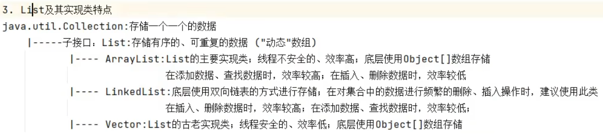
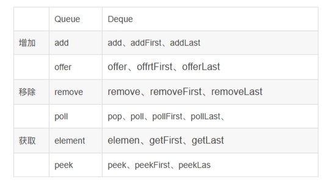

# 数据结构与算法

## 基础知识

### 复杂度

#### **时间复杂度**

时间复杂度是衡量算法运行时间随着输入数据规模增长而变化的指标。不同的算法和数据结构具有不同的时间复杂度，通常使用大O表示法（Big O notation）来表示。以下是一些常见的时间复杂度，按照从低（快）到高（慢）的顺序进行排序：

1. **O(1)**：常数时间复杂度。无论输入数据规模多大，算法执行时间都是常数。这是最优的时间复杂度。
2. **O(log n)**：对数时间复杂度。常见于二分查找、二分搜索树等算法。随着数据规模的增加，执行时间以对数速度增长。
3. **O(n)**：线性时间复杂度。算法执行时间与输入数据规模成正比。例如，遍历一个数组或链表。
4. **O(n log n)**：线性对数时间复杂度。这是许多高效排序算法（如归并排序、堆排序、快速排序平均情况）的时间复杂度。
5. **O(n^2)**：平方时间复杂度。常见于简单的排序算法（如冒泡排序、插入排序）、暴力搜索等。
6. **O(n^3)**：立方时间复杂度。在某些算法中，特别是涉及三维数组或嵌套循环时可能出现。
7. **O(2^n)**：指数时间复杂度。这种复杂度通常出现在需要遍历所有可能的子集或排列的情况，如全排列、图的遍历（如果解决方案空间是指数级的）。
8. **O(n!)**：阶乘时间复杂度。这是最高的时间复杂度之一，通常出现在需要遍历所有可能排列的算法中，如旅行商问题（TSP）的暴力解法。

需要注意的是，时间复杂度通常描述的是算法的最坏情况、平均情况或最好情况，具体取决于算法的实现和输入数据的特性。此外，空间复杂度（衡量算法所需额外空间的指标）也是算法分析中重要的考虑因素，但在这里我们仅讨论时间复杂度。

#### **空间复杂度**

空间复杂度是一个描述算法在运行过程中临时占用存储空间大小的量度。


#### **时间与空间复杂度关系**

时间复杂度和空间复杂度是算法分析中的两个重要方面，它们分别描述了算法执行所需的时间和空间资源。尽管它们都是评估算法性能的关键指标，但它们之间并没有直接的数学关系，也就是说，一个算法的时间复杂度低并不意味着它的空间复杂度也低，反之亦然。

**时间复杂度**主要关注算法执行所需的**时间**，通常与输入数据的规模（如数组的长度、图的节点数等）有关。时间复杂度的高低决定了算法在处理大规模数据时的效率。例如，O(n) 的时间复杂度表示算法的执行时间与输入数据规模 n 成正比，而 O(n^2) 则表示算法的执行时间与 n 的平方成正比。

**空间复杂度**则主要关注算法执行过程中所需的额外**辅助空间**（不包括输入数据本身所占用的空间）。空间复杂度通常用于衡量算法在内存中所需的存储量。例如，O(1) 的空间复杂度表示算法所需的额外空间是常数，与输入数据规模无关；而 O(n) 则表示算法所需的额外空间与输入数据规模 n 成正比。

在实际应用中，我们通常需要在时间复杂度和空间复杂度之间进行权衡。有时，为了降低时间复杂度，我们可能需要增加空间复杂度（例如，使用哈希表或动态规划来加速查找或计算）；反之，有时为了节省空间，我们可能需要牺牲一些时间效率（例如，使用原地算法或迭代算法来避免使用额外的数据结构）。

总之，时间复杂度和空间复杂度是两个独立的概念，它们之间没有固定的关系。在设计算法时，我们需要根据具体的应用场景和需求来选择合适的算法，以在时间和空间之间达到最佳的平衡。


### 两数之和

排序+双指针

```
Arrays.sort(nums);//对数组进行排序
int low = 0,hi = nums.length - 1;//创建左右指针
```

### 两数相加

遍历两条链表，依次相加，处理进位

```
// 虚拟头结点（构建新链表时的常用技巧）
//创建了一个新的ListNode对象，并将其数据字段初始化为-1，使用哑节点，可以避免处理一些边界情况
ListNode dummy = new ListNode(-1);
// 指针 p 负责构建新链表
ListNode p = dummy;
```

```
// 在两条链表上的指针
//声明了两个新的ListNode类型的变量p1和p2。
//将l1的值赋给p1，将l2的值赋给p2。
ListNode p1 = l1, p2 = l2;
```

### 无重复字符的最长子串

滑动窗口

```
//<Character, Integer>是泛型参数，它指定了Map中键的类型为Character（字符），值的类型为Integer（整数）。
Map<Character, Integer> window = new HashMap<>();
```

```
//charAt（），括号内为索引值
char c = s.charAt(right);
```

```
//put方法用于将指定的值与此映射中的指定键关联
//getOrDefault方法,获取与键c相关联的值
//如果window中包含键c，则返回与该键相关联的值；
// 如果不包含，则返回提供的默认值，这里为0。
window.put(c,window.getOrDefault(c, 0) + 1);
```


## 数组

**数组是存放在连续内存空间上的相同类型数据的集合。**

需要两点注意的是

- **数组下标都是从0开始的。**
- **数组内存空间的地址是连续的**

正是**因为数组的在内存空间的地址是连续的，所以我们在删除或者增添元素的时候，就难免要移动其他元素的地址。**

**数组的元素是不能删的，只能覆盖。**

**二维数组在地址空间上也是连续的**。

数组在定义的时候，长度就是固定的，如果想改动数组的长度，就需要重新定义一个新的数组。

[704. 二分查找](https://leetcode.cn/problems/binary-search/)
[27. 移除元素](https://leetcode.cn/problems/remove-element/)

[977.有序数组的平方](https://leetcode.cn/problems/squares-of-a-sorted-array/)

[209. 长度最小的子数组（滑动窗口）](https://leetcode.cn/problems/minimum-size-subarray-sum/)
[59. 螺旋矩阵II](https://leetcode.cn/problems/spiral-matrix-ii/)

## 链表

链表的长度可以是不固定的，并且可以动态增删， 适合数据量不固定，频繁增删，较少查询的场景。


### Java：链表节点的定义

```java
public class ListNode {
    // 结点的值
    int val;

    // 下一个结点
    ListNode next;

    // 节点的构造函数(无参)
    public ListNode() {
    }

    // 节点的构造函数(有一个参数)
    public ListNode(int val) {
        this.val = val;
    }

    // 节点的构造函数(有两个参数)
    public ListNode(int val, ListNode next) {
        this.val = val;
        this.next = next;
    }
}
```


[203. 移除链表元素](https://leetcode.cn/problems/remove-linked-list-elements/)

以一种统一的逻辑来移除 链表的节点呢。

**可以设置一个虚拟头结点**，这样原链表的所有节点就都可以按照统一的方式进行移除了。

在 C 或 C++ 中，需要处理内存释放问题。

在 Java 和 Python 等具有垃圾回收机制的语言中，通常不需要手动释放内存。

[707. 设计链表](https://leetcode.cn/problems/design-linked-list/)
[206. 反转链表](https://leetcode.cn/problems/reverse-linked-list/)
[19. 删除链表的倒数第N个结点](https://leetcode.cn/problems/remove-nth-node-from-end-of-list/)


## 哈希表

哈希表又称散列表，一种以「key-value」形式存储数据的数据结构。所谓以「key-value」形式存储数据，是指任意的键值 key 都唯一对应到内存中的某个位置。只需要输入查找的键值，就可以快速地找到其对应的 value。可以把哈希表理解为一种高级的数组，这种数组的下标可以是很大的整数，浮点数，字符串甚至结构体。

### **哈希函数**

对比之前博客讨论的二叉排序树 二叉平衡树 红黑树 B B+树，它们的查找都是先从根节点进行查找，从节点取出数据或索引与查找值进行比较。那么，有没有一种函数H，根据这个函数和查找关键字key，可以直接确定查找值所在位置，而不需要一个个比较。这样就**“预先知道”**key所在的位置，直接找到数据，提升效率。
即
地址index=H（key）
说白了，hash函数就是根据key计算出应该存储地址的位置，而哈希表是基于哈希函数建立的一种查找表

> **常见的哈希函数**
>
> **除留余数法**（最常用）
> 函数：[Hash](https://so.csdn.net/so/search?q=Hash&spm=1001.2101.3001.7020)（key）=key MOD p （p<=m m为表长），求出来的hash(key)就为存储该key的下标
>
> **直接定制法**（常用）
> 取关键字的某个线性函数为散列地址(A、B为常数)：**Hash（Key）= A\*Key + B**
>
> **平方取中法**（少）
> 如果关键字的每一位都有某些数字重复出现频率很高的现象，可以先求关键字的平方值，通过平方扩大差异，而后取中间数位作为最终存储地址。

### 哈希冲突（**哈希碰撞**）

即不同的key通过同一哈希函数产生了相同的哈希位置，H（key1）=H（key2），例如我们在除留余数法中的例子，如果此时插入一个12，其hash(12)为2，此时下标为2的位置已经有元素，此时就会产生哈希冲突

一般哈希碰撞有两种解决方法， 拉链法和线性探测法。

#### 拉链法

拉链法是在每个存放数据的地方开一个链表，如果有多个键值索引到同一个地方，只用把他们都放到那个位置的链表里就行了。查询的时候需要把对应位置的链表整个扫一遍，对其中的每个数据比较其键值与查询的键值是否一致。

其实拉链法就是要选择适当的哈希表的大小，这样既不会因为数组空值而浪费大量内存，也不会因为链表太长而在查找上浪费太多时间。

#### 线性探测法

如果当前下标已经被占用了，那么就沿着当前位置向下查找，如果下个位置也被占用，就继续查找，直到找到一个没有被占用的空白位置，将元素存放到这个位置。

使用线性探测法，一定要保证tableSize大于dataSize。 我们需要依靠哈希表中的空位来解决碰撞问题。

### 常见的三种哈希结构

当我们想使用哈希法来解决问题的时候，我们一般会选择如下三种数据结构。

- 数组
- set （集合）
- map(映射)

Java 集合可分为 Collection 和 Map 两大体系：

- **Collection接口**：用于存储一个一个的数据，也称`单列数据集合`。
  - **List子接口**：用来存储**有序的、可以重复**的数据（主要用来替换数组，"动态"数组）
  - - 实现类：ArrayList(主要实现类)、LinkedList、Vector
  - **Set子接口**：用来存储**无序的、不可重复**的数据（类似于高中讲的"集合"）
    - 实现类：HashSet(主要实现类)、LinkedHashSet、TreeSet
- **Map接口**：用于存储具有映射关系“key-value对”的集合，即一对一对的数据，也称`双列数据集合`。(类似于高中的函数、映射。(x1,y1),(x2,y2) ---> y = f(x) )
  - HashMap(主要实现类)、LinkedHashMap、TreeMap、Hashtable、Properties

> ### 数组作为哈希表
>
> 数组就是简单的哈希表，但是**数组的大小是受限的**。当题目中只包含小写字母，那么使用数组来做哈希最合适不过。使用map的空间消耗要比数组大一些，因为map要维护红黑树或者符号表，而且还要做哈希函数的运算。所以数组更加简单直接有效！
>
> **==元素有序、可重复==**
>
> - 实现类：ArrayList(主要实现类)、LinkedList、Vector
>
> 
>
> ### set作为哈希表
>
> 题目**没有限制数值的大小**，就无法使用数组来做哈希表了。此时一样的做映射的话，就可以使用set了。
>
> **==元素无序，不可重复==**
>
> - 实现类：HashSet(主要实现类)、LinkedHashSet、TreeSet
> - - HashSet 按 Hash 算法来存储集合中的元素，因此具有很好的存储、查找、删除性能。`不能保证元素的排列顺序`
>   - LinkedHashSet 是 HashSet 的子类，不允许集合元素重复。使用`双向链表`维护元素的次序，这使得元素看起来是以`添加顺序`保存的。
>   - TreeSet特点：底层使用`红黑树`结构存储数据,`实现排序`（自然排序或定制排序）
>
> ### map作为哈希表
>
> 来说一说：使用数组和set来做哈希法的局限。
>
> - 数组的大小是受限制的，而且如果元素很少，而哈希值太大会造成内存空间的浪费。
> - set是一个集合，里面放的元素只能是一个key，而两数之和这道题目，不仅要判断y是否存在而且还要记录y的下标位置，因为要返回x 和 y的下标。所以set 也不能用。
>
> map是一种**==`<key, value>`的结构==**，本题可以用key保存数值，用value在保存数值所在的下标。所以使用map最为合适。
>
> - HashMap(主要实现类)、LinkedHashMap、TreeMap、Hashtable、Properties
> - - 存储数据采用的哈希表结构，底层使用`一维数组`+`单向链表`+`红黑树`进行key-value数据的存储。与HashSet一样，元素的`存取顺序不能保证一致`。
>   - LinkedHashMap 是 HashMap 的子类, 存储数据采用的哈希表结构+链表结构，在HashMap存储结构的基础上，使用了一对`双向链表`来`记录添加元素的先后顺序`，可以保证遍历元素时，与添加的顺序一致。
>   - TreeMap底层使用`红黑树`结构存储数据, TreeMap 可以保证所有的 key-value 对处于`有序状态`。

### 题目

#### 242.有效的字母异位词

> 数组就是简单的哈希表，但是数组的大小可不是无限开辟的
>
> **使用数组来做哈希的题目，是因为题目都限制了数值的大小。**

#### 349. 两个数组的交集

> 如果哈希值比较少、特别分散、跨度非常大，使用数组就造成空间的极大浪费！

如果你有一个`Set<Integer>`，并且你想要将它转换为一个`int[]`数组，你不能直接使用`toArray()`方法，因为`toArray()`返回的是`Object[]`或特定类型的对象数组（在这个例子中是`Integer[]`）。

1. 要将`Set<Integer>`转换为`int[]`，你需要手动遍历集合并将每个`Integer`对象转换为原始的`int`类型。

```java
        // 获取集合的大小以创建正确大小的数组  
        int size = intSet.size();  
        int[] intArray = new int[size];  
  
        // 遍历集合并将Integer对象转换为int  
        int index = 0;  
        for (Integer value : intSet) {  
            intArray[index++] = value;  
        }  
  
        // 输出数组元素  
        for (int val : intArray) {  
            System.out.println(val);  
        }  
    }  
```

获取集合的大小，然后创建一个相应大小的`int[]`数组。接着，我们使用一个`for-each`循环遍历集合中的每个`Integer`对象，并将它们转换为`int`类型，然后存储在`intArray`中。

2. 如果你使用的是Java 8或更高版本，你可以使用Stream API来简化这个过程：

```java
 // 使用Stream API将Set<Integer>转换为int[]  
        int[] intArray = intSet.stream()  
                               .mapToInt(Integer::intValue)  
                               .toArray();  
```

在这个例子中，我们使用`stream()`方法将`Set<Integer>`转换为一个`Stream<Integer>`，然后调用`mapToInt(Integer::intValue)`方法将`Stream<Integer>`转换为一个`IntStream`。最后，我们调用`toArray()`方法将`IntStream`转换为一个`int[]`数组。这种方法利用了Java 8的流式处理特性，使得代码更加简洁和易读。

#### 第202题. 快乐数

####  1. 两数之和

#### 第454题.四数相加II

1. map.getOrDefault(key, defaultValue)` 是一个`Map`接口中的方法，用于获取指定键（`key`）的值。

**map.getOrDefault(sum, 0)**:

- 如果`map`中包含键`sum`，则返回该键对应的值。
- 如果`map`中不包含键`sum`，则返回`defaultValue`，这里是`0`。

2. map.put(key, value)` 是一个`Map`接口中的方法，用于将指定的值与该键关联（如果键已存在，则替换旧值）。

####  383. 赎金信

#### 第15题. 三数之和

#### 第18题. 四数之和

```Java
import java.util.Arrays;

//leetcode submit region begin(Prohibit modification and deletion)
class Solution {
    public List<List<Integer>> fourSum(int[] nums, int target) {
        Arrays.sort(nums);
        return nSumTarget( nums, 4, 0, target);
    }

    //计算n数之和通用函数
    public List<List<Integer>> nSumTarget( int[] nums, int n, int start, long target) {
        List<List<Integer>> res = new ArrayList<>();
        if (n < 2 || nums.length < n) return res;
        //双指针
        if (n == 2) {
            int low = start, high = nums.length - 1;
            while(low < high){
               long sum = nums[low] + nums[high];
               int left = nums[low], right = nums[high];
                if (sum < target) {
                    while (low < high && nums[low] == left) low++;
                } else if (sum > target) {
                    while (low < high && nums[high] == right) high--;
                }else {
                    res.add(new ArrayList<>(Arrays.asList((int)left, (int)right)));
                    while (low < high && nums[low] == left) low++;
                    while (low < high && nums[high] == right) high--;
                }
            }
        }
        //n > 2 时，递归计算 (n-1)Sum 的结果
        else {
            for (int i = start; i < nums.length; i++) {
                List<List<Integer>> sub = nSumTarget(nums, n - 1, i + 1, target - nums[i]);
                for (List<Integer> arr : sub) {
                    // (n-1)Sum 加上 nums[i] 就是 nSum
                    arr.add(nums[i]);
                    res.add(arr);
                }
                while (i < nums.length - 1 && nums[i] == nums[i + 1]) i++;
            }
        }
        return res;
    }
}
//leetcode submit region end(Prohibit modification and deletion)

```

## 字符串

字符串是若干字符组成的有限序列，也可以理解为是一个字符数组

双指针法是字符串处理的常客。

### KMP算法

KMP主要应用在字符串匹配上。

KMP的主要思想是**当出现字符串不匹配时，可以知道一部分之前已经匹配的文本内容，可以利用这些信息避免从头再去做匹配了。**

### 前缀表

写过KMP的同学，一定都写过next数组，那么这个next数组究竟是个啥呢？

next数组就是一个前缀表（prefix table）。

前缀表有什么作用呢？

**前缀表是用来回退的，它记录了模式串与主串(文本串)不匹配的时候，模式串应该从哪里开始重新匹配。**

那么什么是前缀表：**记录下标i之前（包括i）的字符串中，有多大长度的相同前缀后缀。**

### 最长公共前后缀

文章中字符串的**前缀是指不包含最后一个字符的所有以第一个字符开头的连续子串**。

**后缀是指不包含第一个字符的所有以最后一个字符结尾的连续子串**。

**前缀表要求的就是相同前后缀的长度。**

### 前缀表与next数组

next数组就可以是前缀表，但是很多实现都是把前缀表统一减一（右移一位，初始位置为-1）之后作为next数组。

为什么这么做呢，其实也是很多文章视频没有解释清楚的地方。

其实**这并不涉及到KMP的原理，而是具体实现，next数组既可以就是前缀表，也可以是前缀表统一减一（右移一位，初始位置为-1）。**

### 时间复杂度分析

其中n为文本串长度，m为模式串长度，因为在匹配的过程中，根据前缀表不断调整匹配的位置，可以看出匹配的过程是O(n)，之前还要单独生成next数组，时间复杂度是O(m)。所以整个KMP算法的时间复杂度是O(n+m)的。

暴力的解法显而易见是O(n × m)，所以**KMP在字符串匹配中极大地提高了搜索的效率。**

### 构造next数组

我们定义一个函数getNext来构建next数组，函数参数为指向next数组的指针，和一个字符串。 代码如下：

```text
void getNext(int* next, const string& s)
```

1

**构造next数组其实就是计算模式串s，前缀表的过程。** 主要有如下三步：

1. 初始化
2. 处理前后缀不相同的情况
3. 处理前后缀相同的情况

接下来我们详解一下。

1. 初始化：

定义两个指针i和j，j指向前缀末尾位置，i指向后缀末尾位置。

然后还要对next数组进行初始化赋值，如下：

```cpp
int j = -1;
next[0] = j;
```

j 为什么要初始化为 -1呢，因为之前说过 前缀表要统一减一的操作仅仅是其中的一种实现，我们这里选择j初始化为-1，下文我还会给出j不初始化为-1的实现代码。

next[i] 表示 i（包括i）之前最长相等的前后缀长度（其实就是j）

所以初始化next[0] = j 。

2. 因为j初始化为-1，那么i就从1开始，进行s[i] 与 s[j+1]的比较。

所以遍历模式串s的循环下标i 要从 1开始，代码如下：

```cpp
for (int i = 1; i < s.size(); i++) {
```

如果 s[i] 与 s[j+1]不相同，也就是遇到 前后缀末尾不相同的情况，就要向前回退。

怎么回退呢？

next[j]就是记录着j（包括j）之前的子串的相同前后缀的长度。

那么 s[i] 与 s[j+1] 不相同，就要找 j+1前一个元素在next数组里的值（就是next[j]）。

所以，处理前后缀不相同的情况代码如下：

```cpp
while (j >= 0 && s[i] != s[j + 1]) { // 前后缀不相同了
    j = next[j]; // 向前回退
}
```

3. 处理前后缀相同的情况

如果 s[i] 与 s[j + 1] 相同，那么就同时向后移动i 和j 说明找到了相同的前后缀，同时还要将j（前缀的长度）赋给next[i], 因为next[i]要记录相同前后缀的长度。

代码如下：

```text
if (s[i] == s[j + 1]) { // 找到相同的前后缀
    j++;
}
next[i] = j;
```

最后整体构建next数组的函数代码如下：

```cpp
void getNext(int* next, const string& s){
    int j = -1;
    next[0] = j;
    for(int i = 1; i < s.size(); i++) { // 注意i从1开始
        while (j >= 0 && s[i] != s[j + 1]) { // 前后缀不相同了
            j = next[j]; // 向前回退
        }
        if (s[i] == s[j + 1]) { // 找到相同的前后缀
            j++;
        }
        next[i] = j; // 将j（前缀的长度）赋给next[i]
    }
}
```

### 使用next数组来做匹配

在文本串s里 找是否出现过模式串t。

定义两个下标j 指向模式串起始位置，i指向文本串起始位置。

那么j初始值依然为-1，为什么呢？ **依然因为next数组里记录的起始位置为-1。**

i就从0开始，遍历文本串，代码如下：

```cpp
for (int i = 0; i < s.size(); i++) 
```

接下来就是 s[i] 与 t[j + 1] （因为j从-1开始的） 进行比较。

如果 s[i] 与 t[j + 1] 不相同，j就要从next数组里寻找下一个匹配的位置。

代码如下：

```cpp
while(j >= 0 && s[i] != t[j + 1]) {
    j = next[j];
}
```

如果 s[i] 与 t[j + 1] 相同，那么i 和 j 同时向后移动， 代码如下：

```cpp
if (s[i] == t[j + 1]) {
    j++; // i的增加在for循环里
}
```

如何判断在文本串s里出现了模式串t呢，如果j指向了模式串t的末尾，那么就说明模式串t完全匹配文本串s里的某个子串了。

本题要在文本串字符串中找出模式串出现的第一个位置 (从0开始)，所以返回当前在文本串匹配模式串的位置i 减去 模式串的长度，就是文本串字符串中出现模式串的第一个位置。

代码如下：

```cpp
if (j == (t.size() - 1) ) {
    return (i - t.size() + 1);
}
```

那么使用next数组，用模式串匹配文本串的整体代码如下：

```cpp
int j = -1; // 因为next数组里记录的起始位置为-1
for (int i = 0; i < s.size(); i++) { // 注意i就从0开始
    while(j >= 0 && s[i] != t[j + 1]) { // 不匹配
        j = next[j]; // j 寻找之前匹配的位置
    }
    if (s[i] == t[j + 1]) { // 匹配，j和i同时向后移动
        j++; // i的增加在for循环里
    }
    if (j == (t.size() - 1) ) { // 文本串s里出现了模式串t
        return (i - t.size() + 1);
    }
}
```


### 459.重复的子字符串

在一个串中查找是否出现过另一个串，这是KMP的看家本领。那么寻找重复子串怎么也涉及到KMP算法了呢？

KMP算法中next数组为什么遇到字符不匹配的时候可以找到上一个匹配过的位置继续匹配，靠的是有计算好的前缀表。 前缀表里，统计了各个位置为终点字符串的最长相同前后缀的长度。

那么 最长相同前后缀和重复子串的关系又有什么关系呢。

可能很多录友又忘了 前缀和后缀的定义，再回顾一下：

- 前缀是指不包含最后一个字符的所有以第一个字符开头的连续子串；
- 后缀是指不包含第一个字符的所有以最后一个字符结尾的连续子串

**在由重复子串组成的字符串中，最长相等前后缀不包含的子串就是最小重复子串**，这里拿字符串s：abababab 来举例，ab就是最小重复单位，如图所示：


## 双指针总结篇

### 数组篇

在[数组：就移除个元素很难么？ (opens new window)](https://programmercarl.com/0027.移除元素.html)中，原地移除数组上的元素，我们说到了数组上的元素，不能真正的删除，只能覆盖。

```c++
for (int i = 0; i < array.size(); i++) {
    if (array[i] == target) {
        array.erase(i);
    }
}
```

这个代码看上去好像是O(n)的时间复杂度，其实是O(n^2)的时间复杂度，因为erase操作也是O(n)的操作。

### 字符串篇

在[字符串：这道题目，使用库函数一行代码搞定 (opens new window)](https://programmercarl.com/0344.反转字符串.html)中讲解了反转字符串，注意这里强调要原地反转，要不然就失去了题目的意义。

使用双指针法，**定义两个指针（也可以说是索引下标），一个从字符串前面，一个从字符串后面，两个指针同时向中间移动，并交换元素。**，时间复杂度是O(n)。

在[替换空格 (opens new window)](https://programmercarl.com/剑指Offer05.替换空格.html)中介绍使用双指针填充字符串的方法，如果想把这道题目做到极致，就不要只用额外的辅助空间了！

思路就是**首先扩充数组到每个空格替换成"%20"之后的大小。然后双指针从后向前替换空格。**

有同学问了，为什么要从后向前填充，从前向后填充不行么？

从前向后填充就是O(n^2)的算法了，因为每次添加元素都要将添加元素之后的所有元素向后移动。

**其实很多数组（字符串）填充类的问题，都可以先预先给数组扩容带填充后的大小，然后在从后向前进行操作。**

那么在[字符串：花式反转还不够！ (opens new window)](https://programmercarl.com/0151.翻转字符串里的单词.html)中，我们使用双指针法，用O(n)的时间复杂度完成字符串删除类的操作，因为题目要删除冗余空格。

**在删除冗余空格的过程中，如果不注意代码效率，很容易写成了O(n^2)的时间复杂度。其实使用双指针法O(n)就可以搞定。**

**主要还是大家用erase用的比较随意，一定要注意for循环下用erase的情况，一般可以用双指针写效率更高！**

### 链表篇

翻转链表是现场面试，白纸写代码的好题，考察了候选者对链表以及指针的熟悉程度，而且代码也不长，适合在白纸上写。

在[链表：听说过两天反转链表又写不出来了？ (opens new window)](https://programmercarl.com/0206.翻转链表.html)中，讲如何使用双指针法来翻转链表，**只需要改变链表的next指针的指向，直接将链表反转 ，而不用重新定义一个新的链表。**

思路还是很简单的，代码也不长，但是想在白纸上一次性写出bugfree的代码，并不是容易的事情。

在链表中求环，应该是双指针在链表里最经典的应用，在[链表：环找到了，那入口呢？ (opens new window)](https://programmercarl.com/0142.环形链表II.html)中讲解了如何通过双指针判断是否有环，而且还要找到环的入口。

**使用快慢指针（双指针法），分别定义 fast 和 slow指针，从头结点出发，fast指针每次移动两个节点，slow指针每次移动一个节点，如果 fast 和 slow指针在途中相遇 ，说明这个链表有环。**

那么找到环的入口，其实需要点简单的数学推理，我在文章中把找环的入口清清楚楚的推理的一遍，如果对找环入口不够清楚的同学建议自己看一看[链表：环找到了，那入口呢？ (opens new window)](https://programmercarl.com/0142.环形链表II.html)。

### N数之和篇

在[哈希表：解决了两数之和，那么能解决三数之和么？ (opens new window)](https://programmercarl.com/0015.三数之和.html)中，讲到使用哈希法可以解决1.两数之和的问题

其实使用双指针也可以解决1.两数之和的问题，只不过1.两数之和求的是两个元素的下标，没法用双指针，如果改成求具体两个元素的数值就可以了，大家可以尝试用双指针做一个leetcode上两数之和的题目，就可以体会到我说的意思了。

使用了哈希法解决了两数之和，但是哈希法并不使用于三数之和！

使用哈希法的过程中要把符合条件的三元组放进vector中，然后在去去重，这样是非常费时的，很容易超时，也是三数之和通过率如此之低的根源所在。

去重的过程不好处理，有很多小细节，如果在面试中很难想到位。

时间复杂度可以做到O(n^2)，但还是比较费时的，因为不好做剪枝操作。

所以这道题目使用双指针法才是最为合适的，用双指针做这道题目才能就能真正体会到，**通过前后两个指针不算向中间逼近，在一个for循环下完成两个for循环的工作。**

只用双指针法时间复杂度为O(n^2)，但比哈希法的O(n^2)效率高得多，哈希法在使用两层for循环的时候，能做的剪枝操作很有限。

在[双指针法：一样的道理，能解决四数之和 (opens new window)](https://programmercarl.com/0018.四数之和.html)中，讲到了四数之和，其实思路是一样的，**在三数之和的基础上再套一层for循环，依然是使用双指针法。**

对于三数之和使用双指针法就是将原本暴力O(n^3)的解法，降为O(n^2)的解法，四数之和的双指针解法就是将原本暴力O(n^4)的解法，降为O(n^3)的解法。

同样的道理，五数之和，n数之和都是在这个基础上累加。

```Java
import java.util.Arrays;

//leetcode submit region begin(Prohibit modification and deletion)
class Solution {
    public List<List<Integer>> fourSum(int[] nums, int target) {
        Arrays.sort(nums);
        return nSumTarget( nums, 4, 0, target);
    }

    //计算n数之和通用函数
    public List<List<Integer>> nSumTarget( int[] nums, int n, int start, long target) {
        List<List<Integer>> res = new ArrayList<>();
        if (n < 2 || nums.length < n) return res;
        //双指针
        if (n == 2) {
            int low = start, high = nums.length - 1;
            while(low < high){
               long sum = nums[low] + nums[high];
               int left = nums[low], right = nums[high];
                if (sum < target) {
                    while (low < high && nums[low] == left) low++;
                } else if (sum > target) {
                    while (low < high && nums[high] == right) high--;
                }else {
                    res.add(new ArrayList<>(Arrays.asList((int)left, (int)right)));
                    while (low < high && nums[low] == left) low++;
                    while (low < high && nums[high] == right) high--;
                }
            }
        }
        //n > 2 时，递归计算 (n-1)Sum 的结果
        else {
            for (int i = start; i < nums.length; i++) {
                List<List<Integer>> sub = nSumTarget(nums, n - 1, i + 1, target - nums[i]);
                for (List<Integer> arr : sub) {
                    // (n-1)Sum 加上 nums[i] 就是 nSum
                    arr.add(nums[i]);
                    res.add(arr);
                }
                while (i < nums.length - 1 && nums[i] == nums[i + 1]) i++;
            }
        }
        return res;
    }
}
//leetcode submit region end(Prohibit modification and deletion)

```

## 栈与队列

队列（queue）是先进先出，栈（stack）是先进后出。


### Queue和Deque接口

1、Queue以及Deque都是继承与Cellection的接口，Deque是queue的子接口。

2、**Queue**是单向队列，FIFO ， **Deque**是双向队列

3、Queue有一个直接子类PriorityQueue。PriorityQueue叫做优先队列，顾名思义，该队列是有序的，该队列内部是一个通过小顶堆维护的二叉树，通过数组实现，多以在插入时会更新小顶堆，取出元素时会取出最小的值。

Deque有两个直接子类：LinkedList和ArrayDeque。ArrayDeque是无初始容量的双端队列，LinkedList则是双向链表。

4、PriorityQueue、LinkedList、ArrayDeque用法比较：

用法：PriorityQueue可以用作堆，根据传入的Comparator实现大小的调整，会是一个很好的选择

用法：ArrayDeque 通常作为栈或队列使用，但是栈的效率不如LinkedList高。
     LinkedList 通常作为栈或队列使用，但是队列的效率不如ArrayQueue高。

5、API对比


（1) add和offer的区别

- add()：添加元素如果添加成功则返回true，如果队列是满的，则抛出异常
- offer()：添加元素，如果添加成功则返回true，如果队列是满的，则返回false

（2）remove和poll

- remove()：移除队列头的元素并且返回，如果队列为空则抛出异常
- poll()：移除队列头的元素并且返回，如果队列为空则返回null
- Deque新增了一个pop方法，也是移除队列头的元素并且返回，如果队列为空则抛出异常。

（3）element和peek

- element()：返回队列头元素但不移除，如果队列为空，则抛出异常
- peek()：返回队列头元素但不移除，如果队列为空，则返回null

因此，推荐增加使用offer()，移除使用poll()，获取元素使用peek().


> 新建队列：Queue<String> queue = new LinkedList<>();


**括号匹配是使用栈解决的经典问题。**

单调队列、优先级队列


==栈经典题目==

>  栈在系统中的应用：**递归的实现是栈：每一次递归调用都会把函数的局部变量、参数值和返回地址等压入调用栈中**，然后递归返回的时候，从栈顶弹出上一次递归的各项参数，所以这就是递归为什么可以返回上一层位置的原因。

### 232.用栈实现队列

### 225. 用队列实现栈

只用一个队列就够了。

**一个队列在模拟栈弹出元素的时候只要将队列头部的元素（除了最后一个元素外） 重新添加到队列尾部，此时在去弹出元素就是栈的顺序了。**

### 20. 有效的括号

括号匹配是使用栈解决的经典问题。左括号先入栈，右括号入栈消除。

### 1047. 删除字符串中的所有相邻重复项

思路就是可以把字符串顺序放到一个栈中，然后如果相同的话栈就弹出，这样最后栈里剩下的元素都是相邻不相同的元素了。

### 150. 逆波兰表达式求值

本题中每一个子表达式要得出一个结果，然后拿这个结果再进行运算，那么**这岂不就是一个相邻字符串消除的过程**，思路同1047

-----

==队列经典题目==

### 239. 滑动窗口最大值

单调队列

**队列没有必要维护窗口里的所有元素，只需要维护有可能成为窗口里最大值的元素就可以了，同时保证队列里的元素数值是由大到小的。**

那么这个维护元素单调递减的队列就叫做**单调队列，即单调递减或单调递增的队列。**

```Java
import java.util.Deque;

//leetcode submit region begin(Prohibit modification and deletion)
class Solution {
    /* 单调队列的实现 */
    class MonotonicQueue {
        Deque<Integer> deque = new LinkedList<>();
        //弹出元素时，比较当前要弹出的数值是否等于队列出口的数值，如果相等则弹出
        //同时判断队列当前是否为空
        void poll(int val) {
            if (!deque.isEmpty() && val == deque.peek()) {
                deque.poll();
            }
        }
        //添加元素时，如果要添加的元素大于入口处的元素，就将入口元素弹出
        //保证队列元素单调递减
        void add(int val) {
            while (!deque.isEmpty() && val > deque.getLast()) {
                deque.removeLast();
            }
            deque.add(val);
        }
        //队列队顶元素始终为最大值
        int peek() {
            return deque.peek();
        }
    }
    
    public int[] maxSlidingWindow(int[] nums, int k) {
        //边界
        if (nums.length == 1) {
            return nums;
        }
        //初始化，新建
        int len = nums.length - k + 1;
        int[] res = new int[len];
        int num = 0;
        MonotonicQueue myQueue = new MonotonicQueue();
        //先将前k个元素放入队列
        for (int i = 0; i < k; i++) {
            myQueue.add(nums[i]);
        }
        res[num++] = myQueue.peek(); //
        for (int i = k; i < nums.length; i++) {
            //滑动窗口移除最前面的元素，移除是判断该元素是否放入队列
            myQueue.poll(nums[i - k]);
            //滑动窗口加入最后面的元素
            myQueue.add(nums[i]);
            //记录对应的最大值
            res[num++] = myQueue.peek();
        }
        return res;

    }
}
//leetcode submit region end(Prohibit modification and deletion)

```


### 347.前 K 个高频元素

**优先级队列**

优先级队列其实**就是一个披着队列外衣的堆**，因为优先级队列对外接口只是从队头取元素，从队尾添加元素，再无其他取元素的方式，看起来就是一个队列。

而且优先级队列内部元素是自动依照元素的权值排列。

**优先级队列如何有序排列？**

缺省情况下priority_queue利用max-heap（大顶堆）完成对元素的排序，这个大顶堆是以vector为表现形式的complete binary tree（完全二叉树）。

**什么是堆？**

**堆是一棵完全二叉树，树中每个结点的值都不小于（或不大于）其左右孩子的值。** 如果父亲结点是大于等于左右孩子就是大顶堆，小于等于左右孩子就是小顶堆。

所以大家经常说的大顶堆（堆头是最大元素），小顶堆（堆头是最小元素），如果懒得自己实现的话，就直接用priority_queue（优先级队列）就可以了，底层实现都是一样的，从小到大排就是小顶堆，从大到小排就是大顶堆。

```Java
//leetcode submit region begin(Prohibit modification and deletion)
/*Comparator接口说明:
 * 返回负数，形参中第一个参数排在前面；返回正数，形参中第二个参数排在前面
 * 对于队列：排在前面意味着往队头靠
 * 对于堆（使用PriorityQueue实现）：从队头到队尾按从小到大排就是最小堆（小顶堆），
 *                                从队头到队尾按从大到小排就是最大堆（大顶堆）--->队头元素相当于堆的根节点
 * */
class Solution {
    public int[] topKFrequent(int[] nums, int k) {
        //优先级队列实现，基于小顶堆
        Map<Integer, Integer> map = new HashMap<>(); //key为数组元素值,val为对应出现次数
        for (int num : nums) {
            map.put(num, map.getOrDefault(num, 0) + 1);
        }
        //在优先队列中存储二元组(num, cnt),cnt表示元素值num在数组中的出现次数
        //出现次数按从队头到队尾的顺序是从小到大排,出现次数最低的在队头(相当于小顶堆)
        //提供了一个lambda表达式作为Comparator，该表达式比较两个数组（pair1和pair2）的第二个元素（索引为1）。根据这个比较器的定义，队列将按照数组中第二个元素的值升序排列
        PriorityQueue<int[]> pq = new PriorityQueue<>((pair1, pair2) -> pair1[1] - pair2[1]);
        for (Map.Entry<Integer, Integer> entry : map.entrySet()) { //小顶堆只需要维持k个元素有序
            if (pq.size() < k) { //小顶堆元素个数小于k个时直接加
                pq.add(new int[]{entry.getKey(), entry.getValue()});
            } else {//堆的大小已经达到k，检查当前的键值对是否应该替换堆顶的最小元素
                if (entry.getValue() > pq.peek()[1]) { //当前元素出现次数大于小顶堆的根结点(这k个元素中出现次数最少的那个)
                    pq.poll(); //弹出队头(小顶堆的根结点),即把堆里出现次数最少的那个删除,留下的就是出现次数多的了
                    pq.add(new int[]{entry.getKey(), entry.getValue()});
                }
            }
        }
        int[] ans = new int[k];
        for (int i = k - 1; i >= 0; i--) { //依次弹出小顶堆,先弹出的是堆的根,出现次数少,后面弹出的出现次数多
            ans[i] = pq.poll()[0];
        }
        return ans;
    }
}
//leetcode submit region end(Prohibit modification and deletion)
```


## 二叉树

### 种类

**满二叉树**

如果一棵二叉树只有度为0的结点和度为2的结点，并且度为0的结点在同一层上，则这棵二叉树为满二叉树。


**完全二叉树**

在完全二叉树中，==除了最底层节点可能没填满外，其余每层节点数都达到最大值，并且最下面一层的节点都集中在该层最左边的若干位置==。若最底层为第 h 层（h从1开始），则该层包含 1~ 2^(h-1) 个节点。


**二叉搜索树**(BST)

Binary Serach Tree

前面介绍的树，都没有数值的，而二叉搜索树是有数值的了，**二叉搜索树是一个有序树**。

- 若它的左子树不空，则左子树上所有结点的值均小于它的根结点的值；
- 若它的右子树不空，则右子树上所有结点的值均大于它的根结点的值；
- 它的左、右子树也分别为二叉排序树


**平衡二叉搜索树**

平衡二叉搜索树：又被称为AVL（Adelson-Velsky and Landis）树，且具有以下性质：它是一棵空树或它的==左右两个子树的高度差的绝对值不超过1==，并且左右两个子树都是一棵平衡二叉树。


- **根节点的高度就是二叉树的最大深度**
- 左右孩子都为空的节点才是叶子节点
- 二叉树节点的深度：指从根节点到该节点的最长简单路径边的条数。
- 二叉树节点的高度：指从该节点到叶子节点的最长简单路径边的条数。


关于根节点的深度究竟是1 还是 0，不同的地方有不一样的标准，leetcode的题目中都是以节点为一度，即根节点深度是1。但维基百科上定义用边为一度，即根节点的深度是0，我们暂时以leetcode为准（毕竟要在这上面刷题）。

因为**求深度可以从上到下去查 所以需要前序遍历（中左右），而高度只能从下到上去查，所以只能后序遍历（左右中）**


### 存储方式

**二叉树可以链式存储，也可以顺序存储。**

链式存储方式就用指针， 顺序存储的方式就是用数组。

顺序存储的元素在内存是连续分布的，而链式存储则是通过指针把分布在各个地址的节点串联一起。


用数组来存储二叉树如何遍历的呢？

**如果父节点的数组下标是 i，那么它的左孩子就是 i \* 2 + 1，右孩子就是 i \* 2 + 2。**

但是用链式表示的二叉树，更有利于我们理解，所以一般我们都是用链式存储二叉树。

**所以大家要了解，用数组依然可以表示二叉树。**

### 遍历方式

二叉树主要有两种遍历方式：

1. 深度优先遍历(dfs)：先往深走，遇到叶子节点再往回走。
2. 广度优先遍历(bfs)：一层一层的去遍历。

**这两种遍历是图论中最基本的两种遍历方式**，后面在介绍图论的时候 还会介绍到。

那么从深度优先遍历和广度优先遍历进一步拓展，才有如下遍历方式：

- 深度优先遍历
  - 前序遍历（递归法，迭代法）
  - 中序遍历（递归法，迭代法）
  - 后序遍历（递归法，迭代法）
- 广度优先遍历
  - 层次遍历（迭代法）

**这里前中后，其实指的就是中间节点的遍历顺序**，只要大家记住 前中后序指的就是中间节点的位置就可以了。

- 前序遍历：中左右
- 中序遍历：左中右
- 后序遍历：左右中

**之前我们讲栈与队列的时候，就说过栈其实就是递归的一种实现结构**，也就说前中后序遍历的逻辑其实都是可以借助栈使用递归的方式来实现的。

而广度优先遍历的实现一般使用**队列**来实现，这也是队列先进先出的特点所决定的，因为需要先进先出的结构，才能一层一层的来遍历二叉树。

### 二叉树定义代码

二叉树的定义和链表是差不多的，相对于链表 ，二叉树的节点里多了一个指针， 有两个指针，指向左右孩子。

```Java
public class TreeNode {
    int val;
    TreeNode left;
    TreeNode right;

    //三种构造器
    TreeNode() {} 
    TreeNode(int val) { this.val = val; }
    TreeNode(int val, TreeNode left, TreeNode right) {
        this.val = val;
        this.left = left;
        this.right = right;
    }
}
```

### 二叉树的递归遍历

 递归算法的三个要素：

1. **确定递归函数的参数和返回值：** 确定哪些参数是递归的过程中需要处理的，那么就在递归函数里加上这个参数， 并且还要明确每次递归的返回值是什么进而确定递归函数的返回类型。

2. **确定终止条件：** 写完了递归算法, 运行的时候，经常会遇到栈溢出的错误，就是没写终止条件或者终止条件写的不对，操作系统也是用一个栈的结构来保存每一层递归的信息，如果递归没有终止，操作系统的内存栈必然就会溢出。

3. **确定单层递归的逻辑：** 确定每一层递归需要处理的信息。在这里也就会重复调用自己来实现递归的过程。

   ```java
   // 前序遍历·递归·LC144_二叉树的前序遍历
   class Solution {
       public List<Integer> preorderTraversal(TreeNode root) {
           List<Integer> result = new ArrayList<Integer>();
           preorder(root, result);
           return result;
       }
   
       public void preorder(TreeNode root, List<Integer> result) {
           if (root == null) {
               return;
           }
           result.add(root.val);
           preorder(root.left, result);
           preorder(root.right, result);
       }
   }
   ```

### 二叉树的迭代遍历

用迭代法（非递归的方式）来实现二叉树的前后中序遍历

在栈与队列中提到了，**递归的实现就是：每一次递归调用都会把函数的局部变量、参数值和返回地址等压入调用栈中**，然后递归返回的时候，从栈顶弹出上一次递归的各项参数，所以这就是递归为什么可以返回上一层位置的原因。

用迭代法写出了二叉树的前后中序遍历，大家可以看出前序和中序是完全两种代码风格，并不像递归写法那样代码稍做调整，就可以实现前后中序。

**这是因为前序遍历中访问节点（遍历节点）和处理节点（将元素放进result数组中）可以同步处理，但是中序就无法做到同步！**

```java
// 前序遍历顺序：中-左-右，入栈顺序：中-右-左
class Solution {
    public List<Integer> preorderTraversal(TreeNode root) {
        List<Integer> result = new ArrayList<>();
        if (root == null){
            return result;
        }
        Stack<TreeNode> stack = new Stack<>();
        stack.push(root);
        while (!stack.isEmpty()){
            TreeNode node = stack.pop();
            result.add(node.val);
            if (node.right != null){
                stack.push(node.right);
            }
            if (node.left != null){
                stack.push(node.left);
            }
        }
        return result;
    }
}

// 中序遍历顺序: 左-中-右 入栈顺序： 左-右
class Solution {
    public List<Integer> inorderTraversal(TreeNode root) {
        List<Integer> result = new ArrayList<>();
        if (root == null){
            return result;
        }
        Stack<TreeNode> stack = new Stack<>();
        TreeNode cur = root;
        while (cur != null || !stack.isEmpty()){
           if (cur != null){
               stack.push(cur);
               cur = cur.left;
           }else{
               cur = stack.pop();
               result.add(cur.val);
               cur = cur.right;
           }
        }
        return result;
    }
}

// 后序遍历顺序 左-右-中 入栈顺序：中-左-右 出栈顺序：中-右-左， 最后翻转结果
class Solution {
    public List<Integer> postorderTraversal(TreeNode root) {
        List<Integer> result = new ArrayList<>();
        if (root == null){
            return result;
        }
        Stack<TreeNode> stack = new Stack<>();
        stack.push(root);
        while (!stack.isEmpty()){
            TreeNode node = stack.pop();
            result.add(node.val);
            if (node.left != null){
                stack.push(node.left);
            }
            if (node.right != null){
                stack.push(node.right);
            }
        }
        Collections.reverse(result);
        return result;
    }
}
```

### 二叉树的层序遍历

二叉树的层序遍历，**就是图论中的广度优先搜索在二叉树中的应用**，需要借助队列来实现（此时又发现队列的一个应用了）。

```Java
class Solution {
    public List<List<Integer>> resList = new ArrayList<List<Integer>>();

    public List<List<Integer>> levelOrder(TreeNode root) {
        checkFun(root);
        return resList;
    }
    //迭代，借助队列
    public void checkFun(TreeNode node) {
        if (node == null) return;
        Queue<TreeNode> que = new LinkedList<TreeNode>();
        que.offer(node);

        while (!que.isEmpty()) {
            List<Integer> itemList = new ArrayList<Integer>();
            int len = que.size();//size的大小在不断变化

            while (len > 0) {
                TreeNode tmpNode = que.poll();
                itemList.add(tmpNode.val);

                if (tmpNode.left != null) que.offer(tmpNode.left);
                if (tmpNode.right != null) que.offer(tmpNode.right);
                len--;
            }

            resList.add(itemList);

        }
    }
}
```

### 题目


可以根据中序+后序、中序+前序构造一个唯一的二叉树，后序+前序无法确定分割点位置不能构造。

## 回溯算法

### 回溯法解决的问题

回溯法，一般可以解决如下几种问题：

- 组合问题：N个数里面按一定规则找出k个数的集合
- 切割问题：一个字符串按一定规则有几种切割方式
- 子集问题：一个N个数的集合里有多少符合条件的子集
- 排列问题：N个数按一定规则全排列，有几种排列方式
- 棋盘问题：N皇后，解数独等等

### 理解回溯法

**回溯法解决的问题都可以抽象为树形结构**，因为回溯法解决的都是在集合中递归查找子集，**集合的大小就构成了树的宽度，递归的深度就构成了树的深度**。

### 回溯法模板

- 回溯函数模板返回值以及参数

在回溯算法中，我的习惯是函数起名字为backtracking，这个起名大家随意。

回溯算法中函数返回值一般为void。

再来看一下参数，因为回溯算法需要的参数可不像二叉树递归的时候那么容易一次性确定下来，所以一般是先写逻辑，然后需要什么参数，就填什么参数。

但后面的回溯题目的讲解中，为了方便大家理解，我在一开始就帮大家把参数确定下来。

回溯函数伪代码如下：

```text
void backtracking(参数)
```

- 回溯函数终止条件

既然是树形结构，那么我们在讲解[二叉树的递归 (opens new window)](https://programmercarl.com/二叉树的递归遍历.html)的时候，就知道遍历树形结构一定要有终止条件。

所以回溯也有要终止条件。

什么时候达到了终止条件，树中就可以看出，一般来说搜到叶子节点了，也就找到了满足条件的一条答案，把这个答案存放起来，并结束本层递归。

所以回溯函数终止条件伪代码如下：

```text
if (终止条件) {
    存放结果;
    return;
}
```

- 回溯搜索的遍历过程

在上面我们提到了，回溯法一般是在集合中递归搜索，集合的大小构成了树的宽度，递归的深度构成的树的深度。

如图：


```java
回溯算法模板框架如下：
void backtracking(参数) {
    if (终止条件) {
        存放结果;
        return;
    }

    for (选择：本层集合中元素（树中节点孩子的数量就是集合的大小）) {
        处理节点;
        backtracking(路径，选择列表); // 递归
        回溯，撤销处理结果
    }
}
```

### 题目


#### 77题. 组合

把回溯问题抽象为树形结构，可以直观的看出其搜索的过程：**for循环横向遍历，递归纵向遍历，回溯不断调整结果集**。

#### 77.组合优化

**剪枝精髓是：for循环在寻找起点的时候要有一个范围，如果这个起点到集合终止之间的元素已经不够 题目要求的k个元素了，就没有必要搜索了**。

#### 216.组合总和III

整体思路还是一样的，本题的剪枝会好想一些，即：**已选元素总和如果已经大于n（题中要求的和）了，那么往后遍历就没有意义了，直接剪掉**。

```Java
if (sum == targetSum) result.add(new ArrayList<>(path));
// 确保添加的是 path 的副本,确保 result 中的每个组合都是独立的，不会受到后续修改的影响
```

#### 17.电话号码的字母组合

```Java
// 每个数字到字母的映射
String[] mapping = new String[] { "", "", "abc", "def", "ghi", "jkl", "mno", "pqrs", "tuv", "wxyz" };

//从字符串digits中提取一个字符并将其转换为整数digit的常见方法
        int digit = digits.charAt(start) - '0';
```

## **容器底层实现分析**

### 容器结构

单例集合：将数据一个一个的进行存储。如图所示：


双例集合：基于 Key 与 Value 的结构存储数据。


### 单例集合

####  Collection 接口

 Collection 接口通用方法


JDK8 之后，Collection 接口新增的方法


#### List 子接口

List 接口特有方法：


##### ArrayList 容器类

ArrayList 是 List 接口的实现类。是 List 存储特征的具体实现。
ArrayList 底层是用**数组**实现的存储。 特点：查询效率高，增删效率低，线程不安全。

##### Vector 容器类

Vector 底层是用**数组**实现的，相关的方法都加了同步检查，因此“线程安全,效率低”。 比如，indexOf 方法就增加了 synchronized 同步标记。

> ###### **Stack 容器介绍**
>
> Stack 栈容器，是 Vector 的一个子类，它实现了一个标准的后进先出(LIFO：Last In Frist Out) 的栈。
>
> 

##### LinkedList 容器类

LinkedList 底层用**双向链表**实现的存储。特点：查询效率低，增删效率高，线程不安全。 双向链表也叫双链表，是链表的一种，它的每个数据节点中都有两个指针，分别指向前 一个节点和后一个节点。 所以，从双向链表中的任意一个节点开始，都可以很方便地找到 所有节点。


#### Set 子接口

Set 接口继承自 Collection，Set 接口中没有新增方法，方法和 Collection 保持完全一 致。我们在前面通过 List 学习的方法，在 Set 中仍然适用。

##### HashSet 容器类

HashSet 是一个没有重复元素的集合，不保证元素的顺序。而且 HashSet 允许有 null 元 素。HashSet 是采用哈希算法实现，底层实际是用 **HashMap** 实现的（HashSet 本质就是一个 简化版的 HashMap），因此，查询效率和增删效率都比较高。

> ###### LinkedHashSet容器类
>
> LinkedHashSet 根据元素的 hashCode 值来决定元素的存储位置，但它同时使用`双向链表`维护元素的次序，这使得元素看起来是以添加顺序保存的。

##### **TreeSet 容器类**

TreeSet 是一个可以对元素进行排序的容器。底层实际是用 **TreeMap**（红黑树） 实现的，内部维持了一个简化版的 TreeMap，通过 key 来存储 Set 的元素。 TreeSet 内部需要对存储的元 素进行排序，因此，我们需要给定排序规则。
排序规则实现方式：
1.通过元素自身实现比较规则。
2.通过比较器指定比较规则。

### 双例集合

#### Map 接口

Map 常用方法


##### HashMap 容器类

HashMap 是 Map 接口的接口实现类，它采用哈希算法实现，是 Map 接口最常用的实现类。 由于底层采用了哈希表存储数据，所以要求键不能重复，如果发生重复，新的值会替换旧的值。 HashMap 在查找、删除、修改方面都有非常高的效率。存储数据采用的哈希表结构，底层使用**一维数组`+`单向链表`+`红黑树**进行key-value数据的存储。与HashSet一样，元素的存取顺序不能保证一致。

> ###### LinkedHashMap **容器类**
>
> - LinkedHashMap 是 HashMap 的子类
> - 存储数据采用的哈希表结构+链表结构，在**HashMap**存储结构的基础上，使用了一对**双向链表**来记录添加元素的先后顺序，可以保证遍历元素时，与添加的顺序一致。


##### **TreeMap 容器类**

TreeMap 和 HashMap 同样实现了 Map 接口，所以，对于 API 的用法来说是没有区 别的。HashMap 效率高于 TreeMap；TreeMap 是可以对键进行排序的一种容器，在需要 对键排序时可选用 TreeMap。TreeMap 底层是基于**红黑树**实现的。

